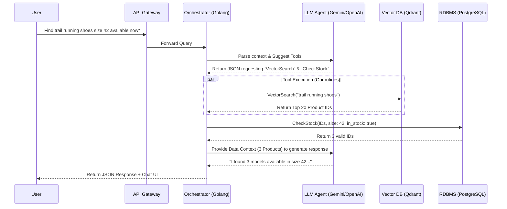

The search system is the beating heart of every e-commerce platform. If customers cannot find a product, they cannot buy it. However, as we move through 2026, user search behavior has evolved drastically from typing short, abrupt keywords (e.g., *"men's running shoes"*) to submitting complex, goal-oriented queries (e.g., *"find me a pair of men's waterproof trail running shoes, size 42, under $100, that can be delivered by tomorrow"*). Against these multifaceted intents, traditional search engines begin to show their limitations.

This marks the tipping point where we must transition from **Semantic Search** to **Agentic Search**—transforming the search bar from a passive "Librarian" into an active "Shopping Assistant."

> **📚 Want the full implementation?** This article is the architectural overview. For a 6-part hands-on build guide (Golang + Qdrant + critique loop + production ops), read the complete **[Agentic E-commerce Search series](/series/agentic-ecommerce-search/)**.

---

## The Fall of Lexical Search (Elasticsearch) in the AI Era

For the past decade, Elasticsearch (powered by the BM25 algorithm) has been the gold standard. Lexical Search operates on literal "keyword matching." Consequently, it fails miserably when faced with synonyms, misspellings, or highly conceptual queries.

Recently, many systems have upgraded to **Semantic Search** by introducing Vector Embeddings into Elasticsearch (kNN search). Semantic Search solves the contextual problem (understanding that "winter layer" and "fleece jacket" are similar). Yet, Semantic Search remains a passive system: it receives a Vector Query, calculates geometric distance, and returns a static list (a 1-step workflow).

It is completely powerless against real-time Business Logic, such as: *"Filter out products not currently in stock at the Downtown Warehouse"*. You simply cannot store highly volatile data like real-time inventory inside a Vector Database.

---

## What is Agentic Search? Semantic Search vs. Agentic AI

**Answer-first:** Agentic E-commerce Search transforms traditional search from passive keyword matching to active shopping assistance using AI agents that understand complex queries, apply business logic filters, and provide personalized results in real-time.

**Agentic Search** solves this by introducing a "Brain" (Orchestration Layer) in front of the databases. Instead of querying the database directly, the system employs an Autonomous AI Agent.

Agentic Search breaks down a complex query into a multi-step reasoning process:

### User Intent Parsing
When receiving the prompt *"waterproof running shoes under $100, deliver now"*, the Agent does not search immediately. It analyzes the query:
- **Semantic Intent:** Running shoes, waterproof (Requires Vector Search for semantic similarity).
- **Hard Filters:** Price < $100.
- **Real-time Filters:** Deliver now (Requires calling the Inventory Service API to check stock at the user's current location).

### RAG (Retrieval-Augmented Generation) combined with Tool-calling
After analysis, the Agent does not "guess" the outcome. It utilizes **Tool-calling** (Function calling). The Agent commands the Golang backend to execute specific functions:
1. Calls `VectorSearch(query: "waterproof running shoes", limit: 50)`.
2. Takes the resulting product IDs and calls `FilterByPrice(ids, max_price: 100)`.
3. Calls `CheckLiveInventory(ids, location: "downtown")`.
4. Finally, it synthesizes the data and returns the exact products alongside a natural language response.

---

## System Architecture: Golang, LLMs, and Vector Databases

To build this [Autonomous Hybrid AI](/posts/architecting-an-autonomous-hybrid-ai-content-pipeline/) system for an e-commerce platform, we need a clean architectural boundary between the Orchestration and Data Layers.

### Data Flow Diagram



### Why Golang is the Perfect Choice for Agentic Backends
Most AI tutorials today are written in Python (LangChain/LlamaIndex). However, when pushed to a production e-commerce environment, Python's weakness in concurrency becomes a massive bottleneck.

In an Agentic Search model, the system must invoke dozens of cross-dependent Tools (APIs) simultaneously. **Golang's Goroutines** solve this elegantly. The ability to run Vector DB queries and SQL Database lookups in parallel drastically reduces latency. Furthermore, Go's strict Type Safety ensures that the JSON Schemas returned by the LLM (during tool-calling) map perfectly into internal Structs, preventing runtime application crashes. Frameworks like **Eino** or **LangChainGo** are heavily utilized for this specific purpose.

---

## Building the "Search Service" Domain in E-commerce Microservices

If you have ever [deconstructed the E-commerce Domain](/posts/deconstructing-ecommerce-service-details-domain/), you know the Search Service does not stand alone; it relies on continuous Data Ingestion.

### Data Ingestion: Converting Product Metadata to Vector Embeddings
New products are created or updated constantly via RabbitMQ/Kafka. The Search Service (Golang Worker) listens for the `ProductUpdated` event.
1. **Chunking** the text data: Product Name, Description, Category, Tags.
2. Pushing the chunks through an Embedding Model to generate Vectors (32-bit float arrays).
3. Storing the Vector alongside Metadata (Brand ID, Category ID) into **Qdrant** or **Milvus**.
*Note: We highly recommend Qdrant for e-commerce due to its exceptionally fast "Filtered Vector Search", which allows applying hard metadata filters (e.g., only search within the "Shoes" category) directly at the vector engine level.*

### Orchestration Layer: Multi-threaded Context Handling
At the orchestration layer, the Golang source code defines the Tools (functions) and exports their schema to the LLM:

```go
// Define the Stock Check Tool for the LLM
var GetStockTool = llm.Tool{
    Name: "get_realtime_stock",
    Description: "Check real-time inventory of a list of products by warehouse location",
    Parameters: jsonschema.Definition{
        Type: jsonschema.Object,
        Properties: map[string]jsonschema.Definition{
            "product_ids": {Type: jsonschema.Array, Items: &jsonschema.Definition{Type: jsonschema.String}},
            "warehouse_location": {Type: jsonschema.String},
        },
        Required: []string{"product_ids"},
    },
}
```
Thanks to this mechanism, instead of hallucinating inventory numbers, the LLM will obediently return a payload requesting Golang to execute the `get_realtime_stock` function, guaranteeing 100% absolute accuracy.

---

## Real-world Deployment: Latency & Cost Challenges

Deploying Agentic Search introduces two major challenges:
1. **Latency:** Waiting for an LLM to reason and call tools can take 1-3 seconds. The solution is to use lightweight, ultra-fast models like **Gemini 3.5 Flash** or gpt-4o-mini as the initial "Routing Agent", combined with Server-Sent Events (SSE) streaming in Golang to return partial results to the Client UI instantly.
2. **Cost:** LLM APIs charge by the token. Routing every single query through an LLM is financially unviable. You must establish a **Semantic Cache** (such as Redis) in front of the Orchestrator. If a user's query is 95% similar to a previously cached query, the system serves the old result immediately, bypassing both the LLM and the Vector DB.

---

## Conclusion

The transition from Elasticsearch BM25 to an **Agentic E-commerce Search** architecture is not merely swapping one database for another. It is a fundamental architectural paradigm shift: separating the *Static Data Storage* capability (Vector DB/RDBMS) from the *Reasoning* capability (LLM Agent), and using **Golang** as the robust, high-speed orchestrator bridging the two.

E-commerce systems in 2026 will abandon dry, rigid search bars in favor of personalized, interactive Conversational Commerce for every individual shopper.

For a deeper evaluation of retrieval strategies at enterprise scale — when naive vector RAG fails, how GraphRAG builds knowledge graphs over product catalogs, and the cost-accuracy tradeoffs at different corpus sizes — see [GraphRAG vs Naive RAG: Enterprise Architecture Guide](/posts/graphrag-vs-naive-rag-enterprise-guide).

---

## FAQ


Not entirely. For aggregation tasks (summing, counting products by brand) or exact SKU matching, Elasticsearch is still unparalleled. However, if you are building a greenfield architecture, Qdrant paired with an RDBMS (PostgreSQL) can replace Elasticsearch in 90% of e-commerce search use cases.



Qdrant is currently the preferred choice because it is written in Rust (offering extreme performance) and provides an excellent official Golang gRPC client SDK. If your data reaches the billion-scale mark, consider Milvus.



They will be if you use heavy reasoning models for every operation. The secret lies in using ultra-fast/cheap models (like Gemini 3.5 Flash) combined with aggressive Semantic Caching. This reduces costs by 90%, which is easily offset by the resulting surge in Conversion Rates.



The primary bottlenecks are LLM reasoning latency (1-3 seconds) and vector similarity search across billions of dimensions. These are mitigated by using lightweight routing models, semantic caching, and server-sent events (SSE) for streaming responses.



Vector databases cannot efficiently handle highly volatile data like real-time inventory. Real-time business logic must be handled by the Orchestration layer (Golang) making separate tool calls to the transactional database (PostgreSQL) after retrieving semantic matches.




---

> **📚 Full Implementation Series:** This post covers the architecture overview. To build this end-to-end — from Golang orchestration and Qdrant ingestion to critique loops and production cost optimization — follow the **[Agentic E-commerce Search series](/series/agentic-ecommerce-search/)** (6 in-depth parts).
