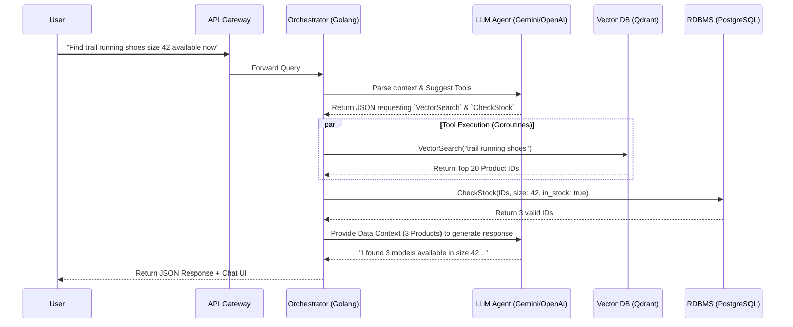

# Architecting Agentic E-commerce Search with Golang

- Practical strategies for tuning vector search precision without bloating RAM.
- How to coordinate multiple AI search agents to prevent search query latency spikes.

If customers cannot find a product, they cannot buy it — search is core infrastructure for any e-commerce platform. User search behavior has evolved from typing short, abrupt keywords (e.g., *"men's running shoes"*) to submitting complex, goal-oriented queries (e.g., *"find me a pair of men's waterproof trail running shoes, size 42, under $100, that can be delivered by tomorrow"*). Against these multifaceted intents, traditional keyword search engines show their limitations.

This is roughly the line between **Semantic Search** and **Agentic Search** — the difference between a search bar that matches text and one that acts more like a shopping assistant.

> **📚 Want the full implementation?** This article is the architectural overview. For a 6-part hands-on build guide (Golang + Qdrant + critique loop + production ops), read the complete **[Agentic E-commerce Search series](/series/agentic-ecommerce-search/)**.

---

## The Fall of Lexical Search (Elasticsearch) in the AI Era

For over a decade, Elasticsearch relying on the traditional BM25 algorithm served as the default enterprise search engine. However, lexical keyword matching fails when encountering complex intent, domain synonyms, or misspelled attributes, resulting in frequent zero-result pages and degraded conversion metrics across modern online retail platforms.

Recently, many systems have upgraded to **Semantic Search** by introducing Vector Embeddings into Elasticsearch (kNN search). Semantic Search solves the contextual problem (understanding that "winter layer" and "fleece jacket" are similar). Yet, Semantic Search remains a passive system: it receives a Vector Query, calculates geometric distance, and returns a static list (a 1-step workflow).

It is completely powerless against real-time Business Logic, such as: *"Filter out products not currently in stock at the Downtown Warehouse"*. You simply cannot store highly volatile data like real-time inventory inside a Vector Database.

---

## Agentic Search Architecture: Vector Routing vs. Multi-Agent Systems

Agentic search moves retrieval architecture from single-step similarity queries to dynamic multi-agent orchestration. A Golang control plane sits in front of vector indices and transactional databases, evaluates incoming user prompts, resolves contextual dependencies, and executes parallel tool workflows to satisfy volatile inventory and pricing constraints.

### User Intent Parsing
When receiving the prompt *"waterproof running shoes under $100, deliver now"*, the Agent does not search immediately. It analyzes the query:
- **Semantic Intent:** Running shoes, waterproof (Requires Vector Search for semantic similarity).
- **Hard Filters:** Price < $100.
- **Real-time Filters:** Deliver now (Requires calling the Inventory Service API to check stock at the user's current location).

### RAG (Retrieval-Augmented Generation) combined with Tool-calling
After analysis, the Agent does not "guess" the outcome. It utilizes **Tool-calling** (Function calling). The Agent commands the Golang backend to execute specific functions:
1. Calls `VectorSearch(query: "waterproof running shoes", limit: 50)`.
2. Takes the resulting product IDs and calls `FilterByPrice(ids, max_price: 100)`.
3. Calls `CheckLiveInventory(ids, location: "downtown")`.
4. Finally, it synthesizes the data and returns the exact products alongside a natural language response.

---

## System Architecture: Golang, LLMs, and Vector Databases

Building this kind of hybrid search infrastructure needs a clear separation of concerns between reasoning agents and data persistence layers. Golang provides the asynchronous runtime and strict typing needed to manage concurrent tool calls while enforcing payload validation between external LLMs, Qdrant vector indices, and relational PostgreSQL storage.

### Data Flow Diagram

The sequence diagram traces the end-to-end flow when a multi-intent user query is routed through the Golang orchestrator, separating high-speed vector retrieval in Qdrant from transactional stock verification in PostgreSQL before returning the structured response.


```mermaid
sequenceDiagram
    participant User
    participant API Gateway
    participant Orchestrator (Golang)
    participant LLM Agent (Gemini/OpenAI)
    participant Vector DB (Qdrant)
    participant RDBMS (PostgreSQL)

    User->>API Gateway: "Find trail running shoes size 42 available now"
    API Gateway->>Orchestrator (Golang): Forward Query
    Orchestrator (Golang)->>LLM Agent (Gemini/OpenAI): Parse context & Suggest Tools
    LLM Agent (Gemini/OpenAI)-->>Orchestrator (Golang): Return JSON requesting `VectorSearch` & `CheckStock`
    
    par Tool Execution (Goroutines)
        Orchestrator (Golang)->>Vector DB (Qdrant): VectorSearch("trail running shoes")
        Vector DB (Qdrant)-->>Orchestrator (Golang): Return Top 20 Product IDs
    end
    
    Orchestrator (Golang)->>RDBMS (PostgreSQL): CheckStock(IDs, size: 42, in_stock: true)
    RDBMS (PostgreSQL)-->>Orchestrator (Golang): Return 3 valid IDs
    
    Orchestrator (Golang)->>LLM Agent (Gemini/OpenAI): Provide Data Context (3 Products) to generate response
    LLM Agent (Gemini/OpenAI)-->>Orchestrator (Golang): "I found 3 models available in size 42..."
    Orchestrator (Golang)-->>User: Return JSON Response + Chat UI
```

### Why Golang is the Perfect Choice for Agentic Backends
Most AI tutorials today are written in Python (LangChain/LlamaIndex). However, when pushed to a production e-commerce environment, Python's weakness in concurrency becomes a massive bottleneck.

In an Agentic Search model, the system must invoke dozens of cross-dependent Tools (APIs) simultaneously. **Golang's Goroutines** solve this elegantly. The ability to run Vector DB queries and SQL Database lookups in parallel drastically reduces latency. Furthermore, Go's strict Type Safety ensures that the JSON Schemas returned by the LLM (during tool-calling) map perfectly into internal Structs, preventing runtime application crashes. Frameworks like **Eino** or **LangChainGo** are heavily utilized for this specific purpose.

---

## Building the "Search Service" Domain in E-commerce Microservices

Integrating vector retrieval into an existing microservices architecture needs event-driven data synchronization between core catalog domain services and the vector database. The search service consumes lifecycle events from message brokers, transforms raw product metadata into dense numerical embeddings, and updates spatial indices without locking primary databases.

### Data Ingestion: Converting Product Metadata to Vector Embeddings
New products are created or updated constantly via RabbitMQ/Kafka. The Search Service (Golang Worker) listens for the `ProductUpdated` event.
1. **Chunking** the text data: Product Name, Description, Category, Tags.
2. Pushing the chunks through an Embedding Model to generate Vectors (32-bit float arrays).
3. Storing the Vector alongside Metadata (Brand ID, Category ID) into **Qdrant** or **Milvus**.
*Note: We highly recommend Qdrant for e-commerce due to its exceptionally fast "Filtered Vector Search", which allows applying hard metadata filters (e.g., only search within the "Shoes" category) directly at the vector engine level.*

### Orchestration Layer: Multi-threaded Context Handling
At the orchestration layer, the Golang backend defines explicit tool interfaces and exports their JSON schemas to the LLM agent. The following Go code snippet demonstrates how to declare a type-safe tool definition for real-time inventory lookups, guaranteeing that the model requests valid database operations rather than hallucinating inventory state:

```go
// Define the Stock Check Tool for the LLM
var GetStockTool = llm.Tool{
    Name: "get_realtime_stock",
    Description: "Check real-time inventory of a list of products by warehouse location",
    Parameters: jsonschema.Definition{
        Type: jsonschema.Object,
        Properties: map[string]jsonschema.Definition{
            "product_ids": {Type: jsonschema.Array, Items: &jsonschema.Definition{Type: jsonschema.String}},
            "warehouse_location": {Type: jsonschema.String},
        },
        Required: []string{"product_ids"},
    },
}
```
Thanks to this mechanism, instead of hallucinating inventory numbers, the LLM will return a payload requesting Golang to execute the `get_realtime_stock` function — the actual stock number always comes from the database, not from the model.

---

## Real-world Deployment: Latency & Cost Challenges

Deploying agentic retrieval in high-traffic production environments surfaces two recurring challenges: token cost and multi-second model latency. Both get addressed with caching and lightweight routing rather than routing every query through a large model.

1. **Latency:** Waiting for an LLM to reason and call tools can take 1-3 seconds. The solution is to use lightweight, ultra-fast models like **Gemini 3.5 Flash** or gpt-4o-mini as the initial "Routing Agent", combined with Server-Sent Events (SSE) streaming in Golang to return partial results to the Client UI instantly.
2. **Cost:** LLM APIs charge by the token. Routing every single query through an LLM is financially unviable. You must establish a **Semantic Cache** (such as Redis) in front of the Orchestrator. If a user's query is 95% similar to a previously cached query, the system serves the old result immediately, bypassing both the LLM and the Vector DB.

---

## Architectural Summary & Production Checklist

The transition from Elasticsearch BM25 to an **Agentic E-commerce Search** architecture is not merely swapping one database for another — it separates the *Static Data Storage* capability (Vector DB/RDBMS) from the *Reasoning* capability (LLM Agent), using **Golang** as the orchestrator bridging the two.

For a deeper evaluation of retrieval strategies at enterprise scale — when naive vector RAG fails, how GraphRAG builds knowledge graphs over product catalogs, and the cost-accuracy tradeoffs at different corpus sizes — see [GraphRAG vs Naive RAG: Enterprise Architecture Guide](/posts/graphrag-vs-naive-rag-enterprise-guide/).

---

## Vector Search Trade-offs & Production Considerations

Balancing search precision, query latency, and RAM utilization in a Qdrant-backed search service requires careful tuning of HNSW graph parameters. Engineers must evaluate trade-offs between index build times, memory footprints, and retrieval accuracy before locking production configurations for enterprise workloads operating under tight latency constraints.

1. **Recall vs. query latency (`ef_search`)**: Raising `ef_search` widens the HNSW candidate list, improving recall but adding CPU per query. The `ef_search=64` used above hits ~98% recall at sub-15ms; pushing to `ef_search=256` chases the last fraction of a percent of recall while roughly quadrupling query CPU. Tune it against a labeled relevance set, not by feel, and re-measure whenever the collection size changes materially.
2. **Index build cost vs. serving quality (`m`, `ef_construct`)**: `m=16` / `ef_construct=128` build a graph dense enough for e-commerce catalogs in the low millions of vectors. Higher `m` improves graph connectivity but inflates RAM per vector (the whole HNSW graph is held in memory), which drives your Kubernetes memory `requests`/`limits` and therefore your node bill. Size the pod memory from `num_vectors × dim × 4 bytes × overhead`, not from a default.
3. **Agentic fallback cost vs. zero-result rate**: The LLM query-expansion fallback rescues tail queries but adds an LLM round-trip (hundreds of ms + token cost) to every miss. Gate it behind a cosine-distance threshold (0.45 in this design) and a BM25 pre-check so you only pay for the model when cheaper paths genuinely fail — otherwise a spike in tail queries becomes a spike in your LLM bill.

## Frequently Asked Questions

### Q1: Will Agentic Search completely replace Elasticsearch?
Not entirely. For aggregation tasks (summing, counting products by brand) or exact SKU matching, Elasticsearch is still unparalleled. However, for semantic discovery and natural language intent parsing, Qdrant paired with PostgreSQL offers superior retrieval accuracy and significantly lower operational cost.

### Q2: Why choose Qdrant gRPC over REST HTTP for Go e-commerce search services?
Qdrant gRPC uses multiplexed HTTP/2 streaming and Protobuf binary serialization, which cuts serialization/transport overhead compared to standard REST JSON endpoints — the exact percentage depends on payload size and shape, so benchmark it against your own product schema rather than assuming a fixed number. The main benefit in practice is more headroom for P99 latency under heavy concurrent request loads.

### Q3: How do you balance vector search recall and latency with HNSW indexing in Qdrant?
Configure HNSW graph parameters with `m=16` and `ef_construct=128` during collection initialization to establish a high-density vector index structure. At query execution time, tune `ef_search=64` to achieve greater than 98% recall while capping query evaluation within 15ms per search request.

### Q4: What is the recommended strategy for handling zero-result vector queries?
Implement an agentic fallback router in Go that triggers query expansion via LiteLLM/SLM, falling back to BM25 keyword search with relaxed payload filters when cosine distance exceeds 0.45. This dual-path approach prevents search dropouts while keeping latency low.

### Q5: Are LLM API costs prohibitive for high-traffic agentic search?
They can be if every request triggers a full reasoning loop using frontier models. The fix is using ultra-fast routing models combined with aggressive semantic caching, which cuts the number of full LLM calls substantially — how much depends on query repetition and cache hit rate for your specific catalog and traffic pattern.



## Related Reading

- [Agentic E-Commerce Search Series](/series/agentic-ecommerce-search/) — the full 6-part build, from ingestion to critique loops.
- [GraphRAG vs Naive RAG Guide](/posts/graphrag-vs-naive-rag-enterprise-guide/) — when graph traversal beats flat vector similarity.
- [Go MCP Server Production Guide](/posts/go-mcp-server-development-production-guide/) — exposing the search engine as an agent-callable tool.
- [Autonomous Hybrid AI Pipeline](/posts/architecting-an-autonomous-hybrid-ai-content-pipeline/) — routing between local SLMs and cloud LLMs to control cost.
