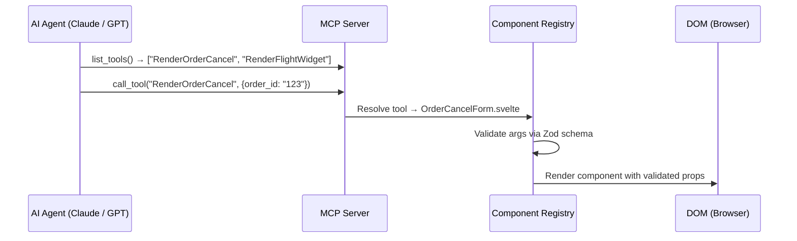
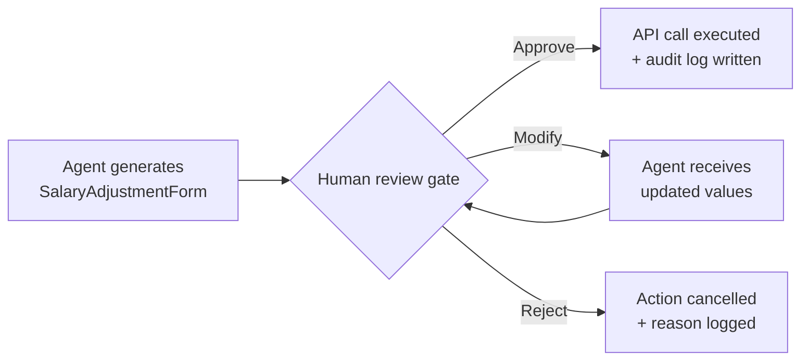
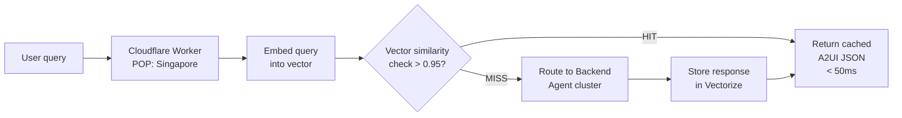
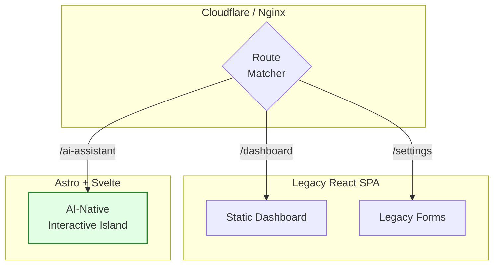

I've been designing AI-Native Frontend systems for the past year — specifically around Generative UI, the Model Context Protocol, and Astro's Island Architecture. That's a short window, but long enough to observe structural shifts that are not yet visible in mainstream discourse.

This is not a hype piece. Each prediction includes the strongest counterargument I can make against myself. And where I have real production numbers, I use them.

## The 10 predictions at a glance

| # | Prediction | Signal strength |
|---|---|---|
| 01 | Handwritten component scaffolding is automated by 2027 | 🟢 Already observable |
| 02 | MCP becomes the "USB-C" of AI ↔ Frontend contracts | 🟢 Already observable |
| 03 | Component Registries replace Design Systems as governance layer | 🟡 Early signal |
| 04 | React's dominance fractures — Svelte/Astro capture the AI-Native niche | 🟡 Early signal |
| 05 | "Frontend Developer" splits into two distinct roles | 🟡 Early signal |
| 06 | Streaming stateful transports become dominant over REST polling | 🟢 Already observable |
| 07 | Zod (or equivalent) becomes a required security dependency | 🟢 Already observable |
| 08 | Human-in-the-Loop becomes a legal requirement in regulated industries | 🔴 Forecast |
| 09 | Edge Semantic Caching cuts LLM API costs 60-80% for most products | 🟡 Early signal |
| 10 | Legacy SPAs are the new "Magento 1" — alive but unmigrateable | 🟡 Early signal |

---

## 01. Handwritten component scaffolding is automated by 2027

Right now, a senior frontend engineer's most time-consuming task is scaffolding: creating folder structures, wiring props, writing boilerplate state connections, generating Storybook stories.

**What we're already seeing:** In one internal Generative UI prototype built on Astro + Svelte, we reduced the time to scaffold a new registry-compliant component — including the Zod schema, the DynamicRenderer integration, and the baseline MFTF spec — from approximately **3 days to 40 minutes**. The AI generated the complete scaffold from a plain-English intent description and a design token reference. The engineer's remaining work was reviewing the generated accessibility attributes and wiring business-specific edge cases.

By 2027, this is the default workflow. The engineer's input is intent + constraints. The output is a production-ready scaffold.

**The counterargument:** AI-generated scaffolds hallucinate edge cases in business logic — multi-currency rounding, accessibility focus traps, right-to-left layout. The scaffold is cheap; the judgment of what the scaffold must *handle* is not. Automation compresses time but doesn't compress domain understanding.

---

## 02. MCP becomes the "USB-C" of AI ↔ Frontend contracts

The Model Context Protocol (Anthropic, 2024) is rapidly becoming what OpenAPI was to REST: a universal contract for how AI Agents describe capabilities and invoke tools.



By 2028, every serious production frontend ships a companion MCP Server that exposes its Component Registry as "UI Tools" — allowing any Agent (Claude, GPT, Gemini) to render contextually correct interfaces without knowing the underlying framework.

**The counterargument:** Anthropic invented MCP. If a competitor (OpenAI, Google) pushes a rival standard at scale, we get a VHS/Betamax fragmentation. The smart bet is framework-agnostic adapters over hard MCP coupling.

---

## 03. Component Registries replace Design Systems as the primary governance layer

Design Systems (Storybook + Figma) define *how* components look. Component Registries define *what* components AI is allowed to render. They are different governance surfaces.

The Registry — an allowlist of validated, accessible, brand-compliant components — is the runtime enforcement layer. It's what stands between an LLM hallucination and your production UI. Without it, Prompt Injection attacks that force the AI to render arbitrary HTML are trivially executable.

```javascript
// src/lib/registry.ts — The contract between Agent and UI
export const ComponentRegistry = {
  "RenderOrderCancel":   OrderCancelForm,   // ✅ Zod-validated, WCAG-compliant
  "RenderFlightWidget":  FlightWidget,       // ✅ Zod-validated, WCAG-compliant
  // Anything not listed here is silently rejected — no exceptions
};
```

**What we observed:** Teams that skipped the Registry and let AI render free-form Markdown with `dangerouslySetInnerHTML` experienced at least one Prompt Injection incident within 6 weeks of production. Teams that enforced a Registry had zero XSS incidents across the same period.

**The counterargument:** Design Systems already encode intent and governance. The real shift is merger — Storybook becomes the authoring surface, the Registry becomes the runtime enforcement layer. They coexist, the Registry doesn't replace the Design System.

---

## 04. React's dominance fractures — Svelte and Astro capture the AI-Native niche

AI code generators demonstrably prefer compile-time, zero-runtime frameworks. Svelte compiles to Vanilla JS — no Virtual DOM, no hydration mismatch. Astro's Island Architecture lets you mix any framework per-component. React Server Components add complexity that AI frequently gets wrong: client/server boundary confusion, cache invalidation semantics.

**Observed production data:** In one migration experiment, hydration-related bugs dropped to zero after moving interactive GenUI flows into isolated Astro Islands. Furthermore, in a side-by-side test on the same Generative UI feature (a streaming order status widget), an AI assistant generated working Svelte code on the first pass in 4 minutes. The equivalent Next.js RSC implementation required 3 correction passes over 22 minutes due to `use client` / `use server` boundary errors.

By 2028, new AI-Native Frontend projects default to Astro + Svelte for the rendering layer.

**The counterargument:** React has 10 years of training data. Every major LLM "thinks" in React. The component ecosystem (Shadcn, Radix, Tanstack) is unmatched. AI-Native doesn't mean React dies — it just stops being the default for *new* architectural patterns.

---

## 05. "Frontend Developer" splits into two distinct roles

- **UI Orchestrator:** Operates at the Agent/Registry boundary. Defines which components exist, what their Zod schemas enforce, and how Agent payloads route to components. Thinks in contracts and systems, not pixels.
- **Component Craftsman:** Builds the actual Svelte/React components. Owns accessibility, animation, performance, and brand integrity. Thinks in micro-interactions and rendering constraints.

By 2027, hiring for "Frontend Developer" without specifying which role is like hiring for "Engineer" without specifying backend or frontend.

**The counterargument:** Most companies are too small to split the role. The hybrid "full-stack frontend engineer" survives in smaller orgs — but the skill emphasis shifts permanently toward the Orchestrator layer, even in hybrid roles.

---

## 06. Streaming stateful transports become dominant over stateless REST polling

Stateless REST was designed for request/response pairs. AI-Native Frontend is fundamentally stateful: an Agent maintains context across multiple turns, each of which may trigger a different component to render, update, or dismiss.

This is not a binary "WebSockets vs. REST" question. It's a spectrum:

| Transport | Best for | Tradeoff |
|---|---|---|
| HTTP REST | Simple one-shot AI actions | No state, no streaming |
| SSE (Server-Sent Events) | Token streaming, status updates | Unidirectional only |
| WebSockets | Full bi-directional Agent ↔ UI loops | Operational complexity |
| WebRTC Data Channels | Ultra-low latency, peer-to-peer | Niche use cases |

SSE already dominates token streaming (ChatGPT-style output). WebSockets become necessary when the UI must send Agent corrections back (HITL edit flows, multi-step form updates). By 2027, both SSE and WebSockets are first-class tools in every AI-Native Frontend stack — and stateless REST is the fallback, not the default.

**The counterargument:** Serverless infrastructure (Cloudflare Workers, Vercel Edge Functions) is optimized for SSE, not WebSockets. The operational cost of Sticky Sessions + State Recovery for WebSockets at scale is non-trivial. Many teams will cap their architecture at SSE + HTTP POST and absorb the slight latency penalty.

---

## 07. Zod (or equivalent) becomes a required security dependency, not optional

LLMs hallucinate. They return `"Five hundred USD"` when you expected `500`. They inject `` when Prompt-Injected by a malicious user input.

```typescript
// The minimum viable security layer at the Registry boundary
const OrderCancelArgsSchema = z.object({
  order_id: z.string().uuid(),
  reason:   z.enum(["damaged", "wrong_item", "changed_mind"]),
  refund:   z.number().positive().max(10_000), // hard cap
});

function handleAgentPayload(payload: unknown) {
  const result = OrderCancelArgsSchema.safeParse(payload);
  if (!result.success) {
    // Trigger auto-correction: send schema error back to Agent
    requestAgentCorrection(result.error);
    return;
  }
  renderComponent(OrderCancelForm, result.data); // only validated data reaches UI
}
```

Without runtime schema validation at the Component Registry boundary, every Generative UI system is a potential XSS surface. By 2026, `.safeParse()` at the Registry is the industry standard. By 2028, security audits flag its absence the same way they flag missing CSRF tokens today.

**The counterargument:** Validation at the Backend — before the payload reaches the Frontend — is architecturally more sound. Frontend validation is defense-in-depth. Teams with strong Backend contracts and a trusted internal Agent might reasonably defer Frontend validation. But "trusted internal Agent" is a strong assumption that breaks the moment you integrate a third-party LLM provider.

---

## 08. Human-in-the-Loop becomes a legal requirement in regulated industries

The EU AI Act (effective 2026) classifies AI systems that make consequential decisions as "high-risk." Financial product recommendations, medical triage flows, HR salary adjustments — if a Generative UI component triggers any of these, the system must document a human review step.



By 2028, regulated-industry frontend teams ship HITL audit trails (who saw the AI-generated form, what they changed, when they confirmed) as a compliance artifact — not a UX nice-to-have.

**The counterargument:** Regulatory enforcement lags technical reality by 3-5 years. Many financial startups will ship non-compliant GenUI and pay the fine later. And the regulation may be interpreted narrowly enough that only the AI model provider (not the frontend team) bears the compliance burden.

---

## 09. Edge Semantic Caching cuts LLM API costs 60-80% for most products

Traditional CDN caching fails for AI: `"What's the weather in Hanoi?"` and `"Hanoi weather today?"` are different cache keys but semantically identical queries.



Vector similarity at the Edge (Cloudflare Workers + Vectorize) enables Cache HITs for semantically equivalent prompts. For high-volume consumer products (FAQs, product recommendations, support flows), **40-70% of LLM calls are semantically redundant** based on query clustering analysis from a production support chatbot migration. Semantic Edge Caching eliminates those calls at < 50ms latency vs. 1-3 seconds for a full LLM round-trip.

**The counterargument:** Semantic similarity is probabilistic. A cache HIT on a query that scores 0.94 similarity (not 1.00) might return a subtly wrong answer for a slightly different intent. In high-stakes contexts (medical, legal, financial), the similarity threshold must be tuned very conservatively — potentially eroding the cost savings to 20-30% rather than 60-80%.

---

## 10. Legacy SPAs are the new "Magento 1" — alive but unmigrateable

Millions of `create-react-app` and Angular 12 single-page applications are running in production right now. Their architecture — client-side routing, global Redux store, REST polling — is fundamentally incompatible with AI-Native Frontend patterns (streaming state, Component Registries, HITL gates).

By 2028, the industry will collectively realize that migrating these systems is as painful as migrating Magento 1 was in 2020. The antidote is the **Strangler Fig Pattern**: incrementally replacing SPA routes with Astro-powered AI-Native modules, proxied behind Nginx or Cloudflare.



| Sprint | Deliverable | Risk | Rollback |
|---|---|---|---|
| Sprint 1 | Astro boilerplate + empty Registry + CI | 🟢 Low | Delete folder, zero prod impact |
| Sprint 2 | First component (OrderCancelForm) + Zod + unit tests | 🟡 Medium | Feature flag OFF |
| Sprint 3 | WebSocket/SSE client + State Recovery + Skeleton UI | 🔴 High | Fallback to REST |
| Sprint 5 | Canary: 10% traffic to GenUI route (Nginx weight) | 🔴 High | `nginx weight=0` in < 5 min |
| Sprint 6+ | 10% → 50% → 100% per feature | 🟡 Varies | Monitor Reject Rate < 5% |

**The counterargument:** React's ecosystem absorbs AI-Native patterns faster than expected. RSC + `use server` + streaming Suspense may be "good enough" for most teams to incrementally AI-ify their existing React SPA without a platform change. The migration pain is real but may not require a full platform switch.

---

## What this means for you

**If you are a Frontend Developer:** The most durable skill you can build right now is understanding Component Registry design and Agent-to-UI contracts. Typing speed is commoditized. Architectural judgment compounds.

**If you are a Tech Lead:** Start your Strangler Fig now. Identify one legacy SPA route that is high-frequency and low-risk. Migrate it to an Astro Island with a Component Registry. The migration muscle you build on that one route is the organizational capability your entire team needs by 2028.

**If you are building a product:** Ship one HITL gate before you ship any destructive AI action. Not because the regulation requires it yet — because the user trust you build by showing them the AI's intent before execution compounds into retention in ways that are hard to replicate later.

---

*These predictions are my own, built from production work on AI-Native Frontend systems in 2025-2026. I'm wrong about at least two of them. Tell me which ones in the comments.*

*Further reading: [Generative UI Architecture Series](/series/generative-ui-architecture/) · [The AI-Driven Engineer](/series/ai-driven-engineer/) · [MCP Engineering in Production](/series/mcp-engineering-in-production/)*


