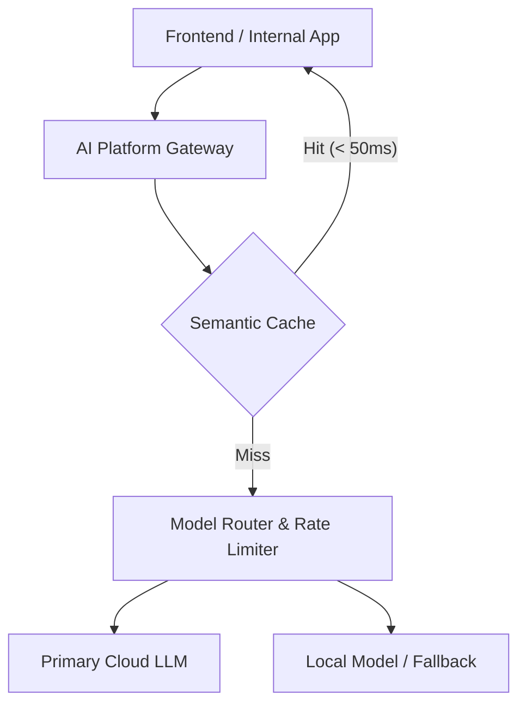
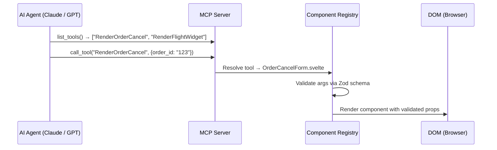

**Answer-first:** By 2028, AI-native systems will transition from static web interfaces and manual prompting to dynamic Generative UIs driven by Model Context Protocol (MCP) contracts, AI Platform Layers, and Policy-as-Code agentic CI/CD pipelines. Standardized component registries, Zod schema validation, and streaming state synchronization will serve as the runtime security and governance baseline.

---

## Executive Summary & AI Playbook Baseline

Transitioning engineering organizations into AI-native operations requires an end-to-end strategy across 5 pillars:

1. **Context Engineering & DDD**: Aligning agent context windows with Domain-Driven Design bounded contexts.
2. **AI Platform Layer**: Centralizing LLM gateways, semantic caching, and model fallback cascades.
3. **Internal Ops Automation**: AI-assisted code review, doc generation, and workflow automation.
4. **Policy-as-Code & Agentic CI/CD**: Enforcing automated security, governance, and evaluation gates.
5. **AI-Native System & UI Architecture**: Generative UI runtimes using MCP, component registries, and streaming state sync.

---

## 1. Context Engineering & Domain-Driven Design (DDD)

Context engineering injects structured, domain-scoped data into LLM prompts using DDD boundaries:
- **Bounded Context Isolation**: Prompts receive data scoped strictly to their aggregate root (e.g. Cart, Order, or Catalog).
- **Schema-Enforced Context**: Data is passed as typed JSON rather than raw unstructured strings to eliminate hallucination vectors.

---

## 2. Centralized AI Platform Layer



A enterprise AI Platform Layer decouples product code from LLM vendors via centralized proxying, billing monitoring, rate limiting, and edge semantic caching.

---

## 3. Policy-as-Code & Agentic CI/CD

All AI-generated code and UI payloads pass through automated policy enforcement gates before deployment:

```typescript
const OrderCancelArgsSchema = z.object({
  order_id: z.string().uuid(),
  reason:   z.enum(["damaged", "wrong_item", "changed_mind"]),
  refund:   z.number().positive().max(10_000),
});

function handleAgentPayload(payload: unknown) {
  const result = OrderCancelArgsSchema.safeParse(payload);
  if (!result.success) {
    requestAgentCorrection(result.error);
    return;
  }
  renderComponent(OrderCancelForm, result.data);
}
```

---

## 4. The 10 AI-Native Frontend Predictions for 2028

| # | Prediction | Signal Strength |
|---|---|---|
| 01 | Handwritten component scaffolding is automated by 2027 | 🟢 Already observable |
| 02 | MCP becomes the "USB-C" of AI ↔ Frontend contracts | 🟢 Already observable |
| 03 | Component Registries replace Design Systems as governance layer | 🟡 Early signal |
| 04 | React's dominance fractures — Svelte/Astro capture AI-Native niche | 🟡 Early signal |
| 05 | "Frontend Developer" splits into Orchestrators & Craftsmen | 🟡 Early signal |
| 06 | Streaming stateful transports (WebSockets/SSE) dominate over REST | 🟢 Already observable |
| 07 | Zod runtime schema validation becomes a mandatory security layer | 🟢 Already observable |
| 08 | Human-in-the-Loop (HITL) becomes a legal compliance requirement | 🔴 Forecast |
| 09 | Edge Semantic Caching cuts LLM API costs 60–80% | 🟡 Early signal |
| 10 | Legacy SPAs become unmigrateable monoliths, requiring Strangler Fig | 🟡 Early signal |



---

## FAQ


MCP acts as the standardized state and capability exchange protocol between AI reasoning agents and the frontend client. Instead of writing custom API adapters for every component, the client uses MCP to negotiate component schema rendering, state synchronization, and tool execution bounds in real-time.



We enforce strict schema parsing at the client boundary using libraries like Zod or TypeBox. The frontend never executes raw streamed JSON/TSX without validating props against a pre-compiled, versioned component registry.



Policy-as-Code ensures that autonomous pull requests or code edits generated by AI agents meet security standards, linting rules, and test coverage thresholds automatically before code is merged into main branches.



