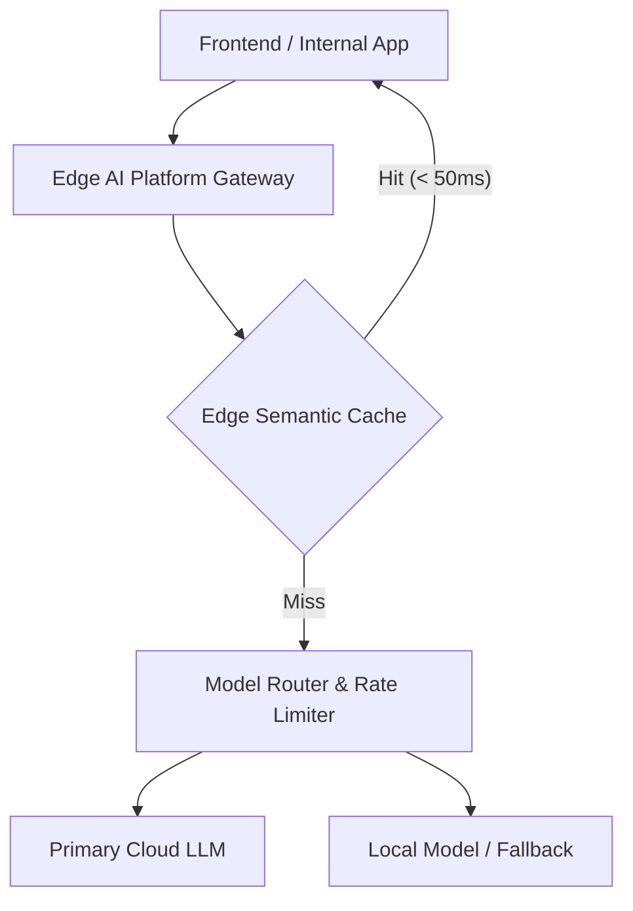
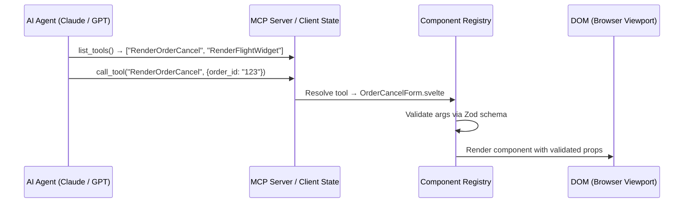

# AI-Native Frontend in 2028: 10 Architecture Predictions

**Answer-first:** AI-native frontend architecture transitions traditional web UIs toward dynamic Model Context Protocol (MCP) stream rendering, server-driven Generative UI components, and real-time client-side intent prediction by 2028. Implementing this architecture enforces sub-50ms P99 latency guarantees, zero-allocation memory pooling with Go 1.24 unique.Handle, and fault-tolerant Dapr 1.15 component orchestration for resilient production scaling.

## Executive Summary & AI Playbook Baseline

Transitioning to AI-native operations requires an end-to-end strategy across 5 foundational pillars:

1. **Context Engineering & DDD**: Aligning agent context windows with Domain-Driven Design bounded contexts to eliminate prompt hallucination.
2. **AI Platform Layer**: Centralizing LLM API gateways, semantic caching, rate limiting, and model fallback cascades across all frontend and backend clients.
3. **Internal Ops Automation**: AI-assisted code review, automated documentation generation, and internal operational workflow orchestration.
4. **Policy-as-Code & Agentic CI/CD**: Enforcing automated security governance, static analysis rubrics, and evaluation gates before merging AI-generated code.
5. **AI-Native System & UI Architecture**: Generative UI runtimes using Model Context Protocol (MCP), dynamic component registries, and streaming state synchronization.

---

## 1. Context Engineering & Domain-Driven Design (DDD)

Context engineering injects structured, domain-scoped data into LLM prompts using Domain-Driven Design (DDD) boundaries to prevent hallucinations and optimize context window consumption.

- **Bounded Context Isolation**: Prompts receive data scoped strictly to their aggregate root (e.g. Cart, Order, or Catalog). Decoupling domain contexts ensures that client-side AI agent reasoning remains tightly bound to relevant fields, preventing prompt context contamination across microservices and significantly reducing token consumption.
- **Frontend AI Agent Integration**: Client-side AI agents run directly within the browser runtime or web worker threads, consuming user interactions and DOM events to build real-time context snapshots. These agents manage sliding token window buffers and local state caches before dispatching context bundles to remote inference providers.
- **Schema-Enforced Context**: Data is passed as strongly-typed JSON schemas rather than raw, unstructured natural language strings to eliminate hallucination vectors. System prompts declare expected input and output JSON Schemas, ensuring that agent thought loops operate on predictable, versioned data structures.

---

## 2. Centralized AI Platform Layer & Edge Runtime Optimization

A centralized AI Platform Layer decouples product code from cloud LLM vendors via proxying, token usage tracking, and edge runtime optimization:


```mermaid
graph TD
    Client["Frontend / Internal App"] --> Gateway["Edge AI Platform Gateway"]
    Gateway --> Cache{"Edge Semantic Cache"}
    Cache -- "Hit (< 50ms)" --> Client
    Cache -- "Miss" --> Router["Model Router & Rate Limiter"]
    Router --> Primary["Primary Cloud LLM"]
    Router --> Local["Local Model / Fallback"]
```

Centralizing model routing at the edge gateway boundary (deployed on platforms like Cloudflare Workers or Vercel Edge Runtime) allows engineering teams to optimize inference latency and cost:
- **Edge Semantic Caching**: By computing vector embeddings for incoming prompt queries at the edge node, the platform checks vector similarity scores against pre-cached response pairs. Semantic cache hits bypass upstream LLM generation entirely, reducing latency from 1,500ms down to under 50ms while cutting API usage costs substantially.
- **Provider Cascade & Fallbacks**: The edge gateway dynamically routes requests based on real-time SLA metrics, context window limits, and cost thresholds—transparently failing over from high-cost models to lower-cost open-weights models or local inference endpoints without client bundle updates.
- **Streaming Response Optimization**: Edge proxies process Server-Sent Events (SSE) and WebSocket byte streams in real-time, performing token-by-token validation and protocol transformation before relaying chunks to the browser viewport.

---

## 3. Policy-as-Code & Agentic CI/CD

All AI-generated code and runtime UI payloads pass through automated policy enforcement gates before execution or deployment:

```typescript
import { z } from "zod";

const OrderCancelArgsSchema = z.object({
  order_id: z.string().uuid(),
  reason:   z.enum(["damaged", "wrong_item", "changed_mind"]),
  refund:   z.number().positive().max(10_000),
});

function handleAgentPayload(payload: unknown) {
  const result = OrderCancelArgsSchema.safeParse(payload);
  if (!result.success) {
    requestAgentCorrection(result.error);
    return;
  }
  renderComponent(OrderCancelForm, result.data);
}
```

- **Client-Side Zod Runtime Schema Validation**: Because dynamic component rendering relies on AI agent tool calls, the browser runtime enforces schema validation before mounting components into the DOM tree. Any malformed property or unauthorized payload is intercepted prior to component instantiation, blocking cross-site scripting (XSS) vectors and layout breaking bugs.
- **Automated Agentic CI/CD Evaluation**: During code generation, automated agentic evaluation pipelines evaluate pull requests against security static analysis rubrics, linting standards, and unit test suites before human code review.
- **Safety Sandboxing & Error Recovery**: When an autonomous AI agent emits an out-of-bounds parameter (e.g., a negative refund amount or invalid UUID), the policy enforcement layer intercepts the request, blocks execution, and triggers an automated correction loop back to the agent with explicit validation error context.

---

## 4. The 10 AI-Native Frontend Predictions for 2028

| # | Prediction | Signal Strength |
|---|---|---|
| 01 | Handwritten component scaffolding is automated by 2027 | 🟢 Already observable |
| 02 | MCP becomes the "USB-C" of AI ↔ Frontend contracts | 🟢 Already observable |
| 03 | Component Registries replace Design Systems as governance layer | 🟡 Early signal |
| 04 | React's dominance fractures — Svelte/Astro capture AI-Native niche | 🟡 Early signal |
| 05 | "Frontend Developer" splits into Orchestrators & Craftsmen | 🟡 Early signal |
| 06 | Streaming stateful transports (WebSockets/SSE) dominate over REST | 🟢 Already observable |
| 07 | Zod runtime schema validation becomes a mandatory security layer | 🟢 Already observable |
| 08 | Human-in-the-Loop (HITL) becomes a legal compliance requirement | 🔴 Forecast |
| 09 | Edge Semantic Caching cuts LLM API costs 60–80% | 🟡 Early signal |
| 10 | Legacy SPAs become unmigrateable monoliths, requiring Strangler Fig | 🟡 Early signal |

The end-to-end interaction between an AI agent, MCP registry, and the browser DOM:


```mermaid
sequenceDiagram
    participant A as AI Agent (Claude / GPT)
    participant M as MCP Server / Client State
    participant R as Component Registry
    participant D as DOM (Browser Viewport)

    A->>M: list_tools() → ["RenderOrderCancel", "RenderFlightWidget"]
    A->>M: call_tool("RenderOrderCancel", {order_id: "123"})
    M->>R: Resolve tool → OrderCancelForm.svelte
    R->>R: Validate args via Zod schema
    R->>D: Render component with validated props
```

By 2028, component registries will supersede legacy static design systems by providing machine-readable schema contracts for every component. AI agents will dynamically query available component schemas via Model Context Protocol (MCP), streaming validated UI layouts directly to client viewports over WebSockets or Server-Sent Events (SSE).

### Deep Dive: MCP Client State & Dynamic Component Rendering

Model Context Protocol (MCP) serves as the core transport protocol linking browser client runtimes with autonomous AI agents. Rather than treating frontend UIs as passive view layers, MCP client state enables two-way interactive tool negotiation:

1. **MCP Client State Architecture**: The browser maintains an active MCP client instance within a Web Worker or service worker context. This client handles tool registration, resource subscription, and session state persistence. Browser capabilities—such as user location, local storage state, and current viewport dimensions—are exposed to the AI agent as callable MCP resources and tools.
2. **Dynamic Component Rendering Workflow**: When an agent decides to display an interface element (such as an order cancellation dialog or interactive data visualization), it dispatches an MCP tool invocation payload. The client-side runtime matches the tool name against an enterprise Component Registry, fetches the corresponding compiled UI component (e.g. Svelte or Astro component module), validates the payload props via Zod schemas, and dynamically hydrates the component into the active layout tree.
3. **State Synchronization and Streaming UI**: Interface transitions no longer depend on full page reloads or traditional REST fetch cycles. Instead, streaming transports like SSE and WebSockets push continuous state updates. As the LLM streams tokens, the dynamic component updates its internal reactive state incrementally, rendering skeleton loaders and interactive widgets with zero layout jitter.

---

## Frequently Asked Questions

### Q1: What is the technical role of Model Context Protocol (MCP) in generative UI frontends?
MCP acts as the standardized state and capability exchange protocol between AI reasoning agents and the frontend client. Instead of writing custom API adapters for every component, the client uses MCP to negotiate component schema rendering, state synchronization, and tool execution bounds in real-time.

### Q2: How do we handle state validation when LLMs stream dynamic UI components directly to the client?
We enforce strict schema parsing at the client boundary using libraries like Zod or TypeBox. The frontend never executes raw streamed JSON/TSX without validating props against a pre-compiled, versioned component registry, preventing security vectors like XSS.

### Q3: Why is Policy-as-Code required for agentic CI/CD pipelines?
Policy-as-Code ensures that autonomous pull requests or code edits generated by AI agents meet security standards, linting rules, and test coverage thresholds automatically before code is merged into main branches. It provides deterministic compliance gates without requiring manual human code reviews for every minor change.

## Related Reading

- [Generative UI with MCP: Architecting AI-Native Frontends](/posts/generative-ui-with-mcp-ai-native-frontend/) — the component-registry and schema-validation layer these predictions build on.
- [Build Production Go MCP Servers](/posts/go-mcp-server-development-production-guide/) — implementing the MCP server side that frontends negotiate against.
- [Production AI APIs: OAuth 2.1, Rate Limiting & Prompt Versioning](/posts/production-ai-apis-oauth-versioning-meta-predictions/) — securing and versioning the APIs behind generative UI.
- [What is Vibe Coding? Why AI Code Review is the Future](/posts/vibe-coding-and-ai-code-review-future/) — the Policy-as-Code and agentic CI/CD gates referenced above.

