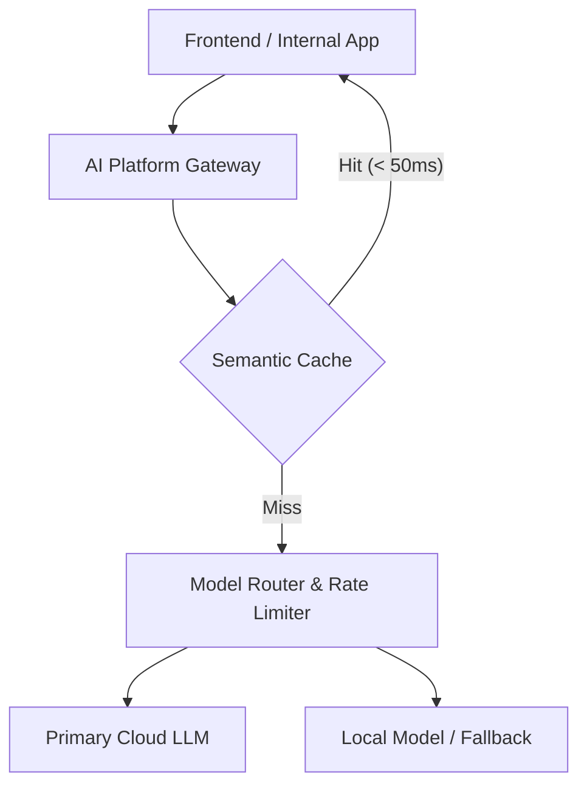
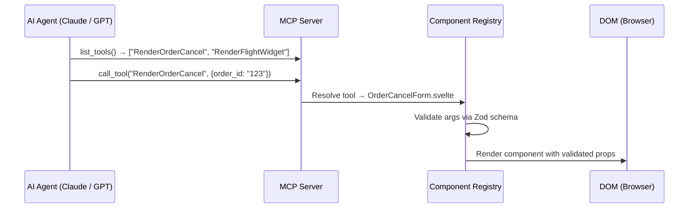

# AI-Native Frontend in 2028: 10 Architecture Predictions

> **Answer-First:** By 2028, AI-native frontend architecture will transition from static design systems to dynamic Generative UI driven by Model Context Protocol (MCP) component registries, client-side Zod runtime schema validation, edge semantic caching, and streaming transport layers like WebSockets and Server-Sent Events.

## Executive Summary & AI Playbook Baseline

Transitioning engineering organizations into AI-native operations requires an end-to-end strategy across 5 foundational pillars:

1. **Context Engineering & DDD**: Aligning agent context windows with Domain-Driven Design bounded contexts to eliminate prompt hallucination.
2. **AI Platform Layer**: Centralizing LLM API gateways, semantic caching, rate limiting, and model fallback cascades across all frontend and backend clients.
3. **Internal Ops Automation**: AI-assisted code review, automated documentation generation, and internal operational workflow orchestration.
4. **Policy-as-Code & Agentic CI/CD**: Enforcing automated security governance, static analysis rubrics, and evaluation gates before merging AI-generated code.
5. **AI-Native System & UI Architecture**: Generative UI runtimes using Model Context Protocol (MCP), dynamic component registries, and streaming state synchronization.

---

## 1. Context Engineering & Domain-Driven Design (DDD)

Context engineering injects structured, domain-scoped data into LLM prompts using DDD boundaries:
- **Bounded Context Isolation**: Prompts receive data scoped strictly to their aggregate root (e.g. Cart, Order, or Catalog). By decoupling domain contexts, LLM reasoning is constrained to relevant fields, preventing prompt context contamination across microservices.
- **Schema-Enforced Context**: Data is passed as strongly-typed JSON rather than raw unstructured strings to eliminate hallucination vectors. System prompts declare expected input and output JSON Schemas, ensuring that agent thought loops operate on predictable data structures.

---

## 2. Centralized AI Platform Layer

A modern enterprise AI Platform Layer decouples product code from cloud LLM vendors via centralized proxying, token usage tracking, and edge semantic caching:


```mermaid
graph TD
    Client[Frontend / Internal App] --> Gateway[AI Platform Gateway]
    Gateway --> Cache{Semantic Cache}
    Cache -- "Hit (< 50ms)" --> Client
    Cache -- "Miss" --> Router[Model Router & Rate Limiter]
    Router --> Primary[Primary Cloud LLM]
    Router --> Local[Local Model / Fallback]
```

Centralizing model routing at the gateway boundary allows engineering teams to swap underlying model providers (e.g. transitioning from OpenAI to Anthropic or local open-weights models) without deploying changes to frontend application bundles.

---

## 3. Policy-as-Code & Agentic CI/CD

All AI-generated code and runtime UI payloads pass through automated policy enforcement gates before execution or deployment. In Generative UI runtimes, policy rules validate tool call arguments against strict schema boundaries:

```typescript
const OrderCancelArgsSchema = z.object({
  order_id: z.string().uuid(),
  reason:   z.enum(["damaged", "wrong_item", "changed_mind"]),
  refund:   z.number().positive().max(10_000),
});

function handleAgentPayload(payload: unknown) {
  const result = OrderCancelArgsSchema.safeParse(payload);
  if (!result.success) {
    requestAgentCorrection(result.error);
    return;
  }
  renderComponent(OrderCancelForm, result.data);
}
```

If an autonomous AI agent emits an out-of-bounds parameter (e.g., a negative refund amount or invalid UUID), the policy enforcement layer intercepts the request, blocks execution, and triggers a retry loop back to the agent.

---

## 4. The 10 AI-Native Frontend Predictions for 2028

| # | Prediction | Signal Strength |
|---|---|---|
| 01 | Handwritten component scaffolding is automated by 2027 | 🟢 Already observable |
| 02 | MCP becomes the "USB-C" of AI ↔ Frontend contracts | 🟢 Already observable |
| 03 | Component Registries replace Design Systems as governance layer | 🟡 Early signal |
| 04 | React's dominance fractures — Svelte/Astro capture AI-Native niche | 🟡 Early signal |
| 05 | "Frontend Developer" splits into Orchestrators & Craftsmen | 🟡 Early signal |
| 06 | Streaming stateful transports (WebSockets/SSE) dominate over REST | 🟢 Already observable |
| 07 | Zod runtime schema validation becomes a mandatory security layer | 🟢 Already observable |
| 08 | Human-in-the-Loop (HITL) becomes a legal compliance requirement | 🔴 Forecast |
| 09 | Edge Semantic Caching cuts LLM API costs 60–80% | 🟡 Early signal |
| 10 | Legacy SPAs become unmigrateable monoliths, requiring Strangler Fig | 🟡 Early signal |


```mermaid
sequenceDiagram
    participant A as AI Agent (Claude / GPT)
    participant M as MCP Server
    participant R as Component Registry
    participant D as DOM (Browser)

    A->>M: list_tools() → ["RenderOrderCancel", "RenderFlightWidget"]
    A->>M: call_tool("RenderOrderCancel", {order_id: "123"})
    M->>R: Resolve tool → OrderCancelForm.svelte
    R->>R: Validate args via Zod schema
    R->>D: Render component with validated props
```

By 2028, component registries will supersede legacy static design systems by providing machine-readable schema contracts for every component. AI agents will dynamically query available component schemas via Model Context Protocol (MCP), streaming validated UI layouts directly to client viewports over WebSockets or Server-Sent Events (SSE).

---

## FAQ


MCP acts as the standardized state and capability exchange protocol between AI reasoning agents and the frontend client. Instead of writing custom API adapters for every component, the client uses MCP to negotiate component schema rendering, state synchronization, and tool execution bounds in real-time.



We enforce strict schema parsing at the client boundary using libraries like Zod or TypeBox. The frontend never executes raw streamed JSON/TSX without validating props against a pre-compiled, versioned component registry.



Policy-as-Code ensures that autonomous pull requests or code edits generated by AI agents meet security standards, linting rules, and test coverage thresholds automatically before code is merged into main branches.



