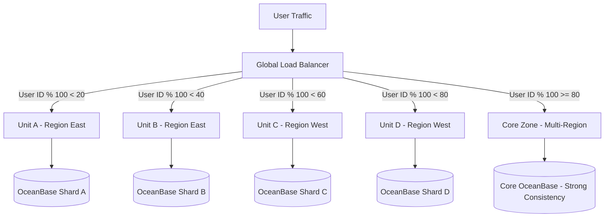

**Answer-first:** Alipay scaled to 583,000 TPS using Logical Data Center (LDC) unitization for multi-site active-active disaster recovery, OceanBase for distributed relational storage with Raft consensus, RocketMQ for transactional messaging, and SOFAStack middleware. This architecture guarantees horizontal scalability and financial-grade consistency under peak load.

---

## Executive Summary & Research Baseline

At midnight on November 11th (Singles' Day), Alipay processes over **583,000 payment transactions per second (TPS)**. The architecture evolved through 4 major phases:

1. **Phase 1 (Monolith, Oracle)**: Monolithic Java app hit physical database lock limits.
2. **Phase 2 (Microservices, MySQL Sharding)**: Scaled horizontally but hit consistency ceilings under network partitions.
3. **Phase 3 (OceanBase + LDC + SOFAStack)**: Introduced cell-based unitization and LSM-tree distributed consensus.
4. **Phase 4 (Cloud-Native Global Unitization)**: Multi-region active-active deployment with automated failover.

---

## LDC (Local Deployment Center) Unitization

LDC unitization partitions users into logical units (cells). Each cell contains a self-contained slice of microservices and an OceanBase database shard:

---

## OceanBase Distributed Database Engine

OceanBase uses an LSM-Tree storage engine and Paxos consensus:
- **LSM-Tree Storage**: Converts random writes to sequential I/O by batching updates in MemTable before flushing to SSTables.
- **Multi-Tenant Isolation**: Hard CPU/RAM limits per tenant prevent noisy-neighbor transaction spikes.
- **Arbitration Service**: 2-replica data clusters achieve quorum via a lightweight third arbitration node without full data replication costs.

---

## RocketMQ 5.x Transactional Messaging

RocketMQ implements 2-phase prepare-commit transactional messages:
1. Producer sends a "prepared" message to broker.
2. Producer executes local database transaction.
3. Producer sends "commit" or "rollback" signal based on DB transaction outcome.

---

## Research Reading Guide & Reference Patterns

| Module | Core Concepts | Application |
|---|---|---|
| **LDC Unitization** | Cell-based routing, user ID hash partitioning | Bounded failure domains |
| **OceanBase** | Paxos quorum, LSM-Tree, multi-tenancy | Distributed write-heavy storage |
| **RocketMQ** | 2-phase transactional messages, timer queues | Exactly-once financial event handling |
| **SOFAStack** | Bolt RPC protocol, SOFATracer, Seata Saga | Microservice mesh governance |

---

## FAQ


LDC (Local Deployment Center) unitization is a horizontal partitioning model that divides user space, services, and database shards into self-contained units. When a unit fails, only users mapped to that unit are affected, and the load balancer remaps them in milliseconds.



OceanBase uses an LSM-tree storage engine to write updates into memory (MemTable) before flushing to disk as immutable SSTables, converting random I/O into fast sequential writes. Paxos consensus guarantees multi-datacenter data consistency.



