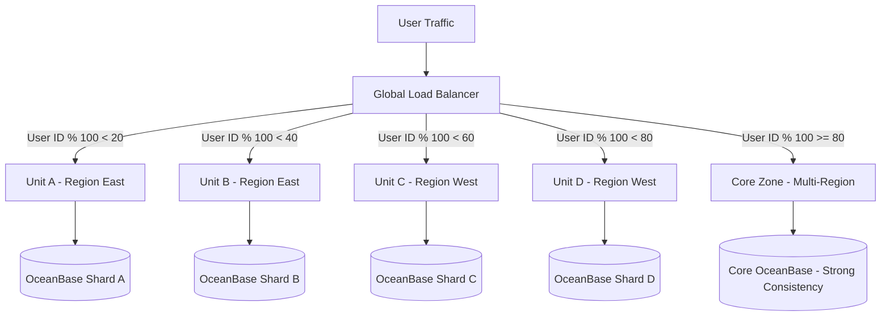

At midnight on November 11th, approximately 1.5 billion people across Asia collectively open a single app and start tapping "Buy Now." In the first 60 seconds, Alipay processes more transactions than a major Western bank handles in an entire day. The 2023 Singles' Day peak — **583,000 payment transactions per second (TPS)** — is not just a headline. It is the product of fourteen years of architectural evolution that has redefined what "production-ready" means for a financial platform.

This post distills the key architectural decisions behind that number. If you want to go deeper into each layer, our [Full Alipay Double 11 Architecture Series](/series/alipay-double-11/) covers every component in detail across nine chapters.

---

## What Is Double 11 and Why It's an Engineering Problem at Planetary Scale

Double 11 (11.11, Singles' Day) is an annual Chinese shopping festival that has grown into the world's largest e-commerce event. In 2023, the Alibaba ecosystem processed over 1 trillion RMB (≈$138 billion) in gross merchandise value (GMV) across the 24-hour window.

From an engineering perspective, the challenge is not the daily average. Alipay handles hundreds of millions of routine payments every day. The challenge is the **traffic shape**: a near-vertical spike at midnight, a secondary spike around 8 PM, and relative silence for most of the day in between.

This asymmetry forces Alipay to design a system that can:
- Handle **100× normal peak traffic** for sustained 30-minute windows
- Guarantee **exactly-once payment semantics** under extreme concurrency
- Maintain **sub-100ms P99 latency** while the system is under maximum load
- Recover automatically from **any single region or datacenter failure** without a transaction being lost

Solving these four requirements simultaneously — at planetary scale — is the engineering problem.

---

## The 4 Phases of Alipay's Scaling Journey (2009 → 2023)

Alipay's architecture did not start at 583,000 TPS. It evolved through distinct phases, each driven by hitting the hard limits of the previous approach.

### Phase 1 (2009–2013): The Monolith

The original Alipay system was a Java monolith deployed on Oracle databases. It worked until the first Double 11 event in 2009 brought the entire site down within minutes. The event traffic was simply several orders of magnitude higher than what the hardware could absorb.

### Phase 2 (2013–2016): Microservices + MySQL Sharding

The response was to decompose the monolith into hundreds of services and shard the MySQL database horizontally. This bought years of headroom, but the 2016 Double 11 exposed the next bottleneck: MySQL could not provide the strong consistency guarantees required for financial transactions at this scale while also staying available during network partitions.

Read our [Phase 2 Architecture Deep Dive](/series/alipay-double-11/phase-2-architecture/) for the full story of how MySQL sharding hit its ceiling.

### Phase 3 (2016–2020): OceanBase + LDC + SOFAStack

The decisive architectural pivot introduced three new components simultaneously:
- **OceanBase**: A distributed relational database built internally at Ant Group to replace Oracle and MySQL
- **LDC (Local Deployment Center) unitization**: A logical partitioning model for traffic, services, and data that enables datacenter-level isolation
- **SOFAStack**: A full-spectrum microservices framework built on top of Dubbo, including service mesh, circuit breakers, and distributed tracing

### Phase 4 (2020–Present): Cloud-Native + Global Unitization

The current architecture extends LDC principles to multi-region global deployment and runs on Ant Group's own cloud infrastructure with custom Kubernetes clusters. OceanBase 4.x introduced a new log-structured storage engine and independent arbitration services that dramatically improved throughput for write-heavy financial workloads.

---

## LDC (Local Deployment Center) Unitization: Traffic Isolation Without Data Loss

LDC unitization is the most distinctive and least-understood part of Alipay's architecture. It is the primary reason Alipay can withstand complete datacenter failures without losing a single transaction.

### The Core Concept

A traditional high-availability architecture routes all requests to a primary datacenter and fails over to a standby when the primary fails. The problem: failover requires detecting the failure, electing a new primary, and re-routing traffic — a process that takes seconds to minutes. In financial systems, these are seconds of lost transactions.

LDC takes a fundamentally different approach. Instead of primary/standby, it **partitions the user space into logical units**. Each unit is a self-contained slice of the system that contains:
- A subset of users (partitioned by user ID hash)
- The services required to process those users' transactions
- A shard of the database containing those users' account data

### Cross-Unit Transactions and the Core Zone

Not all transactions are self-contained within a single user's data. A payment between two users in different units must span unit boundaries. Alipay handles this by routing all cross-unit transaction finalization through a dedicated **Core Zone** — a set of high-availability services deployed across all regions simultaneously with synchronous replication.

The Core Zone uses OceanBase in Paxos multi-replica mode, where a write is only acknowledged when a quorum (at least 2 of 3 replicas) have persisted it. This guarantees no transaction is lost even if an entire datacenter vanishes mid-write.

### The Failover Benefit

When a unit fails, only the users mapped to that unit are affected — and the global load balancer can remap those users to a standby unit within **milliseconds**, not minutes, because the standby unit already has a warm replica of the affected data shard. The rest of the system continues processing at full capacity.

This is the architectural reason Alipay can claim "zero transaction loss" during datacenter failures: the failure boundary is a unit, not the entire system.

---

## OceanBase: The Distributed Database Built to Survive Peak Load

OceanBase is Ant Group's internal distributed relational database, open-sourced in 2021. It is the storage engine that makes LDC unitization possible, because it natively supports the multi-tenant, multi-shard, geographically distributed data model that LDC requires.

### Key Design Decisions

**1. LSM-Tree Storage Engine**
OceanBase uses a Log-Structured Merge-Tree (LSM-Tree) storage engine, the same class of engine used by RocksDB and Cassandra. Unlike a traditional B-tree, LSM-Trees batch writes into memory (MemTable), flush them to immutable disk files (SSTables), and compact SSTables in the background. This converts random writes to sequential I/O, dramatically increasing write throughput — critical for payment processing where write rate is the bottleneck.

**2. Paxos-Based Multi-Replica Consensus**
Each OceanBase partition (tablet) is replicated across at least three replicas in different availability zones. Writes use the Paxos consensus protocol: the leader replica proposes the write, and it is committed when a majority acknowledge receipt. This provides **strong consistency** without relying on a single master.

**3. Multi-Tenant Isolation**
OceanBase runs multiple business units (payment ledger, user accounts, merchant accounts, etc.) as separate tenants on a shared physical cluster. Resources (CPU, memory, I/O) are allocated per-tenant with hard limits, preventing a surge in one domain from affecting another.

**4. OceanBase 4.x: The Arbitration Service**
OceanBase 4.x introduced an independent Arbitration Service — a lightweight process that participates in Paxos elections without storing data. This allows a 2-replica cluster to achieve quorum for writes without requiring a full third replica to be present, reducing infrastructure cost while maintaining availability guarantees.

### How OceanBase Compares to TiDB and CockroachDB

| Feature | OceanBase 4.x | TiDB 8.x | CockroachDB 23.x |
|---|---|---|---|
| Consensus Protocol | Paxos | Raft | Raft |
| Storage Engine | LSM-Tree (self) | RocksDB | Pebble (RocksDB fork) |
| Multi-Tenancy | Native (per-tenant resource caps) | Via TiDB Cloud | Via virtual clusters |
| MySQL Compatibility | Full (OB MySQL mode) | Full | Partial |
| Oracle Compatibility | Full (OB Oracle mode) | No | No |
| Financial/HTAP Use | Primary design target | Strong HTAP | Strong OLTP |

For a full comparison with TiDB in the context of scaling a MySQL-based payment ledger, see our post on [MySQL Database Scaling: Sharding and TiDB Architecture](/posts/mysql-scaling-sharding-tidb-architecture).

---

## RocketMQ 5.x: Handling Billions of Financial Events Per Day

Every payment at Alipay generates a cascade of downstream events: ledger entries, risk scoring, merchant settlements, user notifications, loyalty point accruals, and tax records. These must be processed durably and in guaranteed order — but they must not block the payment response.

RocketMQ is Alipay's (and Alibaba's) event streaming backbone. It is the financial-grade alternative to Apache Kafka, with several capabilities that make it better suited for payment event processing.

### Why RocketMQ Over Kafka for Payments

**Transactional Message Protocol**: RocketMQ's native transactional message protocol implements a two-phase prepare-then-commit mechanism. A producer sends a "prepared" message (invisible to consumers), executes the local database transaction, and then sends a "commit" signal. If the producer crashes between prepare and commit, RocketMQ's broker queries the producer's `checkLocalTransaction` callback to determine whether the transaction succeeded and decides whether to commit or rollback the message. This guarantees **exactly-once event delivery** aligned with database transaction outcomes.

Kafka, by contrast, provides idempotent producers and transactions, but the transaction semantics are scoped to Kafka itself — they do not coordinate with external database transactions without application-level two-phase commit logic.

**Timer Messages**: RocketMQ supports delivering messages with delays up to 40 days. Alipay uses this for:
- Payment expiry reminders (e.g., "your QR code expires in 5 minutes")
- Deferred settlement triggers (e.g., escrow release after 7-day return window)
- SLA monitoring (e.g., if merchant has not shipped in 48 hours, alert)

**Message Tracing**: RocketMQ 5.x provides built-in message tracing that records the full lifecycle of each message (produce, store, deliver, consume, ACK) with microsecond timestamps. This is a hard requirement for financial audit trails.

### Scale at Double 11

During Double 11 2023, the Alibaba RocketMQ cluster sustained:
- **1 trillion+ message deliveries** across the 24-hour window
- Peak throughput of **multiple millions of messages per second**
- P99 message delivery latency under 5ms for payment-critical topics

For a deeper exploration of event-driven patterns using a similar architecture, see [Mastering Event-Driven Architecture with Dapr](/posts/mastering-event-driven-architecture-dapr).

---

## SOFAStack Microservices: How Ant Group Standardized Service Mesh at Scale

With hundreds of microservices, Alipay needed a standardized framework for service communication, discovery, resilience, and observability. SOFAStack is the internal framework that emerged from this need — now open-sourced.

### Key Components

**SOFARPC**: A high-performance RPC framework based on the Bolt protocol. Bolt is a binary, length-prefixed protocol optimized for financial services: it includes built-in message type, sequence ID, and serialization format fields in the header, enabling request multiplexing and timeout management per-request on a single TCP connection.

**SOFAMesh**: A service mesh implementation that integrates with Envoy and Istio but extends them with Ant Group's specific requirements: connection pooling policies for financial service SLAs, dynamic routing rules for LDC unit-aware traffic steering, and circuit breaker state synchronization across zones.

**Seata**: The distributed transaction coordinator that implements Saga, TCC (Try-Confirm-Cancel), and AT (Automatic Transaction) modes for coordinating cross-service database operations. If you are building distributed transaction patterns with a different runtime, see our post on [Dapr Workflow Saga Orchestration](/posts/dapr-workflow-saga-orchestration-guide/) for a Go-native implementation of the same patterns.

**SOFATracer**: A distributed tracing system that propagates trace context (Trace ID, Span ID) across all SOFARPC calls, HTTP requests, and RocketMQ messages. Every financial operation at Alipay is fully traceable from the initial payment API call to the final ledger write and notification dispatch.

---

## Annual Stress Testing: How Alipay Practices for the Worst Day of the Year

Alipay does not simply add more servers and hope for the best. The week before Double 11, engineering teams run a full-scale production chaos engineering rehearsal called **全链路压测 (Full-Link Stress Test)**.

### What Full-Link Stress Testing Covers

1. **Shadow Traffic Replay**: Production traffic is replayed at 2× the expected peak against real production infrastructure using shadow databases (isolated from real user data). This identifies bottlenecks under realistic query distributions.

2. **LDC Unit Failover Drill**: Individual units are deliberately killed to verify that the global load balancer reroutes traffic within the SLA (sub-100ms), that OceanBase replica promotion completes without data loss, and that downstream services gracefully degrade.

3. **RocketMQ Consumer Lag Simulation**: Consumer groups are artificially throttled to simulate a downstream consumer falling behind during peak load. Engineers verify that backpressure flows correctly through the system without cascading failures.

4. **Capacity Headroom Verification**: After all drills pass, a final load test is run at **110% of the expected peak** to verify a 10% safety buffer. If any service saturates before that threshold, it is scaled up before Double 11 goes live.

This culture of structured rehearsal is what separates Alipay's architecture from systems that are "designed for scale" but have never actually been tested at it. For teams building Kubernetes-hosted services, similar chaos engineering practices can be applied at cluster level — a topic covered in [GitOps at Scale: Kubernetes and ArgoCD for Microservices](/posts/gitops-at-scale-kubernetes-argocd-microservices/).

---

## Lessons for Modern Engineers: What You Can Actually Apply Today

The Alipay architecture operates at a scale most engineers will never encounter. But the *principles* behind each decision are directly applicable to services handling thousands, not hundreds of thousands, of TPS.

### 1. Design Failure Boundaries, Not Failover
The LDC model shows that the goal is not to recover quickly from failure — it is to bound the blast radius of failure. Before your next incident, ask: "If this service goes down, what percentage of our users are affected?" If the answer is "all of them," your failure boundary is too large.

### 2. Choose Your Database Consistency Model Based on the Transaction Type
OceanBase uses Paxos-level strong consistency for the payment ledger but eventual consistency for ancillary data like recommendation scores and loyalty points. Match your consistency guarantee to the actual business requirement, not to a blanket policy. Strong consistency has real throughput costs; pay that cost only where it matters.

### 3. Transactional Messaging Is Not Optional for Financial Events
If your payment service emits events (order created, payment settled, refund initiated) via fire-and-forget Kafka producers, you have a distributed systems correctness bug waiting to surface. Implement transactional messaging — either via Kafka transactions, RocketMQ transactional messages, or an outbox pattern — before you hit production at scale.

### 4. Rehearse the Worst Day
Chaos engineering is not just for FAANG companies. Even small teams can run tabletop failover drills, simulate downstream consumer lag, and load-test at 110% of expected peak before major events. The cost of a production incident during peak traffic is always higher than the cost of a pre-event rehearsal.

---

## Frequently Asked Questions

### What is LDC unitization in Alipay's architecture?
LDC (Local Deployment Center) unitization is a horizontal partitioning model that divides Alipay's user space, services, and database shards into self-contained "units." Each unit handles a subset of users independently. When a unit fails, only users mapped to that unit are affected, and the global load balancer can remap those users to a standby unit in milliseconds. This bounds the blast radius of any failure to a fraction of total traffic.

### How does OceanBase compare to CockroachDB or TiDB?
All three are distributed relational databases using consensus protocols (Paxos for OceanBase, Raft for TiDB and CockroachDB). OceanBase is differentiated by native Oracle SQL compatibility, multi-tenant resource isolation, and its LSM-Tree storage engine tuned for write-heavy financial workloads. TiDB has stronger HTAP (Hybrid Transactional/Analytical Processing) capabilities via TiFlash columnar storage. CockroachDB has the strongest multi-region active-active replication story for global geographic distribution.

### How many transactions did Alipay process during Double 11 2023?
The verified peak was **583,000 payment transactions per second (TPS)** sustained during the midnight spike. The total transaction volume for the 24-hour event exceeded several hundred billion RMB in payment value. The infrastructure handled this without reported SLA violations due to LDC unit isolation and OceanBase's horizontal scaling.

For a comparison with how a different payment platform solved similar concurrency challenges — how PayPay handles 7.8 billion transactions/year using Kafka idempotency, TiDB, and campaign-era Redis counters — see [PayPay Architecture: Scaling to Billions of Transactions](/posts/paypay-architecture-scaling).


