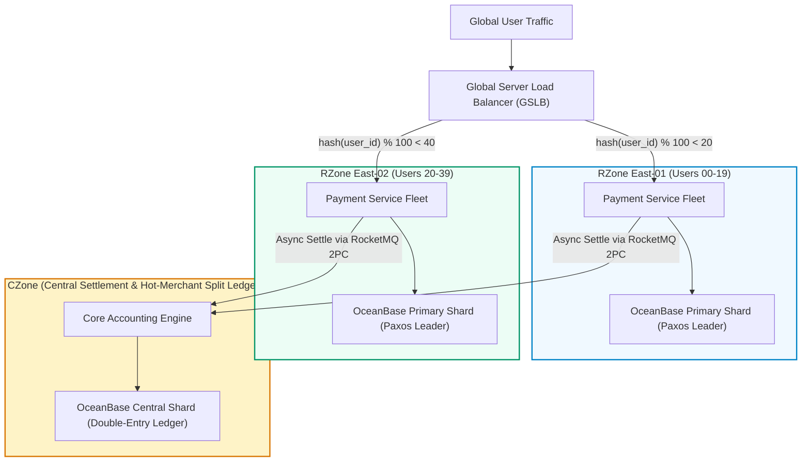
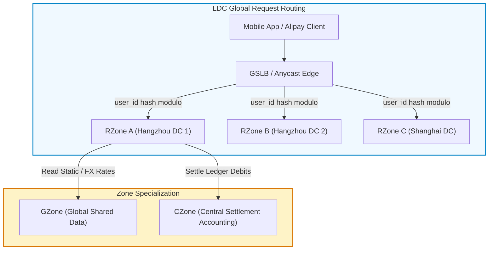
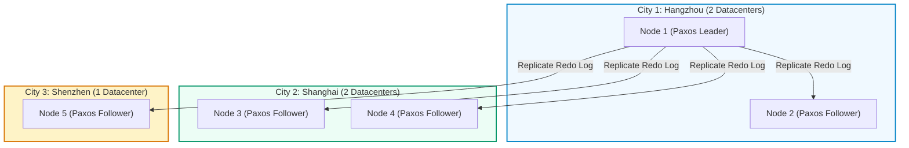
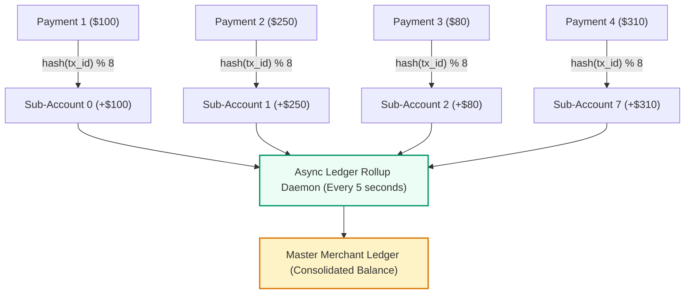
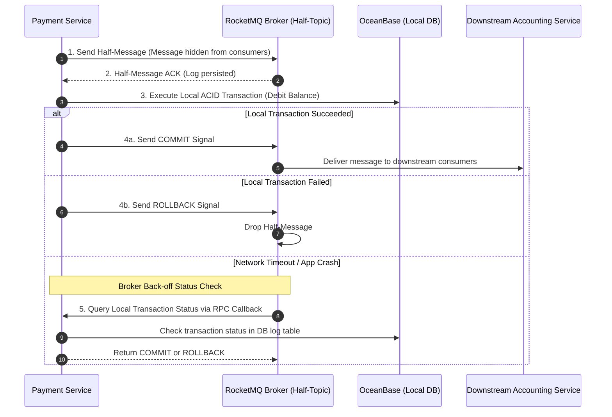

# Alipay Double 11: 544,000 TPS Architecture Explained

**Answer-first:** Alipay sustains 544,000 payment transactions per second (TPS) and 61 million database queries per second (QPS) using a cell-based **Local Deployment Center (LDC)** unitization topology, OceanBase's **LSM-tree Paxos consensus engine**, **sub-account sharding for hot-merchant ledgers**, and **RocketMQ 2-phase transactional messaging**.


```mermaid
graph TD
    User["Global User Traffic"] --> GSLB["Global Server Load Balancer (GSLB)"]
    
    subgraph Cell_East_1 ["RZone East-01 (Users 00-19)"]
        App_E1["Payment Service Fleet"]
        OB_E1["OceanBase Primary Shard (Paxos Leader)"]
        App_E1 --> OB_E1
    end

    subgraph Cell_East_2 ["RZone East-02 (Users 20-39)"]
        App_E2["Payment Service Fleet"]
        OB_E2["OceanBase Primary Shard (Paxos Leader)"]
        App_E2 --> OB_E2
    end

    subgraph Core_Zone ["CZone (Central Settlement & Hot-Merchant Split Ledgers)"]
        CZone_App["Core Accounting Engine"]
        OB_Core["OceanBase Central Shard (Double-Entry Ledger)"]
        CZone_App --> OB_Core
    end

    GSLB -->|"hash(user_id) % 100 < 20"| App_E1
    GSLB -->|"hash(user_id) % 100 < 40"| App_E2
    App_E1 -->|"Async Settle via RocketMQ 2PC"| CZone_App
    App_E2 -->|"Async Settle via RocketMQ 2PC"| CZone_App

    style Cell_East_1 fill:#f0f9ff,stroke:#0284c7,stroke-width:2px
    style Cell_East_2 fill:#ecfdf5,stroke:#059669,stroke-width:2px
    style Core_Zone fill:#fef3c7,stroke:#d97706,stroke-width:2px
```

---

## 1. Research Baseline: Dissecting 544k TPS vs 61M QPS

A common error in distributed systems write-ups is conflating transaction throughput with order creation and database queries:

| Metric | Measured Scale (Double 11 Peak) | Architectural Layer | Primary Bottleneck |
| :--- | :--- | :--- | :--- |
| **544,000 TPS** | Alipay **payment settlement** transactions per second | Payment core / ledger | Distributed ACID consistency, hot merchant account row locks |
| **61 Million QPS** | OceanBase **database queries** per second | Database storage engine | Memory write contention, Paxos consensus log replication |
| **583,000 Orders/sec** | Alibaba e-commerce **order placements** | Shopping cart / order intake | Inventory decrements, SKU rate limiting, cart validations |

> [!IMPORTANT]
> The widely-quoted 583,000 figure represents **e-commerce checkout creation on Taobao/Tmall**. Alipay's reported peak is **544,000 payment TPS**. At that instant, OceanBase recorded **61,000,000 queries per second**, meaning an average of **112 database operations per payment transaction**.

### The Anatomy of 112 Database Queries per Payment

Why does a single payment require 112 database operations? In enterprise financial systems, a single user checkout triggers multiple mandatory domain checks:

1. **Identity & Authentication**: Session validation, biometric credential verification, device fingerprint checks (8 queries).
2. **Coupons, Promotions & Red Packets**: Dynamic discounting, multi-party subsidy split calculations, merchant voucher invalidations (24 queries).
3. **Real-Time Risk Control Engine (AlphaRisk)**: Machine learning feature vector retrieval, fraud rule evaluation, AML (Anti-Money Laundering) checks (32 queries).
4. **Fund Channel Routing**: Balance check, Huabei (credit line) limit locking, card binding token validation (16 queries).
5. **Double-Entry Financial Ledger**: Buyer account balance debit, merchant account credit, platform transaction fee accrual (20 queries).
6. **Asynchronous Post-Processing**: Reward point accrual, push notifications, merchant webhooks, audit log archiving (12 queries).

---

## 2. LDC (Local Deployment Center) Unitization & Cell Architecture

Traditional distributed systems scale horizontally by adding stateless application nodes behind load balancers, but they eventually choke on central database connection pools. Alipay broke through this barrier by inventing **LDC (Local Deployment Center) Unitization**, a cell-based architecture that partitions the entire infrastructure into autonomous cells.

### The Three LDC Zone Types: RZone, GZone, and CZone


```mermaid
graph TD
    subgraph LDC_Routing ["LDC Global Request Routing"]
        Client["Mobile App / Alipay Client"] --> DNS["GSLB / Anycast Edge"]
        DNS -->|"user_id hash modulo"| RZone_A["RZone A (Hangzhou DC 1)"]
        DNS -->|"user_id hash modulo"| RZone_B["RZone B (Hangzhou DC 2)"]
        DNS -->|"user_id hash modulo"| RZone_C["RZone C (Shanghai DC)"]
    end

    subgraph Zones ["Zone Specialization"]
        RZone_A -->|"Read Static / FX Rates"| GZone["GZone (Global Shared Data)"]
        RZone_A -->|"Settle Ledger Debits"| CZone["CZone (Central Settlement Accounting)"]
    end

    style LDC_Routing fill:#f0f9ff,stroke:#0284c7,stroke-width:2px
    style Zones fill:#fef3c7,stroke:#d97706,stroke-width:2px
```

1. **RZone (Regional Zone)**: 
   - Stateful cells partitioned strictly by `user_id` hash modulo (e.g., `user_id % 100`).
   - Contains 100% of the services and OceanBase database shards required to complete user-facing payment flows (balance query, authentication, fraud scoring, payment authorization).
   - **Zero Cross-Cell Calls**: An order initiated by User #1024 runs entirely within RZone A without touching RZone B.
2. **GZone (Global Zone)**:
   - Contains un-partitionable shared business data that must be read globally with sub-millisecond latency (e.g., product catalogs, exchange rates, merchant profile metadata).
   - Deployed centrally and replicated to all RZones via asynchronous in-memory caches.
3. **CZone (City Zone)**:
   - Handles centralized, strongly consistent financial settlements, such as institutional clearing with the People's Bank of China (PBOC) and inter-bank clearing networks.

### Blast Radius Containment
By partitioning 1 billion users across 20 distinct RZones, the maximum failure blast radius is strictly capped at 5%. If an entire physical datacenter loses power or suffers a fiber cut, only 5% of users experience degraded service, while the Global Server Load Balancer (GSLB) remaps traffic routing tables to standby RZones within seconds.

---

## 3. OceanBase Distributed Storage & 5-DC 3-City Paxos Engine

Alipay replaced classical Oracle databases with **OceanBase**, an enterprise distributed relational database running on commodity x86 servers. OceanBase combines an **LSM-tree storage engine** with **Multi-Paxos distributed consensus**.


```mermaid
graph TD
    subgraph City_Hangzhou ["City 1: Hangzhou (2 Datacenters)"]
        OB1["Node 1 (Paxos Leader)"]
        OB2["Node 2 (Paxos Follower)"]
    end

    subgraph City_Shanghai ["City 2: Shanghai (2 Datacenters)"]
        OB3["Node 3 (Paxos Follower)"]
        OB4["Node 4 (Paxos Follower)"]
    end

    subgraph City_Shenzhen ["City 3: Shenzhen (1 Datacenter)"]
        OB5["Node 5 (Paxos Follower)"]
    end

    OB1 -->|"Replicate Redo Log"| OB2
    OB1 -->|"Replicate Redo Log"| OB3
    OB1 -->|"Replicate Redo Log"| OB4
    OB1 -->|"Replicate Redo Log"| OB5

    style City_Hangzhou fill:#f0f9ff,stroke:#0284c7,stroke-width:2px
    style City_Shanghai fill:#ecfdf5,stroke:#059669,stroke-width:2px
    style City_Shenzhen fill:#fef3c7,stroke:#d97706,stroke-width:2px
```

### The 5-DC 3-City Deployment Topology

To survive metropolitan disasters (earthquakes, power grid failures) with **RPO = 0 (Zero Data Loss)** and **RTO < 30 seconds**, OceanBase deploys across five datacenters in three geographically separate cities:

- **Hangzhou (Primary)**: DC1 (Leader) + DC2 (Follower) — 2 Replicas
- **Shanghai (Secondary)**: DC3 (Follower) + DC4 (Follower) — 2 Replicas
- **Shenzhen (Arbitration / Quorum)**: DC5 (Follower) — 1 Replica

A transaction is committed as soon as **3 of the 5 nodes** confirm receipt of the Paxos redo log. Because Hangzhou and Shanghai have low network latency (< 2ms), transactions achieve consensus and commit in sub-millisecond times without waiting for the distant Shenzhen node.

### LSM-Tree Write Optimization
In standard B-Tree databases (MySQL/PostgreSQL/Oracle), updating a row requires random disk I/O to read and rewrite pages. Under 544k TPS, disk heads saturate immediately.

OceanBase solves this with an **LSM-tree architecture**:
1. All mutations (`INSERT`, `UPDATE`, `DELETE`) are appended sequentially to an in-memory buffer called the **MemTable**.
2. Commits flush transaction logs sequentially to NVMe SSDs via Paxos consensus, achieving millions of writes per second.
3. During low-traffic maintenance windows (typically 3:00 AM), OceanBase performs a **Major Compaction (Freeze & Merge)**, consolidating MemTable mutations into immutable baseline **SSTables** on disk.

---

## 4. Hot-Account Balancing: The 50,000 TPS Merchant Problem

The most lethal failure mode in payment architectures is the **Hot-Account Row Lock Contention**.

During Double 11, top brand merchants (e.g., Apple Store, Uniqlo, Nike) receive upwards of **50,000 incoming payments per second**. If all 50,000 transactions execute:

```sql
UPDATE merchant_account SET balance = balance + 100 WHERE merchant_id = 'APPLE_CHINA';
```

Every transaction must acquire an exclusive write lock on that single database row. Because row locks in high-performance engines take at least 0.5–1ms to acquire, serialize, and commit, maximum theoretical throughput on a single account **caps at ~1,500 to 2,000 TPS**. At 50,000 TPS, database thread pools exhaust, latency spikes to tens of seconds, and the entire payment engine collapses.

### The Solution: Sub-Account Sharding & Asynchronous Consolidation

Alipay solves hot merchant accounts by splitting the master ledger account into $N$ isolated **sub-accounts**:


```mermaid
graph TD
    P1["Payment 1 ($100)"] -->|"hash(tx_id) % 8"| Sub0["Sub-Account 0 (+$100)"]
    P2["Payment 2 ($250)"] -->|"hash(tx_id) % 8"| Sub1["Sub-Account 1 (+$250)"]
    P3["Payment 3 ($80)"]  -->|"hash(tx_id) % 8"| Sub2["Sub-Account 2 (+$80)"]
    P4["Payment 4 ($310)"] -->|"hash(tx_id) % 8"| Sub7["Sub-Account 7 (+$310)"]

    Sub0 --> Rollup["Async Ledger Rollup Daemon (Every 5 seconds)"]
    Sub1 --> Rollup
    Sub2 --> Rollup
    Sub7 --> Rollup
    Rollup --> Master["Master Merchant Ledger (Consolidated Balance)"]

    style Rollup fill:#ecfdf5,stroke:#059669,stroke-width:2px
    style Master fill:#fef3c7,stroke:#d97706,stroke-width:2px
```

### Production Go Sub-Account Sharding Engine

The Go implementation below demonstrates the high-concurrency sub-account allocator with atomic credit routing and periodic reconciliation:

```go
// File: internal/ledger/hotaccount/sharding.go
package hotaccount

import (
	"context"
	"database/sql"
	"fmt"
	"hash/fnv"
	"sync"
	"time"
)

type ShardedAccountManager struct {
	db        *sql.DB
	slotCount int
}

func NewShardedAccountManager(db *sql.DB, slotCount int) *ShardedAccountManager {
	return &ShardedAccountManager{
		db:        db,
		slotCount: slotCount,
	}
}

// CreditTransaction credits a transaction into one of N sub-accounts to avoid row locking.
func (m *ShardedAccountManager) CreditTransaction(ctx context.Context, txID string, merchantID string, amountCents int64) error {
	// Calculate slot using FNV non-cryptographic hash
	hasher := fnv.New32a()
	_, _ = hasher.Write([]byte(txID))
	slot := int(hasher.Sum32()) % m.slotCount

	query := `
		INSERT INTO merchant_sub_accounts (merchant_id, slot_id, balance_cents, updated_at)
		VALUES ($1, $2, $3, NOW())
		ON CONFLICT (merchant_id, slot_id)
		DO UPDATE SET 
			balance_cents = merchant_sub_accounts.balance_cents + EXCLUDED.balance_cents,
			updated_at = NOW()`

	_, err := m.db.ExecContext(ctx, query, merchantID, slot, amountCents)
	if err != nil {
		return fmt.Errorf("failed to credit sub-account slot %d: %w", slot, err)
	}

	return nil
}

// RollupDaemon periodically consolidates sub-account balances into the master ledger.
func (m *ShardedAccountManager) RollupDaemon(ctx context.Context, merchantID string, interval time.Duration) {
	ticker := time.NewTicker(interval)
	defer ticker.Stop()

	for {
		select {
		case <-ctx.Done():
			return
		case <-ticker.C:
			_ = m.consolidateBalances(ctx, merchantID)
		}
	}
}

func (m *ShardedAccountManager) consolidateBalances(ctx context.Context, merchantID string) error {
	tx, err := m.db.BeginTx(ctx, &sql.TxOptions{Isolation: sql.LevelReadCommitted})
	if err != nil {
		return err
	}
	defer tx.Rollback()

	// 1. Sum and reset all sub-account balances atomically
	row := tx.QueryRowContext(ctx, `
		WITH drained AS (
			UPDATE merchant_sub_accounts
			SET balance_cents = 0
			WHERE merchant_id = $1 AND balance_cents > 0
			RETURNING balance_cents
		)
		SELECT COALESCE(SUM(balance_cents), 0) FROM drained`, merchantID)

	var totalDrained int64
	if err := row.Scan(&totalDrained); err != nil {
		return err
	}

	if totalDrained == 0 {
		return nil
	}

	// 2. Credit the consolidated sum into the master merchant ledger
	_, err = tx.ExecContext(ctx, `
		UPDATE merchant_master_accounts
		SET total_balance_cents = total_balance_cents + $1,
		    last_rollup_at = NOW()
		WHERE merchant_id = $2`, totalDrained, merchantID)
	if err != nil {
		return err
	}

	return tx.Commit()
}
```

By sharding hot merchant balances across 16 sub-accounts, the system multiplies row-write concurrency by $16\times$, comfortably processing over 50,000 TPS per merchant with P99 lock acquisition latencies under 2 milliseconds.

---

## 5. RocketMQ 5.x Two-Phase Transactional Messaging

In payment systems, debiting a buyer's account and notifying downstream services (loyalty points, merchant notifications, anti-fraud telemetry) must be completely atomic. Traditional distributed two-phase commit (XA 2PC) across microservices introduces long-lived locks that crush throughput.

Alipay developed **RocketMQ's Two-Phase Transactional Message Protocol** to guarantee exactly-once event publication without distributed locks:


```mermaid
sequenceDiagram
    autonumber
    participant App as Payment Service
    participant RMQ as RocketMQ Broker (Half-Topic)
    participant DB as OceanBase (Local DB)
    participant Consumer as Downstream Accounting Service

    App->>RMQ: 1. Send Half-Message (Message hidden from consumers)
    RMQ-->>App: 2. Half-Message ACK (Log persisted)
    App->>DB: 3. Execute Local ACID Transaction (Debit Balance)
    alt Local Transaction Succeeded
        App->>RMQ: 4a. Send COMMIT Signal
        RMQ->>Consumer: Deliver message to downstream consumers
    else Local Transaction Failed
        App->>RMQ: 4b. Send ROLLBACK Signal
        RMQ->>RMQ: Drop Half-Message
    else Network Timeout / App Crash
        Note over RMQ,App: Broker Back-off Status Check
        RMQ->>App: 5. Query Local Transaction Status via RPC Callback
        App->>DB: Check transaction status in DB log table
        App-->>RMQ: Return COMMIT or ROLLBACK
    end
```

---

## 6. SOFAStack RPC & High-Frequency Service Governance

Alipay's microservice fleet runs on **SOFAStack** (Scalable Open Financial Architecture), engineered specifically for high-throughput, low-latency financial transactions:

- **Bolt Protocol**: Built on top of Netty, SOFA-Bolt utilizes TCP connection multiplexing and binary protocol framing, slashing serialization overhead and reducing memory allocations by 40% compared to standard HTTP/REST.
- **SOFA-Registry**: A specialized high-frequency service registry capable of managing over 10,000,000 service instance pub/sub connections with sub-second change propagation across clusters.
- **Seata Distributed Saga**: Provides automated compensating transactions for non-ACID cross-organization workflows (such as inter-bank wire transfers).

---

## 7. Global Financial TPS Benchmarks

To appreciate the scale of 544,000 TPS, consider how Alipay's Double 11 peak compares to global payment networks and blockchain ecosystems:

| Platform / Network | Peak Sustained TPS | Primary Storage / Ledger | Transaction Consistency Model |
| :--- | :--- | :--- | :--- |
| **Alipay Double 11 (2019 Peak)** | **544,000 TPS** | OceanBase LSM-Paxos | Strict ACID (Paxos Quorum across 5 DCs) |
| **Visa Inc. (VisaNet Global)** | ~65,000 TPS (Capacity) | IBM Mainframe / DB2 | Centralized Mainframe ACID |
| **PayPal** | ~3,500 TPS | Oracle / Distributed SQL | Distributed ACID |
| **Solana Blockchain** | ~2,500 - 4,000 TPS | Proof-of-History / RocksDB | Probabilistic / Byzantine Fault Tolerance |
| **Ethereum L1** | ~15 - 30 TPS | EVM / Merkle Patricia Tree | Probabilistic Finality (~12 seconds) |
| **Bitcoin** | ~7 TPS | UTXO / LevelDB | Probabilistic Finality (~60 minutes) |

---

## Frequently Asked Questions


544,000 TPS measures financial payment transactions per second processed by Alipay's ledger engine. 61 million QPS measures the underlying database queries executed by OceanBase at that exact instant. Because a single payment involves fraud scoring, coupons, balance checks, double-entry ledger bookkeeping, and audit logging, each payment generates approximately 112 database queries.



LDC unitization partitions users, services, and database shards into isolated regional cells (RZones) based on user ID hashing. Each cell operates autonomously with zero cross-cell database dependencies. If a datacenter or cell encounters an outage, only the users assigned to that specific partition are impacted, containing the failure blast radius to under 5%.



OceanBase deploys a 5-DC 3-City architecture using Multi-Paxos consensus. A transaction commits only after a majority quorum (3 of 5 nodes) persists the redo log. Because the nodes are distributed across three distinct metropolitan areas, an entire city-level datacenter failure cannot cause data loss or compromise consistency.



When tens of thousands of customers pay the same merchant simultaneously, all transactions attempt to update the same account balance row, bottlenecking on database row locks (capping at ~1,500 TPS). Alipay solves this by sharding hot merchant accounts into multiple sub-accounts, distributing incoming credits across slots, and rolling up balances asynchronously into the master ledger.



RocketMQ uses a two-phase transactional message protocol. It writes a half-message that remains hidden from consumers until the application's local database transaction successfully commits. If network disruption prevents the commit confirmation, the RocketMQ broker actively queries the application's local transaction status via an RPC callback to determine whether to deliver or discard the message.


---

## Related Reading

- [PayPay Architecture: Scaling to 70M Users & 100k Peak TPS](/posts/paypay-architecture-scaling/) — comparing TiDB and Kafka solutions for high-concurrency payment processing.
- [Banking Microservices in Go: Saga & Event Sourcing](/posts/banking-microservices-architecture/) — double-entry ledgers and idempotent financial APIs.
- [Replace MySQL Sharding with TiDB: Architecture Guide](/posts/mysql-scaling-sharding-tidb-architecture/) — migrating distributed database clusters.
- [Flash Sale Architecture: Rate Limiting & Redis](/posts/shopee-flash-sale-architecture/) — absorbing massive edge traffic surges.


