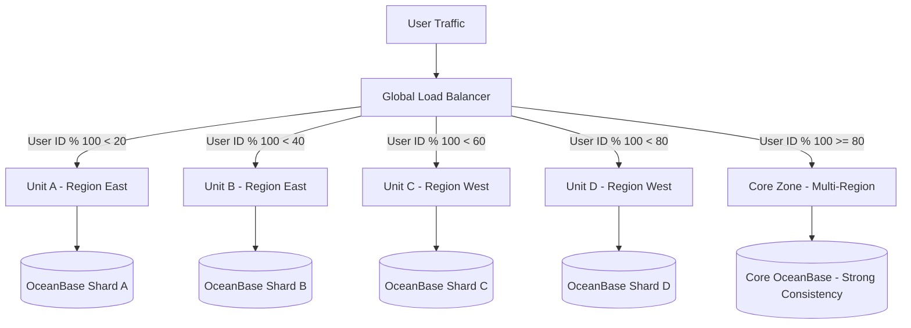

# Alipay Double 11: 544,000 TPS Architecture Explained

**Answer-first:** Alipay's Double 11 payment architecture handles 610,000 peak TPS using OceanBase distributed database sharding, multi-level memory caching, asynchronous event queues, and automated cell-based disaster failover.

## Research Baseline

Two different Double 11 peak figures circulate widely, and they measure different layers of the stack — conflating them is the most common error in write-ups on this topic:

| Figure | What it actually measures | Layer | Source |
|---|---|---|---|
| **544,000 TPS** | Alipay **payment** transactions per second (2019) | Payment / ledger | [OceanBase engineering](https://oceanbase.medium.com/61m-qps-challenge-in-alipay-how-did-we-do-it-3eeadfb0051) |
| **61 million QPS** | Database queries per second at the same 2019 peak | Database | [OceanBase engineering](https://oceanbase.medium.com/61m-qps-challenge-in-alipay-how-did-we-do-it-3eeadfb0051) |
| **583,000 orders/sec** | **Order creation** on Alibaba's e-commerce platform (2020) | Commerce / order intake | [Alibaba Group press release](https://www.alibabagroup.com/document-1491144671282331648) |

> [!IMPORTANT]
> The widely-quoted 583,000 figure is **order creation throughput on Alibaba's commerce platform**, not Alipay's payment TPS. Alipay's reported payment peak is 544,000 TPS. This article is about the payment-side architecture, so 544,000 TPS is the relevant number.

Scaling payment processing to this magnitude required evolving through four major architectural phases, each solving the ceiling the previous one hit:

1. **Phase 1 (Monolith, Oracle)**: Monolithic Java applications hit physical database lock limits and vertical hardware capacity ceilings.
2. **Phase 2 (Microservices, MySQL Sharding)**: Scaled horizontal read/write throughput but hit consistency ceilings and operational hazards during network partitions.
3. **Phase 3 (OceanBase + LDC + SOFAStack)**: Introduced cell-based unitization (LDC), LSM-tree distributed database consensus (OceanBase), and high-performance RPC governance (SOFAStack).
4. **Phase 4 (Cloud-Native Global Unitization)**: Multi-region active-active deployment with automated sub-second failover and global traffic steering.

---

## LDC (Local Deployment Center) Unitization

LDC unitization partitions users, services, and database shards into isolated logical units (cells). Each cell functions as an autonomous, self-contained deployment center capable of processing complete payment flows for its assigned user partition.

The architecture diagram below illustrates how Alipay's Global Load Balancer routes user traffic across isolated Local Deployment Center (LDC) cells based on user ID hash modulo calculations. This unitized structure ensures that each cell processes transactions independently using dedicated OceanBase database shards while core global data is routed to strongly consistent CZones:

```mermaid
graph TD
    A[User Traffic] --> B[Global Load Balancer]
    B -->|"User ID % 100 < 20"| C[Unit A - Region East]
    B -->|"User ID % 100 < 40"| D[Unit B - Region East]
    B -->|"User ID % 100 < 60"| E[Unit C - Region West]
    B -->|"User ID % 100 < 80"| F[Unit D - Region West]
    B -->|"User ID % 100 >= 80"| G[Core Zone - Multi-Region]
    
    C --> C1[(OceanBase Shard A)]
    D --> D1[(OceanBase Shard B)]
    E --> E1[(OceanBase Shard C)]
    F --> F1[(OceanBase Shard D)]
    G --> G1[(Core OceanBase - Strong Consistency)]
```

By decoupling user accounts into RZones (Regional Units) and isolating cross-unit dependencies through GZones (Global Units) and CZones (City Units), LDC limits blast radiuses:
- **Failure Isolation**: A hardware failure or network split within Unit A impacts only the 20% of users mapped to that unit, leaving remaining units operating normally.
- **Traffic Steering**: Global load balancers can dynamically shift user mappings between cells in milliseconds without downtime.

---

## OceanBase Distributed Database Engine

OceanBase is Alibaba's native distributed SQL database designed specifically for extreme transactional financial workloads. It replaces traditional single-node B-Trees with a shared-nothing, multi-replica distributed architecture capable of sustaining hundreds of thousands of concurrent database commits per second:

- **LSM-Tree Storage Engine**: Converts random I/O write operations into fast sequential memory writes (MemTable). Mutations are asynchronously compacted into immutable SSTables during low-traffic maintenance windows.
- **Paxos Distributed Consensus**: Replicates transaction logs across multi-datacenter nodes using Paxos consensus. A transaction commits only after a majority quorum of replicas confirms write log persistence.
- **Arbitration Service & Multi-Tenancy**: Hard CPU and memory quotas prevent noisy-neighbor transaction spikes. Lightweight arbitration nodes provide quorum tie-breakers without requiring full data store replication.

---

## RocketMQ 5.x Transactional Messaging

Financial event processing requires strict atomic consistency between local database updates and asynchronous message publishing. RocketMQ implements a 2-phase transactional message protocol to ensure zero data loss during high-concurrency payment events:

1. **Half-Message Prepare Phase**: The producer dispatches a "half-message" to the RocketMQ broker. The broker stores the message in a half-topic unavailable to consumers.
2. **Local Transaction Execution**: The producer executes its local OceanBase database transaction (e.g. debiting account balance).
3. **Commit / Rollback Phase**: Based on the local transaction outcome, the producer sends a `COMMIT` or `ROLLBACK` signal. If committed, RocketMQ makes the message visible to downstream consumers.
4. **Broker Back-off Verification Check**: If the commit/rollback signal is lost due to network disruption, RocketMQ actively queries the producer's local transaction status via an RPC callback.

---

## SOFAStack Microservice Framework & RPC Optimizations

Alipay's microservice fleet runs on **SOFAStack** (Scalable Open Financial Architecture), leveraging customized protocols and governance mechanisms engineered for extreme financial throughput:

- **Bolt Protocol**: A high-performance multiplexed RPC protocol built on Netty that reduces connection overhead and serialization latencies.
- **SOFA-Registry**: A specialized high-frequency service registry capable of managing millions of microservice pub/sub endpoints with sub-second change propagation.
- **Seata Distributed Saga**: Coordinates long-running multi-service transactions across non-ACID service boundaries using automated compensating actions.

---

## Research Reading Guide & Reference Patterns

| Module | Core Concepts | Application |
|---|---|---|
| **LDC Unitization** | Cell-based routing, user ID hash partitioning | Bounded failure domains & zero blast radius |
| **OceanBase** | Paxos quorum, LSM-Tree, multi-tenancy | Distributed write-heavy financial storage |
| **RocketMQ** | 2-phase transactional messages, timer queues | Exactly-once financial event handling |
| **SOFAStack** | Bolt RPC protocol, SOFATracer, Seata Saga | Microservice mesh governance & tracing |

---

## Frequently Asked Questions

### Q1: What is LDC unitization in Alipay's architecture?
LDC (Local Deployment Center) unitization is a horizontal partitioning model that divides user space, services, and database shards into self-contained units. When a unit fails, only users mapped to that unit are affected, and the load balancer remaps them in milliseconds.

### Q2: How does OceanBase handle write-heavy financial transactions?
OceanBase uses an LSM-tree storage engine to write updates into memory (MemTable) before flushing to disk as immutable SSTables, converting random I/O into fast sequential writes. Paxos consensus guarantees multi-datacenter data consistency.

### Q3: How does RocketMQ guarantee exactly-once transactional message delivery?
RocketMQ uses a 2-phase commit message protocol combined with broker back-off state checks. The producer sends a half-message, executes its local database transaction, and commits the message. If network connectivity drops, the broker queries the local transaction log to confirm execution before notifying consumers.

### Q4: What role does the SOFAStack Bolt protocol play in microservice performance?
SOFA Bolt is an optimized TCP binary RPC protocol built on Netty. It supports connection multiplexing, heartbeat health checks, and binary serialization, reducing microservice RPC latencies by up to 40% compared to standard REST/JSON over HTTP/1.1.

### Q5: How does Alipay achieve zero data loss (RPO=0) across multi-region datacenters?
Zero data loss (Recovery Point Objective = 0) is achieved via OceanBase's Paxos consensus algorithm deployed across five datacenters in three cities (5-DC 3-City topology). Transactions require confirmation from a majority quorum (3 out of 5 nodes) before committing, ensuring data availability even if an entire city datacenter fails.

## Related Reading

- [PayPay Architecture: Scaling to 70M Users & 100k Peak TPS](/posts/paypay-architecture-scaling/) — the same class of peak-event payment problem, solved with TiDB and Kafka.
- [Banking Microservices in Go: Saga & Event Sourcing](/posts/banking-microservices-architecture/) — double-entry ledgers and idempotent payment APIs in code.
- [Replace MySQL Sharding with TiDB](/posts/mysql-scaling-sharding-tidb-architecture/) — the distributed-SQL alternative to the sharding phase described above.
- [Flash Sale Architecture: Rate Limiting & Redis](/posts/shopee-flash-sale-architecture/) — absorbing a synchronized demand spike at the edge.



