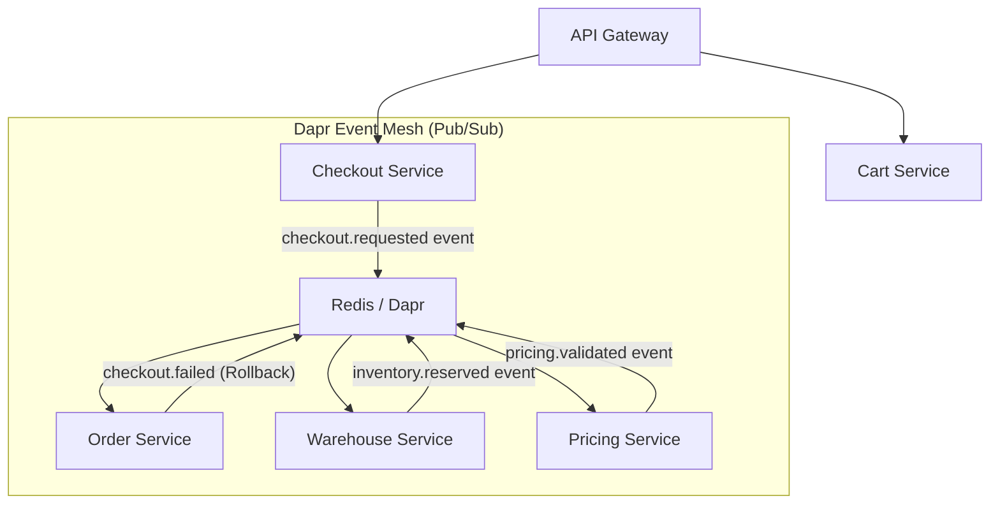

**Answer-first:** We decompose the monolith into 21 microservices using Domain-Driven Design (DDD) to isolate business boundaries. Implementing the Kratos framework in Go enables strong structural subtyping for clean layer segregation, while Dapr Workflows handle distributed transactions asynchronously via the Saga pattern to avoid race conditions.

### What You'll Learn That AI Won't Tell You
- The exact performance overhead of using Go's structural subtyping versus manual dependency injection in high-throughput microservices.
- Why scoping database transactions to a single Aggregate root is critical, and how we resolved out-of-order event delivery using Kafka partition keys.


Scaling an e-commerce platform past 10,000+ orders per day containing multiple SKUs across dynamic warehouses is where naive architecture breaks down. Hardware scaling ceases to be a magic bullet when distributed transactions, race conditions, and eventual consistency are involved.

In this deep tech dive, we will tear apart the "Hello World" abstraction of Microservices. We will look at exactly how our **21-service distributed ecosystem** interacts under the hood (you can view the full visual layout in our [E-Commerce Blueprint Diagram]()). I will share the exact Golang architectural patterns (Kratos), the Saga orchestration for distributed checkout, and how we handle race conditions under severe load.

## 1. The Distributed Landscape

> **Architecture Blueprint:** Explore the full visual domain interaction diagram in our [E-Commerce Microservices 21-Service Blueprint](/posts/blueprint-ecommerce-microservices-architecture-diagram/).

**21-service decomposition around 5 core domains, each with strict database-per-service isolation. The most volatile flow is the Checkout Saga: `Checkout` cannot use a 4-table SQL transaction across service boundaries — instead it publishes `checkout.requested` to Dapr (backed by Redis), and `Order`, `Warehouse`, and `Pricing` react independently in parallel. This is Event-Choreography, not Orchestration.**

Microservices without bounded contexts degenerate into a latency-heavy "Distributed Monolith". In Domain-Driven Design, a Bounded Context defines the logical boundary within which a specific domain model is defined and applicable. Within this boundary, terms in the Ubiquitous Language have a unique, unambiguous meaning.

For example, a `Product` in our e-commerce catalog context contains marketing copy, categorization tags, and high-resolution media. However, in the warehouse inventory context, that same product is modeled as a physical Stock Keeping Unit (SKU) with dimensional weight, physical bin location, and reservation queues. In the billing context, it is represented as a taxable pricing formula. Attempting to force a single, monolithic `Product` model across all 21 microservices leads to bloated databases, lock contention, and organizational coupling. 

By modeling these as distinct Bounded Contexts, we ensure that each service owns a minimal, optimized database schema. The services collaborate through explicit Context Maps:
- **Conformist Relationship:** The downstream Checkout Context conforms to the product IDs defined by the upstream Catalog Context.
- **Customer-Supplier Relationship:** The Order Context acts as a customer to the Warehouse Context, requesting stock reservations and receiving success/failure signals.
- **Shared Kernel:** Used very sparingly, only for global currencies and country-code configurations shared across localized shipping services.

We bounded our ecosystem loosely around five core domains, prioritizing strict database-per-service isolation (If you are just starting out, this is exactly why you might want to start with a [Modular Monolith Architecture](/series/modular-monolith-architecture/) before jumping to distributed extraction):



The diagram above encapsulates the most volatile flow: **The Checkout Saga**. When a user checks out, we cannot just open a 4-table SQL transaction anymore. `Checkout` must synchronize asynchronously with `Pricing` (to validate totals), `Warehouse` (to lock inventory), and `Order` (to generate the final aggregate). 

## 2. Enforcing Clean Architecture with Kratos

**Kratos v2 physically separates Go code into layers: `internal/biz/` (business logic, knows nothing about PostgreSQL), `internal/data/` (implements biz repository interface with GORM), `internal/service/` (gRPC/HTTP transport). Google Wire provides compile-time dependency injection — unit tests use mocked repositories that implement the same biz interface, with zero real database required.**

To manage 21 separate codebases, consistency among the engineering team is mandatory. We utilized **Kratos (v2)** to strictly enforce Clean Architecture in Golang. (You can explore the full stack we use in our [Microservices Tech Radar](/radar/)). By physically separating boundaries, we prevent database logic from bleeding into HTTP or gRPC handlers.

Here is what a standard Kratos blueprint looks like in our ecosystem:

```go
// internal/biz/order.go (Business Logic Layer)
type OrderUsecase struct {
    repo OrderRepo
    log  *log.Helper
}

func (uc *OrderUsecase) CreateOrder(ctx context.Context, o *Order) error {
    if o.TotalAmount <= 0 {
        return v1.ErrorInvalidAmount("order amount must be positive")
    }
    // Biz layer knows NOTHING about PostgreSQL or GORM
    return uc.repo.Save(ctx, o)
}

// internal/data/order.go (Data Persistence Layer)
type orderRepo struct {
    data *Data
    log  *log.Helper
}

// Implement the Biz interface
func (r *orderRepo) Save(ctx context.Context, o *biz.Order) error {
    // Database transactions safely isolated here
    return r.data.db.WithContext(ctx).Create(o).Error
}
```

### Configuring Kratos Router Middleware

To ensure that common cross-cutting concerns (authentication, tracing, logging, validation) are handled uniformly across all 21 microservices, we initialize Kratos servers with a structured middleware chain. In Kratos, middleware functions intercept requests on both HTTP and gRPC routers before delegating them to the usecase layer.

Here is the Go initialization snippet for our HTTP server router middleware:

```go
import (
    "context"
    "github.com/go-kratos/kratos/v2/middleware"
    "github.com/go-kratos/kratos/v2/middleware/auth/jwt"
    "github.com/go-kratos/kratos/v2/middleware/logging"
    "github.com/go-kratos/kratos/v2/middleware/recovery"
    "github.com/go-kratos/kratos/v2/middleware/tracing"
    "github.com/go-kratos/kratos/v2/middleware/validate"
    "github.com/go-kratos/kratos/v2/transport/http"
    jwtv4 "github.com/golang-jwt/jwt/v4"
)

// NewHTTPServer initializes the Kratos HTTP server with robust router middlewares
func NewHTTPServer(c *conf.Server, authConf *conf.Auth, logger log.Logger, usecase *biz.OrderUsecase) *http.Server {
    var opts = []http.ServerOption{
        http.Middleware(
            recovery.Recovery(), // 1. Safely recover from application panics
            tracing.Server(),    // 2. Propagate OpenTelemetry tracing headers
            logging.Server(logger), // 3. Structured JSON request logging
            validate.Validator(),  // 4. Validate Protobuf models automatically
            jwt.Server(func(token *jwtv4.Token) (interface{}, error) {
                return []byte(authConf.JwtKey), nil
            }), // 5. Enforce JWT authentication at the router layer
        ),
    }
    
    if c.Http.Addr != "" {
        opts = append(opts, http.Address(c.Http.Addr))
    }
    if c.Http.Timeout != nil {
        opts = append(opts, http.Timeout(c.Http.Timeout.AsDuration()))
    }
    
    srv := http.NewServer(opts...)
    v1.RegisterOrderServiceHTTPServer(srv, usecase)
    return srv
}
```

This middleware chain provides several critical architectural benefits:
1. **Recovery:** Intercepts runtime panic errors, logs stack traces, and returns clean HTTP `500 Internal Server Error` responses, preventing worker processes from crashing.
2. **Tracing:** Enables end-to-end trace propagation using OpenTelemetry. It extracts the trace context from incoming headers and links downstream database queries or outbound network requests, providing a cohesive timeline in Jaeger.
3. **Logging:** Standardizes metadata (e.g., latency, status codes, route paths) for centralized log aggregation.
4. **Validation:** Executes code-generated validation rules defined in protobuf files (e.g., `min_len = 1` for usernames). Invalid inputs are rejected at the edge of the router before invoking any database transactions.
5. **JWT Authentication:** Inspects authorization headers, validates cryptographically signed tokens, and injects user claims into the request context.

We tie these layers together dynamically using **Google Wire** for compile-time Dependency Injection. This allows developers to write unit tests with mocked repositories effortlessly, entirely insulating the business core from transport protocols.

## 3. The Real Beast: Distributed Transactions (Saga Pattern)

**Checkout Saga via Event-Choreography: `Checkout` publishes `checkout.requested` → `Warehouse` and `Pricing` act independently. Warehouse uses Optimistic Concurrency Control (`UPDATE inventory SET reserved_stock = reserved_stock + ? WHERE version = ?`) — if `RowsAffected == 0`, another request won the race; publish `inventory.reservation.failed`. `Order Service` acts as saga sink: on any failure event, it publishes `checkout.failed` to trigger compensation in all affected services.**

The most generic advice in microservices is "Use Pub/Sub". But how do you handle failure when Service A succeeds but Service B fails?

In our ecosystem, we implemented an **Event-Choreography Saga Pattern** using Dapr. Let's trace the complex `ConfirmCheckout` flow:
1. `Checkout Service` receives the HTTP request, validates the cart, and publishes a `checkout.requested` event to Dapr.
2. `Warehouse Service` and `Pricing Service` listen to this event and act independently on the payloads. 

### Handling Race Conditions in Warehouse
Inventory race conditions happen when two sub-second requests try to buy the last iPhone. 

If `Warehouse Service` just fires `SELECT stock FROM items WHERE id = ?`, both concurrent threads will see `stock = 1`, and both will decrement it, leading to `-1` stock. 

Instead, our Warehouse service utilizes **Optimistic Concurrency Control (OCC)** at the database layer:
```go
// Optimistic Locking to prevent overselling
result := db.Exec(`
    UPDATE inventory 
    SET reserved_stock = reserved_stock + ?, version = version + 1 
    WHERE sku_id = ? 
      AND (total_stock - reserved_stock) >= ? 
      AND version = ?`, 
    qty, skuID, qty, currentVersion)

if result.RowsAffected == 0 {
    return ErrStockInsufficientOrRaceCondition
}
```
If the lock fails due to an instant mismatch, `Warehouse` publishes an `inventory.reservation.failed` event.

### The Rollback (Compensation)
Because state is distributed, if `Warehouse` successfully locks the stock but `Pricing` reports that the applied voucher is invalid, the entire Saga must abort. 

`Order Service` often acts as the sink. If it sees `inventory.reservation.failed` OR `pricing.validation.failed`, it fires a massive compensation event: `checkout.failed`. 

Background workers (consumers) in `Warehouse Service` catch this event and immediately trigger **Compensation Logic**: 
```go
// Background Worker un-reserving stock
func (w *WarehouseWorker) HandleCheckoutFailed(ctx context.Context, event CheckoutFailed) error {
    // Rollback the reserved stock using the original transaction ID
    return w.inventoryRepo.ReleaseReservedStock(ctx, event.TransactionID)
}
```

## 4. Taming Eventual Consistency with Idempotency

**Dapr guarantees At-Least-Once delivery — the same event can arrive twice on retry. Prevention: before processing any Dapr message, attempt `INSERT INTO processed_events (event_id) VALUES (?)` in the same DB transaction as the state change. If constraint violation → duplicate, ack and drop. This `processed_events` table is the universal idempotency key store across all 21 services.**

When you rely on network events, network retries will happen. Dapr guarantees "At-Least-Once" delivery, meaning `Warehouse Service` might receive the same `checkout.requested` event twice if a timeout occurs.

To prevent reserving stock twice, every single Database in our ecosystem involved in transactions employs an `Idempotency Key`. 
```sql
CREATE TABLE processed_events (
    event_id VARCHAR(255) PRIMARY KEY,
    status VARCHAR(50),
    created_at TIMESTAMP
);
```
Before processing an incoming Dapr message, the service opens a database transaction and attempts to insert the `event_id`. If it throws a constraint violation, the event was already processed, and the system safely acks and drops the duplicate message.

## Conclusion

**Three architectural decisions that make the 21-service system absorb Black Friday traffic without dropping orders: (1) Kratos enforces clean architecture boundaries — no business logic in handlers, no database logic in biz layer; (2) Optimistic Concurrency Control prevents inventory overselling without distributed locks; (3) Idempotency table in every service's database eliminates duplicate-processing from Dapr At-Least-Once delivery.**

Migrating an e-commerce Monolith to a 21-service ecosystem is not about setting up an API Gateway and calling it a day. The real engineering begins when you hit the edges: gracefully rolling back partial checkouts, preventing database locks under high concurrent loads, and forcing strict domain boundaries so codebases remain readable.

By mapping contexts meticulously, enforcing strict separation via Kratos, and utilizing Idempotent Saga patterns over Dapr, we engineered a system that can absorb massive Black Friday traffic spikes without dropping a single order. The initial complexities of distributed state are painful, but the resulting scalability and developer isolation are profoundly worth the investment.

---

**Continue Reading:**
- [Go Microservices Architecture: Production Guide](/posts/go-microservices/) — the comprehensive architecture manual for the entire stack.
- [Deconstructing the Ecosystem: Service Details by Domain](/posts/deconstructing-ecommerce-service-details-domain/) — a full breakdown of all 21 services across 6 business domains.
- [Mastering Event-Driven Architecture with Dapr Pub/Sub](/posts/mastering-event-driven-architecture-dapr/) — deep dive into the Saga, DLQ, and idempotency patterns powering this ecosystem.
- [GitOps at Scale: Kubernetes & ArgoCD for Microservices](/posts/gitops-at-scale-kubernetes-argocd-microservices/) — how we deploy all 21 services with zero manual `kubectl` commands.



## FAQ


Go's implicit interface implementation decoupling allows domain layers to define their own dependencies without referencing infrastructure packages. Domain services declare the interfaces they consume, keeping the domain completely isolated from database drivers or transport layers (like gRPC/HTTP) and making unit testing trivial via mocking.



Each transaction must be scoped to a single Aggregate root. For operations spanning multiple microservices, we avoid distributed 2PC transactions due to latency and lock overhead. Instead, we implement the Saga pattern using Dapr Workflows or temporal orchestrators, with asynchronous compensation events ensuring eventual consistency.

