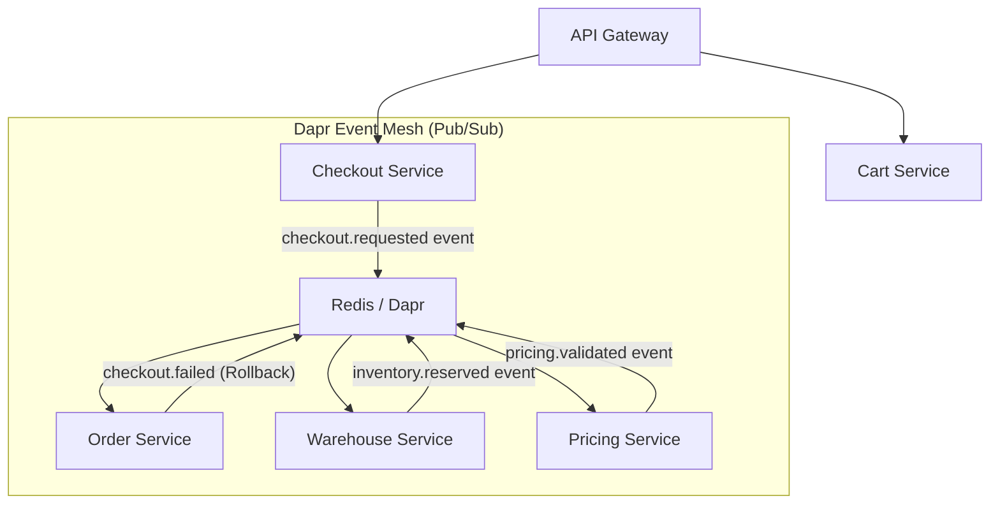

Scaling an e-commerce platform past 10,000+ orders per day containing multiple SKUs across dynamic warehouses is where naive architecture breaks down. Hardware scaling ceases to be a magic bullet when distributed transactions, race conditions, and eventual consistency are involved.

In this deep tech dive, we will tear apart the "Hello World" abstraction of Microservices. We will look at exactly how our **21-service distributed ecosystem** interacts under the hood. I will share the exact Golang architectural patterns (Kratos), the Saga orchestration for distributed checkout, and how we handle race conditions under severe load.

## 1. The Distributed Landscape 

Microservices without bounded contexts degenerate into a latency-heavy "Distributed Monolith". We bounded our ecosystem loosely around five core domains, prioritizing strict database-per-service isolation:



The diagram above encapsulates the most volatile flow: **The Checkout Saga**. When a user checks out, we cannot just open a 4-table SQL transaction anymore. `Checkout` must synchronize asynchronously with `Pricing` (to validate totals), `Warehouse` (to lock inventory), and `Order` (to generate the final aggregate). 

## 2. Enforcing Clean Architecture with Kratos

To manage 21 separate codebases, consistency among the engineering team is mandatory. We utilized **Kratos (v2)** to strictly enforce Clean Architecture in Golang. By physically separating boundaries, we prevent database logic from bleeding into HTTP or gRPC handlers.

Here is what a standard Kratos blueprint looks like in our ecosystem:

```go
// internal/biz/order.go (Business Logic Layer)
type OrderUsecase struct {
    repo OrderRepo
    log  *log.Helper
}

func (uc *OrderUsecase) CreateOrder(ctx context.Context, o *Order) error {
    if o.TotalAmount <= 0 {
        return v1.ErrorInvalidAmount("order amount must be positive")
    }
    // Biz layer knows NOTHING about PostgreSQL or GORM
    return uc.repo.Save(ctx, o)
}

// internal/data/order.go (Data Persistence Layer)
type orderRepo struct {
    data *Data
    log  *log.Helper
}

// Implement the Biz interface
func (r *orderRepo) Save(ctx context.Context, o *biz.Order) error {
    // Database transactions safely isolated here
    return r.data.db.WithContext(ctx).Create(o).Error
}
```

We tie these layers together dynamically using **Google Wire** for compile-time Dependency Injection. This allows developers to write unit tests with mocked repositories effortlessly, entirely insulating the business core from transport protocols.

## 3. The Real Beast: Distributed Transactions (Saga Pattern)

The most generic advice in microservices is "Use Pub/Sub". But how do you handle failure when Service A succeeds but Service B fails?

In our ecosystem, we implemented an **Event-Choreography Saga Pattern** using Dapr. Let's trace the complex `ConfirmCheckout` flow:
1. `Checkout Service` receives the HTTP request, validates the cart, and publishes a `checkout.requested` event to Dapr.
2. `Warehouse Service` and `Pricing Service` listen to this event and act independently on the payloads. 

### Handling Race Conditions in Warehouse
Inventory race conditions happen when two sub-second requests try to buy the last iPhone. 

If `Warehouse Service` just fires `SELECT stock FROM items WHERE id = ?`, both concurrent threads will see `stock = 1`, and both will decrement it, leading to `-1` stock. 

Instead, our Warehouse service utilizes **Optimistic Concurrency Control (OCC)** at the database layer:
```go
// Optimistic Locking to prevent overselling
result := db.Exec(`
    UPDATE inventory 
    SET reserved_stock = reserved_stock + ?, version = version + 1 
    WHERE sku_id = ? 
      AND (total_stock - reserved_stock) >= ? 
      AND version = ?`, 
    qty, skuID, qty, currentVersion)

if result.RowsAffected == 0 {
    return ErrStockInsufficientOrRaceCondition
}
```
If the lock fails due to an instant mismatch, `Warehouse` publishes an `inventory.reservation.failed` event.

### The Rollback (Compensation)
Because state is distributed, if `Warehouse` successfully locks the stock but `Pricing` reports that the applied voucher is invalid, the entire Saga must abort. 

`Order Service` often acts as the sink. If it sees `inventory.reservation.failed` OR `pricing.validation.failed`, it fires a massive compensation event: `checkout.failed`. 

Background workers (consumers) in `Warehouse Service` catch this event and immediately trigger **Compensation Logic**: 
```go
// Background Worker un-reserving stock
func (w *WarehouseWorker) HandleCheckoutFailed(ctx context.Context, event CheckoutFailed) error {
    // Rollback the reserved stock using the original transaction ID
    return w.inventoryRepo.ReleaseReservedStock(ctx, event.TransactionID)
}
```

## 4. Taming Eventual Consistency with Idempotency

When you rely on network events, network retries will happen. Dapr guarantees "At-Least-Once" delivery, meaning `Warehouse Service` might receive the same `checkout.requested` event twice if a timeout occurs.

To prevent reserving stock twice, every single Database in our ecosystem involved in transactions employs an `Idempotency Key`. 
```sql
CREATE TABLE processed_events (
    event_id VARCHAR(255) PRIMARY KEY,
    status VARCHAR(50),
    created_at TIMESTAMP
);
```
Before processing an incoming Dapr message, the service opens a database transaction and attempts to insert the `event_id`. If it throws a constraint violation, the event was already processed, and the system safely acks and drops the duplicate message.

## Conclusion

Migrating an e-commerce Monolith to a 21-service ecosystem is not about setting up an API Gateway and calling it a day. The real engineering begins when you hit the edges: gracefully rolling back partial checkouts, preventing database locks under high concurrent loads, and forcing strict domain boundaries so codebases remain readable.

By mapping contexts meticulously, enforcing strict separation via Kratos, and utilizing Idempotent Saga patterns over Dapr, we engineered a system that can absorb massive Black Friday traffic spikes without dropping a single order. The initial complexities of distributed state are painful, but the resulting scalability and developer isolation are profoundly worth the investment.
