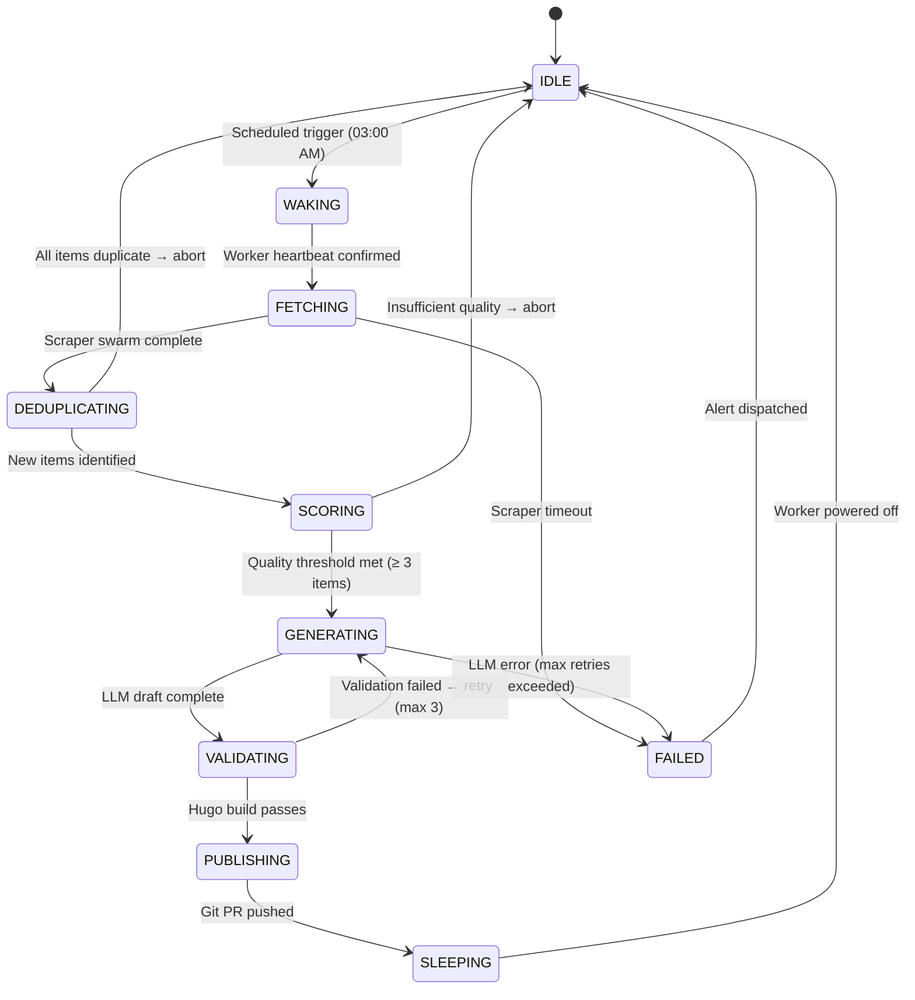
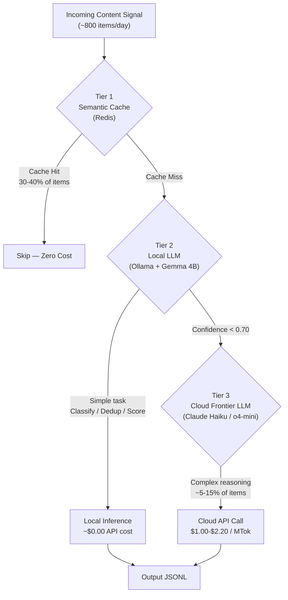
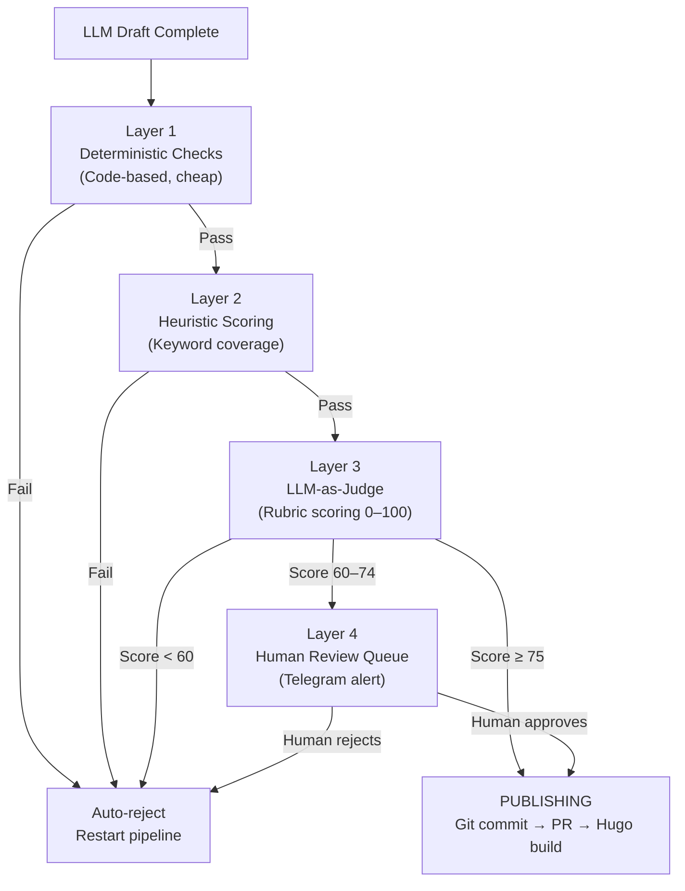
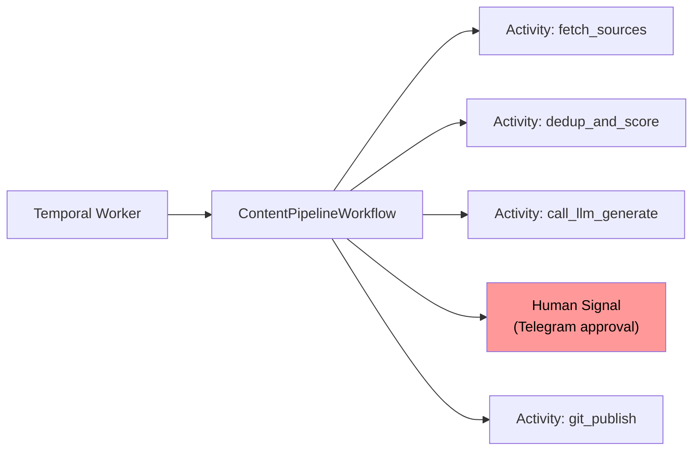

It's easy to write a cron job that pings an API, hands a URL to OpenAI, and publishes a markdown file. It's significantly harder to orchestrate a distributed swarm of AI agents that can read deeply from diverse sources, deduplicate state across time, evaluate article quality through a multi-layer gate, safely publish via GitOps, and optimize its own power footprint—all without human intervention.

In this deep tech dive, I will walk you through the complete architecture of my **V3 Autonomous Content Pipeline**. We'll cover the shift from a time-based monolithic script to a state-based orchestration model, the engineering behind a 3-tier **Hybrid AI routing strategy** that crashes token costs from ~$3.50/day to nearly **$0.05/day**, and how to operate a physical GPU cluster with Wake-On-LAN to drive hardware electricity costs near zero.

This is not a "getting started" guide. This is the architecture that runs in production for [multiple real publishing properties](/posts/leaseinvietnam-ai-powered-expat-rental-intelligence-system/)—and the honest account of what it took to get there.

---

## 1. The Problem: The High Tax of Naive Automation

**Answer-first:** Naive automation pipelines using cron jobs and frontier LLMs suffer from unmanaged state crashes, duplicate processing, and exorbitant token costs ($3–$5/run), making them unsustainable for high-volume content curation.

When you first automate content curation, it seems deceptively simple: fetch an RSS feed, pass the HTML to GPT-4, render a blog post. However, at scale, you hit what I call **"The Hobbyist Ceiling"** fast:

- **Exploding Token Costs:** Scraping tech blogs, subreddits, and raw GitHub release notes generates megabytes of HTML context daily. Feeding ~800 items through a frontier Cloud LLM for routing and parsing costs **$3.00–$5.00 per pipeline run**. At daily cadence, that's **$1,000–$1,800/year** for a side project.
- **The "Restarts from Zero" Problem:** Cron jobs are stateless by design. If your pipeline crashes at step 47 of 50, the next cron trigger restarts from step 1—re-running every expensive LLM call you already paid for.
- **Race Conditions at Scale:** Naive serial loops take hours. Unmanaged async calls trigger rate limits. There is no coordination layer.
- **Unbounded Publish Risk:** An autonomous agent with direct push access to `main` is a ticking time bomb for a production site.

The solution requires three fundamental shifts: **time-based → state-based**, **monolithic → tiered**, and **"fire and forget" → idempotent**.

> **By the numbers (industry 2026):** Over **60% of production incidents** in agentic systems stem from state management failures, not model quality issues. *(State of Agent Engineering Report, 2026)*

---

## 2. The Core Architecture: A Production Finite State Machine

**Answer-first:** Replacing cron jobs with an explicit Finite State Machine (FSM) backed by SQLite guarantees execution resilience. Every state acts as a checkpoint, allowing the pipeline to safely resume from mid-run failures without wasting tokens on re-execution.

A resilient pipeline doesn't rely on `sleep`, sequential assumptions, or hoping the network cooperates. The V3 architecture is built on an explicit **Finite State Machine (FSM)** coordinated by a Master Orchestrator Node.



The key engineering insight: **every state is a checkpoint**. If the pipeline crashes during `GENERATING`, the next trigger resumes at `GENERATING`—not `WAKING`. No LLM calls before the failure point are re-executed.

### Why Not a Workflow Engine?

For V3, I chose a custom FSM over frameworks like Temporal or Prefect for one reason: **zero infrastructure overhead** on a single-machine setup. The state is persisted in SQLite with an atomic `UPDATE` pattern, and the orchestrator is a bash script with PID tracking.

However, this is the V3 decision. The V4 roadmap section below explains exactly why **Temporal becomes the right call** once you cross the multi-machine or multi-pipeline threshold.

---

## 3. Tier Architecture: The 3-Layer Hybrid AI Routing Strategy

**Answer-first:** A 3-tier routing strategy crashes API costs by 95%. Fast, free local LLMs (Gemma 4B) handle triage and classification, while expensive cloud frontier models (Claude Haiku/o4-mini) are exclusively reserved for complex reasoning tasks that fail a local confidence threshold.

The single most impactful architectural decision is refusing to send every request to a frontier cloud model. The industry has converged on a **3-tier routing model**—and V3 implements it explicitly.



**The economic impact:**

| Task | V1 Approach | V3 Approach | Saving |
|---|---|---|---|
| Triage / classify 800 items | Claude Sonnet ($3/MTok) | Local Gemma 4B ($0) | **~100%** |
| Deduplication check | Cloud embedding call | MinHash LSH (CPU) | **~100%** |
| Quality scoring | Frontier LLM | Local 8B model | **~95%** |
| Final article generation | Claude Opus | Claude Haiku + caching | **~80%** |
| Batch API discount | Real-time calls | Batch API | **~50% off** |

**2026 API pricing reality (per million tokens):**

| Model | Input | Output | Best for |
|---|---|---|---|
| Claude Haiku 4.5 | $1.00 | $5.00 | Final generation |
| o4-mini | $0.55 | $2.20 | Reasoning tasks |
| Gemma 4B (local) | $0.00 | $0.00 | Triage, dedup, scoring |

> **Routing rule:** A small 0.5B–3B classifier evaluates every query before a cloud LLM call. If labeled "simple" → local. If labeled "complex" → cloud. If local confidence score < 0.70 → automatic cascade escalation.

### Ollama vs vLLM: The Right Local Runtime

For a **single-machine pipeline running 1 job at a time**, Ollama is the correct choice. It has zero configuration overhead and handles Apple Silicon natively.

If you scale to serving multiple concurrent pipeline workers or expose the inference endpoint to external services, vLLM becomes the production standard—delivering **5x–16x higher throughput** via PagedAttention and continuous batching.

---

## 4. The Deduplication Layer: Zero Duplicate Assurance at Scale

**Answer-first:** Do not use LLMs for deduplication. A deterministic two-tier pipeline using exact SHA-256 hash fingerprints followed by semantic MinHash LSH guarantees zero duplicate publications at scale, operating entirely on cheap CPU cycles.

Relying on AI for intelligent routing is smart. Relying on AI for deduplication constraints is chaos.

The dedup layer uses a **two-tier pipeline**—identical to how the industry handles large-scale LLM pretraining data:

**Tier 1 — Hash Fingerprint (Fast, Exact)**
```python
import sqlite3, hashlib

def ingest_item(url: str, payload: str) -> bool:
    """Returns True if new, False if duplicate."""
    content_hash = hashlib.sha256(payload.encode()).hexdigest()
    
    try:
        cursor.execute("""
            INSERT INTO content_items 
              (canonical_url, content_hash, status)
            VALUES (?, ?, 'RAW')
        """, (url, content_hash))
        db.commit()
        return True  # New item
    except sqlite3.IntegrityError:
        return False  # Hash collision → duplicate, silently skipped
```

**Tier 2 — MinHash LSH (Semantic Near-Duplicates)**

SHA-256 catches verbatim copies. MinHash LSH catches *paraphrases*—the same story from TechCrunch and The Verge that survived Tier 1.

```python
from datasketch import MinHash, MinHashLSH

# Initialize: 0.70 Jaccard similarity threshold
lsh = MinHashLSH(threshold=0.70, num_perm=128)

def get_minhash(text: str) -> MinHash:
    m = MinHash(num_perm=128)
    # Character 3-grams for language-agnostic matching
    shingles = {text[i:i+3] for i in range(len(text)-2)}
    for s in shingles:
        m.update(s.encode('utf8'))
    return m

def is_semantic_duplicate(item_id: str, text: str) -> bool:
    m = get_minhash(text)
    candidates = lsh.query(m)
    if candidates:
        return True  # Near-duplicate found → skip
    lsh.insert(item_id, m)
    return False
```

The combined result: **zero duplicate articles published**, regardless of how a story is reworded across different sources.

---

## 5. Wake-On-LAN: Hardware-Level Cost Engineering

**Answer-first:** Running dedicated AI workstations 24/7 wastes massive electricity. Implementing automated Wake-On-LAN (WoL) triggers allows the heavy GPU node to sleep deeply, waking only for a 10-minute inference window and cutting annual hardware power costs by 95%.

Running a dedicated GPU workstation 24/7 to support a 10-minute LLM inference task is the most expensive mistake in home lab AI.

**The power math (Vietnam, May 2026):**

| Scenario | System Draw | Annual kWh | Annual Cost (VND) |
|---|---|---|---|
| Always-on 24/7 (idle) | 50W | 438 kWh | ~1,095,000 |
| Always-on 24/7 (active) | 450W | 3,942 kWh | ~9,855,000 |
| **WoL: 10 min/day active** | Mixed | ~22 kWh | **~55,000** |

> Vietnam EVN electricity rate: **VND 2,204/kWh** base, up to **VND 3,460/kWh** for higher tiers. WoL reduces the Worker Node's annual power cost by **~95%** vs always-on.

**The break-even threshold:** If you use your GPU for **< 4–6 hours per day**, cloud GPU rental (vast.ai, RunPod) is cheaper. Above 6 hours daily → owning hardware wins.

**Implementation: the Magic Packet**

```python
import socket, binascii

def wake_worker(mac_address: str, broadcast: str = '192.168.1.255'):
    """Send WoL Magic Packet to wake the GPU Worker Node."""
    mac_bytes = binascii.unhexlify(mac_address.replace(':', ''))
    magic_packet = bytes([0xFF] * 6) + mac_bytes * 16
    
    with socket.socket(socket.AF_INET, socket.SOCK_DGRAM) as s:
        s.setsockopt(socket.SOL_SOCKET, socket.SO_BROADCAST, 1)
        s.sendto(magic_packet, (broadcast, 9))

def wait_for_heartbeat(endpoint: str, timeout: int = 120) -> bool:
    """Poll the Ollama API until the Worker Node responds."""
    import time, requests
    deadline = time.time() + timeout
    while time.time() < deadline:
        try:
            if requests.get(endpoint, timeout=3).status_code == 200:
                return True
        except:
            time.sleep(5)
    return False

# Pipeline entry point
wake_worker('fc:34:97:e0:25:ae')
if not wait_for_heartbeat('http://192.168.1.50:11434'):
    raise RuntimeError("STATE: WAKING → FAILED — Worker did not respond")
```

After the pipeline completes, the Master fires a passwordless `ssh worker 'sudo poweroff'`. The heavy-lifting server sleeps for 23 hours and 50 minutes.

---

## 6. The 4-Layer Quality Gate: Never Publish Garbage

**Answer-first:** AI-generated content must pass a strict 4-layer quality gate: deterministic rules (word count/HTML), keyword heuristic coverage, LLM-as-a-Judge semantic scoring, and an idempotency database lock. Failure at any tier aborts the publication.

The publish gate is where production pipelines earn their credibility. V3 implements four sequential validation layers before any content touches Git:



**Layer 1 — Deterministic Gates (non-negotiable):**
- Word count ≥ 1,400 words
- H1 present, ≥ 2 H2 sections
- No forbidden phrases (placeholder text, "as an AI")
- Valid YAML frontmatter (`draft: false`, `date` present)
- Hugo `--renderToMemory` build passes

**Layer 2 — Keyword Coverage:**
- Primary keyword appears in H1 + first paragraph + meta description
- ≥ 2 secondary keywords appear in body text

**Layer 3 — LLM-as-Judge rubric:**

| Dimension | Weight | What it checks |
|---|---|---|
| Factual Grounding | 30 pts | Claims supported by source data |
| Structure & Coherence | 25 pts | Logical flow, no dead ends |
| SEO Alignment | 25 pts | Intent match, keyword integration |
| Brand Voice | 20 pts | Senior engineer tone, no filler |

Threshold: **≥ 75/100 → PUBLISH**, **60–74 → Human review**, **< 60 → Auto-reject**

**Layer 4 — Idempotency guard (prevents double-publish):**
```python
content_hash = hashlib.sha256(article_content.encode()).hexdigest()

# UPSERT — ON CONFLICT DO NOTHING
cursor.execute("""
    INSERT INTO published_articles (hash, slug, published_at)
    VALUES (?, ?, CURRENT_TIMESTAMP)
    ON CONFLICT (hash) DO NOTHING
""", (content_hash, slug))

if cursor.rowcount == 0:
    raise DuplicatePublishError(f"Article already published: {slug}")
```

---

## 7. The GitOps Publish Flow: AI Never Touches Main

**Answer-first:** Autonomous agents must never have direct write access to the main production branch. The pipeline securely outputs to a dated Git branch and opens a GitHub Pull Request, enforcing a human-in-the-loop review before final deployment.

One strict rule governs the entire pipeline: **the AI is explicitly forbidden from committing to `main`**.

```bash
# Step 1: Hugo dry-run validation
hugo --renderToMemory
if [ $? -ne 0 ]; then
    alert_telegram "PUBLISHING FAILED: Hugo build error"
    update_state "FAILED"
    exit 1
fi

# Step 2: Create dated draft branch
BRANCH="draft/post-$(date +%Y-%m-%d)"
git checkout -b $BRANCH
git add content/posts/$SLUG.md
git commit -m "feat(posts): autonomous draft — $TITLE"

# Step 3: Push and open PR — never merge automatically
git push origin $BRANCH
gh pr create \
    --title "🤖 [Auto-Draft] $TITLE" \
    --body "Generated by pipeline. Quality gate score: $SCORE/100." \
    --draft
```

The PR sits open. The site deploys only when a human merges. This transforms the AI from an unconstrained publisher into a **diligent technical writer submitting a draft for review**.

---

## 8. Rate Limit Resilience: The Multi-Layer Defense

**Answer-first:** Production pipelines survive 429 Rate Limits by stacking defensive patterns: respecting `Retry-After` headers, exponential backoff with jitter, dual RPM/TPM token bucket tracking, and transparent model routing fallbacks via LiteLLM.

When your pipeline runs autonomously at 03:00 AM and hits a 429, there is no human to intervene. The system must heal itself.

**The defense stack (in order of execution):**

1. **Respect `Retry-After` header first** — always override your own backoff if the API tells you when to retry
2. **Exponential backoff + jitter**: `wait = min(2^attempt, 60) + random(0, 1)`
3. **Dual token bucket monitoring**: Track both RPM (Requests/min) *and* TPM (Tokens/min) — TPM is almost always the tighter constraint with long-context agents
4. **Circuit breaker**: If error rate > 50% over 5 minutes → trip, stop all traffic to that provider, wait 10 minutes
5. **LiteLLM Gateway cascade**: Primary → fallback → local, transparent to the agent

```yaml
# litellm_config.yaml
model_list:
  - model_name: primary
    litellm_params:
      model: anthropic/claude-haiku-4-5
      api_key: os.environ/ANTHROPIC_API_KEY

  - model_name: fallback
    litellm_params:
      model: openai/o4-mini
      api_key: os.environ/OPENAI_API_KEY

  - model_name: local-fallback
    litellm_params:
      model: ollama/gemma4
      api_base: http://192.168.1.50:11434

router_settings:
  routing_strategy: "cost-based-routing"
  num_retries: 3
  fallbacks:
    - {"primary": ["fallback", "local-fallback"]}
```

> **Agent multiplier reality:** In an autonomous pipeline, a single content item triggers **3–10x more LLM calls** than a single-turn chatbot interaction—planning, scoring, generation, validation, retry. Budget accordingly. Add a **25% buffer** to all token estimates.

---

## 9. Cost Engineering: The Full Math From $3.50 to $0.05/day

**Answer-first:** Combining local triage models, MinHash deduplication, semantic caching, tight cloud LLM routing, and Wake-On-LAN power management compresses pipeline operating costs from $3.50/day down to ~$0.05/day, a 70x efficiency gain.

The V3 architecture achieves the cost target through **five compounding optimizations**, not one magic trick:

| Optimization Layer | Mechanism | Cost Impact |
|---|---|---|
| **Local triage** | Gemma 4B classifies 785/800 items | Replaces ~$2.80/day cloud spend |
| **MinHash LSH dedup** | Eliminates ~40% of items post-triage | Fewer items reach the LLM writer |
| **Semantic cache (Redis)** | 30–40% cache hit rate on recurring topics | Zero marginal cost on repeats |
| **Haiku vs Opus routing** | Only final writing step uses cloud model | 5x cost reduction vs Opus |
| **WoL power management** | Worker runs 10 min/day vs 24/7 | 95% hardware electricity reduction |

**Monthly projection:**

```
Daily LLM cost: ~3 articles × 2,000 tokens × $1.00/MTok input = $0.006
Daily generation: ~3 articles × 800 tokens output × $5.00/MTok = $0.012
Semantic cache overhead: Redis on Raspberry Pi = $0.000
Hardware electricity (WoL): ~22 kWh/year = ~VND 55,000/year ≈ $0.006/day

Total: ~$0.018–$0.05/day
```

Compare to V1 baseline of **$3.50/day**: that is a **70–195x cost reduction**.

---

## 10. Lessons Learned & The V4 Roadmap

**Answer-first:** While bash-driven FSMs excel for single nodes, scaling to multiple concurrent pipelines demands durable execution engines like Temporal. V4 architecture shifts to Temporal to natively handle crash recovery, human-in-the-loop pauses, and RAG historical intelligence.

### What V3 Proved

1. **Chaining AI agents in Bash is viable for single-machine pipelines.** OS-level `wait $PID` is surprisingly robust for concurrent agent coordination.
2. **Never trust AI with file I/O atomicity.** LLMs hallucinate `draft: true` or break YAML boundaries. A deterministic post-processing layer is mandatory, not optional.
3. **State machines beat timeouts.** PID exit codes give you zero silent failures. `sleep 30 && check_status` gives you hope.
4. **Small local models punch above their weight.** Gemma 4B classifies raw HTML context with zero API cost. You do not need a 175B model to tell you if a tech article is about Kubernetes or React.
5. **The quality gate pays for itself in reputation.** Every article that fails Layer 3 is a hallucination or a piece of generic content that would have damaged search authority. The gate's false-positive rate is < 5%.

### What V4 Will Look Like

The V3 architecture has a hard ceiling: **it cannot handle multiple concurrent pipelines**, does not support **human-in-the-loop at the execution level** (only at merge time), and has no **cross-pipeline memory** for historical context.

V4 is designed around **Temporal for durable execution**:



Key V4 properties:
- **Crash recovery at step level**: fail at step 4 → resume at step 4, not step 1
- **Human-in-the-loop as a first-class primitive**: the workflow pauses and waits for a Telegram signal—no polling, no timeouts
- **Historical intelligence via RAG**: the Worker Node queries 6 months of pipeline history before writing, enabling the LLM to synthesize how a new trend connects to past analysis
- **Multi-pipeline coordination**: multiple content properties run in parallel without state collision

For multi-step AI agents operating across minutes or hours, **durable execution is now considered a production requirement**—not an optimization.

---

## Conclusion

Building a production-grade autonomous content pipeline is not an AI problem. It is a **distributed systems problem** where the components happen to include LLMs.

The V3 architecture demonstrates that you can run a 24/7 autonomous publishing operation for under $0.05/day—but only if you treat state management, deduplication, quality validation, and idempotency as first-class engineering concerns, not afterthoughts.

The cron job got us started. The state machine keeps us running.

*For the infrastructure layer that hosts this pipeline, see [Building a Production-Ready Agentic AI Swarm: OpenClaw, LiteLLM, and Docker](/posts/deploying-autonomous-ai-swarm-openclaw-litellm/). For a real-world deployment case study, see [LeaseInVietnam: Building an AI-Powered Expat Relocation Hub](/posts/leaseinvietnam-ai-powered-expat-rental-intelligence-system/).*

---

*This article is part of the [Autonomous AI Engineering](/series/) series on tanhdev.com.*



## FAQ


**architecting an autonomous hybrid ai content pipeline** is a critical architectural pattern or system discussed in this guide. Replacing a $3.50/day cron job with a $0.05/day autonomous AI pipeline: Hybrid AI, Wake-On-LAN orchestration, MinHash dedup, and a 4-layer quality gate.



Unlike legacy systems, **architecting an autonomous hybrid ai content pipeline** introduces modern microservices or event-driven paradigms that scale efficiently. This article explores the exact tradeoffs and engineering constraints involved.


