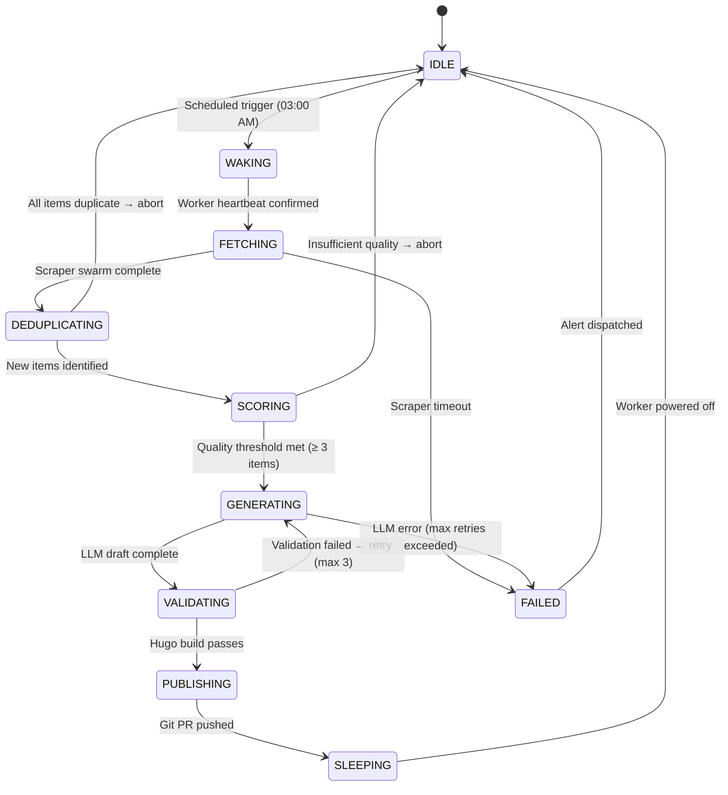
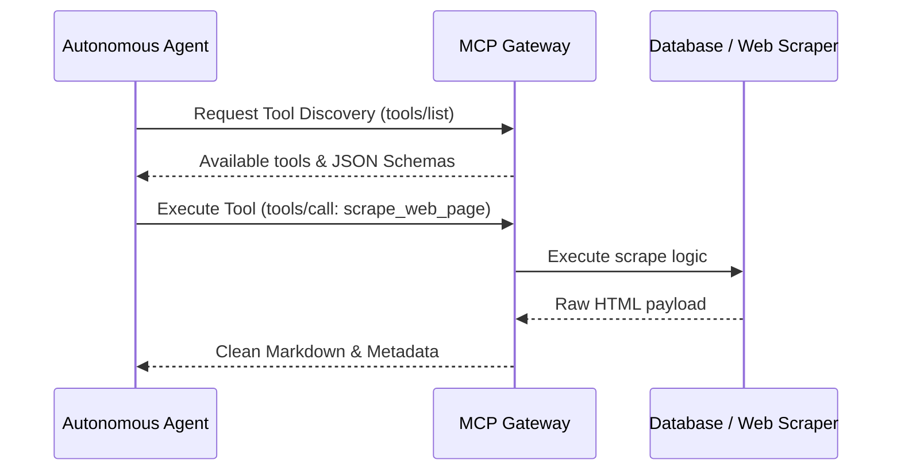
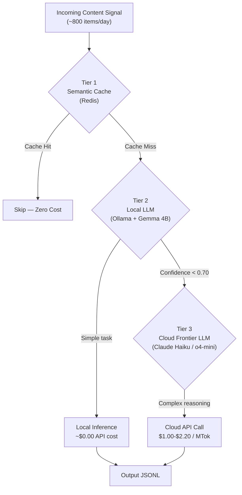
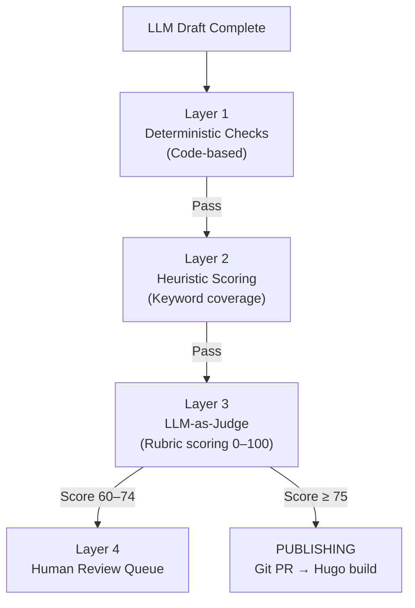

**Answer-first:** Transitioning from fragile, expensive cron jobs to an autonomous hybrid-AI pipeline requires a state-based Finite State Machine (FSM), structured Agent Topology, multi-tier memory (working, short-term, long-term vector/graph memory), and Model Context Protocol (MCP) tool calling. Using local models for triage and frontier models only for final writing drops token costs from ~$3.50/day to ~$0.05/day.

---

## Executive Summary & Agentic Architecture Overview

Building production-grade autonomous agent systems requires moving beyond single-prompt loops to robust agentic system architecture:

1. **Topology & Orchestration**: Master-worker agent swarms managed by explicit state machines.
2. **Memory System Architecture**: Working memory (context window), short-term memory (Redis session), and long-term memory (Vector/Graph RAG).
3. **Tool Calling & MCP**: Protocol-driven tool execution via Model Context Protocol.
4. **AgentOps & Governance**: Tracing, fallback cascades, evaluation gates, and hardware Wake-on-LAN power optimization.

---

## 1. Agent System Topology & State Machine

A resilient pipeline replaces stateless cron scripts with an explicit Finite State Machine (FSM):



---

## 2. Agent Memory Systems (Working, Short-Term, Long-Term)

Production agents manage three distinct memory tiers:
- **Working Memory**: Dynamic context window holding prompt signatures, current turn variables, and active tool outputs.
- **Short-Term Memory**: Redis-backed session state capturing intermediate subtask outputs across pipeline steps.
- **Long-Term Memory**: Vector database (pgvector/Qdrant) and Knowledge Graph (GraphRAG) storing historical content, brand guidelines, and past evaluation scores.

---

## 3. Tool Calling & Model Context Protocol (MCP)

Agents communicate with external systems through standardized MCP servers (Model Context Protocol):



---

## 4. 3-Tier Hybrid AI Routing & Cost Engineering



---

## 5. Wake-on-LAN & AgentOps Pipeline

Hardware WoL magic packets boot the local GPU server for batch inference runs and shut it down afterward, reducing idle power draw by 95%:

```python
import socket, binascii

def wake_worker(mac_address: str, broadcast: str = '192.168.1.255'):
    mac_bytes = binascii.unhexlify(mac_address.replace(':', ''))
    magic_packet = bytes([0xFF] * 6) + mac_bytes * 16
    with socket.socket(socket.AF_INET, socket.SOCK_DGRAM) as s:
        s.setsockopt(socket.SOL_SOCKET, socket.SO_BROADCAST, 1)
        s.sendto(magic_packet, (broadcast, 9))
```

---

## 6. The 4-Layer Quality Gate & GitOps Publish Flow



---

## FAQ


MinHash computes Jaccard similarity between incoming documents before they touch any LLM. By representing documents as shingle sets and hash tables, we filter out near-duplicates (e.g., syndicated press releases) at the edge, saving up to 90% in API costs by skipping expensive vector embeddings or LLM evaluations.



WOL allows us to keep heavy local GPU infrastructure powered down when idle. When the cloud scheduler detects high-priority ingestion runs, it sends a magic packet to boot the local server for embedding generation and local LLM processing, shutting it down afterward to achieve a $0.05/day operating cost.



MCP standardizes discovery, authorization, and input/output contracts between AI agents and external tools or databases. It eliminates custom one-off integration code and allows any MCP-compliant agent to interact with internal enterprise APIs safely.



