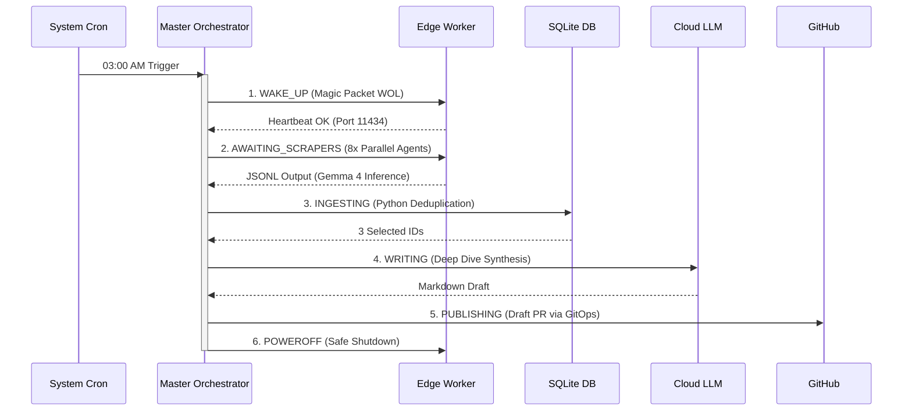

It’s easy to write a cron job that pings an API, hands a URL to OpenAI, and publishes a markdown file. It’s significantly harder to orchestrate a distributed swarm of AI agents that can read deeply from diverse sources, deduplicate state, evaluate article quality, safely publish via GitOps, and optimize its own power footprint along the way.

In this deep tech dive, I will walk you through the architecture of my V3 Autonomous Content Pipeline. We'll explore the shift from a time-based monolithic script to a state-based orchestration model, integrating a **Hybrid AI Strategy** (Local + Cloud LLMs) to crash token costs from ~$3.50/day to nearly $0.05/day, and how to operate a physical cluster with Wake-On-LAN to drive hardware costs near zero.

## 1. The Problem: The High Tax of Naive Scrapers

Initially, automating content curation seems simple: fetch an RSS feed, pass the HTML to a Cloud LLM to summarize, and render a blog post. 

However, at scale, you quickly encounter "The Hobbyist Ceiling":
- **Exploding Token Costs:** Scraping multiple tech blogs, subreddits, and raw GitHub releases generates megabytes of HTML context. Feeding that full context (crawling ~800 items daily) into a high-tier Cloud LLM (like GPT-4 or Codex) for routing and parsing costs **~$3.00 to $5.00 per run**.
- **Race Conditions:** Naive scripts struggle with concurrency. Serial loops take hours, while unmanaged async calls trigger API rate limits.
- **Unbounded Risk:** Allowing an autonomous agent to push directly to `main` is a ticking time bomb for production outages.

To build a production-grade aggregator, the system needs discrete operational boundaries and rigorous state management.

## 2. The Solution: State-Based Orchestration

A resilient pipeline doesn't rely on `sleep` or sequential assumptions. Instead, we transition to a **State Machine Architecture** coordinated by a Master Node. 

Here is the high-level flow of the orchestrated system:



If any state fails, the orchestrator logs the exception natively and halts, protecting downstream integrity.

## 3. The Hybrid AI Architecture & OS-Level Concurrency

To solve the token cost dilemma, we implemented a **Tiered Hybrid AI Workflow**.

Instead of outsourcing data evaluation to the Cloud, we offload massive reading tasks to a **Local Worker Node** equipped with a rapid edge model (`gemma4:e4b` via Ollama). 

### The Swarm Concurrency (Local LLM Ingestion)
The Orchestrator dispatches a swarm of 8 concurrent `OpenClaw` scraper agents—each assigned a specialized niche (e.g., HackerNews, Medium Architecture blogs, specific Subreddits). 

Instead of heavy message queue systems or Python `asyncio` blocking overhead, we use OS-level sub-process tracking for lightweight, robust concurrency. Background jobs are spawned via bash process forks (`&`), and the orchestrator acts as an exit-code synchronizer utilizing `wait $PID`. 

```bash
# Spawning heterogeneous Edge Agents OS-natively
$OC agent --agent tier3_reddit --message "Fetch Subreddits" > /tmp/tier3r.txt &
P_REDDIT=$!

$OC agent --agent tier2_medium --message "Search Blogs" > /tmp/tier2m.txt &
P_MEDIUM=$!

# Barrier synchronization
wait $P_REDDIT $P_MEDIUM
if [ $? -ne 0 ]; then notify_fail "SCRAPERS_FAILED"; fi
```
Since local inference costs **$0.00 in API tokens**, we can parallelize 8 massive data-reading jobs simultaneously.

### The Synthesis (Cloud LLM Deep-Dive)
Once the Local Worker reduces gigabytes of internet noise down to 3 high-quality JSON rows, the Orchestrator passes the baton to the Cloud LLM (OpenAI Codex / GPT-5.2). Because the context window is now small and highly curated, the Cloud LLM is used solely for executing a high-IQ "Deep-Dive" synthesis. 

We inject an explicit `System Prompt` mandating the Cloud LLM to dynamically crawl the raw source URLs for those top 3 signals, extracting granular details before rendering the final document. The output contract is rigidly structured to enforce Hugo-compatible YAML frontmatter (`draft: false`, taxonomies) and maintain an authoritative, Senior Engineer tone—focusing on architectural trade-offs rather than generic marketing summaries.

## 4. Ingestion Determinism: Zero Duplicate Assurance

Relying on AI for intelligent routing is smart; relying on AI for data storage constraints is chaos.

The layer bridging the Local Scrapers and the Cloud Writer is purely deterministic Python. An `ingest.py` script maps the `canonical_url` to a `UNIQUE` index constraint in an SQLite database, silently discarding previously fetched data.

```python
# Deduplication Logic in ingest.py
import sqlite3, hashlib

content_hash = hashlib.sha256(raw_payload.encode()).hexdigest()

try:
    c.execute("""
        INSERT INTO content_items 
        (source, source_type, canonical_url, title, raw_payload, content_hash, status) 
        VALUES (?, ?, ?, ?, ?, ?, 'RAW')
    """, (source, s_type, url, title, payload, content_hash))
    
    if c.rowcount > 0:
        print(f"SUCCESS: Ingested new signal: {url}")
except sqlite3.IntegrityError:
    print(f"INFO: Duplicate item skipped: {url}")
```
This single boundary guarantees that tomorrow's post never repeats today's news.

## 5. Publish Safety Flow: Zero AI Commits on Main

One strict rule rules the pipeline: **The AI is explicitly forbidden from committing to the `main` branch.**

Before pushing, a Dry-Run executes a strict formatting check by parsing the markdown in-memory via Hugo:
```bash
# Validating Hugo Build frontmatter validity
hugo --renderToMemory
if [ $? -ne 0 ]; then
    notify_fail "HUGO_VALIDATION_FAILED"
fi
```
If successful, a new Git branch `draft/radar-YYYY-MM-DD` is instantiated and pushed to GitHub as a Pull Request. This transforms the AI from a loose cannon into a diligent technical writer submitting a draft. The site only triggers Cloudflare Pages deployment when a human hits "Merge".

## 6. Energy Optimization via Wake-On-LAN ($0.05/day cost)

Running a dedicated V8 i7 Local Worker Node 24/7 to support a 10-minute LLM task is incredibly inefficient. Phase 5 introduced hardware-layer orchestration to aggressively cut costs.

Before triggering the state machine, the Orchestrator broadcasts a **Wake-On-LAN (Magic Packet)** directly into the router's broadcast address. 

```python
import socket, binascii
# Wake-on-LAN Magic Packet Injection
mac_bytes = binascii.unhexlify('fc3497e025ae')
magic_packet = bytes([0xFF] * 6) + mac_bytes * 16

s = socket.socket(socket.AF_INET, socket.SOCK_DGRAM)
s.setsockopt(socket.SOL_SOCKET, socket.SO_BROADCAST, 1)
s.sendto(magic_packet, ('192.168.1.255', 9))
```

It polls the OpenClaw API for a heartbeat. Once alive, it unleashes the swarm. Immediately after the GitHub Pull Request is pushed, it fires a password-less `sudo poweroff` to the Worker Node.

The heavy-lifting server sleeps for 23 hours and 50 minutes a day. This drops the hardware power cost from a continuously running 300W load to an effectively unnoticeable **~$0.05 per day (1-2k VND)**.

## 7. Conclusion & Next Steps

Building V3 proved that chaining AI agents natively in Bash is not only viable, but often significantly more resilient than relying on thick Python orchestration frameworks. 

### Lessons Learned:
1. **Never trust AI with Formatting:** LLMs will eventually hallucinate `draft: true` or break Markdown boundaries. Post-processing with structural Regex and Hugo `--renderToMemory` is non-negotiable.
2. **State Machines beat Timeouts:** Tracking PID exit codes ensures zero silent race-condition failures.
3. **Small Local Models punch above their weight:** Evaluating raw HTML classification does not need a 175B model. `Gemma 4B` parses context efficiently with zero OPEX.

### What's next in V4?
The immediate next step (V4) is embedding a localized **Vector Database RAG** layer. Currently, the Cloud LLM writes blindly about the new data. By integrating RAG, the Worker Node will query historical pipeline data, allowing the Writer to synthesize how a new architectural trend correlates with signals fetched 6 months ago. Let's make the pipeline not just independent, but historically intelligent.
