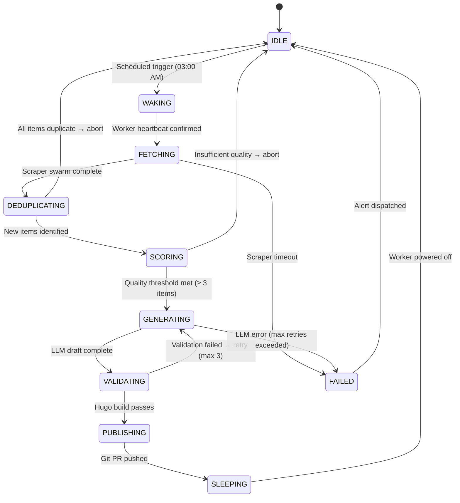
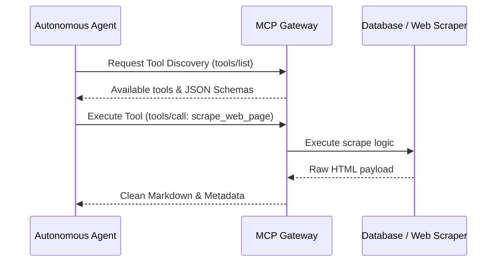
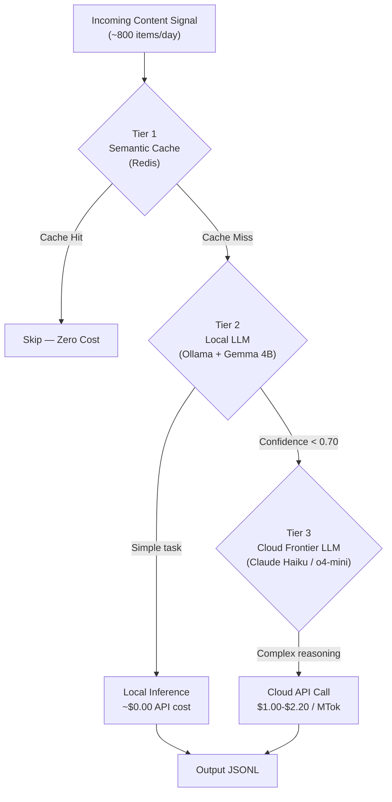
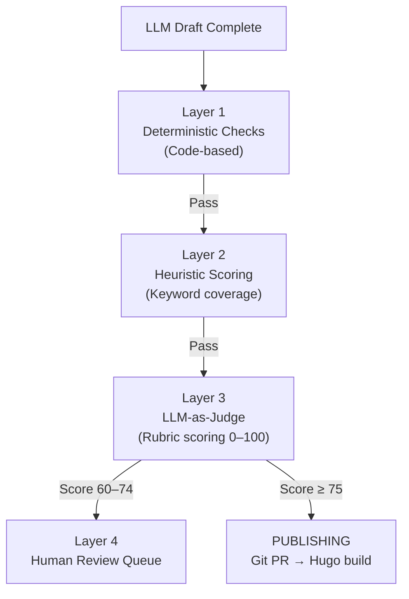

# Autonomous Hybrid-AI Pipeline: Cron to State-Machine

> **Answer-First:** An autonomous hybrid-AI content pipeline replaces stateless cron triggers with finite state machines (FSM) and dynamic model routing. By using local LLMs (Gemma 4B) for initial filtering and cloud LLMs (Claude Haiku/o4-mini) only for complex generation, operating costs drop to $0.05/day while maintaining high content quality.

## Executive Summary & Agentic Architecture Overview

Building production-grade autonomous agent systems requires moving beyond single-prompt loops to robust agentic system architecture:

1. **Topology & Orchestration**: Master-worker agent swarms managed by explicit state machines.
2. **Memory System Architecture**: Working memory (context window), short-term memory (Redis session), and long-term memory (Vector/Graph RAG).
3. **Tool Calling & MCP**: Protocol-driven tool execution via Model Context Protocol.
4. **AgentOps & Governance**: Tracing, fallback cascades, evaluation gates, and hardware Wake-on-LAN power optimization.

---

## 1. Agent System Topology & State Machine

A resilient pipeline replaces stateless cron scripts with an explicit Finite State Machine (FSM). Traditional cron jobs suffer from silent failures, lack of state transition auditing, and partial execution hazards when network timeouts occur mid-flight. By encapsulating pipeline operations within an explicit state machine, every transition—from waking hardware nodes to scraping, filtering, and drafting—is logged as an atomic state change.


```mermaid
stateDiagram-v2
    [*] --> IDLE
    IDLE --> WAKING: Scheduled trigger (03:00 AM)
    WAKING --> FETCHING: Worker heartbeat confirmed
    FETCHING --> DEDUPLICATING: Scraper swarm complete
    DEDUPLICATING --> SCORING: New items identified
    DEDUPLICATING --> IDLE: All items duplicate → abort
    SCORING --> GENERATING: Quality threshold met (≥ 3 items)
    SCORING --> IDLE: Insufficient quality → abort
    GENERATING --> VALIDATING: LLM draft complete
    VALIDATING --> PUBLISHING: Hugo build passes
    VALIDATING --> GENERATING: Validation failed → retry (max 3)
    PUBLISHING --> SLEEPING: Git PR pushed
    SLEEPING --> IDLE: Worker powered off
    FETCHING --> FAILED: Scraper timeout
    GENERATING --> FAILED: LLM error (max retries exceeded)
    FAILED --> IDLE: Alert dispatched
```

The master orchestrator tracks node health and enforces strict state transition rules:
- **State Persistence**: Current state and payload context are serialized to Redis, preventing state loss during process restarts.
- **Retry Bounds**: Transient states (such as `GENERATING` or `FETCHING`) maintain maximum retry counters before triggering fallback transitions to `FAILED`.
- **Clean Teardown**: Upon reaching terminal states (`SLEEPING` or `FAILED`), the orchestrator dispatches alert telemetry and powers down local inference nodes.

---

## 2. Agent Memory Systems (Working, Short-Term, Long-Term)

Production agents manage three distinct memory tiers to balance low latency, cost efficiency, and deep contextual grounding:

- **Working Memory (Context Window)**: Holds the dynamic context window for active LLM turns, including system prompts, active tool call schemas, and conversation histories. To prevent context window bloat and truncation errors, working memory is pruned using sliding-window token management and summarization heuristics.
- **Short-Term Memory (Redis Session Store)**: Captures intermediate subtask outputs across multi-step pipeline workflows. Redis hashes store structured key-value payloads (such as scraped raw Markdown, MinHash signatures, and partial JSON drafts) with explicit Time-To-Live (TTL) expirations to isolate pipeline runs.
- **Long-Term Memory (Vector & Graph RAG)**: Combines dense vector embeddings (using `pgvector` or Qdrant) with structural Knowledge Graphs (GraphRAG). Long-term memory provides historical content lookup, cross-article entity linking, brand voice guidelines, and past evaluation rubrics. When generating new articles, the agent queries long-term memory to retrieve relevant background facts and avoid repeating prior content topics.

---

## 3. Tool Calling & Model Context Protocol (MCP)

Agents communicate with external infrastructure—such as web scrapers, database instances, and publishing platforms—through standardized Model Context Protocol (MCP) servers. MCP replaces proprietary, hardcoded tool integration wrappers with a uniform JSON-RPC protocol over standard input/output (stdio) or HTTP/SSE transports.


```mermaid
sequenceDiagram
    participant Agent as Autonomous Agent
    participant MCP as MCP Gateway
    participant Tool as Database / Web Scraper
    Agent->>MCP: Request Tool Discovery (tools/list)
    MCP-->>Agent: Available tools & JSON Schemas
    Agent->>MCP: Execute Tool (tools/call: scrape_web_page)
    MCP->>Tool: Execute scrape logic
    Tool-->>MCP: Raw HTML payload
    MCP-->>Agent: Clean Markdown & Metadata
```

By enforcing strict JSON Schema validation for tool inputs and outputs, MCP guarantees that agent tool invocations are type-safe and deterministic. If an LLM emits invalid arguments for a tool call, the MCP Gateway intercepts the payload and returns an explicit schema error, allowing the agent to correct its invocation without crashing the execution environment.

---

## 4. 3-Tier Hybrid AI Routing & Cost Engineering

To minimize operational costs while maintaining high-quality outputs, incoming content signals pass through a 3-tier hybrid routing architecture:


```mermaid
flowchart TD
    A["Incoming Content Signal\n(~800 items/day)"] --> B{"Tier 1\nSemantic Cache\n(Redis)"}
    B -- "Cache Hit" --> Z["Skip — Zero Cost"]
    B -- "Cache Miss" --> C{"Tier 2\nLocal LLM\n(Ollama + Gemma 4B)"}
    C -- "Simple task" --> D["Local Inference\n~$0.00 API cost"]
    C -- "Confidence < 0.70" --> E{"Tier 3\nCloud Frontier LLM\n(Claude Haiku / o4-mini)"}
    E -- "Complex reasoning" --> F["Cloud API Call\n$1.00-$2.20 / MTok"]
    D --> G["Output JSONL"]
    F --> G
```

1. **Tier 1 (Semantic Cache)**: Redis vector similarity matching compares incoming article vectors against previously processed items. Exact or high-similarity matches (threshold ≥ 0.92) are instantly skipped at zero API cost.
2. **Tier 2 (Local LLM Inference)**: Simple content extraction, initial categorization, and preliminary scoring are routed to lightweight local models (such as Gemma 4B running on Ollama). Local inference incurs $0.00 in external API token fees.
3. **Tier 3 (Cloud Frontier Escalation)**: Complex tasks requiring nuanced reasoning, synthesis, or long-form prose drafting are escalated to cloud frontier models (e.g., Claude Haiku or OpenAI o4-mini) only when local confidence scores fall below 0.70.

---

## 5. Wake-on-LAN & AgentOps Pipeline

To maintain a zero-idle energy footprint, local GPU worker servers remain powered off until triggered by the cloud orchestrator. Hardware Wake-on-LAN (WoL) magic packets boot the local worker server on demand:

```python
import socket, binascii

def wake_worker(mac_address: str, broadcast: str = '192.168.1.255'):
    """Sends a magic packet to boot the local inference worker GPU node."""
    mac_bytes = binascii.unhexlify(mac_address.replace(':', ''))
    magic_packet = bytes([0xFF] * 6) + mac_bytes * 16
    with socket.socket(socket.AF_INET, socket.SOCK_DGRAM) as s:
        s.setsockopt(socket.SOL_SOCKET, socket.SO_BROADCAST, 1)
        s.sendto(magic_packet, (broadcast, 9))
```

Once the worker completes its batch inference tasks, the AgentOps pipeline flushes CUDA memory caches and issues a system shutdown command. OpenTelemetry tracing and LangSmith telemetry track token usage, P99 latency per turn, and hardware boot times across all pipeline runs.

---

## 6. The 4-Layer Quality Gate & GitOps Publish Flow

Before generated content is published to production, it must pass through a strict 4-layer evaluation gate:


```mermaid
flowchart TD
    A["LLM Draft Complete"] --> B["Layer 1\nDeterministic Checks\n(Code-based)"]
    B -- "Pass" --> C["Layer 2\nHeuristic Scoring\n(Keyword coverage)"]
    C -- "Pass" --> D["Layer 3\nLLM-as-Judge\n(Rubric scoring 0–100)"]
    D -- "Score 60–74" --> E["Layer 4\nHuman Review Queue"]
    D -- "Score ≥ 75" --> F["PUBLISHING\nGit PR → Hugo build"]
```

- **Layer 1 (Deterministic AST & Linter)**: Verifies frontmatter YAML validity, checks Markdown link integrity, and enforces required structural sections.
- **Layer 2 (Heuristic Keyword Coverage)**: Computes TF-IDF scores and keyword coverage metrics to confirm technical depth.
- **Layer 3 (LLM-as-a-Judge Evaluation)**: An independent evaluator LLM scores the draft against a 0–100 rubric assessing accuracy, tone, and readability.
- **Layer 4 (GitOps Publishing & Human Fallback)**: Drafts scoring ≥ 75 automatically generate a Git Pull Request and trigger Hugo static site compilation tests. Drafts scoring between 60 and 74 are routed to a human review queue.

---

## FAQ


MinHash computes Jaccard similarity between incoming documents before they touch any LLM. By representing documents as shingle sets and hash tables, we filter out near-duplicates (e.g., syndicated press releases) at the edge, saving up to 90% in API costs by skipping expensive vector embeddings or LLM evaluations.



WOL allows us to keep heavy local GPU infrastructure powered down when idle. When the cloud scheduler detects high-priority ingestion runs, it sends a magic packet to boot the local server for embedding generation and local LLM processing, shutting it down afterward to achieve a $0.05/day operating cost.



MCP standardizes discovery, authorization, and input/output contracts between AI agents and external tools or databases. It eliminates custom one-off integration code and allows any MCP-compliant agent to interact with internal enterprise APIs safely.



