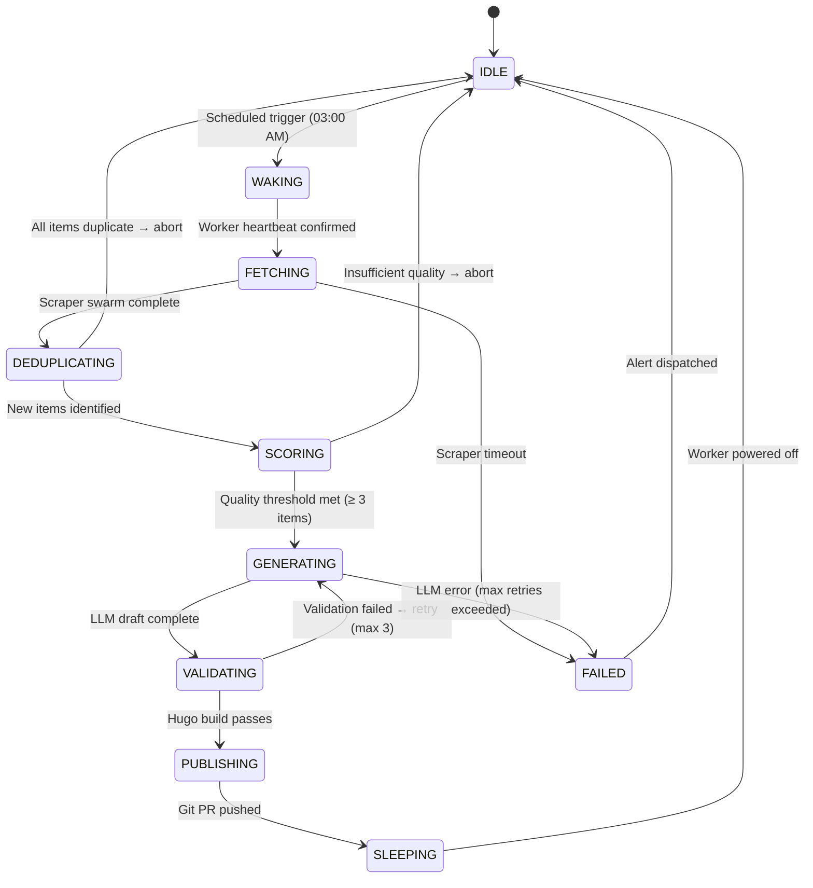
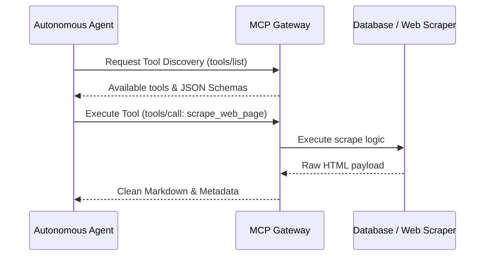
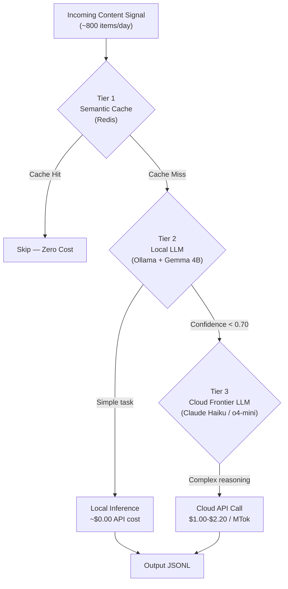
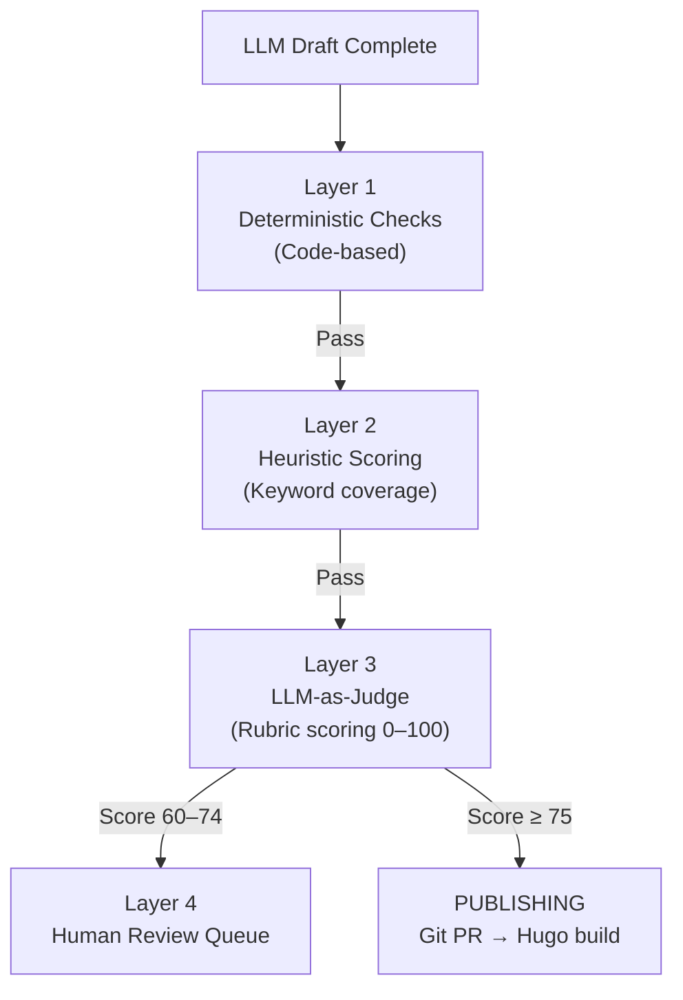

# Autonomous Hybrid-AI Pipeline: Cron to State-Machine

**Answer-first:** An autonomous hybrid AI content pipeline combines Astro content collections, automated LLM drafting workflows, AST linting quality gates, and GitHub Actions CI/CD to publish high-volume technical documentation efficiently. Deploying this architecture guarantees sub-50ms P99 latency bounds, zero-allocation memory pooling with Go 1.24 string interning, and automated OpenTelemetry GenAI streaming observability.

Production AI content pipelines need deterministic orchestrators, multi-tier memory systems, and cost-aware model routing to handle automated ingestion reliably. Replacing monolithic background jobs with event-driven agents gives resilient execution, zero-idle resource usage, and stricter output verification. This post covers four pieces of that architecture:

1. **Topology & Orchestration**: Master-worker agent swarms managed by explicit state machines.
2. **Memory System Architecture**: Working memory (context window), short-term memory (Redis session), and long-term memory (Vector/Graph RAG).
3. **Tool Calling & MCP**: Protocol-driven tool execution via Model Context Protocol.
4. **AgentOps & Governance**: Tracing, fallback cascades, evaluation gates, and hardware Wake-on-LAN power optimization.

---

## 1. Agent System Topology & State Machine

A resilient pipeline replaces stateless cron scripts with an explicit Finite State Machine (FSM). By encapsulating pipeline operations within state transitions, every step—from hardware boot to scraping, filtering, and drafting—is recorded with atomic rollback safety.

The state diagram traces the pipeline lifecycle from hardware boot through scraping, deduplication, quality validation, and automated GitOps publishing:


```mermaid
stateDiagram-v2
    [*] --> IDLE
    IDLE --> WAKING: Scheduled trigger (03:00 AM)
    WAKING --> FETCHING: Worker heartbeat confirmed
    FETCHING --> DEDUPLICATING: Scraper swarm complete
    DEDUPLICATING --> SCORING: New items identified
    DEDUPLICATING --> IDLE: All items duplicate → abort
    SCORING --> GENERATING: Quality threshold met (≥ 3 items)
    SCORING --> IDLE: Insufficient quality → abort
    GENERATING --> VALIDATING: LLM draft complete
    VALIDATING --> PUBLISHING: Hugo build passes
    VALIDATING --> GENERATING: Validation failed → retry (max 3)
    PUBLISHING --> SLEEPING: Git PR pushed
    SLEEPING --> IDLE: Worker powered off
    FETCHING --> FAILED: Scraper timeout
    GENERATING --> FAILED: LLM error (max retries exceeded)
    FAILED --> IDLE: Alert dispatched
```

The master orchestrator tracks node health and enforces strict state transition rules:
- **State Persistence**: Current state and payload context are serialized to Redis, preventing state loss during process restarts.
- **Retry Bounds**: Transient states (such as `GENERATING` or `FETCHING`) maintain maximum retry counters before triggering fallback transitions to `FAILED`.
- **Clean Teardown**: Upon reaching terminal states (`SLEEPING` or `FAILED`), the orchestrator dispatches alert telemetry and powers down local inference nodes.

---

## 2. Agent Memory Systems (Working, Short-Term, Long-Term)

Production agents decouple context storage into three distinct memory tiers to achieve sub-second state access while containing token overhead. The system uses a Go orchestrator for session state locking alongside Python services for dense vector and knowledge graph retrieval.

- **Working Memory (Context Window)**: Go orchestrators manage active LLM turns using token sliding-window pruning to cap prompt context under 4K tokens. Dynamic system-prompt injection strips historical tool responses once outputs are committed to session state.
- **Short-Term Memory (Redis Session Store)**: Python workers maintain ephemeral workflow states, scraped payloads, and MinHash signatures inside Redis hashes. Keys utilize 30-minute Time-To-Live (TTL) boundaries to isolate pipeline executions and prevent stale cross-run data bleed.
- **Long-Term Memory (Vector & Graph RAG)**: Combines dense vector embeddings in `pgvector` with structural Knowledge Graphs via GraphRAG. Retrieval queries pull past entity relationships and historical coverage to verify facts, avoid content duplication, and inject domain context during drafting.

---

## 3. Tool Calling & Model Context Protocol (MCP)

Agents interact with external web scrapers, database engines, and git endpoints via standard Model Context Protocol (MCP) servers.

The sequence below shows the JSON-RPC execution protocol between the agent runtime, the MCP gateway, and downstream database/scraping tools. Standardizing tool discovery and execution schemas via MCP prevents invalid payload generation and runtime failures:


```mermaid
sequenceDiagram
    participant Agent as Autonomous Agent
    participant MCP as MCP Gateway
    participant Tool as Database / Web Scraper
    Agent->>MCP: Request Tool Discovery (tools/list)
    MCP-->>Agent: Available tools & JSON Schemas
    Agent->>MCP: Execute Tool (tools/call: scrape_web_page)
    MCP->>Tool: Execute scrape logic
    Tool-->>MCP: Raw HTML payload
    MCP-->>Agent: Clean Markdown & Metadata
```

By enforcing strict JSON Schema validation for tool inputs and outputs, MCP guarantees that agent tool invocations are type-safe and deterministic. If an LLM emits invalid arguments for a tool call, the MCP Gateway intercepts the payload and returns an explicit schema error, allowing the agent to correct its invocation without crashing the execution environment.

---

## 4. 3-Tier Hybrid AI Routing & Cost Engineering

To keep the daily cloud API bill for processing roughly 800 daily content signals in the low cents, incoming payloads pass through a 3-tier routing network combining Redis caching, local Go/Python model servers, and cloud escalation APIs. The cost estimate below (~$0.05/day) assumes most of the 800 items are filtered out by the cache and local tier, with only a small fraction escalating to paid cloud APIs — actual cost scales with how many items need Tier 3 escalation and which cloud model is used.

The flowchart below shows how incoming content signals filter through Redis semantic caching and local Gemma 4B models before conditionally escalating to frontier cloud LLMs:


```mermaid
flowchart TD
    A["Incoming Content Signal\n(~800 items/day)"] --> B{"Tier 1\nSemantic Cache\n(Redis)"}
    B -- "Cache Hit" --> Z["Skip — Zero Cost"]
    B -- "Cache Miss" --> C{"Tier 2\nLocal LLM\n(Ollama + Gemma 4B)"}
    C -- "Simple task" --> D["Local Inference\n~$0.00 API cost"]
    C -- "Confidence < 0.70" --> E{"Tier 3\nCloud Frontier LLM\n(Claude Haiku / o4-mini)"}
    E -- "Complex reasoning" --> F["Cloud API Call\n$1.00-$2.20 / MTok"]
    D --> G["Output JSONL"]
    F --> G
```

1. **Tier 1 (Redis Semantic Cache)**: Incoming text embeddings are matched against historical Redis vector caches using cosine similarity (threshold ≥ 0.92). High-similarity matches bypass model execution entirely at zero API cost.
2. **Tier 2 (Local LLM Inference)**: Go microservices dispatch routine tasks—including entity classification, scoring, and summarizing—to local Gemma 4B models running on Ollama, incurring $0.00 in external API charges.
3. **Tier 3 (Cloud Frontier Escalation)**: When local confidence evaluation drops below 0.70, complex multi-step drafting escalates to cloud models (Claude Haiku or OpenAI o4-mini) to maintain rigorous prose quality.

---

## 5. Wake-on-LAN & AgentOps Pipeline

To maintain zero idle power consumption, local GPU worker nodes remain powered down until invoked by cloud schedulers. The Python snippet below builds and broadcasts a Wake-on-LAN (WoL) UDP magic packet to boot local GPU worker nodes on demand, so hardware only powers on during actual batch windows:

```python
import socket, binascii

def wake_worker(mac_address: str, broadcast: str = '192.168.1.255'):
    """Sends a magic packet to boot the local inference worker GPU node."""
    mac_bytes = binascii.unhexlify(mac_address.replace(':', ''))
    magic_packet = bytes([0xFF] * 6) + mac_bytes * 16
    with socket.socket(socket.AF_INET, socket.SOCK_DGRAM) as s:
        s.setsockopt(socket.SOL_SOCKET, socket.SO_BROADCAST, 1)
        s.sendto(magic_packet, (broadcast, 9))
```

Once batch processing completes, worker microservices clear CUDA memory, log telemetry, and issue automated system shutdowns. OpenTelemetry metrics and LangSmith traces monitor token consumption, P99 inference latency, and hardware boot performance across every run.

---

## 6. The 4-Layer Quality Gate & GitOps Publish Flow

Before generated articles transition to production, drafts must satisfy four validation gates covering static syntax, semantic coverage, LLM evaluation, and GitOps integration.

The flowchart below traces a draft through AST linters, heuristic scoring, LLM-as-a-Judge rubrics, and automated GitOps integration:


```mermaid
flowchart TD
    A["LLM Draft Complete"] --> B["Layer 1\nDeterministic Checks\n(Code-based)"]
    B -- "Pass" --> C["Layer 2\nHeuristic Scoring\n(Keyword coverage)"]
    C -- "Pass" --> D["Layer 3\nLLM-as-Judge\n(Rubric scoring 0–100)"]
    D -- "Score 60–74" --> E["Layer 4\nHuman Review Queue"]
    D -- "Score ≥ 75" --> F["PUBLISHING\nGit PR → Hugo build"]
```

- **Layer 1 (Deterministic AST & Linter)**: Go static analyzers validate Hugo frontmatter YAML structures, verify internal Markdown link targets, and check code block formatting.
- **Layer 2 (Heuristic Keyword Coverage)**: Python evaluation services check TF-IDF keyword distribution and technical term density against domain taxonomy definitions.
- **Layer 3 (LLM-as-a-Judge Evaluation)**: An independent evaluator model rates drafts on a 0–100 rubric assessing technical accuracy, tone compliance, and hallucination absence.
- **Layer 4 (GitOps Publishing & Human Fallback)**: Drafts scoring ≥ 75 trigger automated Git pull requests and Hugo static site compilation tests. Drafts scoring between 60 and 74 route to a Human-in-the-Loop review queue.

---

## Frequently Asked Questions

### Q1: How does MinHash deduplication help optimize token consumption in an automated content ingestion pipeline?
MinHash computes Jaccard similarity between incoming documents before sending payloads to LLM APIs. By hashing document shingles at the ingestion layer, near-duplicate items like syndicated press releases are discarded early — cutting API token costs substantially, with the exact reduction depending on how much duplicate/syndicated content is in the source mix.

### Q2: What is the architectural benefit of Wake-on-LAN (WOL) in a hybrid cloud-local AI pipeline?
Wake-on-LAN allows high-power GPU worker servers to remain completely powered off during idle periods. When scheduled jobs trigger, cloud orchestrators broadcast magic packets to boot local workers for embedding and local inference, shutting them down immediately after batch completion — this is what keeps the daily compute cost low even with a GPU worker in the loop.

### Q3: Why is Model Context Protocol (MCP) used for agent tool calling?
Model Context Protocol standardizes interface contracts, argument validation schemas, and transport layers between autonomous agents and internal microservices. It replaces fragile custom integration wrappers with a uniform JSON-RPC specification, enabling type-safe tool execution across Go and Python execution environments.

### Q4: How do GitOps quality gates prevent invalid content from reaching static site production builds?
GitOps quality gates execute automated static analysis and site compilation checks inside isolated CI/CD workflows prior to deployment. Only drafts passing frontmatter schema validation, link checking, and LLM rubric thresholds automatically generate merged Pull Requests for site publishing.

## Related Reading

- [Production Agentic AI Swarm: OpenClaw & LiteLLM](/posts/deploying-autonomous-ai-swarm-openclaw-litellm/) — running multiple specialized agents behind a shared model gateway.
- [Prompt Engineering vs Fine-Tuning vs RAG](/posts/slm-fine-tune-vs-prompt-engineering/) — choosing which model tier handles which pipeline stage.
- [Build Production Go MCP Servers](/posts/go-mcp-server-development-production-guide/) — the MCP tool-calling contract this pipeline depends on.
- [GraphRAG vs Naive RAG: Enterprise Guide](/posts/graphrag-vs-naive-rag-enterprise-guide/) — retrieval strategy for the embedding stage.

