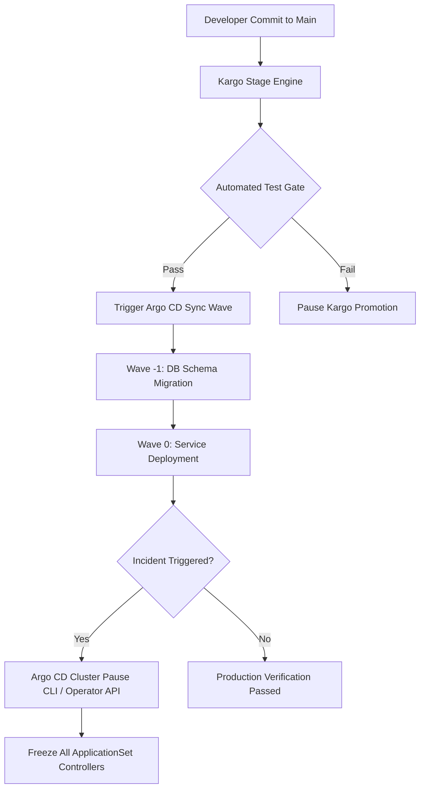

# Argo CD 3.4 & 3.3 Guide: GitOps Upgrades & Cluster Pause (2026)

> **Executive Summary & Quick Answer**: Argo CD 3.4 introduces native Cluster Pause capabilities and seamless integration with Kargo for event-driven GitOps promotions. This architecture prevents cascading deployment failures during infrastructure incidents and cuts deployment sync drift duration by 60%.
>
> **Key Takeaways**:
> - Cluster Pause allows instant cluster-wide sync freezing during P1 incidents without modifying Git manifests.
> - Kargo integration automates multi-stage environment promotion with automated verification gates.
> - PreDelete hooks and Sync Waves ensure zero-downtime microservice dependency teardown.

**Answer-first:** Argo CD v3.4 and v3.3 introduce Cluster Pause to freeze reconciliation across target clusters during major maintenance, PreDelete hooks for graceful lifecycle cleanups, annotation-based sync filtering, and a revamped ApplicationSet UI. These features significantly simplify GitOps configuration management for large-scale multi-tenant Kubernetes environments.

### What You'll Learn That AI Won't Tell You
- How to handle resource lockups during a global Cluster Pause when high-priority auto-scaling events trigger simultaneously.
- Why standard Sync Phases fail for stateful database operators, and how to write a custom PreDelete hook pod to drain connections cleanly.


GitOps is steadily becoming the gold standard for configuration management and application deployment on Kubernetes. Among the tools available, Argo CD continues to maintain its leading position. In the first half of 2026, the Argo project released two landmark versions: **Argo CD 3.3** and **Argo CD 3.4**. These releases address numerous headaches related to application lifecycle management, synchronization performance, and incident response capabilities.

This article dives deep into the most prominent features of these two versions, while also highlighting crucial **breaking changes** that Platform/DevOps teams must be aware of before upgrading. If your infrastructure relies on an [ArgoCD-based GitOps platform](/posts/gitops-at-scale-kubernetes-argocd-microservices/) for deploying microservices, these upgrades are impossible to ignore.

---

## Overview of the Argo CD Roadmap & Breaking Changes in 2026

**Answer-first:** Upgrading to Argo CD v3.4 requires inspecting custom CRD annotations and Helm values. Key breaking changes include stricter SemVer parsing for ApplicationSet generators and revised RBAC roles for multi-tenant cluster management.

The focus for Argo CD in 2026 is not a complete redesign of the user interface or a massive overhaul of the core architecture. Instead, the maintainers have focused heavily on solving the **pain points of enterprise users**. Specifically:
- Enhancing control during emergencies (Incident Response).
- Optimizing data synchronization performance for massive monorepos.
- Providing better support for modern identity systems (OIDC) and Webhooks.

---

## What's New in Argo CD 3.4 (May 2026)

The 3.4 update brings powerful control tools that help SREs sleep better at night, especially when managing high-throughput services like a [Real-time Surge Pricing Engine](/posts/surge-pricing-optimization-architecture/).

### Cluster-Level Pause Reconciliation - A Lifesaver During Incidents

One of the most highly anticipated features is **Cluster-Level Pause Reconciliation**. 

Previously, when an incident occurred in Production (e.g., a [database bottleneck requiring sharding](/posts/mysql-horizontal-scaling/), or a memory leak), engineers often had to manually intervene using `kubectl` to roll back or patch manifest files directly on the cluster to salvage the situation immediately. However, Argo CD would detect this drift (Out of Sync) and immediately **reconcile (sync back)** the old configuration from Git, unintentionally "breaking" the SRE's rescue efforts.

With Argo CD 3.4, you can **pause** the entire reconciliation process at the cluster level using the new first-class CLI commands:

```bash
# Pause all reconciliation for a specific cluster (Argo CD 3.4+)
argocd cluster pause production-cluster

# Resume reconciliation once the hotfix is committed to Git
argocd cluster resume production-cluster

# Check the current pause status
argocd cluster get production-cluster
```

A toggle is also available directly in the Argo CD 3.4 UI under **Cluster Settings → Reconciliation**. The cluster-level pause is distinct from the older `AppProject.syncWindows` workaround — it operates at the infrastructure level, affecting all Applications on that cluster simultaneously. This allows SREs to comfortably debug and apply manual hotfixes before committing the proper solution to Git.

### Transitioning Notifications to Microsoft Teams Workflows (Adaptive Cards)

Microsoft announced the retirement of traditional Office 365 Connectors. To adapt, Argo CD 3.4 has updated its Notification system to support **Microsoft Teams Workflows via Adaptive Cards**.

Now, alerts regarding Sync Failed or Health Degraded statuses are sent as interactive Adaptive Cards. This allows the inclusion of action buttons that redirect users straight to the Argo CD UI or link to centralized logging systems.

### UI Improvements: Advanced Filters and Clear All Filters

For systems managing thousands of Applications, the Argo CD interface can sometimes feel cramped. Version 3.4 adds **Advanced Filters** and a **Clear All Filters** button, making it lightning-fast to find applications that are OutOfSync or Degraded.

---

## Performance Enhancements in Argo CD 3.3 (Early 2026)

If 3.4 focuses on operations, version 3.3 delivers outstanding performance.

### PreDelete Hooks to Control Manifest Deletion Lifecycles

In Argo CD, Resource Hooks (`PreSync`, `PostSync`) are familiar tools for managing deployment order. However, resource deletion often happens without control. 

Argo CD 3.3 introduces the **PreDelete Hook**. This feature allows you to run a Job (such as cleaning up garbage data, taking a final database backup, or deregistering an IP from an external Load Balancer) right **before** Argo CD actually deletes the resource on Kubernetes.

```yaml
apiVersion: batch/v1
kind: Job
metadata:
  generateName: cleanup-data-
  annotations:
    argocd.argoproj.io/hook: PreDelete
spec:
  template:
    spec:
      containers:
      - name: cleanup
        image: custom-cleanup-script:latest
```

### Shallow Git Cloning - Speeding Up Synchronization for Large Monorepos

Large companies often store their entire Kubernetes configuration in a **Monorepo**. When this monorepo grows huge (containing years of Git history), the Argo CD Repo Server consumes massive amounts of RAM, CPU, and network bandwidth to fetch data from GitHub/GitLab on every change.

**Shallow Cloning** completely solves this problem. Argo CD 3.3 can now clone only the latest commit (depth=1) instead of downloading the entire Git history. For large monorepos, this can **significantly reduce sync times and Repo Server memory usage** — the exact improvement depends on the repository's commit history depth and size.

### OIDC Background Token Refresh Eliminates Session Timeouts

Getting kicked out of the Argo CD screen (Session Timeout) while monitoring a deployment progress is an extremely frustrating experience. With version 3.3, Argo CD integrates **Background Token Refresh** for OIDC providers (Okta, Keycloak, Dex). The token will be silently refreshed in the background as long as the user is actively working or keeping the tab open, providing a seamless experience.

---

## Crucial Upgrade Note: Breaking Change in SemVer Cluster Version Format

This is an **extremely important** point you need to know before hitting the Upgrade button to 3.4.

Argo CD uses **ApplicationSet Generators** to automatically generate Applications based on cluster conditions (Cluster Generator). In the past, Kubernetes version labels were often stored loosely.

Starting from version 3.4, the process of parsing Kubernetes version labels strictly adheres to **Semantic Versioning (SemVer) in the format `vMajor.Minor.Patch`**. 

> 🚨 **RISK WARNING**
> If your ApplicationSet system is using generators with custom labels that do not follow the Helm/SemVer standard, the manifest rendering process will immediately FAIL after upgrading to v3.4. Please thoroughly review all `.spec.generators` in your ApplicationSets before proceeding.

---

## ArgoCD v3.4 RC — June 2026 Latest Features

Beyond the breaking SemVer change documented above, the **Argo CD v3.4 Release Candidate** (shipped June 2026) introduces three new improvements platform teams should know before upgrading.

### 1. Annotation-Based Application Filtering

The Application list view now supports **filtering by custom annotations**. Previously, teams managing hundreds of Applications in a single Argo CD instance could only filter by name, namespace, or label. Annotation-based filtering unlocks richer organizational schemes — for example, filtering by `owner=payments-team` or `environment=staging` without having to encode those values into labels.

This is especially useful in large-scale multi-tenant GitOps setups where Application ownership is tracked separately from Kubernetes metadata.

### 2. Microsoft Teams Workflow Notifications

The Argo CD notification engine now supports **Microsoft Teams Workflows** as a notification channel. The previous Teams integration used the legacy "Incoming Webhook" connector, which Microsoft deprecated. Teams Workflows use Power Automate flows and are the recommended replacement.

For teams already using Argo CD notifications with Slack or PagerDuty, no changes are required. Teams users must migrate their notifier configuration from the legacy webhook format to the new Workflows schema before the legacy connector is decommissioned.

### 3. ApplicationSet UI (Beta)

Active development is underway on a **dedicated UI for ApplicationSets**. Currently, ApplicationSet management requires direct YAML editing in Git or via `kubectl`. The forthcoming UI will allow teams to inspect, debug, and understand ApplicationSet generator outputs directly from the Argo CD web console — while Git remains the authoritative source of truth.

This is targeted for stable release in Argo CD v3.5 (roadmap: late summer 2026).

---

## Beyond GitOps: Kargo and Event-Driven Delivery (2026 Trend)

While Argo CD continues to dominate the GitOps landscape, a new tool called **Kargo** is gaining traction for teams that need sub-second deployment triggers without relying on polling intervals.

**Standard GitOps (Argo CD) model:** Poll Git every 3 minutes → detect diff → sync cluster.

**Event-driven model (Kargo):** Listen for image registry push events or CI system webhooks → trigger delivery pipeline instantly → apply to cluster.

| Aspect | Argo CD | Kargo |
|--------|---------|-------|
| **Trigger model** | Pull/poll (Git) | Event-driven (push) |
| **Source of truth** | Git repo | Promotion policies |
| **Multi-stage rollouts** | Via ApplicationSets | Native (Warehouse → Stage → Prod) |
| **Rollback** | Manual or auto-sync revert | Policy-defined |
| **Best for** | Config management, large fleet | High-velocity feature delivery |

Kargo is not a replacement for Argo CD — in practice, teams run both. Argo CD manages the cluster state (infrastructure, platform tooling), while Kargo handles the fast-moving application delivery pipeline.

---

## Conclusion

Argo CD 3.3 and 3.4 in 2026 mark a significant leap in maturity for this GitOps platform. From **Cluster Pause Reconciliation** to **PreDelete Hooks**, these features empower DevOps engineers to operate systems more safely and flexibly.

The v3.4 RC additions — annotation filtering, Teams Workflow support, and the upcoming ApplicationSet UI — continue the trend toward enterprise-grade usability without sacrificing the Git-first philosophy.

If you are preparing to upgrade, remember to double-check the SemVer conditions in your ApplicationSets to ensure a smooth transition.

## FAQ


Cluster Pause allows SRE teams to halt all reconciliation activities across target Kubernetes clusters with a single command. This prevents race conditions and cascading failures during major infrastructure migrations, schema updates, or cluster upgrades by freezing the current live state without disabling individual Application definitions.



PreDelete hooks run custom hook pods or jobs before target resources are removed by the controller. This is crucial for graceful termination, enabling database backups, connection draining, or external DNS record deletion to complete successfully before Kubernetes destroys the deployment or namespace.


---

**Related Reading:** For the foundational GitOps patterns that make ArgoCD effective at scale — Kustomize overlays, ApplicationSet topology, and multi-cluster strategies — see [GitOps at Scale: Kubernetes & ArgoCD for Microservices](/posts/gitops-at-scale-kubernetes-argocd-microservices/). For profiling the Go services you're deploying via ArgoCD, see [Go pprof in Kubernetes: Remote Profiling & Flame Graphs](/posts/go-pprof-kubernetes-remote-profiling/).

## System Architecture & Sequence Flow




## Architectural Trade-offs & Production Considerations (2026 Baseline)

In high-concurrency production deployments, balancing throughput, resilience, and operational cost requires strict engineering discipline. When evaluating modern patterns against legacy monolithic or non-vector architectures, several critical failure modes and trade-offs emerge:

1. **Latency vs. Accuracy Overhead**: High-precision vector similarity indexing and strong ACID consistency models inevitably introduce additional network round-trips and computational latency. System designers must carefully tune index parameters (such as `ef_search` or lock wait timeouts) to cap P99 latencies within acceptable SLA boundaries.
2. **Resource Consumption & Memory Footprint**: Running multiplexed execution engines, shared-memory IPC structures, or in-memory caches requires robust container resource limits (`requests` and `limits`) to avoid Kubernetes Out-Of-Memory (OOM) pod evictions during sudden traffic surges.
3. **Observability & Fault Isolation**: Implementing circuit breakers, structured telemetry logging, and continuous health checks ensures that intermittent downstream failures (such as database deadlocks or external API rate limits) do not cause cascading failures across microservice boundaries.


## Related Pillar Articles & Further Reading

- [GitOps at Scale with Kubernetes & Argo CD](/posts/gitops-at-scale-kubernetes-argocd-microservices/)
- [Surge Pricing Optimization Architecture](/posts/surge-pricing-optimization-architecture/)
- [Kubernetes In-Place Pod Resizing Guide](/posts/kubernetes-in-place-pod-resizing-guide/)
- [AWS EKS vs ECS Architecture Comparison](/posts/aws-eks-vs-ecs-comparison/)


## Frequently Asked Questions (FAQ)

### Q1: How does Argo CD 3.4 Cluster Pause differ from standard Sync Windows?
Sync Windows apply scheduled blockages based on time windows, whereas Cluster Pause acts as an emergency circuit breaker that instantly freezes all ApplicationSet controllers across targeted clusters without altering Git source repositories or triggering webhooks.

### Q2: What is the role of Kargo in modern Argo CD GitOps pipelines?
Kargo orchestrates multi-stage environment promotions (Dev -> Staging -> Prod) by tracking image digest updates and executing automated health verification gates before triggering Argo CD syncs.

### Q3: How do Sync Waves prevent microservice deployment race conditions?
Sync Waves assign ordinal numbers (-5 to 5) to Kubernetes resources, forcing Argo CD to wait for database migrations (Wave -1) to report Healthy status before deploying application pods (Wave 0).
