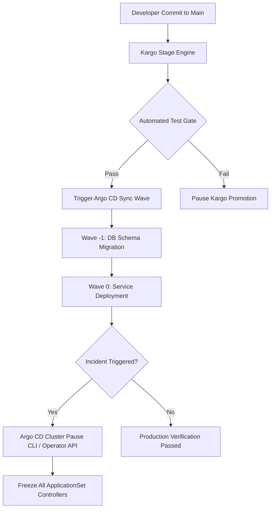

# Argo CD 3.4 & 3.3 Guide: GitOps Upgrades & Cluster Pause (2026)

GitOps is steadily becoming the gold standard for configuration management and application deployment on Kubernetes. Among the tools available, Argo CD continues to maintain its leading position. In the first half of 2026, the Argo project released two landmark versions: **Argo CD 3.3** and **Argo CD 3.4**. These releases address numerous headaches related to application lifecycle management, synchronization performance, and incident response capabilities.

This article analyzes the most prominent features of these two versions, while also highlighting crucial **breaking changes** that Platform/DevOps teams must be aware of before upgrading. If your infrastructure relies on an [ArgoCD-based GitOps platform](/posts/gitops-at-scale-kubernetes-argocd-microservices/) for deploying microservices, these upgrades are impossible to ignore.

---

## Argo CD 2026 Roadmap & Architectural Breaking Changes

The engineering focus for Argo CD in 2026 centers on enterprise stability, operational control, and performance scalability rather than superficial interface redesigns:

- Enhancing emergency control mechanisms during P1 incidents through cluster-level reconciliation freezing.
- Optimizing Repo Server memory footprints and Git synchronization speeds across enterprise monorepos using shallow cloning techniques.
- Upgrading authentication and notification subsystems to align with modern OIDC identity providers and Microsoft Teams Workflows.

---

## What's New in Argo CD 3.4 (May 2026)

One of the most highly anticipated features is **Cluster-Level Pause Reconciliation**. 

Previously, when an incident occurred in Production (e.g., a [database bottleneck requiring sharding](/posts/mysql-horizontal-scaling/), or a memory leak), engineers often had to manually intervene using `kubectl` to roll back or patch manifest files directly on the cluster to salvage the situation immediately. However, Argo CD would detect this drift (Out of Sync) and immediately **reconcile (sync back)** the old configuration from Git, unintentionally "breaking" the SRE's rescue efforts.

With Argo CD 3.4, you can **pause** the entire reconciliation process at the cluster level using the new first-class CLI commands:

```bash
# Pause all reconciliation for a specific cluster (Argo CD 3.4+)
argocd cluster pause production-cluster

# Resume reconciliation once the hotfix is committed to Git
argocd cluster resume production-cluster

# Check the current pause status
argocd cluster get production-cluster
```

A toggle is also available directly in the Argo CD 3.4 UI under **Cluster Settings → Reconciliation**. The cluster-level pause is distinct from the older `AppProject.syncWindows` workaround — it operates at the infrastructure level, affecting all Applications on that cluster simultaneously. This allows SREs to comfortably debug and apply manual hotfixes before committing the proper solution to Git.

### Transitioning Notifications to Microsoft Teams Workflows (Adaptive Cards)

Microsoft announced the retirement of traditional Office 365 Connectors. To adapt, Argo CD 3.4 has updated its Notification system to support **Microsoft Teams Workflows via Adaptive Cards**.

Now, alerts regarding Sync Failed or Health Degraded statuses are sent as interactive Adaptive Cards. This allows the inclusion of action buttons that redirect users straight to the Argo CD UI or link to centralized logging systems.

### UI Improvements: Advanced Filters and Clear All Filters

For systems managing thousands of Applications, the Argo CD interface can sometimes feel cramped. Version 3.4 adds **Advanced Filters** and a **Clear All Filters** button, making it lightning-fast to find applications that are OutOfSync or Degraded.

---

## Performance Enhancements in Argo CD 3.3 (Early 2026)

Argo CD 3.3 also ships performance work: reducing repository server resource consumption, eliminating authentication session timeouts, and giving teams control over resource deletion order.

### PreDelete Hooks to Control Manifest Deletion Lifecycles

In Argo CD, Resource Hooks (`PreSync`, `PostSync`) are familiar tools for managing deployment order. However, resource deletion often happens without control. 

Argo CD 3.3 introduces the **PreDelete Hook**. This feature allows you to run a Job (such as cleaning up garbage data, taking a final database backup, or deregistering an IP from an external Load Balancer) right **before** Argo CD actually deletes the resource on Kubernetes.

```yaml
apiVersion: batch/v1
kind: Job
metadata:
  generateName: cleanup-data-
  annotations:
    argocd.argoproj.io/hook: PreDelete
spec:
  template:
    spec:
      containers:
      - name: cleanup
        image: custom-cleanup-script:latest
```

### Shallow Git Cloning - Speeding Up Synchronization for Large Monorepos

Large companies often store their entire Kubernetes configuration in a **Monorepo**. When this monorepo grows huge (containing years of Git history), the Argo CD Repo Server consumes massive amounts of RAM, CPU, and network bandwidth to fetch data from GitHub/GitLab on every change.

**Shallow Cloning** completely solves this problem. Argo CD 3.3 can now clone only the latest commit (depth=1) instead of downloading the entire Git history. For large monorepos, this can **significantly reduce sync times and Repo Server memory usage** — the exact improvement depends on the repository's commit history depth and size.

### OIDC Background Token Refresh Eliminates Session Timeouts

Getting kicked out of the Argo CD screen (Session Timeout) while monitoring a deployment progress is an extremely frustrating experience. With version 3.3, Argo CD integrates **Background Token Refresh** for OIDC providers (Okta, Keycloak, Dex). The token will be silently refreshed in the background as long as the user is actively working or keeping the tab open, providing an uninterrupted session experience.

---

## Crucial Upgrade Note: Breaking Change in SemVer Cluster Version Format

Upgrading to Argo CD v3.4 requires platform engineers to audit ApplicationSet generator configurations for compliance with Semantic Versioning. The controller now enforces strict SemVer string parsing — non-compliant version labels in cluster generators will cause manifest rendering to fail immediately during deployment execution.

> 🚨 **RISK WARNING**
> If your ApplicationSet system is using generators with custom labels that do not follow the Helm/SemVer standard, the manifest rendering process will immediately FAIL after upgrading to v3.4. Please thoroughly review all `.spec.generators` in your ApplicationSets before proceeding.

---

## ArgoCD v3.4 RC — June 2026 Latest Features

Beyond the core breaking changes, the Argo CD v3.4 Release Candidate adds a few smaller features worth knowing about before you upgrade: multi-tenant filtering, a modernized chatops notification path, and an early look at a visual ApplicationSet UI.

### 1. Annotation-Based Application Filtering

The Application list view now supports **filtering by custom annotations**. Previously, teams managing hundreds of Applications in a single Argo CD instance could only filter by name, namespace, or label. Annotation-based filtering unlocks richer organizational schemes — for example, filtering by `owner=payments-team` or `environment=staging` without having to encode those values into labels.

This is especially useful in large-scale multi-tenant GitOps setups where Application ownership is tracked separately from Kubernetes metadata.

### 2. Microsoft Teams Workflow Notifications

The Argo CD notification engine now supports **Microsoft Teams Workflows** as a notification channel. The previous Teams integration used the legacy "Incoming Webhook" connector, which Microsoft deprecated. Teams Workflows use Power Automate flows and are the recommended replacement.

For teams already using Argo CD notifications with Slack or PagerDuty, no changes are required. Teams users must migrate their notifier configuration from the legacy webhook format to the new Workflows schema before the legacy connector is decommissioned.

### 3. ApplicationSet UI (Beta)

Active development is underway on a **dedicated UI for ApplicationSets**. Currently, ApplicationSet management requires direct YAML editing in Git or via `kubectl`. The forthcoming UI will allow teams to inspect, debug, and understand ApplicationSet generator outputs directly from the Argo CD web console — while Git remains the authoritative source of truth.

This is targeted for stable release in Argo CD v3.5 (roadmap: late summer 2026).

---

## Beyond GitOps: Kargo and Event-Driven Delivery (2026 Trend)

Traditional pull-based GitOps remains effective for infrastructure governance, but modern microservices architectures increasingly pair it with event-driven delivery engines like Kargo to get faster rollout velocity without giving up declarative reconciliation.

**Standard GitOps (Argo CD) model:** Poll Git every 3 minutes → detect diff → sync cluster.

**Event-driven model (Kargo):** Listen for image registry push events or CI system webhooks → trigger delivery pipeline instantly → apply to cluster.

| Aspect | Argo CD | Kargo |
|--------|---------|-------|
| **Trigger model** | Pull/poll (Git) | Event-driven (push) |
| **Source of truth** | Git repo | Promotion policies |
| **Multi-stage rollouts** | Via ApplicationSets | Native (Warehouse → Stage → Prod) |
| **Rollback** | Manual or auto-sync revert | Policy-defined |
| **Best for** | Config management, large fleet | High-velocity feature delivery |

Kargo is not a replacement for Argo CD — in practice, teams run both. Argo CD manages the cluster state (infrastructure, platform tooling), while Kargo handles the fast-moving application delivery pipeline.

---

## Architectural Summary & Production Checklist

Argo CD 3.3 and 3.4 bring meaningful GitOps maturity: cluster-wide emergency controls, optimized repository caching, and refined deletion hooks. Before upgrading production controllers, validate your ApplicationSet label schemas, verify notification endpoints, and put rollout safety checks in place.

The v3.4 RC additions — annotation filtering, Teams Workflow support, and the upcoming ApplicationSet UI — continue the trend toward better usability without sacrificing the Git-first philosophy.

If you are preparing to upgrade, remember to double-check the SemVer conditions in your ApplicationSets to ensure a smooth transition.

---

## System Architecture & Sequence Flow

The diagram below traces a commit from `main` through a Kargo promotion gate into an Argo CD Sync Wave, and shows where Cluster Pause intercepts the flow when an incident fires mid-deployment. Note how the schema migration (Wave -1) always completes before service rollout (Wave 0), and how Cluster Pause freezes the ApplicationSet controllers without touching the Git source.


```mermaid
flowchart TD
    A[Developer Commit to Main] --> B[Kargo Stage Engine]
    B --> C{Automated Test Gate}
    C -- Pass --> D[Trigger Argo CD Sync Wave]
    C -- Fail --> E[Pause Kargo Promotion]
    D --> F[Wave -1: DB Schema Migration]
    F --> G[Wave 0: Service Deployment]
    G --> H{Incident Triggered?}
    H -- Yes --> I[Argo CD Cluster Pause CLI / Operator API]
    I --> J[Freeze All ApplicationSet Controllers]
    H -- No --> K[Production Verification Passed]
```

## Argo CD Upgrade Trade-offs & Production Considerations

Upgrading a GitOps control plane in place is never free of risk — the controller reconciles every application in every cluster it manages, so a regression in 3.3/3.4 has a blast radius equal to your entire fleet. Weigh these trade-offs before rolling the upgrade past your staging clusters.

1. **Cluster Pause vs. drift accumulation**: Cluster Pause freezes reconciliation instantly during a P1, but every minute paused is a minute of un-applied Git state. When you resume, the controller replays the full diff at once — on a large fleet this can spike API-server load. Cap the pause window and pre-scale the `argocd-application-controller` shards before resuming, rather than leaving a cluster paused indefinitely.
2. **Shallow clone (`depth=1`) vs. history-dependent tooling**: Shallow cloning slashes monorepo sync time, but any plugin or Kustomize generator that walks Git history (changelog generators, `git describe` version stamping) will break silently. Audit your config-management plugins for history access before enabling it.
3. **Kargo promotion gates vs. deployment velocity**: Event-driven Kargo promotions add verification gates between stages. This prevents bad manifests from reaching production, but a flaky verification webhook becomes a hard stop for the whole pipeline. Set explicit gate timeouts and a manual-override path so a broken check does not block every downstream environment.
4. **PreDelete hooks vs. teardown latency**: Custom PreDelete hooks (draining DB connections, deregistering from service discovery) guarantee graceful teardown, but they run synchronously inside the sync phase. A hook that hangs will stall the entire Sync Wave — always give hook pods an `activeDeadlineSeconds` so a stuck drain cannot wedge the reconciliation loop.

## Related Reading

- [GitOps at Scale with Kubernetes & Argo CD](/posts/gitops-at-scale-kubernetes-argocd-microservices/) — sharding the application controller and ApplicationSet patterns for large fleets.
- [Kubernetes In-Place Pod Resizing Guide](/posts/kubernetes-in-place-pod-resizing-guide/) — resizing the controller without full pod restarts during an upgrade.
- [AWS EKS vs ECS Architecture Comparison](/posts/aws-eks-vs-ecs-comparison/) — choosing the control plane your GitOps stack deploys onto.

## Frequently Asked Questions

### How does Argo CD 3.4 Cluster Pause differ from standard Sync Windows?
Cluster Pause acts as an emergency circuit breaker that instantly freezes all ApplicationSet controllers across targeted Kubernetes clusters without altering Git repositories or triggering webhooks. In contrast, standard Sync Windows apply scheduled maintenance blockages based on recurring cron time windows.

### What is the role of Kargo in modern Argo CD GitOps pipelines?
Kargo orchestrates multi-stage environment promotions across development, staging, and production environments by tracking container image digest updates and executing automated health verification gates. Once promotion gates pass successfully, Kargo updates target Git manifests to trigger Argo CD continuous reconciliation.

### How do PreDelete hooks improve resource lifecycle management in Argo CD?
PreDelete hooks execute dedicated hook pods or jobs before target Kubernetes resources are removed by the Argo CD controller. This guarantees graceful workload termination by allowing database connection draining, state backups, and external DNS record cleanups to complete before pod deletion.

### What breaking changes in SemVer parsing affect Argo CD 3.4 upgrades?
Argo CD 3.4 enforces strict Semantic Versioning (`vMajor.Minor.Patch`) when parsing Kubernetes version labels in ApplicationSet generators. If cluster manifests contain custom or unformatted version strings, manifest rendering will fail immediately upon upgrading the controller.


