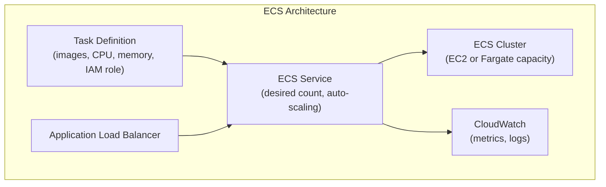
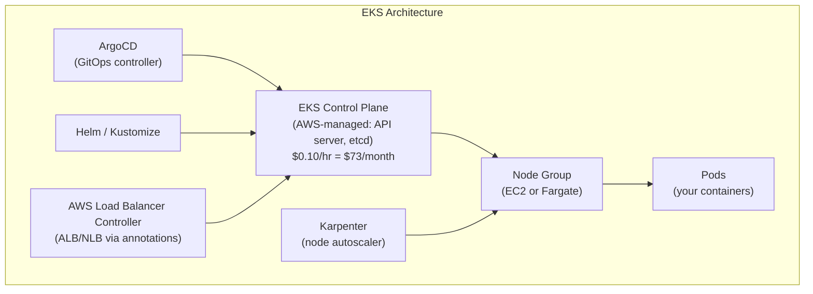
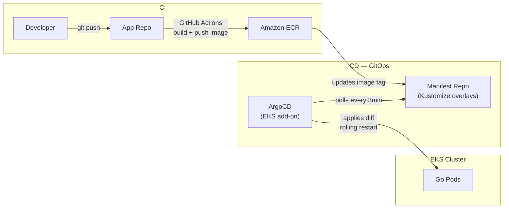
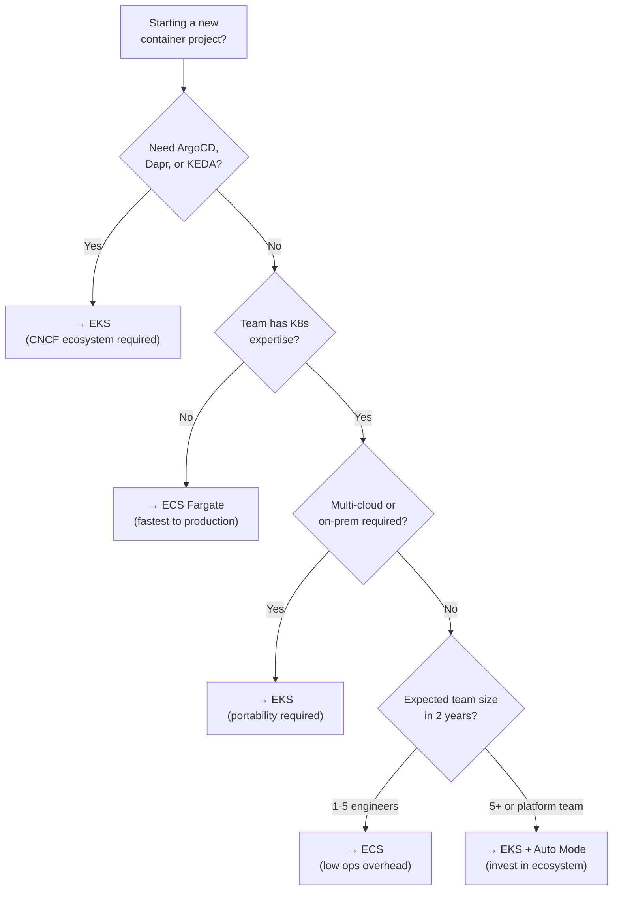

---
title: "AWS EKS vs ECS: Architecture, Cost & Real-World Use Cases (2026)"
slug: "aws-eks-vs-ecs-comparison"
date: 2026-06-26T21:00:00+07:00
lastmod: 2026-07-03T15:41:55+07:00
draft: false
mermaid: true
tags: ["AWS", "EKS", "ECS", "Kubernetes", "Container Orchestration", "DevOps", "Go", "Microservices", "Fargate"]
description: "A practitioner's guide to EKS vs ECS: control plane costs, Fargate trade-offs, EKS Auto Mode, and when to choose — from a Go architect who ran both in production."
categories: ["DevOps", "Engineering", "AWS"]
ShowToc: true
TocOpen: true
cover:
  image: "/images/posts/aws-eks-vs-ecs-cover.png"
  alt: "AWS EKS vs ECS architecture comparison — tanhdev.com"
  relative: false
---

**TL;DR:** EKS gives you full Kubernetes power with portability and the CNCF ecosystem. ECS gives you AWS-native simplicity with zero control plane cost. Choose EKS if you need GitOps, ArgoCD, Dapr, or multi-cloud portability. Choose ECS if you want faster setup, lower ops overhead, and a pure AWS-native stack.

I've run both in production. At Vigo Retail, I architected a 21-service Go microservices platform on EKS handling **8,000 RPS peak and 25M+ requests/month**. I've also managed ECS clusters for smaller AWS-native projects. This guide is what I wish existed before I made those decisions.

---

## 1. TL;DR — Quick Decision Table

**Answer-first:** If you need the CNCF ecosystem (ArgoCD, Dapr, Helm, Istio), choose EKS. If you need the fastest path to production on AWS with minimum ops overhead, choose ECS.

| Decision Factor | Choose ECS | Choose EKS |
|-----------------|-----------|-----------|
| Control plane cost | $0/month ✅ | $73/month (~$876/year) |
| Setup time | Minutes | Hours–days |
| Kubernetes expertise required | No | Yes (significant) |
| GitOps with ArgoCD | ❌ Not native | ✅ First-class |
| Dapr sidecar auto-injection | ❌ Manual only | ✅ Operator-managed |
| KEDA event-driven autoscaling | ❌ Not available | ✅ CNCF graduated |
| Multi-cloud / portability | ❌ AWS-only | ✅ Any Kubernetes cluster |
| Karpenter fast autoscaling | ❌ ASG-based only | ✅ 45–60s provisioning |
| App Mesh *(EOL Sept 30, 2026)* | → Service Connect | → VPC Lattice or Istio |
| Team ops overhead | ~0.1 FTE | 0.5–2 FTE |
| Best for | Startups, small teams, AWS-native stacks | Enterprise, CNCF ecosystem, Go/K8s shops |

---

## 2. What Are ECS and EKS? Core Architecture

**Answer-first:** ECS is AWS's proprietary container orchestrator — no Kubernetes. EKS is AWS-managed Kubernetes — fully compatible with `kubectl`, Helm, and the entire CNCF ecosystem.

### 2.1 Amazon ECS — AWS-Native Container Orchestration

ECS launched in 2014 before Kubernetes existed. AWS designed it to be opinionated and simple.

The core primitives are straightforward:

- **Task Definition** — your "recipe": container images, CPU, memory, env vars, IAM role, network mode
- **Service** — runs N copies of a Task, integrates with ALB, handles rolling updates
- **Cluster** — the logical boundary; maps to a VPC + EC2/Fargate capacity

There is no control plane fee. AWS manages the orchestration layer completely. You pay only for what you run.



**Key constraint most people miss:** ECS Task Definitions have a **hard limit of 10 containers per task**. If you run sidecar-heavy patterns (app + Dapr + Envoy + log agent + metrics agent), you can hit this fast.

### 2.2 Amazon EKS — Managed Kubernetes on AWS

EKS gives you a fully-managed Kubernetes control plane (API server, etcd, scheduler, controllers) — you manage the worker nodes (or use Fargate/Auto Mode).



Every Kubernetes tool you've heard of works here: Helm, ArgoCD, Argo Rollouts, Dapr, Karpenter, KEDA, Istio, Linkerd, Prometheus, Grafana, OpenTelemetry Operator.

### 2.3 Architecture Comparison: Control Plane, Data Plane, Launch Types

| Component | ECS | EKS |
|-----------|-----|-----|
| Control plane | AWS-managed, $0 | AWS-managed, $0.10/hr ($73/month) |
| Worker nodes | EC2 (capacity provider) or Fargate | EC2 (node groups, Karpenter) or Fargate |
| Networking | `awsvpc` (ENI per task) or bridge | VPC CNI (ENI per pod) with Prefix Delegation |
| Service discovery | AWS Cloud Map, ECS Service Connect | CoreDNS, K8s Services, Ingress |
| Config management | Task Definitions (JSON/Terraform) | YAML manifests, Helm, Kustomize |
| Add-on lifecycle | Managed by AWS | Self-managed or EKS Managed Add-ons |
| IAM for workloads | Task IAM Role (simple) | EKS Pod Identity (modern) / IRSA (legacy) |

---

## 3. Real Cost Breakdown — No Bullshit Numbers

**Answer-first:** ECS is cheaper at the control plane level — $0 vs $73/month for EKS. But "EKS costs more" is an oversimplification. Compute costs are identical; the real gap is control plane fees, ops headcount, and hidden infrastructure costs.

### 3.1 Control Plane Cost: ECS $0 vs EKS $73/month

This is the only hard-dollar advantage ECS has over EKS at the control plane level:

| | ECS | EKS Standard | EKS Extended Support |
|-|-----|-------------|---------------------|
| Control plane fee | **$0/month** | **$73/month** (~$0.10/hr) | **$438/month** (~$0.60/hr) |
| Per year | $0 | $876 | $5,256 |
| 3 clusters | $0 | $2,628/year | $15,768/year |

**Source:** [aws.amazon.com/eks/pricing](https://aws.amazon.com/eks/pricing/), [aws.amazon.com/ecs/pricing](https://aws.amazon.com/ecs/pricing/)

**The Extended Support trap:** EKS Extended Support ($0.60/hr) kicks in when you run a Kubernetes version more than 14 months past its upstream release. This has been in effect since April 2024. Teams that don't maintain a K8s upgrade cadence silently hit this 6× price jump. At 3 clusters, that's **$15,768/year in control plane fees alone** — before compute.

### 3.2 Compute Costs: EC2 vs Fargate

Both ECS and EKS run on identical compute. EC2 pricing and Fargate pricing are the same regardless of orchestrator:

**Fargate pricing (US-East-1):**
- vCPU: **$0.04048/hour** per vCPU
- Memory: **$0.004445/hour** per GB

**Source:** [aws.amazon.com/fargate/pricing](https://aws.amazon.com/fargate/pricing/)

**Fargate limitation (ECS-specific):** ECS Fargate forces you into predefined CPU/memory combinations (0.25, 0.5, 1, 2, 4, 8, 16, 32 vCPU — fixed list). You cannot request 1.5 vCPU. This can force over-provisioning by one step.

**Cost optimization options (both ECS and EKS):**
- **Compute Savings Plans:** Up to 66% off EC2 and Fargate compute. Control plane fee is NOT covered. ([aws.amazon.com/savingsplans](https://aws.amazon.com/savingsplans/pricing/))
- **Spot Instances:** ECS Spot via capacity providers; EKS Spot via Karpenter (intelligent multi-pool selection)
- **Graviton ARM:** ~20% lower base cost, up to 40% better price-performance. ECS: set `cpuArchitecture: ARM64` in Task Definition. EKS: Karpenter auto-selects Graviton. Go compiles to ARM with zero code changes — `GOARCH=arm64 GOOS=linux go build`.
- **Fargate Spot + Graviton:** Up to **76% savings** vs x86 on-demand pricing

### 3.3 Hidden Costs: NAT Gateway, ALB, Engineering Headcount

These costs hit both ECS and EKS, but EKS can compound them:

| Hidden Cost | Notes |
|-------------|-------|
| **NAT Gateway** | ~$0.045–0.048/GB data processed. High-traffic clusters with cross-AZ traffic generate significant NAT costs. |
| **ALB** | ECS: ALB integrates natively. EKS: requires AWS Load Balancer Controller add-on (Helm chart). |
| **CloudWatch metrics** | EKS OTel Container Insights enriches metrics with 150+ Kubernetes labels → high cardinality → bill shock. ECS Enhanced Container Insights: ~$0.47/metric/month. |
| **Engineering headcount** | EKS: 0.5–2 FTE platform ops. ECS: ~0.1 FTE. [INFERENCE — industry estimate] |
| **K8s version upgrades** | EKS: mandatory every ~14 months to avoid Extended Support fee. ECS: zero effort. |

### 3.4 Real Cluster Cost Example (10 Services, ap-southeast-1)

| Config | ECS (Fargate) | EKS (EC2 + Karpenter) |
|--------|--------------|----------------------|
| Control plane | $0 | $73/month |
| Compute (10 services × 1 vCPU/2GB) | ~$310/month | ~$200/month (bin-packing) |
| ALB | ~$25/month | ~$25/month |
| NAT Gateway | ~$30/month | ~$30/month |
| CloudWatch | ~$20/month | ~$35/month (higher cardinality) |
| **Infrastructure total** | **~$385/month** | **~$363/month** |

*Illustrative estimates. Actual costs vary by traffic, region, and workload efficiency.*

---

## 4. Performance & Scalability

**Answer-first:** ECS and EKS have identical raw throughput and latency — both use ENI-native VPC networking with no overlay. The difference is *how fast* they scale and *how efficiently* they pack workloads.

### 4.1 Startup & Scale-Out Speed

This is where EKS (with Karpenter) beats ECS significantly for bursty workloads:

| Autoscaler | Node provisioning time | Architecture |
|-----------|----------------------|--------------|
| **Karpenter (EKS)** | **~45–60 seconds** | Direct EC2 Fleet API — no ASG |
| ECS Capacity Provider (EC2) | ~3–5 minutes | Standard EC2 Auto Scaling Group |
| ECS Fargate | ~30–90 seconds | Task-level cold start |
| Cluster Autoscaler (EKS) | ~3–5 minutes | ASG-based — legacy |

**Why this matters at 8,000 RPS:** At Vigo Retail, traffic spikes during promotions hit 8,000 RPS within minutes. A 3-minute node provisioning delay translates directly to queued requests, degraded p99 latency, and potential 5xx errors. Karpenter's 45-second provisioning kept us within SLA during every burst event.

**Pod-level autoscaling:**

| | ECS | EKS |
|-|-----|-----|
| Standard (CPU/Memory) | ECS Application Auto Scaling | HPA (Kubernetes native, 15s poll) |
| Event-driven (queue depth) | ❌ No equivalent | ✅ **KEDA** (SQS, Kafka, Redis, 70+ scalers) |
| Scale to zero | ✅ Task count = 0 | ✅ KEDA `minReplicaCount: 0` |

**KEDA is an EKS superpower for background workers.** Go SQS consumers scale to zero during off-hours and back up when queue depth rises — without building custom CloudWatch metric pipelines.

### 4.2 Networking: VPC CNI vs ECS awsvpc

Both ECS (`awsvpc` mode) and EKS (VPC CNI) assign real VPC IP addresses directly to containers. No NAT, no overlay. Latency is identical to EC2 instance networking.

**EKS VPC CNI Prefix Delegation advantage at scale:** Allocates `/28` IPv4 blocks (16 IPs) per ENI attachment. Dramatically reduces EC2 API calls during pod scale-out — critical for large clusters scaling rapidly under Karpenter.

**ECS bridge mode:** Technically available but deprecated for production. Adds NAT overhead. Use `awsvpc` exclusively.

---

## 5. Use Cases — When to Choose ECS, When to Choose EKS

**Answer-first:** If you're asking *khi nào dùng EKS, khi nào dùng ECS* — the answer is simpler than most comparison articles suggest. ECS is the right choice for startups and AWS-native stacks that need fast time-to-production. EKS is the right choice for teams needing GitOps, event-driven autoscaling, or CNCF ecosystem tools.

### 5.1 Startup (Speed & Simplicity) → ECS Fargate

ECS Fargate is the fastest path from code to production on AWS.

**ECS wins when:**
- Your team has no Kubernetes experience
- You need to ship in days, not weeks
- Your architecture is standard HTTP/gRPC services behind an ALB
- You're fully committed to the AWS ecosystem (CloudWatch, CodeDeploy, IAM)
- You have 1–3 backend engineers

**Real ECS Fargate setup timeline:**
1. Define Task Definition (Terraform `aws_ecs_task_definition`) — 30 minutes
2. Create ECS Service with ALB target group — 20 minutes
3. Configure Application Auto Scaling — 15 minutes
4. **Total: ~65 minutes to production**

Compare to EKS: cluster creation + VPC CNI config + ALB Controller (Helm) + CoreDNS tuning + IRSA/Pod Identity + Karpenter NodePool + ArgoCD install. Realistically **4–8 hours** for a production-ready cluster.

**gRPC on ECS:** Fully supported via ALB. Required config: `awsvpc` network mode + `ip` target type + `ProtocolVersion: GRPC` on the target group. Health check path: `/grpc.health.v1.Health/Check`. For internal service-to-service gRPC, use AWS Cloud Map for discovery.

### 5.2 Enterprise (Scale, CNCF Ecosystem) → EKS

EKS is the right choice when your organization needs the Kubernetes ecosystem.

**EKS wins when:**
- You need **ArgoCD for GitOps** — ArgoCD is Kubernetes-only. It cannot deploy to ECS.
- You run **Dapr** — on ECS, Dapr requires manual sidecar injection in every Task Definition. On EKS, the Dapr operator handles this automatically across all 21 services.
- You need **KEDA** for event-driven scaling — no ECS equivalent exists
- You need **multi-tenancy at scale** — EKS supports Namespace + RBAC + NetworkPolicy isolation; ECS has no namespace concept
- You need multi-cloud or workload portability

According to the [CNCF 2024 Annual Survey](https://www.cncf.io/reports/cncf-annual-survey-2024/), **93% of organizations** are using, evaluating, or piloting Kubernetes. **92% of the container orchestration market** runs on Kubernetes. Choosing ECS in 2025 is a deliberate, informed trade-off — not a lack of awareness.

### 5.3 Go Microservices on EKS — Firsthand Production Experience

At Vigo Retail, I led the architecture for a **21-service Go microservices platform** on EKS in `ap-southeast-1`. The system handled an e-commerce backend for a Korean conglomerate's Vietnam operations, peaking at **8,000 RPS and 25M+ requests/month**.

**Stack:**
- 21 Go services (order management, inventory, loyalty, payment, notifications, and more)
- EKS on EC2 (m6i + m6g Graviton2 nodes — mixed architecture)
- ArgoCD with App-of-Apps pattern (see [GitOps at Scale](/posts/gitops-at-scale-kubernetes-argocd-microservices/))
- Dapr for pub/sub, state store, service invocation
- Karpenter for node autoscaling
- AWS Load Balancer Controller (ALB for external, NLB for internal gRPC)
- ADOT + AWS X-Ray for distributed tracing

**Lesson 1 — Graviton Spot for stateless Go services**

We ran all stateless Go services on Graviton Spot instances. Pure-Go binaries compile to ARM64 without code changes:

```dockerfile
# Multi-arch build — works on both ECS and EKS
FROM --platform=$BUILDPLATFORM golang:1.23-alpine AS builder
ARG TARGETOS TARGETARCH
RUN GOOS=$TARGETOS GOARCH=$TARGETARCH go build -o /app ./cmd/server
```

Result: **~35% compute cost reduction** on burst capacity.

**Lesson 2 — Internal gRPC: NLB passthrough, not ALB**

Go gRPC clients do client-side load balancing. Behind ALB, without explicitly setting `grpc.WithDefaultServiceConfig("round_robin")`, all traffic can funnel to one backend pod. We switched internal service-to-service communication to NLB passthrough + CoreDNS-based discovery. ALB handles only external-facing endpoints.

**Lesson 3 — Dapr auto-injection saved 21 manual task definitions**

With 21 services, Dapr's Kubernetes operator auto-injects the sidecar. On ECS, every Dapr version bump requires updating 21 Task Definitions manually. On EKS: update the Dapr Helm chart once. Done.

**Lesson 4 — Karpenter consolidation for overnight cost savings**

```yaml
apiVersion: karpenter.sh/v1
kind: NodePool
metadata:
  name: go-services
spec:
  template:
    spec:
      requirements:
        - key: karpenter.sh/capacity-type
          operator: In
          values: ["spot", "on-demand"]
        - key: kubernetes.io/arch
          operator: In
          values: ["amd64", "arm64"]
  disruption:
    consolidationPolicy: WhenEmptyOrUnderutilized
    consolidateAfter: 1m
```

Karpenter's consolidation engine killed underutilized nodes automatically. At off-peak hours, the cluster shrank from 8 nodes to 3. Significant overnight compute savings with zero manual intervention.

### 5.4 Hybrid: ECS + EKS in One Organization

More common than people admit. Typical pattern:

- **ECS:** Internal tooling, simple CRUD services, batch jobs — teams without K8s expertise
- **EKS:** Core product microservices, services needing ArgoCD/Dapr/KEDA — platform team-owned

Both clusters share the same VPC. They communicate via VPC peering or PrivateLink. The technical barrier is low; the organizational complexity of maintaining two paradigms is the real cost.

---

## 6. EKS Auto Mode (2026): Game Changer?

**Answer-first:** EKS Auto Mode (GA since re:Invent 2024) closes roughly 60% of the ops gap between EKS and ECS. It eliminates node lifecycle management — the most time-consuming EKS ops task. But you still need Kubernetes expertise for everything above the infrastructure layer.

### What EKS Auto Mode Automates

- **Compute:** Node provisioning via managed Karpenter — just submit your pods, nodes appear automatically
- **Operating system:** Bottlerocket OS, patched and updated by AWS
- **Core add-ons:** VPC CNI, CoreDNS, kube-proxy, AWS Load Balancer Controller, EBS CSI driver — all managed

### What EKS Auto Mode Does NOT Do

- You still write Kubernetes manifests (Deployments, Services, Ingress)
- You still manage RBAC, NetworkPolicies, namespaces, resource quotas
- You still configure application-level Helm charts (ArgoCD, Dapr, KEDA, Prometheus)
- You cannot use custom AMIs — Bottlerocket only
- Added per-instance management fee on top of standard EC2 pricing

### My Take

If you're starting a new EKS cluster today, enable Auto Mode from day one. Don't fight Karpenter NodePool configuration if AWS will manage it for you. Auto Mode makes EKS significantly more accessible for teams without dedicated platform engineers — but it's not "ECS simplicity." It's "EKS with the hardest part removed."

---

## 7. Operational Overhead & Team Requirements

**Answer-first:** ECS requires ~0.1 FTE for platform operations. EKS requires 0.5–2 FTE, reduced to ~0.3–0.5 FTE with Auto Mode. The K8s version upgrade treadmill is real and ongoing regardless of Auto Mode.

### 7.1 ECS: Minimal Ops

**What AWS manages:**
- Control plane (100%)
- Task placement and orchestration
- ALB integration (native, no controller)
- CloudWatch integration (built-in)
- ECS Service Connect (traffic management, health checks, retry, outlier detection)

**What you manage:**
- Task Definitions (version-controlled in Terraform/CDK)
- Service scaling policies
- IAM Task Roles (simple — attach role to task definition)
- EC2 Auto Scaling (if using EC2 launch type)

### 7.2 EKS: Platform Team Investment

| Responsibility | Without Auto Mode | With Auto Mode |
|---------------|-------------------|----------------|
| Node lifecycle (AMI patches) | Your team | AWS ✅ |
| K8s version upgrades (~every 14 months) | Your team | Your team |
| Add-on management (VPC CNI, LB Controller) | Your team | AWS ✅ (core add-ons) |
| Application add-ons (ArgoCD, Dapr, KEDA) | Your team | Your team |
| RBAC, NetworkPolicy, namespace structure | Your team | Your team |
| Cost optimization (Karpenter tuning) | Your team | AWS ✅ (managed Karpenter) |

**The K8s version upgrade treadmill:** EKS versions have a ~14-month window before Extended Support pricing applies. At Vigo Retail, we ran quarterly upgrade sprints — staging cluster upgrade first, then production with blue/green cluster swap. Budget **2–3 engineer-days per cluster per upgrade cycle**.

### 7.3 GitOps on EKS with ArgoCD

The deployment pattern I consider non-negotiable for production Kubernetes:



No engineer runs `kubectl apply` in production. No cluster credentials in CI. Rollback = `git revert` → ArgoCD auto-applies within 3 minutes.

This GitOps pattern is not available for ECS. ECS teams use CodeDeploy (blue/green, linear, canary — all AWS-managed and solid) or GitHub Actions + `ecspresso`. Both work well; neither is GitOps in the Kubernetes sense.

---

## 8. Ecosystem & Tooling

**Answer-first:** ECS integrates deeply with AWS-native tools (CloudWatch, CodeDeploy, IAM, ALB). EKS integrates with the entire CNCF ecosystem — 1,000+ tools, all Kubernetes-compatible.

### 8.1 ECS: AWS Native Tools

| Tool | ECS Integration |
|------|----------------|
| CloudWatch Container Insights | ✅ One-click enable |
| AWS X-Ray + ADOT tracing | ✅ Sidecar or Service Extension |
| Application Load Balancer | ✅ Native (no controller needed) |
| CodeDeploy (Blue/Green, Canary) | ✅ Native deployment controller |
| IAM Task Roles | ✅ Simplest workload identity model |
| ECS Service Connect | ✅ Built-in service mesh (health, retry, outlier, observability) |
| AWS App Mesh | ⚠️ **EOL September 30, 2026** |

**App Mesh EOL is urgent:** AWS is discontinuing App Mesh on **September 30, 2026**. New customers cannot onboard as of September 24, 2024. If you're using App Mesh on ECS today, migrate to **ECS Service Connect**. If you're on EKS, migrate to **Amazon VPC Lattice** or adopt Istio. Both migration guides are available at [aws.amazon.com/blogs/containers](https://aws.amazon.com/blogs/containers/).

### 8.2 EKS: CNCF Ecosystem

| Tool | EKS Support | ECS Support |
|------|------------|-------------|
| **ArgoCD** (GitOps) | ✅ First-class | ❌ Not supported |
| **Argo Rollouts** (canary/blue-green with auto-rollback) | ✅ K8s-native | ❌ Not supported |
| **Dapr** (microservice patterns) | ✅ Auto-injection via operator | ⚠️ Manual sidecar in Task Definition |
| **KEDA** (event-driven autoscaling) | ✅ CNCF graduated | ❌ No equivalent |
| **Karpenter** (smart node autoscaling) | ✅ 45–60s provisioning | ❌ ASG-based only |
| **Helm** (package manager) | ✅ Industry standard | ❌ No equivalent |
| **Prometheus + Grafana** | ✅ K8s-native metrics scraping | ⚠️ Manual ADOT wiring needed |
| **Istio / Linkerd** (service mesh) | ✅ Full support | ❌ No K8s CRDs |
| **OPA / Kyverno** (policy enforcement) | ✅ Admission webhook | ❌ No equivalent |

**Deployment strategies:**

| Strategy | ECS | EKS |
|----------|-----|-----|
| Rolling update | ✅ Native (default) | ✅ K8s native (`maxSurge`/`maxUnavailable`) |
| Blue/Green | ✅ Native (CodeDeploy) | ✅ Argo Rollouts |
| Canary + metric-based auto-rollback | ⚠️ CodeDeploy alarms | ✅ Argo Rollouts + Prometheus SLO |

Argo Rollouts is the 2025 standard for EKS progressive delivery. It replaces `Deployment` with a `Rollout` CRD, integrates natively with ArgoCD, and auto-rolls back if your Prometheus error rate exceeds the configured threshold — all declared in git.

---

## 9. Security & IAM

**Answer-first:** ECS Task Roles are simpler — no OIDC, no agents, just attach an IAM role to a task definition. EKS Pod Identity is the recommended approach for EKS (EKS 1.24+) — no OIDC setup, reusable across all clusters. Both are secure; ECS wins on simplicity.

| Feature | ECS | EKS |
|---------|-----|-----|
| Workload identity mechanism | **Task IAM Role** | **EKS Pod Identity** (recommended) / IRSA (legacy) |
| OIDC required | ❌ No | ❌ No (Pod Identity); ✅ Yes (IRSA) |
| Multi-cluster IAM management | N/A | Pod Identity: cluster-agnostic role reuse ✅ |
| IRSA scaling limit | N/A | 100 OIDC providers per AWS account |
| Network policy (pod-level) | ❌ VPC Security Groups per task only | ✅ K8s NetworkPolicy (Calico, VPC CNI) |
| Zero-trust workload isolation | Service Group-level | Pod-label-level |

**IRSA scaling trap:** Legacy IRSA requires a unique OIDC provider per EKS cluster. AWS accounts have a 100 OIDC provider limit. Teams running many clusters hit this wall. EKS Pod Identity (EKS 1.24+) is cluster-agnostic — the same IAM role works across all clusters without trust policy updates.

---

## 10. Vendor Lock-in & Portability

**Answer-first:** ECS is AWS-only with no migration path to another cloud. EKS workloads use standard Kubernetes manifests — portable to GKE, AKS, or any self-managed cluster with minimal changes.

| Portability dimension | ECS | EKS |
|----------------------|-----|-----|
| Move to GCP/Azure | ❌ Full rewrite | ✅ Port manifests to GKE/AKS |
| Run on-premises (AWS-managed CP) | ✅ ECS Anywhere | ✅ EKS Hybrid Nodes (GA Dec 2024) |
| Run fully on-premises | ❌ | ✅ EKS Anywhere (self-managed CP) |
| Multi-cloud management | ❌ | ✅ Any K8s-compatible tool |
| Tooling portability | AWS-specific | Any CNCF tool |

**EKS Hybrid Nodes** (GA since re:Invent December 2024): AWS-managed control plane in the cloud + on-premises worker nodes. The Hybrid Nodes gateway (GA April 2026) automates pod-to-pod routing between cloud and on-prem — eliminating manual BGP/routing configuration. For organizations with on-premises requirements, this is now the preferred path over EKS Anywhere.

---

## 11. Final Decision Framework

**Answer-first:** Start with your constraints (team expertise, ecosystem needs, budget), not the feature list.



| Team Profile | Recommended | Reason |
|-------------|------------|--------|
| Early-stage startup (1–5 engineers) | **ECS Fargate** | Zero control plane cost, ships in ~65 minutes |
| AWS-native enterprise, no K8s need | **ECS on EC2** | CodeDeploy B/G, CloudWatch, low FTE overhead |
| Go/CNCF shop, GitOps required | **EKS + ArgoCD** | ArgoCD K8s-only; Dapr auto-injection; Argo Rollouts |
| Platform engineering team | **EKS + Auto Mode** | Managed nodes; invest in CNCF ecosystem |
| Multi-cloud or hybrid on-prem | **EKS + Hybrid Nodes** | AWS-managed CP + portability |
| Event-driven workers (SQS/Kafka) | **EKS + KEDA** | Scale-to-zero from queue depth |
| Budget-constrained | **ECS Fargate Spot + Graviton** | No control plane fee; up to 76% compute savings |

---

## FAQ



Neither is universally better. EKS gives you the Kubernetes ecosystem (ArgoCD, Dapr, KEDA, Helm) at the cost of higher operational complexity and $73/month per cluster. ECS gives you AWS-native simplicity with zero control plane cost. Choose based on your team's expertise and what ecosystem tools you actually need — not industry hype.



EKS Auto Mode (GA since re:Invent 2024) automates node provisioning via managed Karpenter, OS patching via Bottlerocket, and core add-ons (VPC CNI, Load Balancer Controller, EBS CSI). You still write Kubernetes manifests and manage RBAC, namespaces, and application-level tools like ArgoCD and Dapr.



The compute layer is identical: same Fargate pricing ($0.04048/vCPU-hr, $0.004445/GB-hr in US-East-1). The difference is the orchestration layer: ECS Fargate has no control plane fee and no Kubernetes API. EKS Fargate costs $73/month for the control plane but gives you full Kubernetes APIs, Helm, and CNCF tooling.



Minimum: $73/month (control plane) + compute. If you fall behind on Kubernetes version upgrades, Extended Support kicks in at $438/month per cluster (~6× more). At 3 clusters in Extended Support, that's **$15,768/year in control plane fees** — before a single container runs. Extended Support has been active since April 2024.



No. ArgoCD is Kubernetes-only — it reconciles Kubernetes resources to Git state. ECS has no Kubernetes resources. Teams deploying ECS via GitOps-style workflows typically use GitHub Actions + [ecspresso](https://github.com/kayac/ecspresso) or AWS CodePipeline + CodeDeploy.



ECS Fargate for the first 12–18 months. Zero control plane cost, ships fast, minimal ops overhead. When you need ArgoCD, Dapr, or KEDA — or when you hire a platform engineer — evaluate EKS. The ECS→EKS migration is significant (Task Definition → K8s manifest conversion, IAM restructure, pipeline rebuild) but manageable with phased traffic switching via ALB weighted target groups.



For a 10-service platform: plan **4–8 engineer-weeks**. Key work: Task Definition → K8s Deployment/Service manifest conversion (no automated tool), IAM Task Roles → EKS Pod Identity, ECS service discovery → K8s Services + Ingress, CloudWatch → Prometheus/ADOT, CI/CD pipeline rebuild. There is no AWS-provided automated migration path.



EKS Extended Support costs **$0.60/hour per cluster** (~$438/month). It applies when your cluster runs a Kubernetes version that has exceeded the 14-month standard support window. This took effect in April 2024. Teams running stale K8s versions pay 6× the normal control plane fee — often without realizing it until they get the AWS bill.

---

## Closing Thoughts

The EKS vs ECS decision comes down to two questions: **What ecosystem tools does your team need?** and **How much Kubernetes complexity can your team absorb?**

If you don't need ArgoCD, Dapr, KEDA, or Kubernetes Network Policies — and you're committed to the AWS ecosystem — ECS is the honest, pragmatic choice. It's not the "lesser" option. It's a deliberate trade-off that keeps ops overhead minimal and your team focused on product delivery.

If you're building a platform that needs GitOps, event-driven autoscaling, pod-level network isolation, or multi-cloud portability — EKS is the right foundation. EKS Auto Mode has significantly lowered the operational bar in 2025. But Kubernetes expertise remains the non-negotiable entry ticket.

At Vigo Retail, EKS was the right call. The CNCF ecosystem — ArgoCD + Dapr + Karpenter — gave us capabilities that ECS cannot match. But I've watched teams choose EKS because "everyone's doing Kubernetes" and then spend 3 months fighting the platform instead of shipping features.

**Pick the tool that matches your team, not the trend.**

---

*[Lê Tuấn Anh](/about/) is a Go Backend Architect with 17+ years of experience. He led the EKS architecture for a 21-service Go microservices platform at Vigo Retail handling 8,000 RPS peak. He also writes about [GitOps at Scale with ArgoCD](/posts/gitops-at-scale-kubernetes-argocd-microservices/), [Kubernetes In-Place Pod Resizing](/posts/kubernetes-in-place-pod-resizing-guide/), and [Dapr Workflow Saga Orchestration](/posts/dapr-workflow-saga-orchestration-guide/).*

---

**From the Tech Radar:** The [May 13, 2026 Tech Radar](/radar/radar-2026-05-13/) covered AgentOps meeting Kubernetes — Signadot's initiative to run AI agent testing inside live Kubernetes sandboxes. For teams choosing EKS specifically to run agentic workloads, this is the most relevant recent signal on where the K8s + AI convergence is heading operationally.

