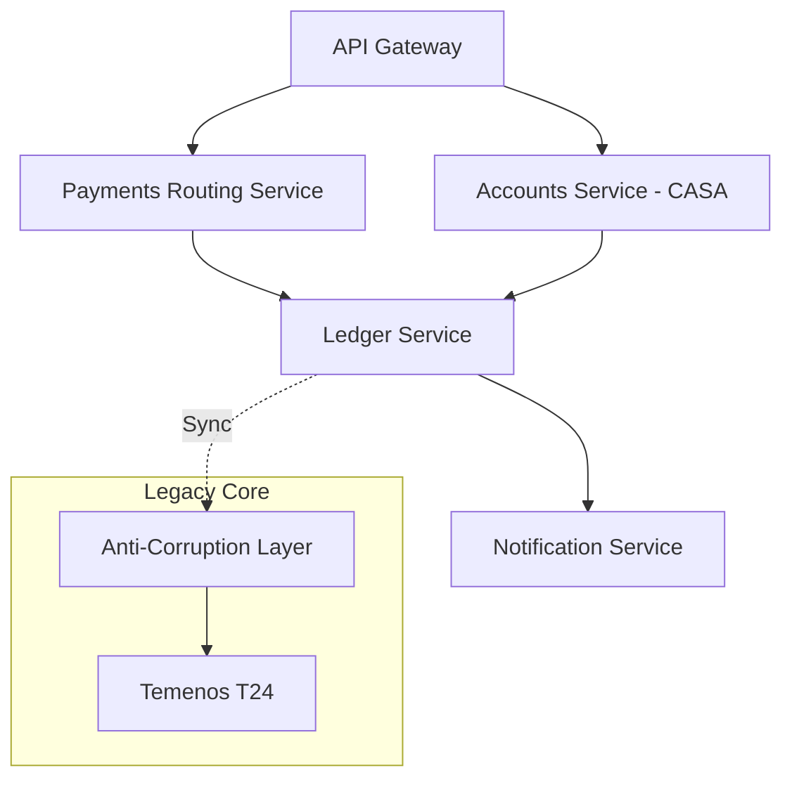
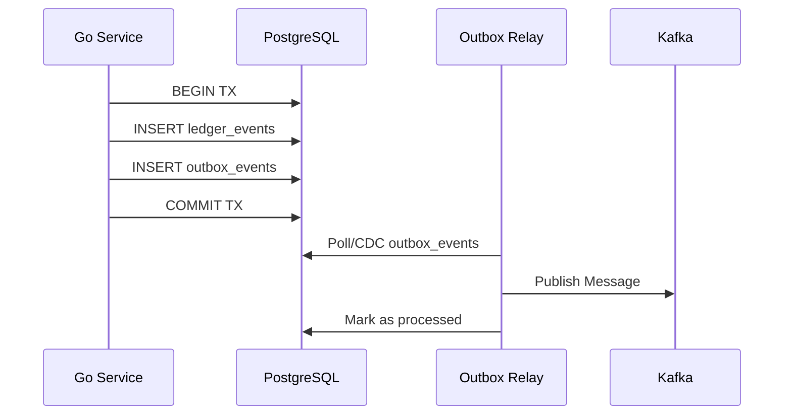

## 1. Introduction: Deconstructing the Legacy Core

**Answer-first:** A modern banking microservices architecture replaces legacy monolithic ledgers (like T24 or Flexcube) using Go for high-throughput transaction routing. The system achieves distributed consistency without two-phase commit (2PC) by combining Event Sourcing (immutable ledger streams), Saga Orchestration (using Temporal or Dapr), the Transactional Outbox pattern, and PostgreSQL unique constraints for API idempotency.

For decades, banks relied on monolithic core systems like Temenos T24 or Oracle FLEXCUBE. While robust, these systems present severe bottlenecks for modern digital banking. They were designed for overnight batch processing, not real-time, API-first global transactions.

Migrating to a microservices architecture in 2026 requires dismantling these bottlenecks:
- **Scaling limitations:** Monoliths scale vertically (costly hardware), while microservices scale horizontally.
- **Release cycles:** Legacy cores require massive, risky quarterly releases. Microservices enable independent deployments.
- **Data locking:** Central databases in monoliths create severe lock contention during high-velocity events (like payday processing).

By leveraging Go's highly concurrent runtime and a distributed event-driven architecture, we optimize the system for <10ms database writes at 10,000 TPS, ensuring scalability and fault tolerance.

## 2. Domain Decomposition: Mapping Core Banking Contexts

**Answer-first:** Decomposing a core banking system requires identifying bounded contexts that operate independently. The primary domains are Accounts (CASA), Payments, Ledgers, and Notifications, allowing isolated scaling and distinct data ownership.

To successfully migrate using the Strangler Fig pattern, you must establish an Anti-Corruption Layer (ACL) that translates legacy models into modern bounded contexts.

Here is how the core domains interact:



Each service owns its database. The Ledger Service never queries the Accounts database directly; instead, it subscribes to immutable state change events.

## 3. Event Sourcing: Designing the Immutable Double-Entry Ledger

**Answer-first:** An immutable double-entry ledger ensures audit compliance by recording financial events rather than mutating balance fields. By using PostgreSQL with Optimistic Concurrency Control (OCC) and a unique index on `(stream_id, version)`, the system guarantees exact sequential consistency.

The core constraint of any financial system is to never store balances as the primary record. Storing a mutable `balance` column leads to lost updates and irreversible data corruption. Instead, you must store the transactions (Event Sourcing).

### PostgreSQL Write Model DDL

This schema enforces Optimistic Concurrency Control (OCC) for the event stream:

```sql
CREATE TABLE ledger_streams (
    stream_id UUID PRIMARY KEY,
    version BIGINT NOT NULL,
    updated_at TIMESTAMP WITH TIME ZONE DEFAULT CURRENT_TIMESTAMP
);

CREATE TABLE ledger_events (
    id UUID PRIMARY KEY DEFAULT gen_random_uuid(),
    stream_id UUID NOT NULL REFERENCES ledger_streams(stream_id),
    version BIGINT NOT NULL,
    event_type VARCHAR(100) NOT NULL,
    payload JSONB NOT NULL,
    created_at TIMESTAMP WITH TIME ZONE DEFAULT CURRENT_TIMESTAMP,
    CONSTRAINT uq_stream_version UNIQUE (stream_id, version)
);
```

### The OCC Append Transaction in Go

When appending an event, the system checks the `expected_version` to prevent race conditions.

```go
// Go repository query using pgx/v5
tx, err := pool.Begin(ctx)
if err != nil {
    return err
}
defer tx.Rollback(ctx)

// 1. Verify and update version
res, err := tx.Exec(ctx, `
    UPDATE ledger_streams 
    SET version = $1, updated_at = NOW() 
    WHERE stream_id = $2 AND version = $3`, 
    expectedVersion+1, streamID, expectedVersion)
if err != nil {
    return err
}
if res.RowsAffected() == 0 {
    return ErrConcurrencyConflict // Version has changed since read
}

// 2. Insert Event
_, err = tx.Exec(ctx, `
    INSERT INTO ledger_events (stream_id, version, event_type, payload) 
    VALUES ($1, $2, $3, $4)`, 
    streamID, expectedVersion+1, eventType, payloadJson)
if err != nil {
    return err
}

return tx.Commit(ctx)
```

To optimize the Go runtime for <10ms database writes at 10,000 TPS, we utilize a transaction-mode PgBouncer pool, NVMe storage, and `synchronous_commit = off` (when business rules tolerate minimal crash delta). For deeper implementation details, read our guide on [double-entry ledger design](/series/core-banking-developer/part-1-double-entry-ledger/).

## 4. The Transactional Outbox Pattern: Preventing Dual-Write Failures

**Answer-first:** The Transactional Outbox pattern resolves the dual-write problem by inserting business data and event messages into the database within the same local transaction. Go workers or CDC tools then poll the outbox table to guarantee at-least-once message delivery to Kafka.

If a service deducts money in the database but fails to publish the `MoneyDeducted` event to Kafka due to a network timeout, the system becomes permanently inconsistent. 

### Implementation Architecture



### Go Polling Relay with FOR UPDATE SKIP LOCKED

To safely poll outbox events across multiple parallel Go worker instances without deadlocks, we use PostgreSQL's `FOR UPDATE SKIP LOCKED`.

```go
func PollOutbox(ctx context.Context, db *pgxpool.Pool, producer sarama.SyncProducer) error {
    tx, err := db.Begin(ctx)
    if err != nil {
        return err
    }
    defer tx.Rollback(ctx)

    // Lock only returned rows, skip already locked rows by other workers
    rows, err := tx.Query(ctx, `
        SELECT id, aggregate_type, event_type, payload 
        FROM outbox_events 
        WHERE processed_at IS NULL 
        ORDER BY created_at ASC 
        LIMIT 50 
        FOR UPDATE SKIP LOCKED`)
    if err != nil {
        return err
    }
    defer rows.Close()

    var eventIDs []uuid.UUID
    for rows.Next() {
        var id uuid.UUID
        var aggType, eventType string
        var payload []byte
        
        if err := rows.Scan(&id, &aggType, &eventType, &payload); err != nil {
            return err
        }
        
        // Publish to Kafka
        _, _, err = producer.SendMessage(&sarama.ProducerMessage{
            Topic: aggType,
            Key:   sarama.StringEncoder(id.String()),
            Value: sarama.ByteEncoder(payload),
        })
        if err != nil {
            return fmt.Errorf("failed to publish: %w", err)
        }
        eventIDs = append(eventIDs, id)
    }

    if len(eventIDs) > 0 {
        _, err = tx.Exec(ctx, `
            UPDATE outbox_events SET processed_at = NOW() WHERE id = ANY($1)`, eventIDs)
        if err != nil {
            return err
        }
    }
    return tx.Commit(ctx)
}
```

## 5. Saga Orchestration: Temporal vs. Dapr for Distributed Transactions

**Answer-first:** Saga Orchestration coordinates distributed financial transactions with compensations for failure states. Temporal offers a dedicated, durable execution engine ideal for long-running workflows, while Dapr Workflows embed the Durable Task Framework as a lightweight sidecar.

Two-Phase Commit (2PC) locks databases and crushes throughput. We must use Sagas to ensure Eventual Consistency.

### Orchestrator Comparison

| Feature | Temporal | Dapr Workflows |
|---------|----------|----------------|
| **Core Architecture** | Dedicated Server/Worker Cluster | Sidecar (Embedded Durable Task Framework) |
| **State Storage** | Dedicated DB (Postgres/Cassandra) | Any Dapr State Store (Redis, CosmosDB) |
| **Operational Overhead**| High (Needs dedicated cluster management) | Low (Reuses existing Dapr infrastructure) |
| **Compliance/Audit** | Native Archival & History Export (S3) | Requires custom audit logging integration |
| **Long-Running Fix** | `Continue-As-New` to avoid event limits | Native Actor state lifecycle |
| **Best Fit** | Complex, multi-day, mission-critical Sagas | Lightweight, integrated Saga compensations |

**Architecture Decision (2026 Core Banking Standard):**
- **Temporal** is required if you need long-term PCI-DSS audit trails, history archival to S3, and process complex multi-day workflows (e.g. mortgage origination). Note that Temporal has a hard event history limit (51,200 events), necessitating the `Continue-As-New` strategy for infinite financial ledgers.
- **Dapr Workflows** are optimal for short-lived Sagas (e.g. cross-service payment transfers) if you already use Dapr for sidecar routing and pub/sub.

### Go Temporal Workflow Code Structure

Temporal executes compensations natively. In Go, you build a slice of compensation functions and trigger them via `defer` if the workflow fails.

```go
func FinancialTransferSaga(ctx workflow.Context, req TransferRequest) (err error) {
    options := workflow.ActivityOptions{
        StartToCloseTimeout: time.Minute,
        RetryPolicy: &temporal.RetryPolicy{MaximumAttempts: 3},
    }
    ctx = workflow.WithActivityOptions(ctx, options)

    var compensations []func()
    
    // Defer compensation execution
    defer func() {
        if err != nil {
            for _, comp := range compensations {
                comp()
            }
        }
    }()

    // Step 1: Deduct
    err = workflow.ExecuteActivity(ctx, DeductFundsActivity, req).Get(ctx, nil)
    if err != nil {
        return err
    }
    compensations = append(compensations, func() {
        workflow.ExecuteActivity(ctx, RefundFundsActivity, req).Get(ctx, nil)
    })

    // Step 2: Credit
    err = workflow.ExecuteActivity(ctx, CreditTargetActivity, req).Get(ctx, nil)
    if err != nil {
        return err
    }

    return nil
}
```

## 6. Designing Idempotent Payment APIs in Go

**Answer-first:** An idempotent payment API guarantees that identical requests process only once, preventing double-charging. This is implemented via a Key-Check-Execute pattern using Redis for TTL-based locking and PostgreSQL unique indexes for permanent deduplication.

When Kafka redelivers a message, or a client retries a timeout, the API must be safe to call repeatedly.

1. **Check:** The client sends an `Idempotency-Key` header.
2. **Lock:** The Go API attempts to acquire a lock in Redis using a Lua script (`SET NX`).
3. **Database Constraint:** For permanent safety, the idempotency key is inserted into a PostgreSQL `processed_transactions` table with a `UNIQUE` constraint. If another request attempts to insert the same key, PostgreSQL rejects it.

This robust mechanism is fundamentally similar to [H3 geospatial indexing](/series/ride-hailing-realtime-architecture/part-2-geospatial-indexing/) collisions or [Redis caching](/posts/graphhopper-distance-matrix-production-guide/) optimizations—you must assume distributed networks will duplicate data.

## 7. Observability: OpenTelemetry in Distributed Ledgers

**Answer-first:** To trace financial transactions across microservices, OpenTelemetry (OTel) context propagation must be injected into HTTP headers, Kafka messages, and Temporal workflows, ensuring end-to-end auditability and latency tracking.

In Go, when using `segmentio/kafka-go`, native OTel wrappers do not exist. We must construct a custom `TextMapCarrier` to map OTel context fields into `kafka.Header`.

```go
type KafkaHeaderCarrier struct {
    Headers *[]kafka.Header
}

func (c *KafkaHeaderCarrier) Get(key string) string {
    for _, h := range *c.Headers {
        if h.Key == key {
            return string(h.Value)
        }
    }
    return ""
}

func (c *KafkaHeaderCarrier) Set(key, value string) {
    *c.Headers = append(*c.Headers, kafka.Header{
        Key:   key,
        Value: []byte(value),
    })
}

func (c *KafkaHeaderCarrier) Keys() []string {
    keys := make([]string, len(*c.Headers))
    for i, h := range *c.Headers {
        keys[i] = h.Key
    }
    return keys
}
```

By explicitly passing this carrier during message publishing and consumption, the transaction ID flows continuously through the entire architecture, providing crucial data for incident resolution.

---

## FAQ


Event Sourcing stores every financial operation as an immutable sequence of events (credits and debits) in a ledger stream, rather than updating a mutable balance column. This provides a cryptographically verifiable and irreversible audit trail required by financial regulators.



If a service updates the database and then directly publishes to Kafka, a network failure during the publish creates a dual-write inconsistency (database updated, downstream services unaware). The Outbox pattern writes the event to the same database in the same transaction, guaranteeing at-least-once delivery.



By implementing a Key-Check-Execute pattern. Clients provide an Idempotency-Key. Go checks a Redis cache (via `SET NX` locks) and enforces uniqueness through a PostgreSQL `UNIQUE` index constraint on a `processed_transactions` table to reject duplicate requests.



Temporal requires a dedicated server cluster and provides immense throughput for long-running workflows, but has high operational overhead and history limits. Dapr Workflows embed a Durable Task Framework directly into the application sidecar, reducing gRPC overhead and cluster management, making it faster for simple, short-lived Sagas.

