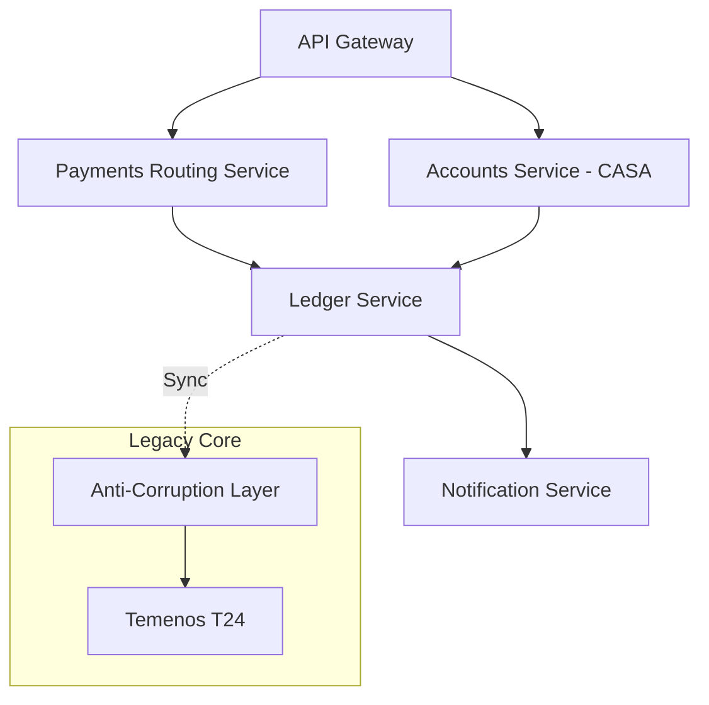
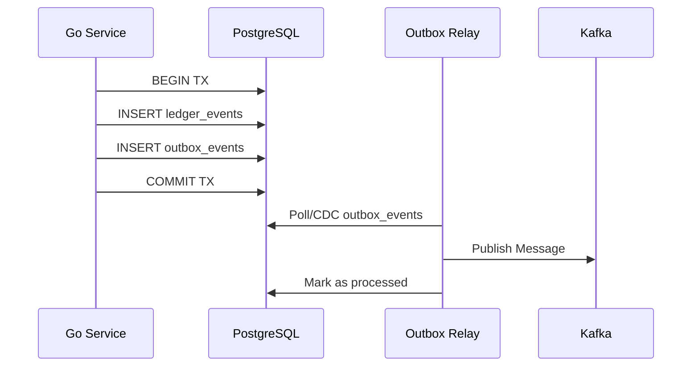

# Banking Microservices in Go: Saga & Event Sourcing

> **Answer-First:** Building resilient banking microservices in Go requires replacing monolithic core systems with double-entry ledger immutability, Transactional Outbox patterns via Kafka, and Temporal Saga orchestration. This architectural combination guarantees strict financial consistency, prevents double-spending, and handles transient payment gateway failures gracefully.

- How to implement transactional outbox pattern to guarantee eventual consistency.
- Saga Orchestration patterns that handle transient payment gateway timeouts gracefully.

## 1. Introduction: Deconstructing the Legacy Core

For decades, legacy banking platforms like Temenos T24 and Oracle FLEXCUBE served as rigid transactional monoliths designed for batch processing. Modern digital banking architectures in 2026 require decomposing these monolithic bottlenecks into event-driven Go microservices capable of processing real-time payments with sub-10ms latency and high throughput.

Migrating to a microservices architecture in 2026 requires dismantling these bottlenecks:
- **Scaling limitations:** Monoliths scale vertically (costly hardware), while microservices scale horizontally.
- **Release cycles:** Legacy cores require massive, risky quarterly releases. Microservices enable independent deployments.
- **Data locking:** Central databases in monoliths create severe lock contention during high-velocity events (like payday processing).

By leveraging Go's highly concurrent runtime and a distributed event-driven architecture, we optimize the system for <10ms database writes at 10,000 TPS, ensuring scalability and fault tolerance.

## 2. Domain Decomposition: Mapping Core Banking Contexts

Deconstructing a core banking monolith into autonomous microservices requires applying the Strangler Fig pattern alongside Domain-Driven Design principles. By defining explicit bounded contexts for Accounts, Payments, and Ledger domains, engineering teams isolate legacy data structures behind Anti-Corruption Layers to ensure independent service scaling and zero-downtime releases.

The domain architecture diagram below illustrates how modern banking microservices decouple from legacy core systems via an Anti-Corruption Layer (ACL). It highlights how API requests flow across Accounts, Payments, and Ledger services while maintaining continuous synchronization with legacy backends:


```mermaid
graph TD
    API[API Gateway] --> Accounts[Accounts Service - CASA]
    API --> Payments[Payments Routing Service]
    Payments --> Ledger[Ledger Service]
    Accounts --> Ledger
    Ledger --> Notifications[Notification Service]
    
    subgraph Legacy Core
        ACL[Anti-Corruption Layer]
        T24[Temenos T24]
        ACL --> T24
    end
    
    Ledger -.Sync.-> ACL
```

Each service owns its database. The Ledger Service never queries the Accounts database directly; instead, it subscribes to immutable state change events.

## 3. Event Sourcing: Designing the Immutable Double-Entry Ledger

Designing an immutable financial ledger requires replacing mutable balance columns with append-only event streams that log every credit and debit transaction. Event sourcing guarantees full audit compliance, eliminates race conditions during concurrent account updates, and provides a mathematically verifiable history essential for modern enterprise banking systems.

### PostgreSQL Write Model DDL

The DDL snippet below defines the core event stream and event log tables in PostgreSQL. This schema enforces Optimistic Concurrency Control (OCC) at the event stream level to prevent concurrent append conflicts:

```sql
CREATE TABLE ledger_streams (
    stream_id UUID PRIMARY KEY,
    version BIGINT NOT NULL,
    updated_at TIMESTAMP WITH TIME ZONE DEFAULT CURRENT_TIMESTAMP
);

CREATE TABLE ledger_events (
    id UUID PRIMARY KEY DEFAULT gen_random_uuid(),
    stream_id UUID NOT NULL REFERENCES ledger_streams(stream_id),
    version BIGINT NOT NULL,
    event_type VARCHAR(100) NOT NULL,
    payload JSONB NOT NULL,
    created_at TIMESTAMP WITH TIME ZONE DEFAULT CURRENT_TIMESTAMP,
    CONSTRAINT uq_stream_version UNIQUE (stream_id, version)
);
```

### The OCC Append Transaction in Go

When appending an event, the system checks the `expected_version` within a database transaction. The following Go code snippet uses `pgx/v5` to execute an optimistic concurrency check before appending ledger events:

```go
// Go repository query using pgx/v5
tx, err := pool.Begin(ctx)
if err != nil {
    return err
}
defer tx.Rollback(ctx)

// 1. Verify and update version
res, err := tx.Exec(ctx, `
    UPDATE ledger_streams 
    SET version = $1, updated_at = NOW() 
    WHERE stream_id = $2 AND version = $3`, 
    expectedVersion+1, streamID, expectedVersion)
if err != nil {
    return err
}
if res.RowsAffected() == 0 {
    return ErrConcurrencyConflict // Version has changed since read
}

// 2. Insert Event
_, err = tx.Exec(ctx, `
    INSERT INTO ledger_events (stream_id, version, event_type, payload) 
    VALUES ($1, $2, $3, $4)`, 
    streamID, expectedVersion+1, eventType, payloadJson)
if err != nil {
    return err
}

return tx.Commit(ctx)
```

To optimize the Go runtime for <10ms database writes at 10,000 TPS, we utilize a transaction-mode PgBouncer pool, NVMe storage, and `synchronous_commit = off` (when business rules tolerate minimal crash delta). For deeper implementation details, read our guide on [double-entry ledger design](/series/core-banking-developer/part-1-double-entry-ledger/).

### Production-Grade Double-Entry Schema

While event sourcing captures the state transitions, a true double-entry ledger requires strict balance verification constraints across asset, liability, equity, revenue, and expense accounts. In double-entry bookkeeping, every financial transaction must have at least one debit and one credit, and the total debits must exactly equal total credits. 

Here is the production-grade PostgreSQL DDL for a normalized, high-performance double-entry ledger. This schema utilizes check constraints to enforce non-negative values and trigger functions to ensure transaction-level balance invariants.

```sql
-- Enforce account categories
CREATE TYPE account_class AS ENUM ('ASSET', 'LIABILITY', 'EQUITY', 'REVENUE', 'EXPENSE');
CREATE TYPE entry_direction AS ENUM ('DEBIT', 'CREDIT');

-- Core Accounts table representing the chart of accounts
CREATE TABLE accounts (
    id UUID PRIMARY KEY DEFAULT gen_random_uuid(),
    code VARCHAR(50) UNIQUE NOT NULL,
    name VARCHAR(255) NOT NULL,
    class account_class NOT NULL,
    currency CHAR(3) NOT NULL DEFAULT 'USD',
    created_at TIMESTAMP WITH TIME ZONE DEFAULT CURRENT_TIMESTAMP
);

-- Journal Entries act as the transactional envelope (header)
CREATE TABLE journal_entries (
    id UUID PRIMARY KEY DEFAULT gen_random_uuid(),
    reference_id UUID UNIQUE, -- External transaction reference (idempotency link)
    narration TEXT NOT NULL,
    posted_at TIMESTAMP WITH TIME ZONE NOT NULL DEFAULT CURRENT_TIMESTAMP,
    created_at TIMESTAMP WITH TIME ZONE DEFAULT CURRENT_TIMESTAMP
);

-- Ledger Lines represent individual postings (lines) within a journal entry
CREATE TABLE ledger_lines (
    id UUID PRIMARY KEY DEFAULT gen_random_uuid(),
    journal_entry_id UUID NOT NULL REFERENCES journal_entries(id) ON DELETE CASCADE,
    account_id UUID NOT NULL REFERENCES accounts(id),
    amount NUMERIC(20, 4) NOT NULL CHECK (amount > 0),
    direction entry_direction NOT NULL,
    -- Simple hash chaining column for tamper-evident auditing
    line_hash BYTEA,
    created_at TIMESTAMP WITH TIME ZONE DEFAULT CURRENT_TIMESTAMP
);

-- Create compound index for fast ledger line reconciliation and account balance calculation
CREATE INDEX idx_ledger_lines_account_posted ON ledger_lines(account_id, created_at DESC);
CREATE INDEX idx_ledger_lines_journal_entry ON ledger_lines(journal_entry_id);
```

To enforce the double-entry invariant (sum of debits equals sum of credits within a transaction), we use a deferred constraint check or a statement-level trigger. Below is the PostgreSQL trigger function that verifies balance integrity before committing:

```sql
CREATE OR REPLACE FUNCTION verify_journal_entry_balance()
RETURNS TRIGGER AS $$
DECLARE
    v_debit_sum NUMERIC(20, 4);
    v_credit_sum NUMERIC(20, 4);
BEGIN
    -- Calculate sum of debits and credits for the current journal entry
    SELECT 
        COALESCE(SUM(amount) FILTER (WHERE direction = 'DEBIT'), 0),
        COALESCE(SUM(amount) FILTER (WHERE direction = 'CREDIT'), 0)
    INTO v_debit_sum, v_credit_sum
    FROM ledger_lines
    WHERE journal_entry_id = NEW.journal_entry_id;

    IF v_debit_sum <> v_credit_sum THEN
        RAISE EXCEPTION 'Double-entry balance mismatch for journal entry %. Total debits (%) must equal total credits (%).', 
            NEW.journal_entry_id, v_debit_sum, v_credit_sum;
    END IF;

    RETURN NEW;
END;
$$ LANGUAGE plpgsql;

-- Apply the trigger as a constraint trigger executed at the end of the statement or transaction
CREATE CONSTRAINT TRIGGER trg_enforce_double_entry
AFTER INSERT OR UPDATE ON ledger_lines
DEFERRABLE INITIALLY DEFERRED
FOR EACH ROW
EXECUTE FUNCTION verify_journal_entry_balance();
```

### Transaction Verification Loops

In high-throughput distributed systems, databases can occasionally suffer from silent data corruption, or application-level bugs might bypass constraint checks (e.g., during database migrations or manual interventions). To mitigate this, modern core banking architectures deploy asynchronous **Transaction Verification Loops**.

A Transaction Verification Loop is a background service in Go that continuously audits the ledger in slices (e.g., hourly batches) to verify the mathematical invariants and cryptographic signatures of the ledger entries.

#### Verification Loop Logic
1. **Mathematical Invariant Audit:** The loop executes high-performance analytical queries to ensure that all `ledger_lines` group by `journal_entry_id` sum up to zero (representing `debits - credits = 0`).
2. **Hash-Chain Auditing:** To prevent malicious database tampering (e.g., an internal actor modifying a transaction amount in SQL), each ledger line stores a cryptographic hash of its content combined with the hash of the preceding line (`line_hash` of line `N` is `SHA256(amount + direction + account_id + journal_entry_id + line_hash_of_N-1)`). The verification loop walks this hash chain to verify its integrity.
3. **Reconciliation Loop:** It reconciles the ledger-line balances against external records (such as payment gateway reports or Kafka event streams).

Here is a Go implementation snippet of the mathematical audit query run by the verification loop:

```go
type ReconciliationFailure struct {
    JournalEntryID uuid.UUID
    DebitSum       decimal.Decimal
    CreditSum      decimal.Decimal
}

func RunVerificationLoop(ctx context.Context, db *pgxpool.Pool, interval time.Duration) {
    ticker := time.NewTicker(interval)
    defer ticker.Stop()

    for {
        select {
        case <-ctx.Done():
            return
        case <-ticker.C:
            failures, err := auditLedgerInvariants(ctx, db)
            if err != nil {
                log.Printf("Verification loop query failure: %v", err)
                continue
            }
            if len(failures) > 0 {
                for _, f := range failures {
                    log.Printf("CRITICAL: Ledger imbalance detected at journal entry %s: debits=%s, credits=%s", 
                        f.JournalEntryID, f.DebitSum.String(), f.CreditSum.String())
                    // Trigger alert, freeze affected accounts, and page on-call engineers
                }
            }
        }
    }
}

func auditLedgerInvariants(ctx context.Context, db *pgxpool.Pool) ([]ReconciliationFailure, error) {
    // Audit the last 2 hours of transactions to catch trailing edge commits
    query := `
        SELECT 
            journal_entry_id,
            COALESCE(SUM(amount) FILTER (WHERE direction = 'DEBIT'), 0) AS debit_sum,
            COALESCE(SUM(amount) FILTER (WHERE direction = 'CREDIT'), 0) AS credit_sum
        FROM ledger_lines
        WHERE created_at >= NOW() - INTERVAL '2 hours'
        GROUP BY journal_entry_id
        HAVING COALESCE(SUM(amount) FILTER (WHERE direction = 'DEBIT'), 0) <> 
               COALESCE(SUM(amount) FILTER (WHERE direction = 'CREDIT'), 0)
    `
    rows, err := db.Query(ctx, query)
    if err != nil {
        return nil, err
    }
    defer rows.Close()

    var failures []ReconciliationFailure
    for rows.Next() {
        var f ReconciliationFailure
        if err := rows.Scan(&f.JournalEntryID, &f.DebitSum, &f.CreditSum); err != nil {
            return nil, err
        }
        failures = append(failures, f)
    }
    return failures, nil
}
```

By separating this verification loop from the hot write path, the system maintains ultra-low transaction commit latencies while guaranteeing cryptographic and mathematical proof of ledger correctness within seconds.

## 4. The Transactional Outbox Pattern: Preventing Dual-Write Failures

Distributing financial transactions across microservices creates dual-write risks where local database updates succeed but message broker publishing fails due to network partitions. Implementing the Transactional Outbox pattern guarantees eventual consistency by persisting outbound event payloads atomically within the primary database before asynchronous relay workers publish them to Kafka.

### Implementation Architecture

The sequence diagram below traces the transactional outbox workflow execution. It demonstrates how local database commits write outbox records atomically before an outbox relay publishes them asynchronously to Kafka:


```mermaid
sequenceDiagram
    participant App as Go Service
    participant DB as PostgreSQL
    participant Worker as Outbox Relay
    participant Broker as Kafka
    
    App->>DB: BEGIN TX
    App->>DB: INSERT ledger_events
    App->>DB: INSERT outbox_events
    App->>DB: COMMIT TX
    Worker->>DB: Poll/CDC outbox_events
    Worker->>Broker: Publish Message
    Worker->>DB: Mark as processed
```

### Go Polling Relay with FOR UPDATE SKIP LOCKED

To safely poll outbox events across multiple parallel Go worker instances without deadlocks, we use PostgreSQL's `FOR UPDATE SKIP LOCKED`. The following Go implementation snippet demonstrates how outbox relay workers select and publish unprocessed events:

```go
func PollOutbox(ctx context.Context, db *pgxpool.Pool, producer sarama.SyncProducer) error {
    tx, err := db.Begin(ctx)
    if err != nil {
        return err
    }
    defer tx.Rollback(ctx)

    // Lock only returned rows, skip already locked rows by other workers
    rows, err := tx.Query(ctx, `
        SELECT id, aggregate_type, event_type, payload 
        FROM outbox_events 
        WHERE processed_at IS NULL 
        ORDER BY created_at ASC 
        LIMIT 50 
        FOR UPDATE SKIP LOCKED`)
    if err != nil {
        return err
    }
    defer rows.Close()

    var eventIDs []uuid.UUID
    for rows.Next() {
        var id uuid.UUID
        var aggType, eventType string
        var payload []byte
        
        if err := rows.Scan(&id, &aggType, &eventType, &payload); err != nil {
            return err
        }
        
        // Publish to Kafka
        _, _, err = producer.SendMessage(&sarama.ProducerMessage{
            Topic: aggType,
            Key:   sarama.StringEncoder(id.String()),
            Value: sarama.ByteEncoder(payload),
        })
        if err != nil {
            return fmt.Errorf("failed to publish: %w", err)
        }
        eventIDs = append(eventIDs, id)
    }

    if len(eventIDs) > 0 {
        _, err = tx.Exec(ctx, `
            UPDATE outbox_events SET processed_at = NOW() WHERE id = ANY($1)`, eventIDs)
        if err != nil {
            return err
        }
    }
    return tx.Commit(ctx)
}
```

## 5. Saga Orchestration: Temporal vs. Dapr for Distributed Transactions

Executing multi-service payment flows without traditional two-phase commit locks requires adopting orchestrated Saga patterns to maintain eventual financial consistency. Engineering teams must evaluate operational trade-offs between Temporal dedicated workflow clusters and Dapr sidecar engines to select the optimal orchestration model for complex, long-running banking transactions.

### Orchestrator Comparison

| Feature | Temporal | Dapr Workflows |
|---------|----------|----------------|
| **Core Architecture** | Dedicated Server/Worker Cluster | Sidecar (Embedded Durable Task Framework) |
| **State Storage** | Dedicated DB (Postgres/Cassandra) | Any Dapr State Store (Redis, CosmosDB) |
| **Operational Overhead**| High (Needs dedicated cluster management) | Low (Reuses existing Dapr infrastructure) |
| **Compliance/Audit** | Native Archival & History Export (S3) | Requires custom audit logging integration |
| **Long-Running Fix** | `Continue-As-New` to avoid event limits | Native Actor state lifecycle |
| **Best Fit** | Complex, multi-day, mission-critical Sagas | Lightweight, integrated Saga compensations |

**Architecture Decision (2026 Core Banking Standard):**
- **Temporal** is required if you need long-term PCI-DSS audit trails, history archival to S3, and process complex multi-day workflows (e.g. mortgage origination). Note that Temporal has a hard event history limit (51,200 events), necessitating the `Continue-As-New` strategy for infinite financial ledgers.
- **Dapr Workflows** are optimal for short-lived Sagas (e.g. cross-service payment transfers) if you already use Dapr for sidecar routing and pub/sub (understanding [Dapr State Store Consistency Trade-offs](/posts/dapr-state-store-consistency-tradeoffs/) is critical here).

### Go Temporal Workflow Code Structure

Temporal executes compensations natively. The following Go workflow snippet shows how to manage compensation stack functions deferred for execution upon transaction failure:

```go
func FinancialTransferSaga(ctx workflow.Context, req TransferRequest) (err error) {
    options := workflow.ActivityOptions{
        StartToCloseTimeout: time.Minute,
        RetryPolicy: &temporal.RetryPolicy{MaximumAttempts: 3},
    }
    ctx = workflow.WithActivityOptions(ctx, options)

    var compensations []func()
    
    // Defer compensation execution
    defer func() {
        if err != nil {
            for _, comp := range compensations {
                comp()
            }
        }
    }()

    // Step 1: Deduct
    err = workflow.ExecuteActivity(ctx, DeductFundsActivity, req).Get(ctx, nil)
    if err != nil {
        return err
    }
    compensations = append(compensations, func() {
        workflow.ExecuteActivity(ctx, RefundFundsActivity, req).Get(ctx, nil)
    })

    // Step 2: Credit
    err = workflow.ExecuteActivity(ctx, CreditTargetActivity, req).Get(ctx, nil)
    if err != nil {
        return err
    }

    return nil
}
```

## 6. Designing Idempotent Payment APIs in Go

Network retries, client timeouts, and duplicate message delivery from Kafka brokers can cause severe double-spending issues if payment endpoints lack strict idempotency safeguards. Building resilient payment APIs requires validating unique request identifiers, acquiring distributed locks, and leveraging database unique constraints to safely handle duplicate transaction submissions.

1. **Check:** The client sends an `Idempotency-Key` header.
2. **Lock:** The Go API attempts to acquire a lock in Redis using a Lua script (`SET NX`).
3. **Database Constraint:** For permanent safety, the idempotency key is inserted into a PostgreSQL `processed_transactions` table with a `UNIQUE` constraint. If another request attempts to insert the same key, PostgreSQL rejects it.

This robust mechanism is fundamentally similar to [H3 geospatial indexing](/series/ride-hailing-realtime-architecture/part-2-geospatial-indexing/) collisions or [Redis caching](/posts/graphhopper-distance-matrix-production-guide/) optimizations—you must assume distributed networks will duplicate data.

## 7. Observability: OpenTelemetry in Distributed Ledgers

Tracing complex payment transactions across asynchronous message brokers and microservices requires propagating distributed context headers through every event payload. Implementing OpenTelemetry carriers in Go allows engineering teams to track end-to-end transaction lifecycles, monitor latency metrics, and quickly isolate failures across event-driven ledger infrastructure.

When using `segmentio/kafka-go`, native OpenTelemetry middleware is unavailable. The Go struct snippet below implements a custom `TextMapCarrier` to inject and extract OpenTelemetry trace context headers into Kafka message headers:

```go
type KafkaHeaderCarrier struct {
    Headers *[]kafka.Header
}

func (c *KafkaHeaderCarrier) Get(key string) string {
    for _, h := range *c.Headers {
        if h.Key == key {
            return string(h.Value)
        }
    }
    return ""
}

func (c *KafkaHeaderCarrier) Set(key, value string) {
    *c.Headers = append(*c.Headers, kafka.Header{
        Key:   key,
        Value: []byte(value),
    })
}

func (c *KafkaHeaderCarrier) Keys() []string {
    keys := make([]string, len(*c.Headers))
    for i, h := range *c.Headers {
        keys[i] = h.Key
    }
    return keys
}
```

By explicitly passing this carrier during message publishing and consumption, the transaction ID flows continuously through the entire architecture, providing crucial data for incident resolution.

---

## Frequently Asked Questions

Addressing common technical questions regarding double-entry event sourcing, transactional outbox implementations, Saga orchestrators, and idempotent payment API design helps engineering teams build resilient banking platforms. The following answers detail key operational principles required for developing mission-critical fintech services in Go.

### Q1: How does Event Sourcing ensure double-entry audit compliance in banking microservices?
Event Sourcing stores every financial operation as an immutable sequence of events (credits and debits) in a ledger stream, rather than updating a mutable balance column. This provides a cryptographically verifiable and irreversible audit trail required by financial regulators.

### Q2: Why is the Transactional Outbox pattern required instead of direct Kafka publishes?
If a service updates the database and then directly publishes to Kafka, a network failure during the publish creates a dual-write inconsistency (database updated, downstream services unaware). The Outbox pattern writes the event to the same database in the same transaction, guaranteeing at-least-once delivery.

### Q3: How do you design an idempotent payment API in Go to prevent double-charging?
By implementing a Key-Check-Execute pattern. Clients provide an Idempotency-Key. Go checks a Redis cache (via `SET NX` locks) and enforces uniqueness through a PostgreSQL `UNIQUE` index constraint on a `processed_transactions` table to reject duplicate requests.

### Q4: What is the performance difference between Dapr and Temporal for banking Saga orchestration?
Temporal requires a dedicated server cluster and provides immense throughput for long-running workflows, but has high operational overhead and history limits. Dapr Workflows embed a Durable Task Framework directly into the application sidecar, reducing gRPC overhead and cluster management, making it faster for simple, short-lived Sagas.


