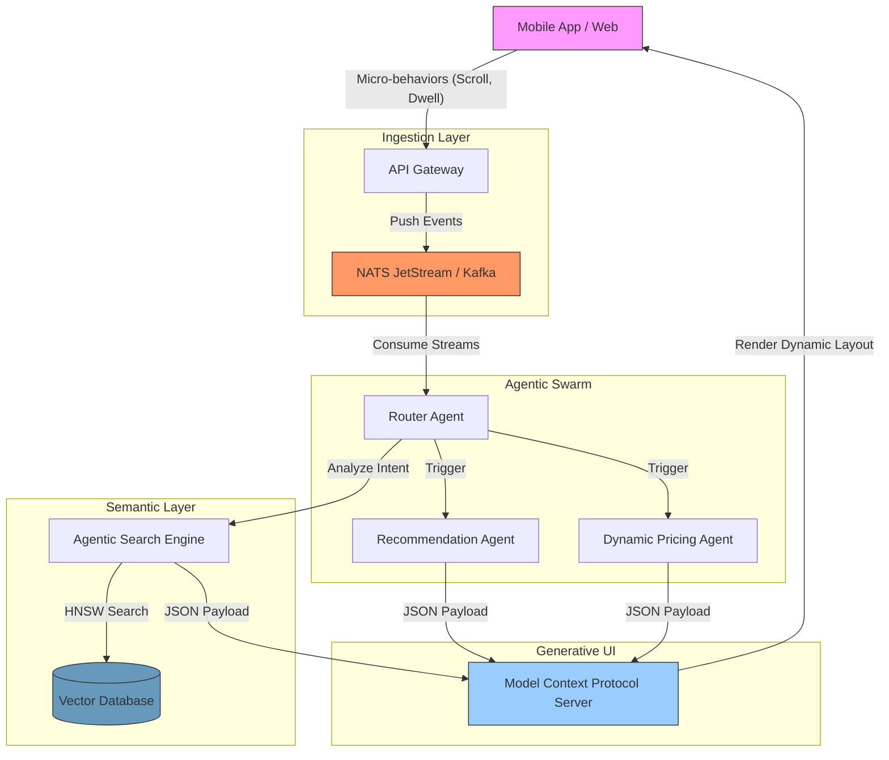

The **Quick Commerce (Q-Commerce)** race to deliver groceries in 15-30 minutes has officially hit its physical ceiling. As growth expert Lê Thanh Hải (Henry) recently [pointed out on LinkedIn](https://www.linkedin.com/pulse/beyond-quick-commerce-sau-cu%E1%BB%99c-%C4%91ua-giao-h%C3%A0ng-15-ph%C3%BAt-h%E1%BA%A3i-henry--qerfc/), platforms cannot demand drivers to go any faster without destroying Unit Economics or compromising safety. 

Consequently, burning cash on the Physical Layer (Logistics) is yielding diminishing marginal returns. The next battleground isn't on the streets; it's on the Digital Layer: **How do you "read" a customer in the first 15 seconds they open your App?**

This is no longer a challenge for business analysts—it is a massive System Architecture challenge.

---

## 1. The 15-Second Window

**The first 15 seconds is the maximum reflex window for an E-commerce system to collect micro-signals (scrolls, dwell time) and deploy Agentic AI to restructure the UI before the user drops off.**

In the first 15 seconds, an average user performs about 3-5 scrolls and 1-2 taps. For a traditional Data Warehouse (batch processing overnight), this data is meaningless until... the next day.

But in the era of **Agentic Engineering**, those 15 seconds contain a wealth of micro-behavioral signals:
- **Scroll velocity:** Fast (rushing to find a familiar meal) or slow (leisurely browsing for a new restaurant).
- **Dwell time:** The finger hovering over an image of "Fried Chicken" longer than "Salad".
- **Contextual History:** It's Friday evening, raining, with a historically high budget.

To react to these signals and instantaneously restructure the App interface, the End-to-end Latency must be **< 500ms**. A traditional Monolithic architecture backed by a standard RDBMS will inevitably collapse under this pressure.

---

## 2. The 15-Second Architecture Blueprint

**The 15-second intelligence system requires an Event-driven architecture and an Autonomous Agentic Swarm divided into 4 specialized layers to achieve sub-500ms E2E latency.**

To achieve real-time reflex speeds, the system must be decoupled into 4 specialized layers, shifting entirely from synchronous processing to Event-driven Architecture and Autonomous Agentic AI.

### Layer 1: The Ingestion Layer
How do you catch millions of micro-events per second without crashing the servers? The architecture absolutely requires high-throughput Message Brokers. We do not write directly to a database; we push behavioral data as Streams.
👉 *Read more:* [Building High-Throughput Event-Driven Microservices with Go, NATS JetStream & CQRS](/posts/building-high-throughput-event-driven-microservices-go-nats-jetstream-cqrs/)

### Layer 2: The Semantic Layer
A customer searches for "Netflix movie snacks". A traditional system searches for the keyword "snack". An Agentic system converts the phrase into a multi-dimensional Vector to find hidden attributes: *crispy, spicy, combo, Coca-Cola*.
👉 *Read more:* [Architecting Agentic E-commerce Search with Golang & Vector Databases](/posts/agentic-ecommerce-search-golang-vector-databases/)

### Layer 3: The Agentic Swarm Layer
Routing the entire data stream through a single massive LLM (like GPT-4) is a latency disaster (> 5s). The solution is an AI Swarm. One lightweight Agent acts as the Router, another handles pricing, and another manages recommendations. They operate concurrently.
👉 *Read more:* [Deploying an Autonomous AI Swarm with OpenClaw and LiteLLM](/posts/deploying-autonomous-ai-swarm-openclaw-litellm/)

### Layer 4: The Generative UI Layer
This is the final touchpoint. Once the Swarm concludes the customer's Intent, the App does not reload a static layout. Through the Model Context Protocol (MCP), the Frontend "redraws" itself. A user in a rush will see a massive "Reorder Last Cart" button. A relaxed user will see "Video Reviews" at the top.
👉 *Read more:* [Generative UI with MCP: The AI-Native Frontend Architecture](/posts/generative-ui-with-mcp-ai-native-frontend/)

---

## 3. The CTO's Challenge: Cost & Observability

**To deploy an Agentic System at scale, CTOs must solve inference costs by self-hosting Small Language Models (SLMs) and ensure LLM observability via OpenTelemetry.**

The vision of 15-Second Intelligence is highly promising, but from a CTO's perspective, it introduces two brutal challenges:

1. **LLM Inference Costs:** Calling OpenAI/Anthropic APIs for *every 15 seconds of scrolling* across 5 million DAU (Daily Active Users) will bankrupt you in a week. The most pragmatic solution is self-hosting Small Language Models (SLMs) like Llama 3 8B on private inference infrastructure.
   *(Deep Dive: [High-Throughput Local LLM Infrastructure with vLLM and Golang Gateway](/posts/high-throughput-local-llm-infrastructure-vllm-golang-gateway/))*
2. **Observability:** How do you debug when an AI Agent hallucinates and suggests the wrong product price? OpenTelemetry for LLM Tracing is a mandatory standard before pushing any Agentic System to Production.
   *(Deep Dive: [Production AI Observability: OpenTelemetry & Golang LLM Tracing](/posts/production-ai-observability-opentelemetry-golang-llm-tracing/))*

## Frequently Asked Questions (FAQ)

**1. Why is Quick Commerce dying?**
Quick Commerce (15-30 minute delivery) has reached its physical and financial limits. Pushing for faster delivery destroys Unit Economics (resulting in negative margins per order) and increases traffic safety risks, leading to unsustainable business models.

**2. What is an E-commerce Agentic System?**
It is a commerce platform powered by Autonomous AI Agents that analyze a customer's context and intent in real-time. It automatically adjusts pricing, curates product recommendations, and personalizes the frontend interface without human intervention.

**3. How does Generative UI work in retail?**
Generative UI uses frameworks like the Model Context Protocol (MCP) to allow AI to dictate the frontend layout directly. Instead of a static interface, the App dynamically morphs—showing a massive "Reorder" button for users in a rush, or "Video Reviews" for relaxed browsers.

---

## Conclusion

The E-commerce war is no longer about who can deliver faster using motorbikes; it's about whose system can "think" faster using data. By combining **Agentic AI, Vector Search, and Event-driven Microservices**, enterprises can build a real-time customer intelligence infrastructure—moving far beyond the limitations of traditional Quick Commerce.
