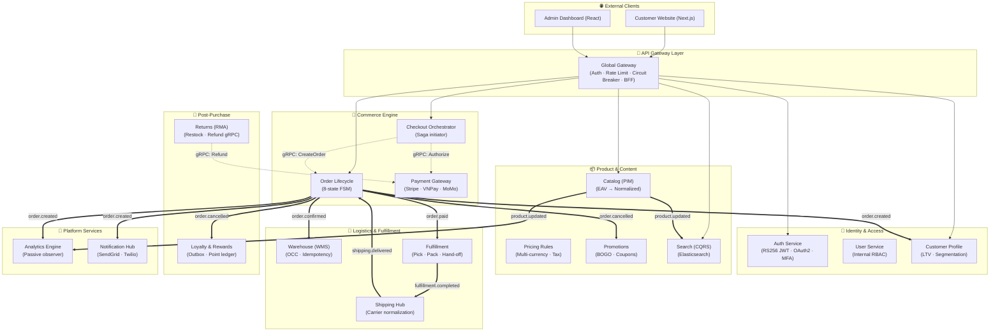
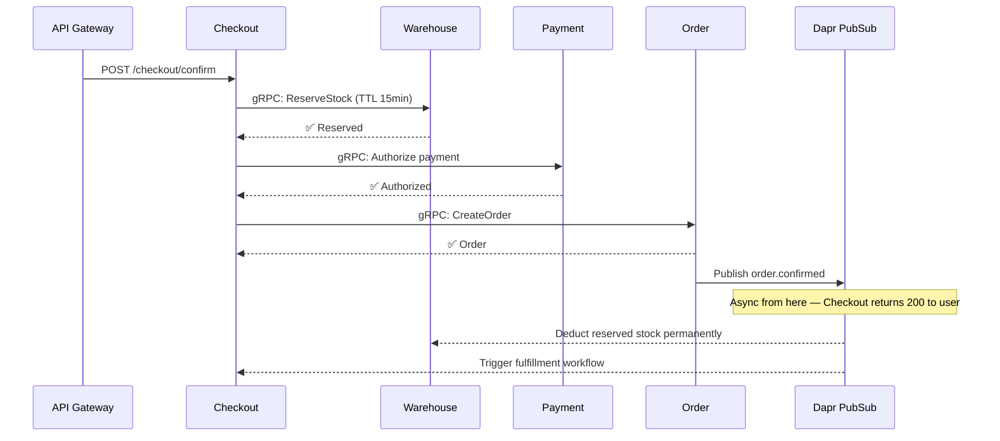
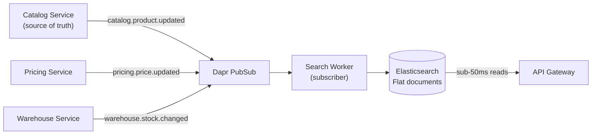

When transitioning from a monolithic platform to a distributed microservice setup, the hardest question isn't "How do we write the code?" — it's "How do these moving parts talk to each other safely, and why is each boundary drawn exactly where it is?"

This post is the architectural anchor for the full composable commerce series. It presents the complete system blueprint and explains the reasoning behind each domain boundary. For deep-dives into specific layers, each section links to the dedicated post in the series.

## The 6 Business Domains

Before drawing a single line in a diagram, we bounded the ecosystem around **Domain-Driven Design (DDD)** principles. Every domain owns its own Postgres database. No cross-domain queries. Communication is exclusively through events or explicit gRPC contracts.

The 6 domains and their 21 services:

| Domain | Services | Owns |
| :--- | :--- | :--- |
| **Commerce Flow** | Checkout, Order, Payment | The money path — highest criticality |
| **Product & Content** | Catalog, Pricing, Promotion, Search | Read-heavy, sub-50ms latency |
| **Logistics** | Warehouse, Fulfillment, Shipping | Physical world integration |
| **Post-Purchase** | Returns, Loyalty | Customer retention after delivery |
| **Identity & Access** | Auth, User, Customer | Security boundary between internal staff and external customers |
| **Platform Operations** | Gateway, Analytics, Notification | Shared infrastructure utilities |

The reasoning behind separating **User** from **Customer** is worth stating explicitly: internal employees and external buyers have fundamentally different access patterns, data structures, and compliance requirements. Merging them creates a schema that serves neither well and creates a security surface where an internal RBAC bug could expose customer PII.

For the full breakdown of each service's responsibilities, see [Deconstructing the Ecosystem: Service Details by Domain](/posts/deconstructing-ecommerce-service-details-domain/).

## The High-Level Architecture

*Solid lines = synchronous HTTP/gRPC. Double lines (`==>`) = asynchronous events via Dapr PubSub.*

## Traffic Anatomy: Three Distinct Flows

### Flow 1 — The Gateway Shield (Read Path)

All external traffic enters through the **API Gateway**. The Gateway enforces:
- **JWT validation** — offloaded from downstream services; every request is authenticated at the edge
- **Rate limiting** — IP-based and user-based, protecting against scraping and checkout abuse
- **Circuit breaking** — if the Catalog service is degraded, the Gateway fails fast rather than stacking requests

Read-heavy operations (product listing, search, user profile) resolve here with sub-50ms latency because the Search service maintains a pre-indexed Elasticsearch CQRS read model, updated in near real-time via events from Catalog and Pricing.

### Flow 2 — The Checkout Saga (Write Path)

The most critical and complex flow. When a customer checks out:

Failure handling uses **Compensating Transactions**: if the Payment service declines the card after stock is reserved, the Checkout service triggers `checkout.failed`. The Warehouse service listens for this event and releases the reserved stock. No long-lived database transactions, no connection pool exhaustion under load.

For the complete implementation — including the Optimistic Concurrency Control SQL for inventory race conditions and the idempotency key pattern — see [Architecting a 21-Service E-commerce Ecosystem with Golang & DDD](/posts/architecting-21-service-ecommerce-golang-ddd/).

### Flow 3 — The Async Event Mesh (Post-Checkout)

Once `order.paid` fires into the Dapr event mesh, synchronous execution terminates from the customer's perspective. Downstream services run in parallel:

- **Warehouse** decrements permanently reserved stock
- **Fulfillment** triggers the pick-pack-ship workflow
- **Analytics** increments revenue dashboards
- **Customer** updates LTV and purchase history
- **Notification** fires the order confirmation email/SMS

A failure in any of these services (Notification is unreachable, Analytics is slow) does not affect the customer's checkout experience or the order record. Isolation is enforced at the infrastructure level — each service owns its own database.

For the Dapr event naming conventions, Dead Letter Queue patterns, and idempotency design, see [Mastering Event-Driven Architecture with Dapr Pub/Sub](/posts/mastering-event-driven-architecture-dapr/).

## The CQRS Pattern for Search

Product search deserves special attention because it solves a problem that Magento's EAV model struggles with at scale: **joining 5+ tables at query time to render a single product listing is too slow.**

The Search service maintains an Elasticsearch read model that is rebuilt from events, not queried from the source database:

When the Catalog team updates a product, they write to their own Postgres database and publish `catalog.product.updated`. The Search Worker receives the event and rebuilds the Elasticsearch document for that SKU — merging current price from the Pricing service and current stock from the Warehouse service into a single flat document.

No cron jobs. No full reindex. No stale data windows. Catalog, Pricing, and Warehouse each own their domain data; Search owns the read projection.

## The Deployment Layer

The full 21-service platform is deployed via GitOps using ArgoCD with Kustomize overlays. No engineer touches the production cluster directly — all changes flow through Git, and ArgoCD enforces drift prevention via `selfHeal: true` on all production Applications.

For the complete GitOps setup — including the App-of-Apps pattern, Kustomize base/overlay structure, and the `git revert` rollback playbook — see [GitOps at Scale: Orchestrating 21 Microservices with Kubernetes & ArgoCD](/posts/gitops-at-scale-kubernetes-argocd-microservices/).

## Why Not a Distributed Monolith?

The most common failure mode when teams adopt microservices is building a **Distributed Monolith**: services that are deployed separately but remain tightly coupled through synchronous HTTP chains, shared databases, or shared deployment pipelines.

The architecture above avoids this through three hard rules:
1. **No cross-domain database access** — ever. If the Order service needs product data, it either holds a denormalized copy or calls the Catalog service's gRPC API.
2. **No synchronous calls in the async event path** — once an event enters the Dapr mesh, it is processed independently. Event consumers do not call back into the producer.
3. **No shared deployment pipelines** — each service has its own ArgoCD Application, its own container registry path, and its own release cycle. A bug in the Loyalty service cannot block a Checkout release.

For the full argument on when this complexity is justified — and when it isn't — see [Why You Should Migrate from Magento to Microservices (And When You Shouldn't)](/posts/why-migrate-magento-to-microservices/).

## Series Navigation

| Post | What it covers |
| :--- | :--- |
| **This post** | Full system blueprint, domain boundaries, traffic flows |
| [Service Details by Domain](/posts/deconstructing-ecommerce-service-details-domain/) | Each service's responsibilities and ownership |
| [Golang DDD Deep-Dive](/posts/architecting-21-service-ecommerce-golang-ddd/) | Kratos clean arch, Saga implementation, OCC, idempotency |
| [Event-Driven with Dapr](/posts/mastering-event-driven-architecture-dapr/) | Naming conventions, Saga pattern, DLQ design |
| [GitOps with ArgoCD](/posts/gitops-at-scale-kubernetes-argocd-microservices/) | App-of-Apps, Kustomize overlays, rollback playbook |
| [Magento to Microservices: Why](/posts/why-migrate-magento-to-microservices/) | Decision framework: when to migrate, when not to |
| [Magento to Microservices: How](/posts/moving-from-magento-to-microservices/) | 3-phase Strangler Fig, Debezium CDC, bidirectional sync |


