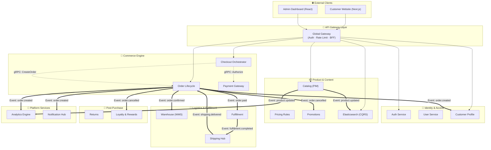

When transitioning off a monolithic platform (like Magento) to a distributed microservice setup, the hardest question isn't "How do we write the code?", but rather "How do these moving parts talk to each other safely?"

In this post, I want to share the visual blueprint of the E-commerce ecosystem I've architected. It's built on top of 21 isolated Go microservices (using Kratos v2) and managed completely via GitOps (ArgoCD) on Kubernetes.

### The High-Level Architecture Diagram

Before diving into the narrative, let's look at the holistic system design. The traffic cascades from external clients down through a tightly secured API Gateway, into bounded domain clusters, and ultimately resolves via asynchronous Dapr PubSub event streams.

*Note: Solid lines represent synchronous external/internal HTTP/gRPC traffic. Dotted double-lines (`==>`) represent asynchronous Event-Driven pub/sub paths via Dapr.*

### Anatomy of the Traffic Flow

#### 1. The Gateway Shield (BFF)
Everything begins at the API Gateway. External clients never speak directly to our downstream services. The Gateway acts as a **Backend For Frontend (BFF)**. It intercepts traffic to handle JWT token validation (offloading the `Auth` service), enforces strict IP-based rate limiting, and implements Circuit Breakers. If a downstream service is struggling, the Gateway fails fast rather than overwhelming the cluster.

#### 2. Synchronous Core (REST / gRPC)
Read-heavy operations (like browsing the `Catalog` or searching via the `Search` service) are executed via highly-optimized synchronous REST/gRPC calls. When a user queries products, the request hits the Gateway and is evaluated directly against an Elasticsearch CQRS read-model to ensure sub-50ms latency.

#### 3. Asynchronous Magic (Dapr PubSub)
The true power of this architecture sits in the post-checkout workflow. 
Once the `Checkout Orchestrator` finalizes a cart, it synchronously tells the `Order` service to create a ledger entry. From here, **synchronous execution terminates**. 
The `Order` service fires an asynchronous `order.paid` event into the Dapr broker. 
Parallel consumer workers in `Warehouse`, `Fulfillment`, and `Analytics` ingest this event simultaneously. They reserve stock, print shipping labels, and increment revenue dashboards without ever talking to each other. 

By isolating traffic into distinct synchronous reads and asynchronous distributed writes, we've achieved a platform that theoretically cannot suffer from a single-point-of-failure domino effect.

*In my next post, I'll break down exactly what each of these Bounded Contexts does, and why we segregated the databases.*


