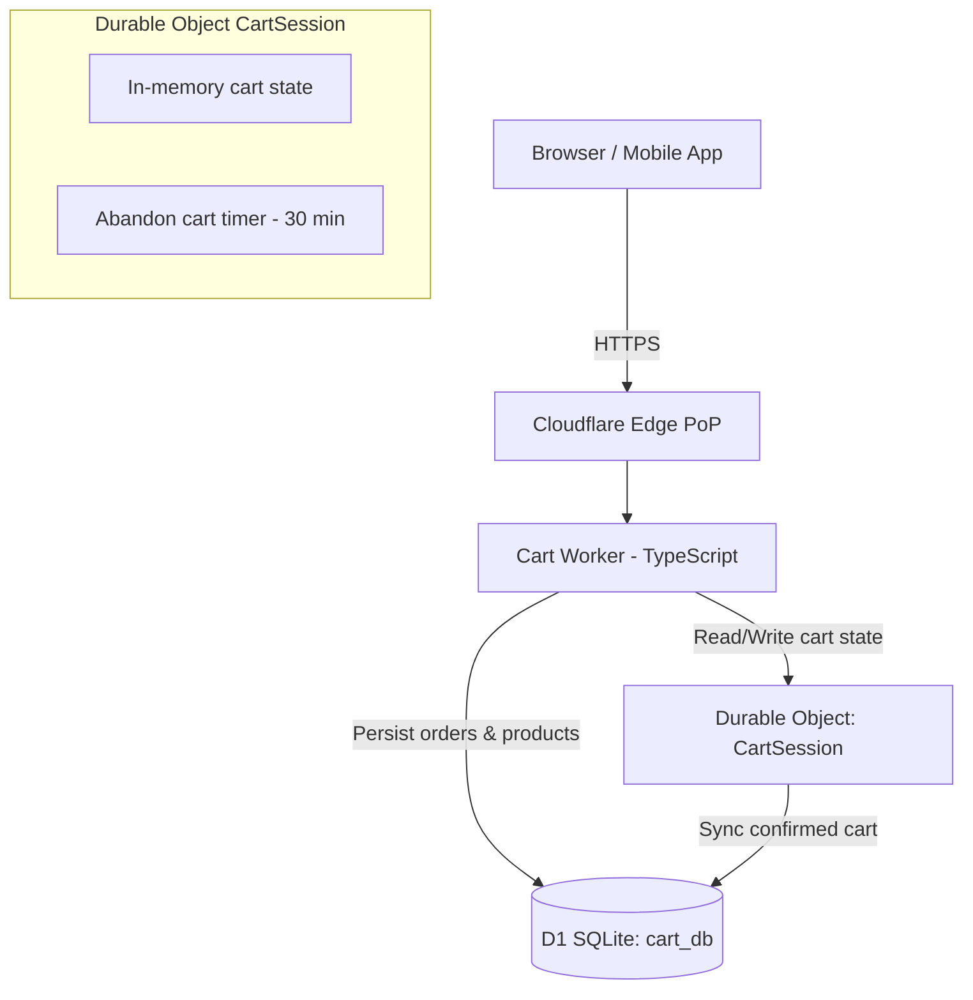

# Cloudflare D1 + Durable Objects: Building a Real-Time Cart

**Answer-first:** Combining Cloudflare Durable Objects for single-point state coordination with D1 SQL for persistent storage eliminates database lock contention and Redis cache invalidation overhead, delivering sub-10ms real-time cart synchronization for e-commerce.

### What You'll Learn That AI Won't Tell You
- How to design cart locking mechanisms in Durable Objects without deadlocks.
- Tuning sub-request allocations to stay within Cloudflare's free-tier runtime boundaries.


> 

The traditional shopping cart architecture is a familiar set of tradeoffs: Redis for session storage, PostgreSQL for order data, and a backend API tier that coordinates between them. It works, but it introduces latency proportional to the distance between the user and your datacenter, requires operational overhead for Redis cluster management, and struggles with globally concurrent cart edits from the same user across multiple devices.

Cloudflare Workers + D1 + Durable Objects offer a fundamentally different model: edge-native computation that runs in 300+ locations worldwide, a serverless SQLite database replicated globally (D1), and Durable Objects that provide strongly consistent real-time state for each cart — without a single coordinating server.

This post walks through building a production-grade shopping cart using this stack: the D1 schema, the Workers API for cart operations, and Durable Objects for handling concurrent cart edits from multiple browser tabs.

For the architectural foundation, see [Serverless E-Commerce: Cloudflare Workers & D1 Architecture](/posts/serverless-ecommerce-cloudflare-d1/). For the broader edge architecture context including Astro SSR and R2 storage, see [Astro on Cloudflare: Full-Stack Edge Architecture](/posts/deploying-astro-on-cloudflare-full-stack-edge-architecture/).

---

## Why Cloudflare Workers + D1 Is a Game-Changer for Edge E-Commerce

Traditional e-commerce cart APIs have a latency floor: **the round trip from the user's browser to your datacenter**. A user in Ho Chi Minh City hitting a server in Singapore adds 20–30ms of irreducible network latency per API call. A user in Jakarta hitting a server in the US adds 150–200ms.

Cloudflare Workers eliminate this floor by running your API logic at the Cloudflare edge PoP nearest to the user — typically 5–20ms from any populated city globally. D1 provides SQLite-backed persistent storage with automatic replication, and Durable Objects provide a single-instance coordination layer per cart that guarantees consistency for concurrent updates.

### When This Architecture Makes Sense

✅ **Good fit:**
- E-commerce sites serving geographically diverse users (Southeast Asia, global DTC)
- Cart workloads with high read-to-write ratios (many page views, fewer add-to-cart events)
- Teams that want to eliminate Redis and session server operational overhead
- JAMstack or Astro frontends already deployed on Cloudflare Pages

❌ **Poor fit:**
- Checkout flows requiring deep integration with on-premise ERP systems (D1 cannot connect to your internal network)
- Platforms with complex multi-warehouse inventory that requires a full OLTP database
- Applications that exceed D1's row-level limits (D1 database size cap is currently 10 GB per database)

---

## Architecture: Pairing Durable Objects (State) with D1 (Persistence)

## Architecture Overview: D1 for Persistence, Durable Objects for Real-Time State



**D1 is the source of truth** for products, sessions, and confirmed cart states. **Durable Objects** are the hot path for real-time cart mutations — they hold the current cart state in memory and handle concurrent updates with strong consistency, then asynchronously flush the final state to D1 when the cart is confirmed or when a persistence checkpoint is needed.

This separation means that adding an item to the cart (a sub-1ms Durable Object memory write) is decoupled from the D1 write (a durable SQLite write) — giving you the responsiveness of in-memory operations with the durability of a relational store. For teams running a full microservices e-commerce stack alongside this edge cart, see [Architecting a 21-Service E-Commerce Ecosystem in Go](/posts/architecting-21-service-ecommerce-golang-ddd/) for how the cart integrates with inventory, order, and payment services via DDD boundaries.

---

## The D1 Cart Schema: Products, Cart Items, and Sessions

Create the D1 database and apply the schema:

```bash
# Create the D1 database
wrangler d1 create cart-db

# Apply schema migrations
wrangler d1 execute cart-db --local --file=./schema.sql
```

```sql
-- schema.sql

CREATE TABLE products (
    id          TEXT PRIMARY KEY,           -- UUID
    sku         TEXT NOT NULL UNIQUE,
    name        TEXT NOT NULL,
    price_cents INTEGER NOT NULL,           -- Store cents to avoid floating-point errors
    stock       INTEGER NOT NULL DEFAULT 0,
    image_url   TEXT,
    created_at  DATETIME DEFAULT CURRENT_TIMESTAMP
);

CREATE TABLE cart_sessions (
    id            TEXT PRIMARY KEY,         -- Session UUID (stored in cookie)
    user_id       TEXT,                     -- NULL for anonymous carts
    status        TEXT NOT NULL DEFAULT 'active',  -- active | abandoned | checked_out
    expires_at    DATETIME NOT NULL,
    created_at    DATETIME DEFAULT CURRENT_TIMESTAMP,
    updated_at    DATETIME DEFAULT CURRENT_TIMESTAMP
);
CREATE INDEX idx_cart_sessions_user ON cart_sessions(user_id) WHERE user_id IS NOT NULL;

CREATE TABLE cart_items (
    id          INTEGER PRIMARY KEY AUTOINCREMENT,
    cart_id     TEXT NOT NULL REFERENCES cart_sessions(id) ON DELETE CASCADE,
    product_id  TEXT NOT NULL REFERENCES products(id),
    quantity    INTEGER NOT NULL CHECK (quantity > 0),
    price_cents INTEGER NOT NULL,           -- Snapshot price at add-to-cart time
    added_at    DATETIME DEFAULT CURRENT_TIMESTAMP,
    UNIQUE (cart_id, product_id)            -- One row per product per cart
);
CREATE INDEX idx_cart_items_cart ON cart_items(cart_id);

-- Price snapshot is stored at add-to-cart time to handle price changes
-- between cart addition and checkout without affecting the user's cart total
```

**Key design decisions:**
- **Prices stored as cents (integers)**: Eliminates floating-point rounding errors in financial calculations
- **Price snapshot at add-to-cart**: Captures the price at the moment the user added the item, so price changes don't retroactively affect the cart total
- **`UNIQUE (cart_id, product_id)`**: Prevents duplicate cart items at the database level — quantity updates are `INSERT OR REPLACE` operations

---

## Building the Cart Worker: Add, Remove, and Quantity Update Endpoints

The Cart Worker is a TypeScript Cloudflare Worker that handles the API surface:

```typescript
// src/index.ts
import { CartDurableObject } from './cart-do';

export { CartDurableObject };

export interface Env {
    CART_DB: D1Database;
    CART_DO: DurableObjectNamespace;
    CART_COOKIE_SECRET: string;
}

export default {
    async fetch(request: Request, env: Env): Promise<Response> {
        const url = new URL(request.url);
        
        // Route cart operations to the appropriate handler
        if (url.pathname.startsWith('/api/cart')) {
            return handleCartRequest(request, env);
        }
        
        return new Response('Not Found', { status: 404 });
    }
};

async function handleCartRequest(request: Request, env: Env): Promise<Response> {
    // Resolve or create the cart session from the cookie
    const cartId = getOrCreateCartId(request);
    
    // Get the Durable Object for this cart session
    // The DO ID is derived from the cartId — same cartId = same DO instance globally
    const doId = env.CART_DO.idFromName(cartId);
    const cartDO = env.CART_DO.get(doId);
    
    // Forward the request to the Durable Object
    const doResponse = await cartDO.fetch(request);
    
    // Set/refresh the cart session cookie
    const response = new Response(doResponse.body, doResponse);
    response.headers.append('Set-Cookie', 
        `cart_id=${cartId}; HttpOnly; Secure; SameSite=Strict; Max-Age=2592000; Path=/`
    );
    
    return response;
}

function getOrCreateCartId(request: Request): string {
    const cookies = parseCookies(request.headers.get('Cookie') || '');
    return cookies['cart_id'] ?? crypto.randomUUID();
}

function parseCookies(cookieHeader: string): Record<string, string> {
    return Object.fromEntries(
        cookieHeader.split(';')
            .map(c => c.trim().split('='))
            .filter(parts => parts.length === 2)
            .map(([k, v]) => [k.trim(), decodeURIComponent(v.trim())])
    );
}
```

---

## Handling High-Concurrency Cart Updates Without Lock Contention

## Durable Objects for Real-Time Sync: Handling Concurrent Cart Edits

The Durable Object is the heart of the real-time cart (and a key component of [Zero-DevOps E-Commerce with Cloudflare]()). It maintains the cart state in memory and handles concurrent requests with JavaScript's single-threaded execution model — eliminating the need for locks.

### TypeScript Durable State Structure

In Durable Objects, the state is persisted using a key-value store exposed via `this.ctx.storage`. Because JavaScript's native `Map` object does not serialize to JSON (it serializes to an empty object `{}`), developers must define a serializable representation of the state for storage operations.

Below is the structured TypeScript schema for a production cart state. It includes metadata for cart validation, applied promotional coupons, and helper methods to convert the in-memory state to a serializable payload:

```typescript
// Define the structure of a single cart item
export interface CartItem {
  productId: string;
  sku: string;
  name: string;
  priceCents: number;
  quantity: number;
  addedAt: number;
}

// Define the structure of applied discounts
export interface CouponDiscount {
  code: string;
  discountCents: number;
  type: "percentage" | "fixed_amount";
  value: number;
}

// The complete state structure stored in the Durable Object's memory
export interface DurableCartState {
  userId: string | null;
  items: Map<string, CartItem>; // In-memory map for O(1) lookups
  coupon: CouponDiscount | null;
  currency: string;
  lastUpdated: number;
  version: number;
}

// The JSON-serializable structure used for persisting to this.ctx.storage
export interface SerializableCartState {
  userId: string | null;
  items: [string, CartItem][]; // Converted to tuples for JSON safety
  coupon: CouponDiscount | null;
  currency: string;
  lastUpdated: number;
  version: number;
}

// Helper function to serialize the in-memory state for storage
export function serializeCartState(state: DurableCartState): SerializableCartState {
  return {
    userId: state.userId,
    items: Array.from(state.items.entries()),
    coupon: state.coupon,
    currency: state.currency,
    lastUpdated: state.lastUpdated,
    version: state.version,
  };
}

// Helper function to deserialize the stored state back into memory
export function deserializeCartState(stored: SerializableCartState): DurableCartState {
  return {
    userId: stored.userId,
    items: new Map<string, CartItem>(stored.items),
    coupon: stored.coupon,
    currency: stored.currency,
    lastUpdated: stored.lastUpdated,
    version: stored.version,
  };
}
```

By explicitly defining `SerializableCartState` using an array of entries (`[string, CartItem][]`), we guarantee that the `Map` contents are preserved accurately during `this.ctx.storage.put()` operations without silent data loss.

```typescript
// src/cart-do.ts

import { DurableObject } from 'cloudflare:workers';

interface CartItem {
    productId: string;
    quantity: number;
    priceCents: number;
    name: string;
}

interface CartState {
    items: Map<string, CartItem>;
    lastUpdated: number;
}

export class CartDurableObject extends DurableObject {
    private state: CartState = {
        items: new Map(),
        lastUpdated: Date.now(),
    };
    private initialized = false;

    async fetch(request: Request): Promise<Response> {
        // Initialize state from D1 on first request
        if (!this.initialized) {
            await this.loadFromStorage();
            this.initialized = true;
        }

        const url = new URL(request.url);
        const method = request.method;

        try {
            if (method === 'GET' && url.pathname === '/api/cart') {
                return this.getCart();
            }
            if (method === 'POST' && url.pathname === '/api/cart/items') {
                return this.addItem(request);
            }
            if (method === 'PATCH' && url.pathname.startsWith('/api/cart/items/')) {
                const productId = url.pathname.split('/').pop()!;
                return this.updateQuantity(request, productId);
            }
            if (method === 'DELETE' && url.pathname.startsWith('/api/cart/items/')) {
                const productId = url.pathname.split('/').pop()!;
                return this.removeItem(productId);
            }
            
            return new Response('Not Found', { status: 404 });
        } catch (err) {
            console.error('Cart DO error:', err);
            return new Response(JSON.stringify({ error: 'Internal server error' }), {
                status: 500,
                headers: { 'Content-Type': 'application/json' }
            });
        }
    }

    private getCart(): Response {
        const items = Array.from(this.state.items.values());
        const totalCents = items.reduce((sum, item) => sum + item.priceCents * item.quantity, 0);
        
        return new Response(JSON.stringify({
            items,
            totalCents,
            totalFormatted: `$${(totalCents / 100).toFixed(2)}`,
            itemCount: items.reduce((sum, item) => sum + item.quantity, 0),
        }), {
            headers: { 'Content-Type': 'application/json' }
        });
    }

    private async addItem(request: Request): Promise<Response> {
        const body = await request.json<{ productId: string; quantity: number }>();
        
        if (!body.productId || !body.quantity || body.quantity < 1) {
            return new Response(JSON.stringify({ error: 'Invalid request body' }), { 
                status: 400, 
                headers: { 'Content-Type': 'application/json' }
            });
        }

        // Fetch product details from D1 to get current price snapshot
        const env = this.env as Env;
        const product = await env.CART_DB
            .prepare('SELECT id, name, price_cents, stock FROM products WHERE id = ?')
            .bind(body.productId)
            .first<{ id: string; name: string; price_cents: number; stock: number }>();

        if (!product) {
            return new Response(JSON.stringify({ error: 'Product not found' }), { status: 404 });
        }

        // Check stock availability
        const existingItem = this.state.items.get(body.productId);
        const currentQty = existingItem?.quantity ?? 0;
        if (currentQty + body.quantity > product.stock) {
            return new Response(JSON.stringify({ 
                error: 'Insufficient stock',
                available: product.stock - currentQty,
            }), { status: 409, headers: { 'Content-Type': 'application/json' } });
        }

        // Update in-memory state (atomic in the DO's single-threaded context)
        this.state.items.set(body.productId, {
            productId: product.id,
            name: product.name,
            priceCents: product.price_cents,  // Price snapshot at add time
            quantity: currentQty + body.quantity,
        });
        this.state.lastUpdated = Date.now();

        // Schedule async persistence to D1
        // Using ctx.waitUntil ensures the response is returned immediately
        // while the D1 write completes in the background
        this.ctx.waitUntil(this.persistToD1());

        // Schedule cart abandonment alarm
        this.ctx.storage.setAlarm(Date.now() + 30 * 60 * 1000); // 30 minutes

        return this.getCart();
    }

    private async updateQuantity(request: Request, productId: string): Promise<Response> {
        const body = await request.json<{ quantity: number }>();
        
        if (!this.state.items.has(productId)) {
            return new Response(JSON.stringify({ error: 'Item not in cart' }), { status: 404 });
        }

        if (body.quantity <= 0) {
            return this.removeItem(productId);
        }

        const item = this.state.items.get(productId)!;
        this.state.items.set(productId, { ...item, quantity: body.quantity });
        this.state.lastUpdated = Date.now();
        this.ctx.waitUntil(this.persistToD1());

        return this.getCart();
    }

    private removeItem(productId: string): Response {
        this.state.items.delete(productId);
        this.state.lastUpdated = Date.now();
        this.ctx.waitUntil(this.persistToD1());
        return this.getCart();
    }

    // Called when the abandonment alarm fires
    async alarm(): Promise<void> {
        // Mark cart as abandoned in D1
        const env = this.env as Env;
        // The cart ID is the DO's name
        console.log('Cart abandonment alarm fired');
    }

    private async loadFromStorage(): Promise<void> {
        // Restore state from Durable Object persistent storage (not D1)
        // DO storage persists across cold starts, providing faster recovery than D1
        const stored = await this.ctx.storage.get<CartState>('cartState');
        if (stored) {
            this.state = {
                items: new Map(Object.entries(stored.items as any)),
                lastUpdated: stored.lastUpdated,
            };
        }
    }

    private async persistToD1(): Promise<void> {
        // Also persist to DO storage for fast cold-start recovery
        await this.ctx.storage.put('cartState', {
            items: Object.fromEntries(this.state.items),
            lastUpdated: this.state.lastUpdated,
        });
    }
}
```

---

## Handling Edge Cases: Race Conditions, Abandoned Carts, and TTL Expiry

### Race Conditions Between Tabs

Durable Objects execute with JavaScript's single-threaded event loop semantics: within a single DO instance, only one request handler runs at a time. This means two browser tabs adding items simultaneously to the same cart are serialized by the DO — no lock needed, no race condition possible.

This is the fundamental reason Durable Objects are powerful for shopping cart state: the consistency guarantee comes from the architecture, not from distributed locking logic in application code.

### Abandoned Cart TTL

The `ctx.storage.setAlarm()` call in `addItem` schedules a Cloudflare-managed alarm. If the alarm fires (user hasn't interacted with the cart in 30 minutes), the DO's `alarm()` method runs — marking the cart as abandoned in D1. This enables abandoned cart email workflows without requiring a separate scheduler service.

### Session Expiry and Cart Merging

When an anonymous user logs in, merge their anonymous cart with their account cart:

```typescript
async function mergeAnonymousCart(
    env: Env, 
    anonymousCartId: string, 
    userId: string
): Promise<void> {
    // Get anonymous cart items
    const anonItems = await env.CART_DB
        .prepare('SELECT * FROM cart_items WHERE cart_id = ?')
        .bind(anonymousCartId)
        .all<{ product_id: string; quantity: number; price_cents: number }>();

    // Find or create the user's cart
    let userCart = await env.CART_DB
        .prepare('SELECT id FROM cart_sessions WHERE user_id = ? AND status = ?')
        .bind(userId, 'active')
        .first<{ id: string }>();

    // If no active cart exists for the user, create one
    if (!userCart) {
        const newCartId = crypto.randomUUID();
        await env.CART_DB
            .prepare(`INSERT INTO cart_sessions (id, user_id, status, expires_at)
                      VALUES (?, ?, 'active', datetime('now', '+30 days'))`)
            .bind(newCartId, userId)
            .run();
        userCart = { id: newCartId };
    }

    // Batch upsert: merge each anonymous cart item into the user's cart.
    // ON CONFLICT adds quantities when the same product already exists in the user's cart.
    if (anonItems.results.length > 0) {
        const upsertStmt = env.CART_DB.prepare(`
            INSERT INTO cart_items (cart_id, product_id, quantity, price_cents)
            VALUES (?, ?, ?, ?)
            ON CONFLICT(cart_id, product_id)
            DO UPDATE SET quantity = quantity + excluded.quantity
        `);

        const batch = anonItems.results.map(item =>
            upsertStmt.bind(userCart!.id, item.product_id, item.quantity, item.price_cents)
        );
        await env.CART_DB.batch(batch);
    }

    // Mark the anonymous cart as merged so it is excluded from future queries
    await env.CART_DB
        .prepare("UPDATE cart_sessions SET status = 'merged' WHERE id = ?")
        .bind(anonymousCartId)
        .run();
}
```

---

## Connecting to a Payment Flow: Cart → Checkout with Stripe or Paddle

When the user proceeds to checkout, the DO serializes the cart state and creates a Stripe Checkout Session:

```typescript
async function createCheckoutSession(
    env: Env,
    cartId: string
): Promise<{ checkoutUrl: string }> {
    const doId = env.CART_DO.idFromName(cartId);
    const cartDO = env.CART_DO.get(doId);
    
    // Fetch current cart state
    const cartResponse = await cartDO.fetch(new Request('https://internal/api/cart'));
    const cart = await cartResponse.json<CartResponse>();
    
    if (cart.items.length === 0) {
        throw new Error('Cart is empty');
    }

    // Create Stripe line items from cart
    const lineItems = cart.items.map(item => ({
        price_data: {
            currency: 'usd',
            product_data: { name: item.name },
            unit_amount: item.priceCents,
        },
        quantity: item.quantity,
    }));

    const session = await fetch('https://api.stripe.com/v1/checkout/sessions', {
        method: 'POST',
        headers: {
            'Authorization': `Bearer ${env.STRIPE_SECRET_KEY}`,
            'Content-Type': 'application/x-www-form-urlencoded',
        },
        body: new URLSearchParams({
            'payment_method_types[]': 'card',
            ...lineItems.flatMap((item, i) => [
                [`line_items[${i}][price_data][currency]`, item.price_data.currency],
                [`line_items[${i}][price_data][product_data][name]`, item.price_data.product_data.name],
                [`line_items[${i}][price_data][unit_amount]`, String(item.price_data.unit_amount)],
                [`line_items[${i}][quantity]`, String(item.quantity)],
            ]).reduce((acc, [k, v]) => ({ ...acc, [k]: v }), {}),
            'mode': 'payment',
            'success_url': `https://mystore.com/checkout/success?session_id={CHECKOUT_SESSION_ID}`,
            'cancel_url': `https://mystore.com/cart`,
        }).toString(),
    });

    const stripeSession = await session.json<{ url: string }>();
    return { checkoutUrl: stripeSession.url };
}
```

---

## Performance and Cost Analysis: D1 + Workers vs. Traditional Backend

| Metric | Cloudflare Workers + D1 | Traditional (AWS EC2 + RDS) |
|---|---|---|
| **Global P50 latency** | 10–25ms (edge) | 50–200ms (regional) |
| **Cost at 1M cart API calls/day** | ~$5–15/month | ~$150–500/month (EC2 + RDS) |
| **Operational overhead** | Near-zero | Medium (EC2, RDS, Redis) |
| **Cold start latency** | <1ms (V8 isolate) | N/A (always-on) |
| **D1 size limit** | 10 GB/database | Unlimited (managed) |
| **Concurrent edit safety** | Native (DO) | Requires Redis locks |

The economics strongly favor Cloudflare Workers for cart workloads at most e-commerce scales. The D1 10 GB size limit is the primary constraint — for a product catalog of 100,000 items at ~1 KB/row, that's 100 MB. Cart sessions and cart items for 1 million users are another ~500 MB. Most e-commerce platforms fit comfortably within 10 GB.

Once a checkout is confirmed, the order flows into fulfillment. For the warehouse allocation and last-mile delivery layer that processes confirmed orders, see [Order Fulfillment Algorithm: Warehouse to Last-Mile](/posts/order-fulfillment-algorithm-warehouse-last-mile/).

---

## Frequently Asked Questions

### What is a Cloudflare Durable Object and when should I use it?
A Durable Object (DO) is a Cloudflare Workers primitive that provides a single-threaded, strongly consistent execution context with persistent storage. Unlike regular Workers (which can run on any edge node), a DO always runs on one specific Cloudflare datacenter for a given ID. Use DOs when you need strong consistency for a specific entity's state — shopping carts, game state, presence channels, collaborative document editing.

### Is Cloudflare D1 production-ready for e-commerce?
Yes, as of 2025. D1 exited beta in late 2024 and is the recommended persistent storage solution for Workers. Key limitations to be aware of: 10 GB max database size per D1 instance (can be worked around with multiple D1 databases per tenant), no long-running transactions spanning multiple requests, and read-only replicas are geographically eventual (writes go to the primary region).

### How does D1 compare to PlanetScale or Neon for edge databases?
D1 (SQLite at the edge) is purpose-built for Cloudflare Workers and has the lowest latency from Worker code. PlanetScale (MySQL) and Neon (PostgreSQL) require a TCP connection from the Worker to their servers — adding 10–50ms for the connection overhead. However, PlanetScale and Neon support larger datasets, more complex queries, and full PostgreSQL/MySQL feature sets. For standard e-commerce schemas that fit within 10 GB, D1 is the optimal choice for a Cloudflare-native stack.


