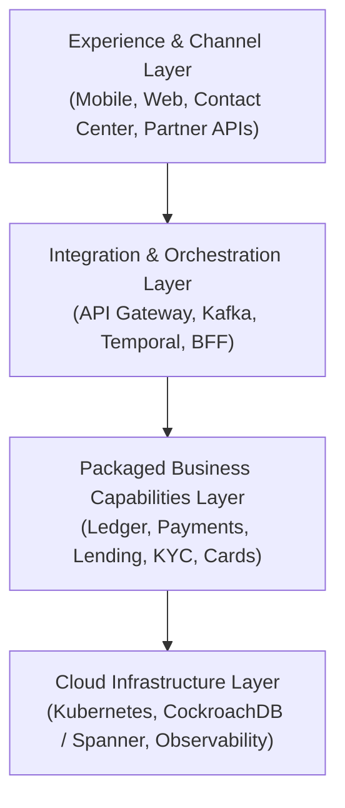
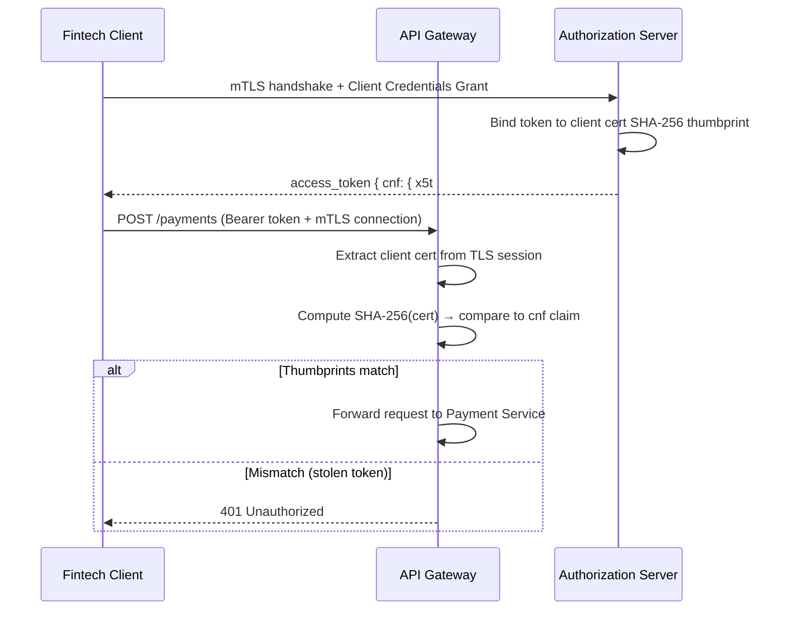
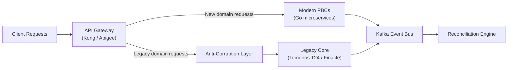

**Answer-first:** Composable banking replaces rigid legacy cores with modular Go microservices. The transition uses the Strangler Fig pattern to decouple domains, while distributed Sagas manage eventual consistency across transaction engines, and NewSQL databases provide horizontal scaling without sacrificing ACID compliance.

### What You'll Learn That AI Won't Tell You
- Strangler fig patterns for core banking systems that prevent data corruption.
- How to bridge legacy COBOL records into dynamic JSON streams using Go middleware.


Legacy core banking systems were designed in a different era. Temenos T24, Finacle, and Flexcube shared one defining assumption: the bank's entire product catalogue — deposits, lending, payments, trade finance — would live inside a single, tightly coupled application and a single, shared database. That assumption held when banking moved at human speed. It breaks completely when product releases need to go from months to days, when a single fraud engine update must not risk a payments outage, and when engineers on a COBOL codebase are retiring faster than they can be replaced.

Composable banking replaces that monolith with a network of independent, purpose-built service components. This post is a deep engineering guide to what that actually means in Go microservices terms: ledger concurrency patterns, event-driven Saga orchestration, BaaS API idempotency, ISO 20022 message flows, and a step-by-step Strangler Fig migration strategy.

For the foundational Saga mechanics in Go, see [Dapr Workflow Saga Orchestration Guide](/posts/dapr-workflow-saga-orchestration-guide) and [Financial Microservices Architecture: Saga & Ledger](/posts/banking-microservices-architecture).

---

## What Is Composable Banking Architecture?

Composable banking is a software design approach that replaces a single-unit core banking system with a network of independent, swappable Packaged Business Capabilities (PBCs). Based on MACH principles (Microservices, API-first, Cloud-native, Headless), it lets a financial institution replace the payment engine without touching the lending module, or launch an embedded finance product line without rebuilding the core ledger.

The reference stack has four layers:



Each PBC owns its domain completely — its own code repository, its own database, its own deployment pipeline. No shared database. No synchronous cross-domain coupling in the transaction critical path.

### BIAN Service Domains and DDD Aggregate Boundaries

The BIAN (Banking Industry Architecture Network) defines ~330 Service Domains — atomic business capabilities like *Payment Execution*, *Current Account*, and *Customer Agreement*. BIAN provides the **"what"**: a standardized dictionary of capabilities so different vendors and in-house services can interoperate semantically.

Domain-Driven Design (DDD) provides the **"how"**: each BIAN Service Domain maps to one or more DDD Bounded Contexts, with Aggregates protecting transactional consistency within their boundaries. A Payment Execution domain maps cleanly to an `Payment` Aggregate that owns the state machine from `INITIATED` through `SETTLED`. No other service writes to that state machine directly — it publishes domain events that other contexts react to asynchronously.

---

## The Business Case: Why Legacy Cores Are Breaking Down in 2026

Legacy monolith maintenance now consumes **70-80% of bank IT budgets** on average, leaving little capital for innovation. Several converging pressures have turned this from a long-term concern into an immediate operational risk.

**Cost indicators driving migration decisions:**

- **TCO reduction:** Banks completing composable modernization report **20-40% lower Total Cost of Ownership** over three years, primarily from eliminating vendor licensing fees and reducing SRE toil.
- **Time-to-market acceleration:** Product release cycles improve by **40-60%**. Launching a new credit card product drops from 12-18 months to 6-10 weeks.
- **Talent risk:** COBOL engineers command **2-3× market salary premiums** due to supply scarcity, and attrition accelerates as the workforce ages. Each legacy developer who leaves takes institutional knowledge that cannot be replaced.
- **Security posture:** Monolithic systems show a 50% higher surface area for security breaches compared to isolated, network-policy-governed microservices, due to the blast radius of any single compromised component.

The business case is no longer "should we modernize?" It is "what sequence minimizes migration risk?"

---

## Scaling the Core Ledger: Optimistic Locking vs. NewSQL

In a monolithic banking system, financial ledgers rely on pessimistic locking (`SELECT FOR UPDATE`) to guarantee transaction consistency. Every balance update acquires an exclusive row lock, blocking all concurrent writes to the same account until the transaction commits. At low transaction volumes this is fine. On a hot-spot account — a high-volume merchant account, a shared treasury account, a sweep account receiving thousands of micro-deposits per second — it becomes a write serialization bottleneck that saturates the database.

Composable architectures solve this at two levels:

### Level 1: Optimistic Locking on the Account Row

For moderate concurrency, replace the row lock with a `version` column. The write succeeds only if the version matches what was read; otherwise the application retries.

```sql
-- Account table with optimistic concurrency
CREATE TABLE accounts (
    id          UUID PRIMARY KEY DEFAULT gen_random_uuid(),
    tenant_id   VARCHAR(50) NOT NULL,
    balance     NUMERIC(18, 4) NOT NULL DEFAULT 0,
    version     INT NOT NULL DEFAULT 1,
    updated_at  TIMESTAMPTZ DEFAULT CURRENT_TIMESTAMP
);

-- Optimistic balance update: fails with 0 rows affected if version mismatches
UPDATE accounts
SET    balance    = balance + $1,
       version    = version + 1,
       updated_at = CURRENT_TIMESTAMP
WHERE  id         = $2
AND    version    = $3;  -- stale read returns 0 rows → application retries
```

In Go, a retry loop with exponential backoff handles the version conflict:

```go
func (r *AccountRepo) UpdateBalance(ctx context.Context, id uuid.UUID, delta decimal.Decimal, version int) error {
    const maxRetries = 5
    for attempt := 0; attempt < maxRetries; attempt++ {
        result := r.db.ExecContext(ctx,
            `UPDATE accounts SET balance = balance + $1, version = version + 1, updated_at = NOW()
             WHERE id = $2 AND version = $3`,
            delta, id, version,
        )
        if result.RowsAffected == 1 {
            return nil // success
        }
        // Version conflict — re-read and retry
        current, err := r.Get(ctx, id)
        if err != nil {
            return err
        }
        version = current.Version
        time.Sleep(time.Duration(attempt*attempt) * 10 * time.Millisecond) // quadratic backoff
    }
    return ErrVersionConflict
}
```

### Level 2: Append-Only Ledger with Balance Snapshots

For very high-throughput accounts, eliminate balance mutations entirely. Every credit or debit appends a signed delta to an immutable `ledger_entries` table. The current balance is derived by summing all entries, which is accelerated by periodically materializing a `balance_snapshots` row.

```sql
-- Append-only ledger entries (never UPDATE or DELETE)
CREATE TABLE ledger_entries (
    id             UUID PRIMARY KEY DEFAULT gen_random_uuid(),
    account_id     UUID NOT NULL,
    transaction_id UUID NOT NULL,
    amount         NUMERIC(18, 4) NOT NULL,  -- positive = credit, negative = debit
    created_at     TIMESTAMPTZ NOT NULL DEFAULT NOW()
);
CREATE INDEX idx_ledger_account_time ON ledger_entries (account_id, created_at DESC);

-- Balance snapshot for fast reads on high-volume accounts
CREATE TABLE balance_snapshots (
    account_id      UUID PRIMARY KEY,
    balance         NUMERIC(18, 4) NOT NULL,
    snapshot_at     TIMESTAMPTZ NOT NULL
);

-- Current balance query (snapshot + deltas since snapshot)
SELECT s.balance + COALESCE(SUM(e.amount), 0) AS current_balance
FROM   balance_snapshots s
LEFT JOIN ledger_entries e
       ON e.account_id = s.account_id
      AND e.created_at > s.snapshot_at
WHERE  s.account_id = $1
GROUP BY s.balance;
```

### Level 3: Distributed NewSQL for Multi-Region Scale

When neither approach is sufficient — multi-region active-active deployments, regulatory data sovereignty across jurisdictions — the ledger migrates to a distributed SQL database:

| Database | Consistency Model | Use Case |
|---|---|---|
| **CockroachDB** | Serializable isolation by default | Multi-region, prevents write-skew without application-level coordination |
| **Google Cloud Spanner** | External consistency via TrueTime API + Paxos | Global banks requiring strict linearizability at planetary scale |
| **YugabyteDB** | Read Committed (adjustable) + Postgres wire protocol | Teams migrating from Postgres who need scale-out without rewriting queries |

CockroachDB's native serializable isolation is particularly relevant: by default, it prevents write-skew (a class of anomaly that Postgres's default Read Committed isolation allows), which means financial ledger invariants hold without explicit `FOR UPDATE` locks.

---

## Event-Driven Orchestration: Sagas, Temporal, and the Outbox Pattern

Composable banking microservices each own their own database. A fund transfer spanning a debit service, a fraud check service, and a credit service cannot rely on a single database transaction. The Saga pattern solves this with a sequence of local transactions, where each step has a corresponding **compensating transaction** that undoes its effect if a later step fails.

### Orchestration vs. Choreography for Financial Flows

Choreography (services reacting to events with no central coordinator) works for simple, low-step flows. For banking, orchestration is mandatory:

| Dimension | Choreography | Orchestration (Temporal / Dapr) |
|---|---|---|
| **Flow visibility** | Distributed across event logs | Centralized in one workflow function |
| **Compensation logic** | Each service implements its own | Orchestrator manages in sequence |
| **Audit trail** | Requires multi-topic correlation | Single durable execution history |
| **Debugging** | Event tracing across 5+ topics | Single workflow history query |
| **Regulatory requirement** | Hard to satisfy | Clear state at every step (PENDING → SETTLED) |

### Temporal Workflow for a Fund Transfer Saga

Temporal persists the full execution history of every workflow run in its internal database. If a worker crashes mid-transfer, Temporal replays the event log from the last checkpoint — completed activities return their cached results without re-executing, and execution resumes from the interrupted step.

```go
// FundTransferWorkflow is the Saga orchestrator — MUST be deterministic.
// No time.Now(), no rand, no environment reads inside this function.
func FundTransferWorkflow(ctx workflow.Context, input FundTransferInput) (FundTransferResult, error) {
    ao := workflow.ActivityOptions{
        StartToCloseTimeout: 30 * time.Second,
        RetryPolicy: &temporal.RetryPolicy{
            MaximumAttempts:    3,
            InitialInterval:    time.Second,
            BackoffCoefficient: 2.0,
        },
    }
    ctx = workflow.WithActivityOptions(ctx, ao)

    // Step 1: Debit source account
    var debitResult DebitResult
    if err := workflow.ExecuteActivity(ctx, DebitSourceAccount, input).Get(ctx, &debitResult); err != nil {
        return FundTransferResult{}, fmt.Errorf("debit failed: %w", err)
    }

    // Step 2: Fraud check
    var fraudResult FraudCheckResult
    if err := workflow.ExecuteActivity(ctx, CheckFraud, input).Get(ctx, &fraudResult); err != nil || fraudResult.Flagged {
        // Compensate: reverse the debit
        _ = workflow.ExecuteActivity(ctx, ReverseDebit, debitResult).Get(ctx, nil)
        return FundTransferResult{}, ErrFraudFlagged
    }

    // Step 3: Credit target account
    var creditResult CreditResult
    if err := workflow.ExecuteActivity(ctx, CreditTargetAccount, input).Get(ctx, &creditResult); err != nil {
        // Compensate: reverse the debit
        _ = workflow.ExecuteActivity(ctx, ReverseDebit, debitResult).Get(ctx, nil)
        return FundTransferResult{}, fmt.Errorf("credit failed: %w", err)
    }

    return FundTransferResult{
        TransactionID: input.TransactionID,
        Status:        "SETTLED",
        SettledAt:     workflow.Now(ctx), // deterministic time from Temporal runtime
    }, nil
}
```

### The Transactional Outbox: Preventing Data Drift

After a local database write, the service must also publish an event to Kafka so downstream services react. Writing to both the database and Kafka in the same operation is the **Dual-Write problem**: if Kafka is unavailable after the database write succeeds, the event is lost and the Saga stalls with no way to detect the gap.

The Transactional Outbox eliminates the problem:

```sql
-- Outbox table lives in the same database as the domain table
CREATE TABLE outbox_events (
    id           UUID PRIMARY KEY DEFAULT gen_random_uuid(),
    aggregate_id UUID NOT NULL,
    event_type   VARCHAR(100) NOT NULL,
    payload      JSONB NOT NULL,
    published    BOOLEAN NOT NULL DEFAULT FALSE,
    created_at   TIMESTAMPTZ NOT NULL DEFAULT NOW()
);
```

```go
// In a single database transaction: write business data + event payload atomically
func (s *AccountService) DebitAccount(ctx context.Context, tx *sql.Tx, input DebitInput) error {
    // 1. Update the account balance
    _, err := tx.ExecContext(ctx,
        `UPDATE accounts SET balance = balance - $1 WHERE id = $2`, input.Amount, input.AccountID)
    if err != nil {
        return err
    }

    // 2. Insert the outbox event — same transaction, same commit
    payload, _ := json.Marshal(AccountDebitedEvent{
        AccountID: input.AccountID,
        Amount:    input.Amount,
        TxID:      input.TransactionID,
    })
    _, err = tx.ExecContext(ctx,
        `INSERT INTO outbox_events (aggregate_id, event_type, payload) VALUES ($1, $2, $3)`,
        input.AccountID, "account.debited", payload)
    return err
}
```

Debezium reads the PostgreSQL WAL and forwards every `outbox_events` INSERT directly to Kafka, with zero polling overhead and guaranteed at-least-once delivery. Even if Kafka is down during the database commit, Debezium will forward the event once Kafka recovers.

For a complete walkthrough of the broader event-driven patterns powering this approach, see [Mastering Event-Driven Architecture with Dapr](/posts/mastering-event-driven-architecture-dapr). For the observability layer across these banking microservices — W3C trace propagation, OTel Collector sampling, and tracing Kafka consumers — see [Go Microservices Distributed Tracing Architecture](/posts/go-microservices-distributed-tracing-architecture).

---

## BaaS API Design: Idempotency and ISO 20022 Integration

Banking-as-a-Service APIs are consumed by fintechs over unreliable networks. A payment initiation request that times out at the client side may have already been processed server-side. The client retries and — without proper protection — the customer is charged twice.

### Idempotency Key Implementation in Go

Every state-mutating BaaS endpoint must accept a client-generated idempotency key (UUID v4) and store a hash of it alongside the processing result:

```go
// idempotencyMiddleware checks for duplicate requests before processing.
// The key_hash has a UNIQUE constraint in the database.
func (h *PaymentHandler) InitiateTransfer(w http.ResponseWriter, r *http.Request) {
    idempotencyKey := r.Header.Get("Idempotency-Key")
    if idempotencyKey == "" {
        http.Error(w, "Idempotency-Key header required", http.StatusBadRequest)
        return
    }

    // SHA-256 hash prevents key enumeration attacks
    hash := sha256.Sum256([]byte(r.Header.Get("X-Client-ID") + ":" + idempotencyKey))
    keyHash := hex.EncodeToString(hash[:])

    // Atomic insert: if key_hash already exists, ON CONFLICT returns the stored status
    var status string
    err := h.db.QueryRowContext(r.Context(), `
        INSERT INTO idempotency_keys (key_hash, status, created_at)
        VALUES ($1, 'PROCESSING', NOW())
        ON CONFLICT (key_hash) DO UPDATE SET updated_at = NOW()
        RETURNING status`,
        keyHash,
    ).Scan(&status)
    if err != nil {
        http.Error(w, "database error", http.StatusInternalServerError)
        return
    }

    if status != "PROCESSING" {
        // Duplicate request: return the previously cached result
        h.returnCachedResult(w, keyHash)
        return
    }

    // Process the new payment and update the idempotency record
    h.processPaymentAndUpdateKey(w, r, keyHash)
}
```

### ISO 20022 Message Flow

BaaS payment APIs map to ISO 20022 XML messages at the interbank layer. Understanding this mapping is essential when debugging payment failures at the settlement layer:

| Message | Business Area | Function | Triggered When |
|---|---|---|---|
| **pain.001** | Payment Initiation | Customer instructs bank to pay | Fintech API calls `/v1/payments` |
| **pacs.008** | Clearing & Settlement | Bank-to-bank credit transfer | Bank forwards to correspondent |
| **pacs.002** | Clearing & Settlement | Payment status report | Correspondent sends ACCP/RJCT/PDNG |
| **camt.052** | Cash Management | Intraday account report | Treasury monitors intraday cash |
| **camt.053** | Cash Management | End-of-day bank statement | Reconciliation runs at T+0 close |

The `pain.001` → `pacs.008` transformation is a critical data mapping step: the `pain` message carries debtor intent (what the customer wants), while the `pacs` message carries the actual interbank instruction. Improper mapping — dropping reference fields like `EndToEndId` — breaks downstream reconciliation and SEPA compliance.

### Verification of Payee (VoP) API Integration

Under the EU Instant Payments Regulation, SEPA PSPs must verify payee identity before executing credit transfers. The EPC VoP Inter-PSP API returns one of four matching codes:

| Code | Meaning | Action |
|---|---|---|
| **MTCH** | Name matches IBAN holder | Proceed with payment |
| **NMTC** | Name does not match | Warn user; require explicit confirmation |
| **CMTC** | Close match (e.g., typo, nickname) | Show the actual registered name; user confirms |
| **NOAP** | Verification not applicable | Continue; flag for manual review |

The `CMTC` response is the most operationally complex: the API returns the actual registered name alongside the close-match indicator. Your UI must present this name clearly so the payer can confirm they are paying the right person — this is the primary fraud-prevention mechanism.

---

## Security Gates: RFC 8705 mTLS and DORA Compliance

### RFC 8705: Certificate-Bound Access Tokens

Standard OAuth 2.0 Bearer tokens can be stolen and replayed from a different client. The Financial-grade API (FAPI) 1.0 Advanced profile addresses this with **RFC 8705 Mutual-TLS Client Certificate-Bound Access Tokens**: the access token is cryptographically bound to the client's X.509 certificate, making stolen tokens useless without the corresponding private key.

The validation flow:



For mobile and SPA clients where establishing mTLS is architecturally impractical, **DPoP (RFC 9449)** provides an equivalent proof-of-possession guarantee at the application layer: the client signs each request with a private key, and the server verifies that the signed request matches the DPoP public key bound in the access token.

### DORA: Threat-Led Penetration Testing

The Digital Operational Resilience Act (DORA, enforceable from January 17, 2025) requires **significant** financial institutions to conduct Threat-Led Penetration Testing (TLPT) **at least every three years**. TLPT is not a standard pen test: it mimics real-world adversary TTPs (Tactics, Techniques, Procedures), typically following the TIBER-EU framework, and covers all critical ICT functions including outsourced cloud infrastructure.

A single TLPT exercise spans 6-12 months including scoping, red team execution, and remediation. For composable banking systems, TLPT scope must include the API Gateway, the event bus (Kafka), the orchestration layer (Temporal/Dapr), and every critical PBC. Third-party SaaS vendors (core banking platforms, cloud providers) are in scope if they support critical functions.

---

## The Strangler Fig Migration: De-Risking Core Modernization

The highest-risk core banking transformation is the "Big Bang" cutover: freeze the legacy system, build the new platform in parallel, and switch everything on a single date. This approach fails consistently because the new system's edge cases are discovered only under production load, after the rollback window has closed.

The **Strangler Fig pattern** eliminates this risk with incremental domain extraction:



### Phase 1: Place the Gateway and Anti-Corruption Layer

Before migrating any domain, position an API Gateway in front of the legacy core. All traffic now flows through the gateway, which routes 100% of requests to the legacy system. The gateway becomes the control plane for traffic shifting.

The **Anti-Corruption Layer (ACL)** lives between the gateway and the legacy system. It translates between the clean domain model of the new PBCs and the legacy system's proprietary data model:

```go
// ACL translates a modern PaymentRequest into the legacy T24 transaction format
type T24ACL struct {
    legacyClient *T24Client
}

func (a *T24ACL) InitiatePayment(ctx context.Context, req domain.PaymentRequest) (domain.PaymentResult, error) {
    // Translate modern domain model → legacy T24 format
    t24Req := T24PaymentRequest{
        FTNO:    req.TransactionID,
        DEBIT:   req.SourceAccount.T24AccountID,
        CREDIT:  req.TargetAccount.T24AccountID,
        AMT:     req.Amount.String(),
        CCY:     req.Currency.ISO4217(),
        VDATE:   req.ValueDate.Format("020106"), // T24 date format
    }

    t24Resp, err := a.legacyClient.PostTransaction(ctx, t24Req)
    if err != nil {
        return domain.PaymentResult{}, translateT24Error(err)
    }

    // Translate legacy response → clean domain model
    return domain.PaymentResult{
        TransactionID: req.TransactionID,
        Status:        mapT24Status(t24Resp.Status),
        CompletedAt:   parseT24Date(t24Resp.PostingDate),
    }, nil
}
```

### Phase 2: Shadow Routing for Risk-Free Validation

Before switching live traffic to a new PBC, deploy it in shadow mode. Istio's traffic mirroring sends a copy of every request to the new service in parallel with the live request to the legacy system:

```yaml
apiVersion: networking.istio.io/v1alpha3
kind: VirtualService
metadata:
  name: payment-service
spec:
  hosts: ["payment-service"]
  http:
  - route:
    - destination:
        host: payment-service-legacy
        port:
          number: 8080
      weight: 100
    mirror:
      host: payment-service-new        # shadow receives copy of every request
      port:
        number: 8080
    mirrorPercentage:
      value: 100.0                      # mirror 100% of traffic
```

The shadow responses are logged but discarded — users are served from the legacy system. The reconciliation engine compares shadow responses against legacy responses and alerts on any divergence. Only when the divergence rate drops to zero for 30+ days does traffic shift begin.

### Phase 3: Reconciliation Loops for Data Parity

During the dual-run period, a continuous reconciliation engine validates that account balances and transaction history match between the legacy core database and the new PBC databases:

```go
func (r *ReconciliationEngine) RunBalanceCheck(ctx context.Context) error {
    accounts, err := r.listActiveAccounts(ctx)
    if err != nil {
        return err
    }

    var discrepancies []Discrepancy
    for _, account := range accounts {
        legacyBalance, err := r.legacyClient.GetBalance(ctx, account.LegacyID)
        if err != nil {
            continue
        }
        modernBalance, err := r.modernLedger.GetBalance(ctx, account.ModernID)
        if err != nil {
            continue
        }

        if legacyBalance.Amount.Compare(modernBalance.Amount) != 0 {
            discrepancies = append(discrepancies, Discrepancy{
                AccountID:     account.ID,
                LegacyBalance: legacyBalance.Amount,
                ModernBalance: modernBalance.Amount,
                Delta:         legacyBalance.Amount.Sub(modernBalance.Amount),
                DetectedAt:    time.Now(),
            })
        }
    }

    if len(discrepancies) > 0 {
        r.alertOps(ctx, discrepancies)
        return r.storeDiscrepancies(ctx, discrepancies)
    }
    return nil
}
```

---

## Next-Gen Core Banking Vendor Landscape

For teams evaluating off-the-shelf composable cores before building in-house, the microfinance vertical offers a useful contrast: it shares the same double-entry ledger and Saga requirements but operates on high-frequency, low-value group loans — see [Microfinance Core Banking Architecture](/posts/deconstructing-microfinance-core-banking-architecture) for that lens.

| Vendor | Runtime | Database | Customization | Tenancy |
|---|---|---|---|---|
| **Mambu** | Java EE / Tomcat | MySQL on Amazon RDS | Webhooks & Streaming APIs | Database-per-tenant on GCP / AWS |
| **Thought Machine (Vault)** | Go + Python runtime | CockroachDB / Cloud Spanner | Python Smart Contracts (event hooks) | Cloud-agnostic, multi-tenant |
| **Finxact** | Go (Golang) | PostgreSQL (temporal schema) | TypeScript DSL scripts | Multi-tenant, WAL CDC streaming |
| **10x Banking (SuperCore)** | JVM / Java | Relational + NoSQL | Click-to-configure "Meta Core" | Multi-tenant SaaS on AWS + Confluent Kafka |

**Key differentiators:**

- **Thought Machine** is the only vendor exposing its product configuration engine as Python code. Banks write `smart contracts` that define product lifecycle rules (interest accrual, fee triggers, account state transitions) in Python, which the Vault runtime executes on event hooks. This gives engineering teams genuine programmable control without forking the core platform.
- **Finxact** chose Go for its microservices runtime — the same language most backend teams in this audience use for their own services. Its temporal PostgreSQL schema stores every record with valid-time and transaction-time context, enabling point-in-time queries across the entire ledger history without separate audit tables.
- **Mambu's** database-per-tenant model (separate MySQL RDS instance per bank customer) provides strong data isolation at the cost of higher infrastructure overhead. This is the highest compliance-friendly model for regulated institutions that cannot tolerate shared schema data co-mingling.

---

## Frequently Asked Questions

### What is composable banking architecture?

Composable banking architecture replaces a monolithic core banking system with a network of independent, domain-specific Packaged Business Capabilities (PBCs). Each PBC owns its own database, deployment pipeline, and API surface. The system is governed by MACH principles (Microservices, API-first, Cloud-native, Headless) and typically aligns service boundaries with BIAN industry-standard Service Domains.

### Why are banks migrating away from monolithic core banking systems?

Three converging pressures: cost (legacy maintenance consumes 70-80% of IT budgets), talent scarcity (COBOL engineers command 2-3× market premiums and the workforce is retiring), and speed (launching a product on a monolith takes 12-18 months; composable architectures reduce this to 6-10 weeks).

### What is the Strangler Fig pattern in core banking migration?

The Strangler Fig pattern migrates a monolithic system domain-by-domain without a "Big Bang" cutover. An API Gateway routes traffic, initially forwarding everything to the legacy system. New microservices intercept individual domains (e.g., cards, deposits) as they become production-ready. An Anti-Corruption Layer translates between modern domain models and legacy data formats. Shadow routing validates the new service against the legacy system before any live traffic shifts.

### What is the difference between Temporal and Dapr Workflow for banking Sagas?

Both implement Orchestrated Sagas using Event Sourcing Replay for crash recovery. Temporal is preferred for complex, long-running workflows requiring advanced versioning, custom search attributes, and high workflow throughput at scale. Dapr Workflow is lighter and integrates natively with the broader Dapr sidecar ecosystem (Pub/Sub, State, Bindings), making it the better fit for teams already using Dapr for other microservice concerns.

### What is RFC 8705 and why does it matter for BaaS APIs?

RFC 8705 defines Mutual-TLS Client Certificate-Bound Access Tokens for OAuth 2.0. The Authorization Server binds the access token to the client's X.509 certificate by embedding the certificate's SHA-256 thumbprint in the token's `cnf.x5t#S256` claim. The API Gateway validates that the token thumbprint matches the certificate presented in the current mTLS connection, making stolen tokens unusable without the corresponding private key. This is mandatory for Financial-grade API (FAPI) 1.0 Advanced compliance.

### What does DORA require for banks running composable banking systems?

DORA (Digital Operational Resilience Act, enforceable January 2025) requires significant EU financial institutions to conduct Threat-Led Penetration Testing (TLPT) at least every three years. TLPT follows the TIBER-EU framework, mimicking real adversary TTPs against all critical ICT functions — including the API Gateway, event bus, orchestration layer, and third-party SaaS core banking platforms. A single TLPT exercise typically spans 6-12 months.


