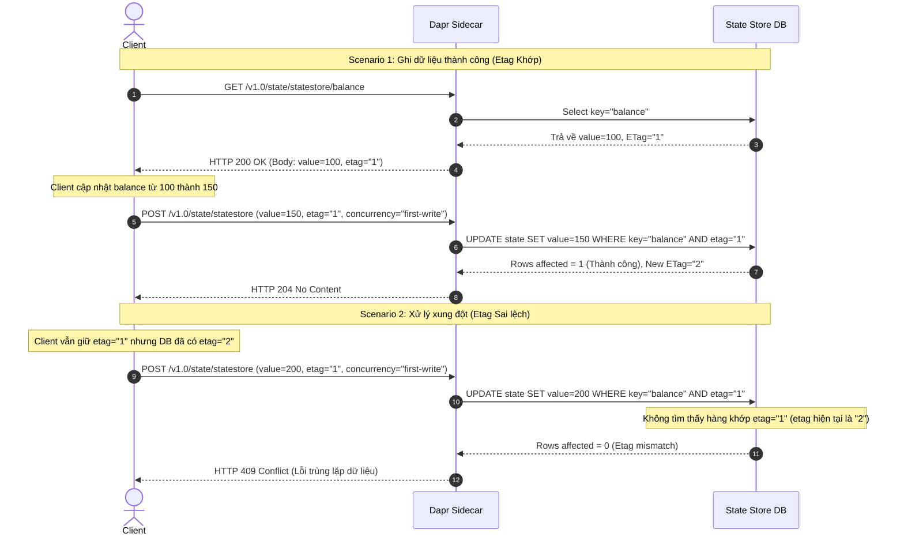

Trong Dapr State Store, sự lựa chọn giữa Strong Consistency (nhất quán mạnh) và Eventual Consistency (nhất quán cuối) quyết định độ trễ và tính toàn vẹn dữ liệu. Strong Consistency phù hợp cho giao dịch tài chính (dùng CockroachDB), trong khi Eventual Consistency tối ưu cho hệ thống cần throughput cao (dùng Redis).

## Giới thiệu về Dapr State Management

Trong phát triển ứng dụng phân tán hiện đại, quản lý trạng thái (state management) luôn là một trong những thử thách phức tạp nhất. Khi chuyển dịch sang [kiến trúc microservices](/posts/banking-microservices-architecture/), mỗi dịch vụ thường yêu cầu lưu trữ và truy vấn dữ liệu một cách độc lập. Điều này dẫn đến sự phân mảnh công nghệ khi một hệ thống có thể sử dụng đồng thời Redis để làm cache, PostgreSQL để lưu trữ dữ liệu giao dịch, và Cassandra cho dữ liệu phi cấu trúc lớn. Dapr (Distributed Application Runtime) ra đời nhằm giải quyết vấn đề này thông qua cơ chế trừu tượng hóa (abstraction).

Dapr State Management cung cấp một API đồng nhất (Unified API) cho phép các ứng dụng giao tiếp với bất kỳ state store nào thông qua HTTP hoặc gRPC mà không cần quan tâm đến thư viện driver hay cú pháp truy vấn cụ thể của từng loại cơ sở dữ liệu. Dapr Sidecar đảm nhận vai trò trung gian nhận các yêu cầu như `GET`, `POST`, `DELETE` từ ứng dụng và chuyển đổi chúng thành các thao tác tương ứng trên cơ sở dữ liệu vật lý được cấu hình. Điều này mang lại khả năng di động (portability) cực kỳ cao: lập trình viên có thể sử dụng Redis khi phát triển trên môi trường local và dễ dàng chuyển sang PostgreSQL hoặc CockroachDB khi triển khai trên môi trường Production chỉ bằng cách thay đổi file cấu hình YAML của component mà không cần sửa đổi bất kỳ dòng code nào của ứng dụng.

Ngoài việc tối giản hóa thao tác CRUD cơ bản, Dapr State Store hỗ trợ nhiều tính năng nâng cao bao gồm: kiểm soát giao dịch đồng thời (concurrency control), mô hình nhất quán dữ liệu (consistency models), lưu trữ đa khóa (bulk operations), và truy vấn nâng cao (query API). Sự linh hoạt này giúp các kỹ sư tập trung vào logic nghiệp vụ thay vì phải xử lý các vấn đề hạ tầng phức tạp.

## Sự khác biệt giữa Strong và Eventual Consistency

Trong hệ thống phân tán, định lý CAP chỉ ra rằng chúng ta không thể đồng thời đạt được cả ba yếu tố: Nhất quán (Consistency), Tính khả dụng (Availability), và Khả năng chịu lỗi phân mảnh mạng (Partition Tolerance). Khi xảy ra phân mảnh mạng, hệ thống bắt buộc phải đánh đổi giữa Consistency và Availability. Dapr State Store hỗ trợ hai mô hình nhất quán chính để các nhà phát triển lựa chọn dựa trên yêu cầu nghiệp vụ: Strong Consistency và Eventual Consistency.

Strong Consistency (Nhất quán mạnh) đảm bảo rằng sau khi một thao tác ghi (write) dữ liệu thành công, tất cả các yêu cầu đọc (read) tiếp theo từ bất kỳ node nào trong hệ thống đều sẽ trả về giá trị mới nhất vừa được ghi. Để đạt được điều này, Dapr phối hợp với state store chạy các giao thức đồng thuận (chẳng hạn như Raft hoặc Paxos) hoặc yêu cầu đồng bộ hóa trên một quorum (số đông các node bản sao). Điều này cực kỳ quan trọng đối với các hệ thống nhạy cảm về mặt dữ liệu như giao dịch tài chính, quản lý số dư tài khoản, hoặc hệ thống ledger ngân hàng. Tuy nhiên, cái giá phải trả cho Strong Consistency là độ trễ (latency) ghi tăng lên đáng kể và thông lượng (throughput) giảm đi do các node phải chờ đợi phản hồi từ nhau để đạt được sự đồng thuận. Nếu một số node gặp sự cố mạng, các thao tác ghi có thể bị từ chối hoặc gặp timeout để bảo vệ tính toàn vẹn của dữ liệu.

Ngược lại, Eventual Consistency (Nhất quán cuối) ưu tiên tính khả dụng và hiệu năng của hệ thống. Khi một thao tác ghi được thực hiện, Dapr State Store sẽ xác nhận thành công ngay khi dữ liệu được lưu trên node gốc (hoặc node master), sau đó quá trình đồng bộ hóa sang các node bản sao (replicas) sẽ diễn ra bất đồng bộ ở chế độ nền (background). Do đó, trong một khoảng thời gian ngắn (vài phần mười hoặc phần trăm giây), các yêu cầu đọc gửi đến các node bản sao khác nhau có thể trả về dữ liệu cũ (stale data). Tuy nhiên, hệ thống đảm bảo rằng nếu không có thao tác ghi mới nào phát sinh, tất cả các node cuối cùng sẽ hội tụ về cùng một trạng thái nhất quán. Eventual Consistency tối ưu cho các bài toán có tần suất đọc/ghi cực lớn và không yêu cầu tính chính xác tức thời như lượt thích (like) bài viết, session cache của người dùng, hoặc phân tích log sự kiện.

## Kiểm soát giao dịch đồng thời với OCC và ETags

Khi xây dựng hệ thống phân tán với hàng ngàn request đồng thời, việc bảo vệ dữ liệu khỏi xung đột ghi đè (race conditions) là vô cùng quan trọng. Có hai hướng tiếp cận chính: Kiểm soát giao dịch bi quan (Pessimistic Concurrency Control) và Kiểm soát giao dịch lạc quan (Optimistic Concurrency Control - OCC). Trong khi kiểm soát giao dịch bi quan khóa tài nguyên lại để ngăn chặn mọi truy cập khác (thường sử dụng các giải pháp như [phân tán khóa (distributed locks)](/series/system-design/06-distributed-locks-concurrency/)), Dapr State Store mặc định cung cấp cơ chế OCC thông qua việc sử dụng các thẻ định danh phiên bản gọi là `ETags`.

Cơ chế OCC hoạt động dựa trên giả định rằng xung đột dữ liệu rất hiếm khi xảy ra. Thay vì khóa tài nguyên trước khi chỉnh sửa, ứng dụng sẽ đọc dữ liệu kèm theo một thẻ `ETag` đại diện cho phiên bản hiện tại của record đó. Khi ứng dụng thực hiện ghi đè hoặc cập nhật dữ liệu, nó sẽ gửi kèm `ETag` cũ này về cho Dapr. Dapr Sidecar sau đó sẽ yêu cầu State Store DB kiểm tra xem `ETag` được gửi lên có trùng khớp với `ETag` đang được lưu trong DB hay không. Nếu trùng khớp, thao tác ghi được chấp nhận và cơ sở dữ liệu sẽ tự động sinh ra một `ETag` mới cho bản ghi đó. Nếu không khớp, điều đó có nghĩa là đã có một client khác cập nhật bản ghi này trong khoảng thời gian giữa lúc đọc và ghi của client hiện tại. Lúc này, Dapr sẽ từ chối thao tác ghi và trả về lỗi `HTTP 409 Conflict`.

Dưới đây là sơ đồ Mermaid mô tả chi tiết quy trình hoạt động của OCC trong Dapr State Store cho cả hai trường hợp: Ghi dữ liệu thành công và Xử lý xung đột do sai lệch ETag.



Quy trình tuần tự trong sơ đồ Mermaid trên bao gồm các bước sau:
1. **Bước 1**: Client gửi yêu cầu đọc dữ liệu số dư tài khoản bằng phương thức `GET` đến endpoint `/v1.0/state/statestore/balance` của Dapr Sidecar.
2. **Bước 2**: Dapr Sidecar truy vấn cơ sở dữ liệu (State Store DB) bằng câu lệnh tìm kiếm tương ứng: `SELECT key="balance"`.
3. **Bước 3**: Cơ sở dữ liệu tìm thấy bản ghi có khóa là `balance`, trả về cho Dapr Sidecar giá trị hiện tại là `100` cùng với thẻ ETag tương ứng là `"1"`.
4. **Bước 4**: Dapr Sidecar phản hồi về cho Client với mã trạng thái `HTTP 200 OK`, gửi kèm dữ liệu số dư và thẻ `etag="1"`.
5. **Bước 5**: Client nhận được dữ liệu, thực hiện logic nghiệp vụ trong bộ nhớ và cập nhật số dư mới từ `100` thành `150`.
6. **Bước 6**: Client gửi yêu cầu ghi đè trạng thái mới thông qua API `POST` đến Dapr Sidecar, truyền theo giá trị `150`, thẻ `etag="1"`, và cấu hình `concurrency="first-write"` (chỉ ghi nếu ETag khớp).
7. **Bước 7**: Dapr Sidecar chuyển yêu cầu thành câu lệnh cập nhật có điều kiện trong DB: `UPDATE state SET value=150 WHERE key="balance" AND etag="1"`.
8. **Bước 8**: Vì cơ sở dữ liệu hiện tại vẫn có ETag là `"1"`, câu lệnh UPDATE tìm thấy chính xác 1 dòng bị ảnh hưởng (`Rows affected = 1`). DB xác nhận ghi thành công và tạo ra ETag mới là `"2"`.
9. **Bước 9**: Dapr Sidecar nhận phản hồi thành công và trả về mã trạng thái `HTTP 204 No Content` cho Client. Đây là kết thúc của Scenario 1 thành công.
10. **Bước 10**: Trong Scenario 2, giả sử Client gửi yêu cầu ghi dữ liệu mới khác (ví dụ: đổi số dư thành `200`) nhưng vẫn dùng thẻ `etag="1"` cũ mà nó nhận được từ Bước 4, trong khi DB đã được cập nhật lên ETag `"2"` ở Bước 8.
11. **Bước 11**: Dapr Sidecar chuyển câu lệnh cập nhật lên DB: `UPDATE state SET value=200 WHERE key="balance" AND etag="1"`.
12. **Bước 12**: Cơ sở dữ liệu kiểm tra điều kiện WHERE nhưng không tìm thấy bản ghi nào thỏa mãn đồng thời `key="balance"` và `etag="1"` (vì hiện tại etag đã là `"2"`). Số dòng bị ảnh hưởng trả về là `0` (`Rows affected = 0`).
13. **Bước 13**: Dapr Sidecar phát hiện số dòng cập nhật bằng 0, hiểu rằng đã có xung đột đồng thời xảy ra, lập tức trả về lỗi `HTTP 409 Conflict` (Lỗi xung đột dữ liệu) cho Client.

Khi Client nhận lỗi 409 này, nó phải thực hiện cơ chế bắt lỗi để thực hiện retry (Retry Pattern): đọc lại state mới nhất cùng ETag mới nhất (trong trường hợp này là `150` và ETag `"2"`), thực hiện lại tính toán logic nghiệp vụ, rồi mới tiến hành ghi lại. Để đảm bảo an toàn cho các tác vụ retry này, ứng dụng cần thiết kế theo nguyên lý [idempotency](/series/system-design/07-idempotency-api-design-go/) nhằm tránh việc xử lý trùng lặp hoặc làm sai lệch kết quả giao dịch nếu client vô tình gửi lại yêu cầu nhiều lần.

## Cấu hình Redis cho Eventual Consistency (YAML)

Redis là một cơ sở dữ liệu lưu trữ cấu trúc dữ liệu trong bộ nhớ (in-memory) có tốc độ cực nhanh, thường được sử dụng làm bộ nhớ đệm (cache) hoặc state store trong các ứng dụng phân tán. Dapr hỗ trợ tích hợp Redis làm state store thông qua component `state.redis`. Trong cấu hình mặc định hoặc cấu hình tối ưu cho hiệu năng cao, Redis thường được thiết lập chạy ở chế độ Eventual Consistency (nhất quán cuối) nhằm tận dụng tối đa tốc độ ghi và đọc của nó.

Dưới đây là cấu hình chi tiết của file component `dapr-redis-state.yaml` dùng để đăng ký Redis làm State Store trong Dapr với cấu hình nhất quán cuối:

```yaml
apiVersion: dapr.io/v1alpha1
kind: Component
metadata:
  name: statestore-redis
spec:
  type: state.redis
  version: v1
  metadata:
  - name: redisHost
    value: localhost:6379
  - name: redisPassword
    value: ""
  - name: readConsistency
    value: eventual
  - name: failover
    value: "false"
  - name: keyPrefix
    value: keys
```

Trong file cấu hình trên:
- **`type: state.redis`**: Xác định loại state store là Redis.
- **`readConsistency: eventual`**: Cấu hình chế độ nhất quán khi đọc là `eventual` (nhất quán cuối). Dapr sẽ không bắt buộc đợi dữ liệu được đồng bộ đồng thời lên tất cả các node slave của Redis trước khi trả về kết quả thành công cho client.
- **`keyPrefix: keys`**: Định dạng tiền tố cho các khóa lưu trữ trong Redis nhằm phân tách không gian tên giữa các microservices khác nhau.
- **`failover: "false"`**: Tắt chế độ tự động failover sang các node phụ nếu không sử dụng Redis Sentinel hoặc Redis Cluster.

Khi ứng dụng thực hiện ghi dữ liệu qua Dapr Sidecar với component Redis này, Dapr sẽ gửi lệnh ghi trực tiếp đến node chính (Master) của Redis. Ngay khi Redis Master lưu dữ liệu vào bộ nhớ và phản hồi cho Dapr, ứng dụng sẽ nhận lời xác nhận ghi thành công. Quá trình sao chép dữ liệu từ Redis Master sang các Redis Slaves (Replicas) diễn ra bất đồng bộ. Nếu có một request đọc gửi đến các node Slaves ngay tại thời điểm đó, người dùng có thể nhận được dữ liệu cũ. Tuy nhiên, tốc độ phản hồi của hệ thống sẽ nằm ở mức dưới 1 mili-giây (sub-millisecond), đáp ứng các yêu cầu chịu tải cực lớn.

## Cấu hình CockroachDB cho Strong Consistency (YAML)

CockroachDB là một cơ sở dữ liệu SQL phân tán mã nguồn mở được thiết kế đặc biệt để mang lại khả năng mở rộng ngang (horizontal scaling) vượt trội kết hợp với tính toàn vẹn dữ liệu cực cao nhờ giao thức đồng thuận Raft. Khác với các mô hình SQL truyền thống sử dụng replication bất đồng bộ, CockroachDB sử dụng kiến trúc Multi-Raft để đảm bảo tính nhất quán mạnh (Strong Consistency) trên toàn bộ cụm node. Dapr tích hợp với CockroachDB thông qua component `state.postgresql` vì CockroachDB tương thích hoàn toàn với wire-protocol của PostgreSQL.

Dưới đây là cấu hình chi tiết của file component `dapr-cockroach-state.yaml` dùng để đăng ký CockroachDB làm State Store trong Dapr với chế độ nhất quán mạnh:

```yaml
apiVersion: dapr.io/v1alpha1
kind: Component
metadata:
  name: statestore-cockroachdb
spec:
  type: state.postgresql
  version: v1
  metadata:
  - name: connectionString
    value: "postgresql://root@localhost:26257/dapr_state?sslmode=disable"
  - name: tableName
    value: "state"
  - name: readConsistency
    value: strong
  - name: timeoutInSeconds
    value: "5"
```

Trong file cấu hình trên:
- **`type: state.postgresql`**: Dapr sử dụng driver PostgreSQL để kết nối và làm việc với CockroachDB.
- **`connectionString`**: Đường dẫn kết nối đến CockroachDB (mặc định chạy ở cổng `26257`).
- **`tableName`**: Tên bảng cơ sở dữ liệu mà Dapr sẽ tự động tạo ra và quản lý để lưu trữ các cặp key-value (mặc định là `state`).
- **`readConsistency: strong`**: Yêu cầu Dapr thực hiện các truy vấn đọc ở chế độ nhất quán mạnh. CockroachDB sẽ đảm bảo rằng dữ liệu đọc ra luôn là dữ liệu mới nhất được cam kết ghi bởi đa số (quorum) các node trong mạng Raft.
- **`timeoutInSeconds: "5"`**: Thời gian chờ tối đa cho một thao tác kết nối và xử lý dữ liệu trước khi Dapr hủy bỏ yêu cầu để tránh treo hệ thống.

Khi ứng dụng ghi dữ liệu vào CockroachDB thông qua Dapr, Dapr Sidecar sẽ thực hiện một truy vấn SQL đến cụm database. CockroachDB sẽ xác định node chịu trách nhiệm quản lý dải khóa đó (Leaseholder), sau đó sao chép bản ghi sang các node khác trong cụm thông qua Raft. Chỉ khi nhận đủ số phản hồi xác nhận từ đa số các node bản sao (Quorum), giao dịch mới được coi là thành công và trả kết quả về cho ứng dụng qua Dapr. Điều này loại bỏ hoàn toàn hiện tượng stale read, nhưng sẽ gia tăng độ trễ mạng tương đối do cần thêm các bước đồng thuận phân tán.

## Đánh giá hiệu năng và Trade-offs trong môi trường tải cao

Việc lựa chọn giữa Redis (Eventual Consistency) và CockroachDB (Strong Consistency) khi sử dụng Dapr State Store không chỉ đơn thuần là chọn lựa công nghệ lưu trữ, mà là quyết định bài toán đánh đổi kiến trúc hệ thống (Architectural Trade-offs). Dưới đây là bảng so sánh chi tiết các chỉ số hiệu năng và hành vi của hai giải pháp này trong môi trường chịu tải cao thực tế:

| Chỉ số so sánh | Dapr State Store Redis | Dapr State Store CockroachDB |
| :--- | :--- | :--- |
| **Thể loại dữ liệu** | In-memory Key-Value store | Disk-backed Distributed SQL DB |
| **Mô hình Consistency** | Eventual Consistency (Nhất quán cuối) | Strong Consistency (Nhất quán mạnh) |
| **Cơ chế đồng bộ** | Master-Slave Replication (Bất đồng bộ) | Multi-Raft Consensus (Đồng bộ đa số) |
| **Độ trễ Ghi (Write Latency)** | Cực thấp (Sub-millisecond: < 1ms) | Trung bình (5ms - 15ms tùy khoảng cách mạng) |
| **Độ trễ Đọc (Read Latency)** | Cực thấp (Sub-millisecond: < 0.5ms) | Thấp (1ms - 3ms nhờ đọc từ Leaseholder) |
| **Throughput tối đa (TPS)** | Cực cao (100,000+ TPS trên một instance) | Trung bình (Vài ngàn TPS, mở rộng tuyến tính) |
| **Bảo vệ mất mát dữ liệu** | Có rủi ro mất dữ liệu nếu Master sập trước khi đồng bộ | Không mất dữ liệu nhờ cơ chế ghi đĩa đồng thuận |
| **Xử lý xung đột (OCC)** | Hỗ trợ nhẹ nhàng bằng cấu trúc dữ liệu Redis | Hỗ trợ chặt chẽ cấp cơ sở dữ liệu thông qua Transaction |
| **Ca sử dụng phù hợp** | Caching, Session State, Đếm lượt view, Pub/Sub | Giao dịch tài chính, Số dư ví, Quản lý đơn hàng |

Khi đo lường bằng các công cụ load test chuyên dụng như k6 hoặc wrk ở mức tải 5000 request đồng thời (Concurrent Connections), chúng ta có thể nhận thấy rõ ràng:
- Hệ thống sử dụng Dapr kết hợp Redis duy trì độ trễ trung bình cực kỳ ổn định ở mức ~1.2ms cho các thao tác ghi và ~0.8ms cho thao tác đọc. Tuy nhiên, nếu giả lập sự cố mất nguồn điện đột ngột hoặc tắt nóng cụm Redis Master, các dữ liệu vừa được ghi trong vài mili-giây trước đó nhưng chưa kịp đồng bộ sang node Slave sẽ bị mất hoàn toàn (Data loss).
- Đối với CockroachDB, dưới cùng một mức tải, độ trễ ghi tăng lên khoảng 8ms - 12ms do CockroachDB phải đảm bảo dữ liệu được ghi xuống đĩa cứng (disk write) của tối thiểu 2 trên tổng số 3 node trong vùng đồng thuận trước khi phản hồi. Tuy nhiên, tính toàn vẹn dữ liệu được đảm bảo tuyệt đối: không bao giờ có hiện tượng đọc ra dữ liệu cũ và dữ liệu sẽ không bao giờ bị mất ngay cả khi một hoặc nhiều node bị đột ngột tắt nguồn vật lý.

Do đó, kiến trúc sư hệ thống cần cân nhắc kỹ lưỡng: nếu hệ thống cần tốc độ phản hồi cực nhanh để tăng trải nghiệm người dùng và dữ liệu có thể chấp nhận sai số nhỏ trong chốc lát, Redis là sự lựa chọn tối ưu. Nhưng nếu đó là dòng tiền giao dịch hoặc thông tin định danh quan trọng, CockroachDB là bắt buộc để tránh các thiệt hại nghiêm trọng về mặt tài chính và dữ liệu.

## Frequently Asked Questions (FAQ)

### Khi nào nên dùng Strong Consistency thay vì Eventual Consistency trong Dapr?

Sự lựa chọn phụ thuộc hoàn toàn vào bài toán nghiệp vụ (CAP theorem).
- **Strong Consistency (Ví dụ: dùng CockroachDB):** Yêu cầu khi tính toàn vẹn dữ liệu là tuyệt đối, đặc biệt trong các giao dịch tài chính (trừ tiền, thanh toán giỏ hàng). Khi bật `strong`, Dapr đảm bảo mọi node đều đọc được dữ liệu mới nhất ngay sau khi write thành công. Đổi lại, độ trễ (latency) sẽ cao hơn do phải chờ quorum đồng thuận, và hệ thống dễ bị timeout nếu network chập chờn.
- **Eventual Consistency (Ví dụ: dùng Redis):** Phù hợp cho các bài toán cần Throughput cực cao nhưng có thể chấp nhận dữ liệu bị cũ (stale) trong một phần ngàn giây. Ví dụ: Đếm số lượt view, lưu session cache. Dapr sẽ trả về phản hồi ngay lập tức, và dữ liệu sẽ dần dần đồng bộ trên các node.

### Dapr xử lý xung đột dữ liệu (Conflict Resolution) như thế nào?

Dapr sử dụng cơ chế **Optimistic Concurrency Control (OCC) kết hợp với ETag**.
- Khi một ứng dụng (VD: App A) đọc dữ liệu từ State Store, Dapr đính kèm một `ETag` (đóng vai trò như phiên bản của record đó).
- Khi App A muốn ghi lại (update) dữ liệu, nó phải gửi kèm cái `ETag` cũ. Dapr sẽ đối chiếu `ETag` này với phiên bản hiện tại trong Database.
- **Nếu khớp:** Dữ liệu được ghi thành công, ETag được cập nhật bản mới.
- **Nếu không khớp (Conflict):** Tức là trong khoảng thời gian App A xử lý, đã có App B ghi đè lên record đó. Dapr sẽ lập tức từ chối và ném ra lỗi **HTTP 409 Conflict**. App A lúc này phải bắt lỗi 409, đọc lại state mới nhất (kèm ETag mới), và thực hiện retry (Retry Pattern) hoặc dùng cơ chế Merge logic.
