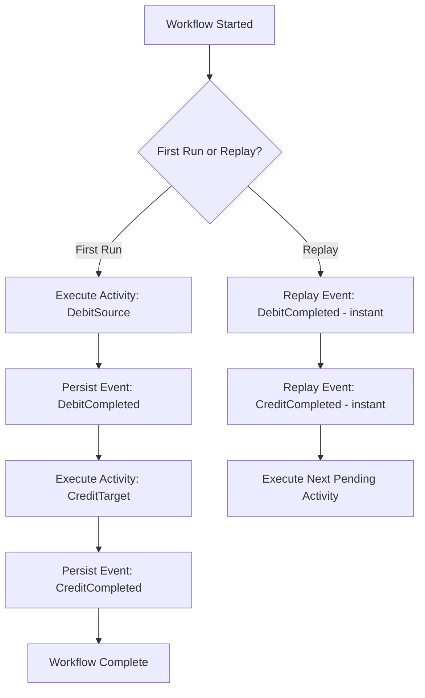
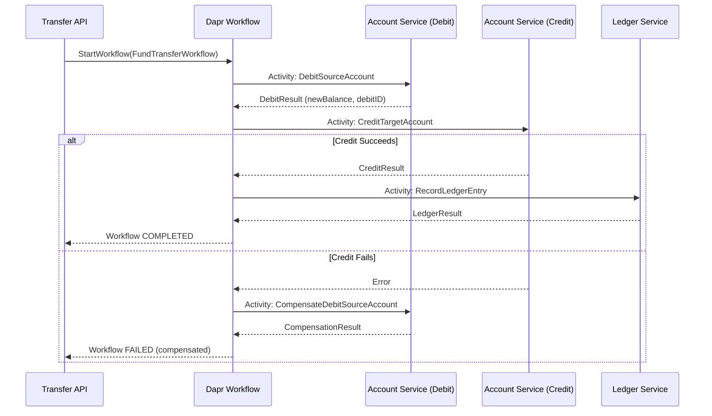

**Answer-first:** Dapr Workflows implement the Saga pattern in Go by coordinating distributed transactions through stateful, durable orchestration. If a step fails, the orchestrator executes compensating transactions in reverse order, ensuring eventual consistency without requiring complex manual state management or two-phase commit overhead.

### What You'll Learn That AI Won't Tell You
- Compensation handlers configuration in Dapr to guarantee atomic rollback.
- How to handle transient workflows when the orchestrator instance restarts mid-transaction.


Most Go developers building microservices know the Choreography Saga pattern: service A emits an event, service B reacts, service C reacts to B, and so on. If step C fails, services emit "compensation" events in reverse order. The pattern works elegantly for simple flows, but breaks down as the number of steps grows: debugging a failed saga requires tracing events across five message broker topics, and implementing compensation logic requires every service to understand the full saga's state.

Dapr Workflow offers a different model: **Orchestrated Saga**. A single orchestrator function owns the entire transaction lifecycle, calls each step explicitly, and manages compensation in a single, readable Go function. The orchestrator is **durable** — it survives process restarts without losing its position in the flow.

This post walks through a complete Go implementation of an Orchestrated Saga using Dapr Workflow, using a fund transfer across three financial microservices as the example.

For the broader financial microservices context, see [Financial Microservices Architecture: Saga & Ledger](/posts/banking-microservices-architecture) and the [Core Banking Developer Learning Path](/series/core-banking-developer/). The modern core banking architecture patterns, including event sourcing and ledger design, are covered in [Part 4: Modern Core Banking Architecture](/series/core-banking-developer/part-4-modern-core-banking-architecture/).

---

## Choreography vs. Orchestration: When Dapr Workflow Becomes the Better Choice

**Choose Dapr Workflow Orchestration when your Saga has 4+ ordered steps with complex, order-dependent compensation — a single orchestrator function owns the entire transaction, calls each step explicitly, and retries failed steps with configurable policies. Choreography (Pub/Sub) is better when services are truly independent and can react to events concurrently without knowing the full flow.**

Both patterns implement the Saga distributed transaction model. The choice between them is architectural:

| Dimension | Choreography (Pub/Sub events) | Orchestration (Dapr Workflow) |
|---|---|---|
| **Coupling** | Services are decoupled from each other | Services coupled to orchestrator API |
| **Flow visibility** | Distributed across event logs | Centralized in one orchestrator function |
| **Compensation logic** | Each service implements its own | Orchestrator manages compensation in sequence |
| **Debugging** | Requires tracing across multiple topics | Single workflow history log |
| **Step count sweet spot** | 2–4 steps | 4+ steps |
| **Failure recovery** | Event replays, DLQ handling per service | Built-in replay and durable state |

**When to choose Dapr Workflow Orchestration:**
- The saga has 4+ ordered steps that must execute in strict sequence
- Compensation logic is complex and order-dependent
- You need a human-readable, inspectable record of every transaction's state
- The business domain requires strong consistency guarantees (financial transactions, order fulfillment)

**When Choreography is better:**
- Services genuinely need to be decoupled and independently deployable without knowledge of the overall flow
- Steps can execute concurrently with no ordering dependency
- The event stream itself provides the audit trail you need

---

## Dapr Workflow Internals: How Durable Execution Works Under the Hood

**Dapr Workflow uses replay-based durable execution: on restart, the orchestrator replays its full history from the state store — completed activities return their recorded results instantly without re-executing. This means the orchestrator function MUST be deterministic: never call `time.Now()` directly; use `ctx.CurrentUTCDateTime()` instead, which returns the deterministic time from the first execution.**

Dapr Workflow is built on the Durable Task Framework. Understanding its execution model is critical to writing correct orchestrators.

When an orchestrator function executes, it does not run as a normal Go function. It runs as a **replay-based state machine**:

1. **First execution**: The orchestrator runs step by step, scheduling each activity (external service call) as an async task.
2. **After a process restart or crash**: When the workflow runtime restarts the orchestrator, it **replays** the entire history of recorded events from the backend state store. Completed activities are not re-executed — their recorded results are returned immediately.
3. **Determinism requirement**: Because the orchestrator is replayed, it **must be deterministic**. Any non-deterministic operation (random numbers, `time.Now()`, reading environment variables) will produce different results on replay and corrupt the workflow state.



This means your orchestrator Go code must never call `time.Now()` directly. Use `ctx.CurrentUTCDateTime()` instead — Dapr Workflow provides this method to return the deterministic time recorded when the step first executed.

---

## Setting Up Dapr Workflow in a Go Microservices Project

**Initialize Dapr Workflow with `workflow.NewWorker()`, then register your orchestrator and all activity functions before calling `w.Start()`. Every function used in `ctx.CallActivity(...)` must be registered — unregistered activities cause a runtime panic. Add `defer w.Shutdown()` to drain in-flight workflows on SIGTERM.**

First, add the Dapr Go SDK:

```bash
go get github.com/dapr/go-sdk@v1.11.0
```

Your Go service needs the Dapr Workflow runtime initialized alongside the Dapr client:

```go
package main

import (
    "context"
    "log"

    dapr "github.com/dapr/go-sdk/client"
    "github.com/dapr/go-sdk/workflow"
)

func main() {
    // Initialize Dapr workflow worker
    w, err := workflow.NewWorker()
    if err != nil {
        log.Fatalf("failed to create workflow worker: %v", err)
    }

    // Register the orchestrator and all activity functions
    if err := w.RegisterWorkflow(FundTransferWorkflow); err != nil {
        log.Fatalf("failed to register workflow: %v", err)
    }
    if err := w.RegisterActivity(DebitSourceAccount); err != nil {
        log.Fatalf("failed to register activity: %v", err)
    }
    if err := w.RegisterActivity(CreditTargetAccount); err != nil {
        log.Fatalf("failed to register activity: %v", err)
    }
    if err := w.RegisterActivity(RecordLedgerEntry); err != nil {
        log.Fatalf("failed to register activity: %v", err)
    }
    if err := w.RegisterActivity(CompensateDebitSourceAccount); err != nil {
        log.Fatalf("failed to register activity: %v", err)
    }

    // Start the worker (connects to Dapr sidecar)
    if err := w.Start(); err != nil {
        log.Fatalf("failed to start workflow worker: %v", err)
    }
    defer w.Shutdown()

    // ... start your HTTP/gRPC server
}
```

---

## Step 1: Defining the Workflow Orchestrator Function

**The orchestrator is the Saga controller: it calls each activity with `ctx.CallActivity(Activity, workflow.ActivityInput(input)).Await(&result)`, handles errors, and triggers compensation by calling compensating activities in sequence. Any error from a compensating activity that itself fails should be escalated as CRITICAL — money may have moved without a corresponding reversal.**

The orchestrator function is the heart of the Saga. It defines the execution order, handles errors, and triggers compensation.

```go
// FundTransferInput carries the saga's input parameters
type FundTransferInput struct {
    TransactionID string  `json:"transaction_id"`
    SourceAccount string  `json:"source_account"`
    TargetAccount string  `json:"target_account"`
    Amount        float64 `json:"amount"`
    Currency      string  `json:"currency"`
}

// FundTransferWorkflow is the Saga orchestrator.
// It MUST be deterministic: no time.Now(), no rand, no env vars.
func FundTransferWorkflow(ctx *workflow.WorkflowContext) (any, error) {
    var input FundTransferInput
    if err := ctx.GetInput(&input); err != nil {
        return nil, fmt.Errorf("failed to get workflow input: %w", err)
    }

    // --- Step 1: Debit the source account ---
    var debitResult DebitResult
    if err := ctx.CallActivity(DebitSourceAccount, workflow.ActivityInput(input)).Await(&debitResult); err != nil {
        // Debit failed — no compensation needed (nothing was charged yet)
        return nil, fmt.Errorf("debit failed: %w", err)
    }

    // --- Step 2: Credit the target account ---
    var creditResult CreditResult
    if err := ctx.CallActivity(CreditTargetAccount, workflow.ActivityInput(input)).Await(&creditResult); err != nil {
        // Credit failed — must compensate the debit
        ctx.GetLogger().Warn("CreditTargetAccount failed, compensating debit", "error", err)
        
        compensateInput := CompensateInput{
            TransactionID: input.TransactionID,
            Account:       input.SourceAccount,
            Amount:        input.Amount,
            Reason:        fmt.Sprintf("credit_failed: %v", err),
        }
        var compensateResult CompensateResult
        if compErr := ctx.CallActivity(CompensateDebitSourceAccount, 
            workflow.ActivityInput(compensateInput)).Await(&compensateResult); compErr != nil {
            // Compensation itself failed — this is a critical alert scenario
            return nil, fmt.Errorf("CRITICAL: compensation failed after credit failure: debit_err=%v, comp_err=%w", err, compErr)
        }
        return nil, fmt.Errorf("transfer failed and compensated: %w", err)
    }

    // --- Step 3: Record the ledger entry (audit trail) ---
    ledgerInput := LedgerInput{
        TransactionID: input.TransactionID,
        DebitResult:   debitResult,
        CreditResult:  creditResult,
        Timestamp:     ctx.CurrentUTCDateTime(), // deterministic time
    }
    var ledgerResult LedgerResult
    if err := ctx.CallActivity(RecordLedgerEntry, workflow.ActivityInput(ledgerInput)).Await(&ledgerResult); err != nil {
        // Ledger recording failed — this is a consistency issue but money moved correctly.
        // Trigger a reconciliation alert rather than compensating the transfer.
        ctx.GetLogger().Error("LedgerEntry failed after successful transfer — reconciliation required",
            "transaction_id", input.TransactionID,
            "error", err)
        // Return partial success to indicate the transfer completed but audit trail needs repair
    }

    return &FundTransferResult{
        TransactionID:  input.TransactionID,
        Status:         "completed",
        LedgerRecorded: err == nil,
    }, nil
}
```

---

## Step 2: Implementing Activity Functions (the Individual Saga Steps)

**Every activity must be idempotent: before executing, check if a ledger entry with the same `TransactionID` (external idempotency key) already exists — if so, return the cached result without repeating the operation. Dapr Workflow retries activities on transient failures; without idempotency, a retry produces a double-debit.**

Each activity is an isolated, idempotent function that performs a single step. Activities can have side effects (database writes, API calls) — unlike the orchestrator, they do not need to be deterministic.

```go
// DebitSourceAccount atomically debits the source account.
// This function MUST be idempotent: if called twice with the same TransactionID, 
// the second call must be a no-op (not a double debit).
func DebitSourceAccount(ctx context.Context, input FundTransferInput) (DebitResult, error) {
    db := dbFromContext(ctx) // retrieve GORM *gorm.DB from context

    var result DebitResult
    err := db.WithContext(ctx).Transaction(func(tx *gorm.DB) error {
        // Idempotency check: has this transaction already been processed?
        var existing LedgerTransaction
        if err := tx.Where("external_id = ? AND type = ?", 
            input.TransactionID, "debit").First(&existing).Error; err == nil {
            // Already processed — return the cached result
            result = DebitResult{
                DebitID:   existing.ID,
                NewBalance: existing.PostBalance,
                Idempotent: true,
            }
            return nil
        } else if !errors.Is(err, gorm.ErrRecordNotFound) {
            return fmt.Errorf("idempotency check failed: %w", err)
        }

        // Lock the account row and check balance
        var account Account
        if err := tx.Set("gorm:query_option", "FOR UPDATE").
            Where("account_number = ?", input.SourceAccount).
            First(&account).Error; err != nil {
            return fmt.Errorf("account not found: %w", err)
        }
        if account.Balance < input.Amount {
            return ErrInsufficientFunds
        }

        // Debit
        newBalance := account.Balance - input.Amount
        if err := tx.Model(&account).Update("balance", newBalance).Error; err != nil {
            return fmt.Errorf("balance update failed: %w", err)
        }

        // Record the ledger entry
        ledger := LedgerTransaction{
            ExternalID:  input.TransactionID,
            Type:        "debit",
            AccountNo:   input.SourceAccount,
            Amount:      input.Amount,
            PostBalance: newBalance,
            CreatedAt:   time.Now(),
        }
        if err := tx.Create(&ledger).Error; err != nil {
            return fmt.Errorf("ledger insert failed: %w", err)
        }

        result = DebitResult{DebitID: ledger.ID, NewBalance: newBalance}
        return nil
    })

    return result, err
}
```

The key pattern here is **idempotency via ExternalID**: before executing the debit, the function checks whether a ledger entry with the same `TransactionID` already exists. If it does, it returns the previously computed result without repeating the operation. This is critical because Dapr Workflow may retry activity calls on transient failures, and without idempotency a retry would produce a double debit.

This idempotency pattern, combined with the Go transaction handling demonstrated here, mirrors the patterns described in [MySQL Database Scaling: Vitess & GORM Sharding](/posts/mysql-scaling-sharding-tidb-architecture) for high-throughput financial writes.

---

## Step 3: Designing and Triggering Compensating Transactions on Failure

**Compensating transactions must be idempotent and recorded as explicit ledger entries — not deletions. Use a composite idempotency key (`TransactionID + ":compensate"`) to prevent double-compensation on retry. Record `LinkedExternalID` pointing to the original transaction for audit trail traceability during reconciliation.**

The compensation for a debit is a credit back to the source account — but it must be recorded as a **reversal**, not simply deleted, to maintain audit trail integrity.

```go
func CompensateDebitSourceAccount(ctx context.Context, input CompensateInput) (CompensateResult, error) {
    db := dbFromContext(ctx)

    var result CompensateResult
    err := db.WithContext(ctx).Transaction(func(tx *gorm.DB) error {
        // Idempotency check for the compensation itself
        var existing LedgerTransaction
        compensateID := input.TransactionID + ":compensate"
        if err := tx.Where("external_id = ? AND type = ?", 
            compensateID, "compensation").First(&existing).Error; err == nil {
            result = CompensateResult{CompensationID: existing.ID, Idempotent: true}
            return nil
        }

        // Find the original debit entry
        var originalDebit LedgerTransaction
        if err := tx.Where("external_id = ? AND type = ?", 
            input.TransactionID, "debit").First(&originalDebit).Error; err != nil {
            return fmt.Errorf("original debit not found for compensation: %w", err)
        }

        // Reverse the balance change
        var account Account
        if err := tx.Set("gorm:query_option", "FOR UPDATE").
            Where("account_number = ?", input.Account).
            First(&account).Error; err != nil {
            return fmt.Errorf("account not found during compensation: %w", err)
        }

        newBalance := account.Balance + input.Amount
        if err := tx.Model(&account).Update("balance", newBalance).Error; err != nil {
            return fmt.Errorf("compensation balance update failed: %w", err)
        }

        // Record the compensation as an explicit ledger entry
        compensation := LedgerTransaction{
            ExternalID:       compensateID,
            Type:             "compensation",
            AccountNo:        input.Account,
            Amount:           input.Amount,
            PostBalance:      newBalance,
            LinkedExternalID: input.TransactionID,
            Reason:           input.Reason,
            CreatedAt:        time.Now(),
        }
        if err := tx.Create(&compensation).Error; err != nil {
            return fmt.Errorf("compensation ledger insert failed: %w", err)
        }

        result = CompensateResult{CompensationID: compensation.ID}
        return nil
    })
    return result, err
}
```

---

## Step 4: Observing Saga State — Querying Workflow Status and History

**Query any workflow instance status using `client.GetWorkflowBeta1(ctx, &dapr.GetWorkflowRequest{InstanceID: transactionID})`. The response includes `RuntimeStatus` (RUNNING/COMPLETED/FAILED), timestamps, and `FailureDetails`. Use this to power a real-time transaction status API — mobile apps and ops dashboards poll it without needing access to internal message queues.**

One of Dapr Workflow's strongest features is built-in state visibility. Every workflow instance stores its full execution history in the configured backend (Redis or a SQL database).

```go
// Query workflow status from any service using the Dapr client
func GetTransactionStatus(ctx context.Context, transactionID string) (*WorkflowStatus, error) {
    client, err := dapr.NewClient()
    if err != nil {
        return nil, err
    }
    defer client.Close()

    resp, err := client.GetWorkflowBeta1(ctx, &dapr.GetWorkflowRequest{
        InstanceID:        transactionID,
        WorkflowComponent: "dapr",
    })
    if err != nil {
        return nil, fmt.Errorf("failed to get workflow state: %w", err)
    }

    return &WorkflowStatus{
        InstanceID:     resp.InstanceID,
        RuntimeStatus:  resp.RuntimeStatus,    // RUNNING, COMPLETED, FAILED
        CreatedAt:      resp.CreatedAt,
        LastUpdated:    resp.LastUpdatedAt,
        FailureDetails: resp.FailureDetails,
    }, nil
}
```

This endpoint can power a real-time transaction status API for your banking application — consumers (mobile apps, ops dashboards) can poll or subscribe to transaction state without needing access to internal message queues.

---

## Production Patterns: Idempotency, Timeouts, and DLQ for Dapr Workflows

**Three production-grade patterns for Dapr Workflow reliability: (1) per-activity timeouts via `workflow.ActivityOptions{StartToCloseTimeout: 30s}` with retry policy (3 attempts, exponential backoff, max 10s interval); (2) workflow-level timeout via `options["workflow-timeout"] = "300s"`; (3) reconciliation worker that polls for FAILED instances every minute and routes to DLQ or ops alert.**

### Activity Timeouts

Every activity should have a timeout to prevent the orchestrator from waiting indefinitely for a hung downstream service:

```go
// Requires: github.com/dapr/go-sdk v1.9+ (workflow.ActivityOptions.RetryPolicy added in v1.9)
// import "github.com/dapr/go-sdk/workflow"

// Set a 30-second timeout per activity call
opts := workflow.ActivityOptions{
    StartToCloseTimeout: 30 * time.Second,
    RetryPolicy: &workflow.RetryPolicy{
        MaxAttempts:        3,
        InitialInterval:    time.Second,
        BackoffCoefficient: 2.0,
        MaxInterval:        10 * time.Second,
    },
}
if err := ctx.CallActivity(CreditTargetAccount, 
    workflow.ActivityInput(input), 
    workflow.WithActivityOptions(opts)).Await(&creditResult); err != nil {
    // Handle timeout or retry exhaustion
}
```

### Workflow-Level Timeout

Set a maximum total duration for the entire saga:

```go
// Start workflow with a 5-minute total timeout
resp, err := client.StartWorkflowBeta1(ctx, &dapr.StartWorkflowRequest{
    WorkflowComponent: "dapr",
    WorkflowName:      "FundTransferWorkflow",
    InstanceID:        transferRequest.TransactionID,
    Options: map[string]string{
        "workflow-timeout": "300s", // 5 minutes
    },
    Input: inputBytes,
})
```

### Dead Letter Handling

Workflows that fail after all retries are exhausted transition to `FAILED` state with a `FailureDetails` payload. Build a reconciliation worker that queries for failed workflow instances and routes them to a DLQ or a human review queue:

```go
func ReconcilationWorker(ctx context.Context, client dapr.Client) {
    ticker := time.NewTicker(1 * time.Minute)
    for {
        select {
        case <-ctx.Done():
            return
        case <-ticker.C:
            // List workflows in FAILED state (implementation depends on your state backend)
            failedInstances := queryFailedWorkflows(ctx)
            for _, instance := range failedInstances {
                routeToDLQ(ctx, instance)
                alertOpsTeam(ctx, instance)
            }
        }
    }
}
```

---

## Real-World Example: A Fund Transfer Saga Across 3 Financial Microservices

**Complete flow: API calls `StartWorkflowBeta1`, Dapr orchestrates DebitSource → CreditTarget → RecordLedger in sequence. On CreditTarget failure, the orchestrator immediately calls CompensateDebitSource to reverse the charge. Every step is persisted in the state store — if the Dapr sidecar restarts mid-transfer, replay resumes from the last completed checkpoint without re-executing completed activities.**

Putting it all together, the complete fund transfer saga flow:



This flow is inspectable at every step via the Dapr dashboard or the workflow status API. Every intermediate state is persisted. If the Dapr sidecar restarts mid-transfer, the workflow replays from the last completed checkpoint without re-executing completed activities.

For teams combining Dapr Workflow with the full Dapr event-driven ecosystem (Pub/Sub, State, Bindings), see [Mastering Event-Driven Architecture with Dapr](/posts/mastering-event-driven-architecture-dapr) for the broader integration patterns.

---

## Frequently Asked Questions

### What is the difference between Dapr Workflow and Dapr Pub/Sub for Sagas?
Dapr Pub/Sub implements choreography-based Sagas: services react to events independently, with no central coordinator. Dapr Workflow implements orchestration-based Sagas: a single orchestrator function explicitly calls each step and manages compensation. Workflow provides better observability (centralized history log), simpler compensation logic, and durable state — but introduces a coordinator as a new dependency.

### How does Dapr Workflow handle failures and retries?
Dapr Workflow supports per-activity retry policies with configurable max attempts, initial interval, backoff coefficient, and max interval. Activities that fail are retried according to their policy before the orchestrator receives the error. Activity functions must be idempotent to handle retries safely — using an external transaction ID as an idempotency key in the database is the standard pattern.

### Is Dapr Workflow production-ready?
Dapr Workflow (based on the Durable Task Framework) reached stable status in Dapr v1.12 (mid-2024). The Go SDK has stable workflow APIs from v1.11. Production considerations: choose a reliable backend (Redis Cluster or PostgreSQL via the dapr-workflow-backend component) for workflow state storage, and monitor the Dapr sidecar resource consumption under high workflow throughput.

For the observability layer on top of these workflows — how to propagate W3C trace context through Kafka headers, configure tail-based sampling, and redact PII at the OTel Collector — see [Go Microservices Distributed Tracing Architecture](/posts/go-microservices-distributed-tracing-architecture). For a comprehensive look at the entire production stack, see the [Go Microservices Architecture: Production Guide](/posts/go-microservices/).


