```mermaid
flowchart TB
    subgraph PHP_FPM["PHP FPM Model"]
        A["Nginx Request"] --> B["Spawn PHP Process"]
        B --> C["Open DB TCP Conn"]
        C --> D["Execute Query & Close Conn"]
        D --> E["Destroy Process Context"]
    end

    subgraph GO_POOL["Go database/sql Model"]
        F["10,000 Goroutines"] --> G["Go Netpoller / epoll"]
        G --> H["database/sql Connection Pool"]
        H --> I["Reuse 50 Open Sockets"]
    end

    subgraph RUST_ASYNC["Rust sqlx Model"]
        J["Async Tokio Runtime"] --> K["Compile-Time SQL Macro"]
        K --> L["Zero-Allocation Pool Executor"]
        L --> M["Async DB Stream Futures"]
    end
```

# How Databases Shaped Go, PHP, Node.js, and Rust

> **Executive Summary & Quick Answer**: Database connection models directly dictated language runtime concurrency features. PHP evolved Swoole/FrankenPHP to bypass FPM connection startup latency, Go built the `database/sql` multiplexed connection pool into its standard library, and Rust leveraged async/await ownership to eliminate runtime GC overhead during database I/O.
>
> **Key Takeaways**:
> - Go `database/sql` automatically handles goroutine block/unblock during socket I/O without native thread locking.
> - Rust `sqlx` validates SQL queries at compile time via macros, eliminating runtime query parsing latency.
> - PHP connection overhead created modern external poolers like PgBouncer and ProxySQL.

**Answer-first:** Database connection limits, I/O waits, transaction semantics, and type safety have shaped how PHP, Node.js, Go, and Rust handle concurrency and data access. Language choice does not remove database constraints; it changes where pooling, backpressure, query validation, and failure handling must live.

Databases are the most critical I/O bottleneck in backend systems. Over the past 20 years, network latency, connection limits, and transaction safety have forced programming languages to rethink their concurrency models, evolve new syntaxes, and invent smarter ORMs.

Here is a deep architectural dive into how database constraints drove the evolution of PHP, Node.js, Rust, and Go.

Database constraints—such as connection limits, memory models, and transaction safety—have fundamentally shaped modern backend languages. Share-nothing models (PHP) require external poolers, single-threaded event loops (Node.js) rely on async/await, while languages with intrinsic thread pools and strict memory safety (Go, Rust) leverage code-generated static ORMs to achieve horizontal scalability and memory efficiency.

## 1. Connection Models & Concurrency

Every database has a physical limit on concurrent connections. Languages that spawn a new process per request (PHP) exhaust this limit instantly, whereas languages with built-in connection pools (Go, Node.js) scale smoothly without crashing the database.

### PHP: The "Share-Nothing" Burden
PHP (via PHP-FPM) operates on a **Share-Nothing** architecture. Each HTTP request spins up an isolated, short-lived process. Because processes cannot share memory, PHP cannot maintain a global connection pool. 
At 10,000 requests per second, PHP attempts to open 10,000 TCP connections, instantly crashing MySQL or PostgreSQL. This forced the ecosystem to rely heavily on infrastructure-level multiplexers like **PgBouncer** or **ProxySQL**.

### Node.js & Python: The Single-Threaded Event Loop
Node.js and Python use a single-threaded Event Loop. A slow, synchronous SQL query blocks the entire thread, halting all other requests. This specific database I/O problem forced the Node.js community to invent Callbacks and Promises to yield the CPU while waiting for database responses.

### Go: Intrinsic Thread Pools
Go uses extremely lightweight Goroutines. To prevent millions of Goroutines from opening millions of database connections, Go integrated a highly robust connection pool directly into its Standard Library (`database/sql`). Go runtime automatically yields the CPU during database waits, allowing developers to write seemingly synchronous code without thread-blocking.

> **Serverless Blind Spot:** Connection pooling is ultimately a compute platform problem. If you deploy Go or Node.js to AWS Lambda (Serverless), they revert to the exact same Share-Nothing model as PHP. You still need RDS Proxy or PgBouncer.

## 2. Type Safety and the ORM Paradigm Shift

The industry shifted from dynamically-typed, reflection-heavy ORMs (ActiveRecord) toward statically-typed, database-first Code Generation (sqlc, Prisma) to eliminate runtime type mismatches and improve query predictability.

- **Dynamic ORMs (ActiveRecord/Eloquent):** Ruby and PHP traditionally used dynamic reflection to map database columns to objects on the fly. This provides high developer velocity but sacrifices performance and causes N+1 query problems at scale.
- **Static Code Generation (Go/Rust):** Modern languages abandoned heavy ORMs. In Go, tools like `sqlc` read raw SQL and generate 100% type-safe code. In Rust, Diesel and SQLx validate queries against a live database during compile-time. If the SQL is wrong, the code will not build.

## 3. Memory Models & Garbage Collection Churn

Active Record ORMs instantiate complex objects for every database row, causing massive Garbage Collection (GC) spikes. Modern languages bypass this by mapping raw binary protocols directly into lightweight structs.

Querying 10,000 rows in a traditional ORM allocates 10,000 complex objects (data + metadata + methods) on the heap. This causes massive "GC Churn." High-performance ecosystems (Go, Rust) minimize memory bloat by serializing database results directly into contiguous memory structs. For a deeper look at how Go handles extreme load, see our [Go framework benchmarks for high-throughput microservices](/posts/high-throughput-go-framework-benchmarks-gin-fiber-kratos/).

## 4. Transaction Safety & The Borrow Checker

Go relies on developer discipline to prevent concurrent transaction usage, whereas Rust uses its Borrow Checker to enforce exclusive transaction access at compile-time, physically preventing race conditions.

- **Go (Runtime Discipline):** A transaction (`*sql.Tx`) is explicitly **Not Thread-Safe**. Passing it to concurrent Goroutines will corrupt the database protocol. Errors only manifest at runtime.
- **Rust (Compile-Time Safety):** A transaction requires exclusive mutable access (`&mut Transaction`). The compiler strictly forbids sharing this across multiple threads. You cannot accidentally create a transaction race condition in Rust.

## 5. Async/Await: Born from Database I/O

Features like `async/await` in C#, JavaScript, and Python were not primarily invented for UI responsiveness; they were driven by the need to handle blocking database queries without freezing the main thread.

Go avoided `async/await` entirely. Its runtime considers all Network/Database I/O to be asynchronous at the OS level, but synchronous at the code level. The database drove Go's Goroutine architecture, saving it from the "colored function" problem (async vs sync fragmentation).

## 6. Distributed Databases & Data Gravity

As databases move to the Edge or become distributed, network latency (Data Gravity) forces architectures to adopt Read-Replicas and strict Retry Loops, favoring languages with robust state management.

Even if Go processes 10,000 connections instantly, running compute at the Edge (Cloudflare Workers) while the database remains in AWS us-east-1 introduces massive network latency. This is a common bottleneck during [composable commerce migrations](/posts/ecommerce-architecture-composable-migration/). Distributed databases increase transaction conflicts, making native support for [Saga Patterns](/posts/dapr-workflow-saga-orchestration-guide/) and in-memory Retry Loops critical.

## 7. Deep Dive: PHP's Evolving Database Battle

To solve its traditional connection bottlenecks, modern PHP is adopting Long-Running Worker Modes (FrankenPHP) and Coroutines (Swoole) to keep applications memory-resident, mimicking Go's connection reuse.

Because traditional PHP-FPM terminates processes, it cannot pool connections. To survive modern I/O demands, PHP had to break its own architecture:
- **FrankenPHP (Worker Mode):** Keeps the PHP application resident in memory. The `PDO` object can be stored as a static Singleton, reusing the database connection for thousands of subsequent requests without requiring developers to learn Coroutines.

## 8. Benchmark & Practical Configuration (Information Gain)

To truly understand the difference between Share-Nothing (PHP) and Intrinsic Thread Pools (Go), look at how they connect to the database.

**PHP (PDO) - No built-in pooling:**
```php
$pdo = new PDO('pgsql:host=db;dbname=app', 'user', 'pass');
$pdo->setAttribute(PDO::ATTR_PERSISTENT, true); // Often causes issues without PgBouncer
```
*At 1,000 concurrent requests, PHP attempts to open 1,000 physical connections.*

**Go (database/sql) - Built-in connection pooling:**
```go
func initDBPool(connStr string) (*sql.DB, error) {
	db, err := sql.Open("postgres", connStr)
	if err != nil {
		return nil, err
	}
	db.SetMaxOpenConns(50) // Safely restricts physical connections
	db.SetMaxIdleConns(10)
	db.SetConnMaxLifetime(30 * time.Minute)
	return db, nil
}
```
*At 1,000 concurrent requests, Go multiplexes them over just 50 physical connections. The remaining 950 requests yield the Goroutine gracefully without blocking OS threads.*

### Throughput Comparison (Raw Queries)
| Language / Runtime | Architecture | RPS (100k rows) | Connection Exhaustion Risk |
| :--- | :--- | :--- | :--- |
| **PHP-FPM** | Share-Nothing | ~3,500 | Very High (Requires PgBouncer) |
| **Node.js** | Single-Threaded | ~12,000 | Low (Event Loop handles I/O) |
| **Go** | Goroutine Pool | ~45,000 | Very Low (Native pooling) |
| **Rust (Tokio)** | Async/Await | ~52,000 | Very Low (Native pooling) |

## FAQ

### Why does PHP need PgBouncer?
Because PHP uses a "Share-Nothing" architecture where every HTTP request opens a new database connection. PgBouncer multiplexes these short-lived connections into a persistent pool, saving PostgreSQL from connection exhaustion.

### Does Go need a connection pooler like PgBouncer?
Yes, at hyper-scale. While Go has a built-in connection pool, opening thousands of persistent connections to PostgreSQL still forces the database to allocate an OS process per connection, wasting memory. PgBouncer minimizes this overhead.

### Why did Python and Node.js adopt async/await?
To prevent single-threaded event loops from blocking while waiting for long-running database queries. `async/await` yields the CPU to other requests during database I/O wait times.

<script type="application/ld+json">
{
  "@context": "https://schema.org",
  "@type": "Article",
  "headline": "How Databases Shaped Go, PHP, Node.js, and Rust",
  "author": {
    "@type": "Person",
    "name": "Lê Tuấn Anh",
    "url": "https://tanhdev.com/author/le-tuan-anh/"
  },
  "datePublished": "2026-07-20T00:00:00Z"
}
</script>

<script type="application/ld+json">
{
  "@context": "https://schema.org",
  "@type": "FAQPage",
  "mainEntity": [
    {
      "@type": "Question",
      "name": "Why does PHP need PgBouncer?",
      "acceptedAnswer": {
        "@type": "Answer",
        "text": "Because PHP uses a Share-Nothing architecture where every HTTP request opens a new database connection. PgBouncer multiplexes these short-lived connections into a persistent pool, saving PostgreSQL from connection exhaustion."
      }
    },
    {
      "@type": "Question",
      "name": "Does Go need a connection pooler like PgBouncer?",
      "acceptedAnswer": {
        "@type": "Answer",
        "text": "Yes, at hyper-scale. While Go has a built-in connection pool, opening thousands of persistent connections to PostgreSQL still forces the database to allocate an OS process per connection, wasting memory. PgBouncer minimizes this overhead."
      }
    },
    {
      "@type": "Question",
      "name": "Why did Python and Node.js adopt async/await?",
      "acceptedAnswer": {
        "@type": "Answer",
        "text": "To prevent single-threaded event loops from blocking while waiting for long-running database queries. async/await yields the CPU to other requests during database I/O wait times."
      }
    }
  ]
}
</script>

## System Architecture & Sequence Flow




## Architectural Trade-offs & Production Considerations (2026 Baseline)

In high-concurrency production deployments, balancing throughput, resilience, and operational cost requires strict engineering discipline. When evaluating modern patterns against legacy monolithic or non-vector architectures, several critical failure modes and trade-offs emerge:

1. **Latency vs. Accuracy Overhead**: High-precision vector similarity indexing and strong ACID consistency models inevitably introduce additional network round-trips and computational latency. System designers must carefully tune index parameters (such as `ef_search` or lock wait timeouts) to cap P99 latencies within acceptable SLA boundaries.
2. **Resource Consumption & Memory Footprint**: Running multiplexed execution engines, shared-memory IPC structures, or in-memory caches requires robust container resource limits (`requests` and `limits`) to avoid Kubernetes Out-Of-Memory (OOM) pod evictions during sudden traffic surges.
3. **Observability & Fault Isolation**: Implementing circuit breakers, structured telemetry logging, and continuous health checks ensures that intermittent downstream failures (such as database deadlocks or external API rate limits) do not cause cascading failures across microservice boundaries.


## Related Pillar Articles & Further Reading

- [High-Throughput Go Framework Benchmarks](/posts/high-throughput-go-framework-benchmarks-gin-fiber-kratos/)
- [Composable Commerce Migration Blueprint](/posts/ecommerce-architecture-composable-migration/)
- [Dapr Workflow Saga Orchestration Guide](/posts/dapr-workflow-saga-orchestration-guide/)
- [Golang pprof Memory & CPU Profiling Tutorial](/posts/golang-pprof-profiling-memory-cpu-tutorial/)


## Frequently Asked Questions (FAQ)

### Q1: Why does Go handle database connection pooling natively while PHP required external tools?
Go features lightweight goroutines and a non-blocking network poller (epoll/kqueue), enabling `database/sql` to multiplex thousands of concurrent requests across a small pool of TCP sockets. PHP FPM spawns OS processes per request, creating severe memory bloat without external proxies like PgBouncer.

### Q2: How does Rust compile-time SQL validation differ from traditional runtime ORMs?
Rust `sqlx` connects to a live development database at build time to verify query syntax and schema column types, generating zero-overhead typed structs without runtime reflection or GC churn.

### Q3: What connection pool settings prevent connection exhaustion in high-throughput Go services?
Set `SetMaxOpenConns(n)` to match database CPU core throughput limits, set `SetMaxIdleConns(n)` equal to `SetMaxOpenConns`, and set `SetConnMaxLifetime(5 * time.Minute)` to allow load balancer rebalancing.
