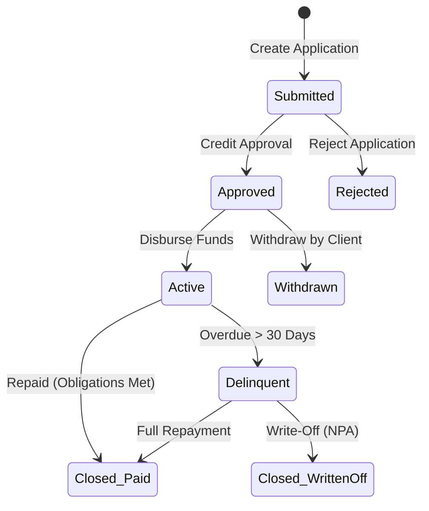

**Answer-first:** Microfinance core banking requires a decentralized architecture: a double-entry ledger for transaction auditing, a joint liability group (JLG) loan engine with optimistic concurrency controls, modular interest/amortization processors, and parallelized worker pools to handle heavy End-of-Day batch processing.

### What You'll Learn That AI Won't Tell You
- How to prevent phantom funds in double-entry ledgers by writing strict write-once, append-only transaction logs.
- Optimistic concurrency control implementations using version-checks and `SELECT ... FOR UPDATE` that survived concurrent interest calculations on 50,000 active accounts.

Building a Core Banking System (CBS) for a Microfinance Institution (MFI) presents a radically different set of engineering challenges compared to traditional retail banking. While commercial banks focus heavily on individual credit scores and card networks, microfinance operates on high-frequency, low-value transactions, group-based lending, and offline field collections. 

If you are an engineer or Business Analyst transitioning into fintech, understanding the architectural nuances of platforms like Apache Fineract (Mifos X) or Musoni is critical. In this guide, we will break down the 5 must-have modules of a Microfinance CBS, providing the database schemas, mathematical formulas, double-entry mappings, and the actual Product Requirements Document (PRD) snippets you need to build them.

---

## The Fundamental Difference: Joint Liability

The cornerstone of microfinance is the **Joint Liability Group (JLG)**. Because borrowers often lack traditional collateral, they are grouped into "centers" of 5 to 10 individuals who co-guarantee each other's loans. If one member defaults, the entire group is held liable, and their collective savings are locked. This dramatically shifts how the CIF (Customer Information File) and Loan engines must be architected.

### Module 1: CIF, KYC, and Joint Liability Groups (JLGs)

In a JLG architecture, the system must track individual amortization schedules while allowing group-level administrative workflows. 

**Database Schema Mapping:**
*   `m_group`: Represents the physical group (meeting day, assigned credit officer).
*   `m_client`: Represents individual borrowers.
*   `m_loan`: Stores loan details. For JLG loans, the `loan_type_enum` is set to JLG, and both `client_id` and `group_id` are populated. This prevents the "monolithic group loan" anti-pattern and preserves individual tracking.

> **User Story:** As a Credit Officer, I want to link multiple individual borrower profiles into a single Joint Liability Group (JLG), so that the system can automatically enforce collective co-guarantees and track group-level risk.

**Acceptance Criteria:**
* **Given** Borrowers A, B, and C are linked under JLG "Center 1".
* **When** Borrower A defaults on their principal repayment by > 30 days.
* **Then** the system must automatically transition the JLG status to "Delinquent".
* **And** place a temporary withdrawal lock on the linked savings accounts of co-guarantors B and C.

---

### Module 2: Loan Management and the Amortization Engine

The credit engine handles the heavy mathematical lifting. MFIs typically utilize two primary interest calculation methods, which must be strictly immutable once a loan is active.

1. **Flat Rate**: Interest is calculated once on the initial principal and remains constant for every installment. 
2. **Declining Balance (Reducing)**: Interest is calculated periodically on the outstanding principal balance. The standard annuity formula for Equated Monthly Installments (EMI) is:
$$EMI = \frac{i \times P}{1 - (1 + i)^{-n}}$$
*(Where $i$ is the interest rate per period, $P$ is outstanding principal, and $n$ is the total remaining installments).*

> **User Story:** As a System Administrator, I want to configure a Declining Balance loan product with Equated Monthly Installments (EMI), so that interest is mathematically charged only on the outstanding principal balance.

**Acceptance Criteria (Payment Allocation Logic):**
* **Given** an active loan has current dues of: $10 penalties, $5 fees, $20 interest, and $100 principal.
* **When** the borrower makes a partial repayment of $25.
* **Then** the system must first clear the $10 penalty and $5 fee *(strict allocation order: Penalties $\rightarrow$ Fees $\rightarrow$ Interest $\rightarrow$ Principal)*.
* **And** allocate the remaining $10 to interest.
* **And** update the outstanding balances to reflect $10 interest and $100 principal remaining due.

---

### Module 3: CASA and Compulsory Savings Logic

To mitigate risk, MFIs utilize Compulsory Savings as cash collateral. The CBS must seamlessly bridge the CASA (Current Account, Savings Account) module with the Loan module.

The system places a `HOLD_FUNDS` constraint on the client's linked savings account equal to the product's collateral requirement (e.g., 20% of the disbursed loan). As the loan is repaid, the system must execute `RELEASE_FUNDS` commands proportionally.

> **User Story:** As a Risk Manager, I want the system to automatically hold a defined percentage of a disbursed loan as mandatory savings, so that the institution has accessible cash collateral against defaults.

**Acceptance Criteria:**
* **Given** a borrower has a $1000 active loan with a 20% collateral requirement ($200 currently locked in savings via `enforceMinRequiredBalance`).
* **When** the borrower repays $500 of the loan principal.
* **Then** the system must recalculate the required hold to $100 (20% of $500).
* **And** release $100 in the savings account, making it immediately available for withdrawal.

---

### Module 4: Teller Operations, Cash Vaults, and Batch Repayments

Because transactions happen offline in village centers and are brought back to the branch, high-volume cash batching is crucial. Teller hierarchy maps physical cash to the General Ledger: 
**Main Vault (GL: 1001) $\rightarrow$ Branch Vault (GL: 1002) $\rightarrow$ Cashier Till (GL: 1003).**

To process a meeting, the CBS provides **Collection Sheets**—a single API payload containing repayments and savings deposits for 20+ group members at once.

> **User Story:** As a Teller, I want to use a Collection Sheet to process repayments for an entire center meeting in a single transaction, so that I can efficiently handle high-volume cash collections without manual entry for every individual.

**Acceptance Criteria:**
* **Given** a teller submits a Collection Sheet containing 20 JLG member repayments.
* **When** member #15's repayment data fails system validation.
* **Then** the system must reject the entire Collection Sheet.
* **And** roll back the ledger transactions for all other 19 members (ACID transaction enforcement).
* **And** log an exception detailing the specific row error for the teller to correct.

---

### Module 5: The General Ledger and Double-Entry Engine

Every lifecycle event must post a strict double-entry journal to the `acc_gl_journal_entry` table, keeping Assets, Liabilities, Equity, Revenues, and Expenses balanced.

| Lifecycle Event | Account Debited | Account Credited | Account Type (Dr / Cr) |
| :--- | :--- | :--- | :--- |
| **Disbursement** | Loan Receivable | Cash / Bank | Asset (+) / Asset (-) |
| **Repayment (Normal)** | Cash / Bank | Loan Receivable / Interest Income | Asset (+) / Asset (-) / Revenue (+) |
| **Interest Accrual** | Interest Receivable | Interest Income | Asset (+) / Revenue (+) |
| **Write-Off (NPA)** | Allowance for Loan Losses | Loan Receivable | Contra-Asset (+) / Asset (-) |

> **User Story:** As a Finance Manager, I want every core banking lifecycle event to automatically post double-entry journals, so that the General Ledger (GL) remains perfectly balanced in real-time.

**Acceptance Criteria:**
* **Given** the EOD batch job triggers the Accrual sequence.
* **When** exactly $5.00 of interest is accrued on an active loan.
* **Then** the system must create an immutable journal entry with a $5.00 Debit to "Interest Receivable" and a $5.00 Credit to "Interest Income".

---

## QA Focus: Testing Core Banking State Machines and EOD Jobs

When testing a CBS, QA engineers must rigorously validate two areas: the State Machine and the End-of-Day (EOD) Batch sequence.

### The Loan Lifecycle State Machine
Just as we explored the [state machine logic in complex e-commerce platforms](/posts/deconstructing-ecommerce-service-details-domain/), a loan account relies on strict transition commands (`approve`, `disburse`, `undo-disbursal`, `write-off`).

**QA Scenario:** If an API command attempts to `Disburse` a loan currently in the `Submitted` state, the system must block the transition. It must be explicitly `Approved` first.

### EOD Batch Processing Resilience
The Close of Business (COB) runs a strict sequence: **Transaction Posting $\rightarrow$ Accruals $\rightarrow$ Penalties $\rightarrow$ Reconciliation $\rightarrow$ Day Close**. 

Because modern CBS architectures manage millions of loans, they rely on distributed processing (like Spring Batch Remote Partitioning). The manager node splits the data, and worker nodes process it concurrently. Instead of monolithic batch windows, we are increasingly seeing banks [handling EOD jobs with event-driven architecture](/posts/mastering-event-driven-architecture-dapr/) to minimize downtime.

**QA Scenario:** If the EOD job processes 10,000 loans and loan #5045 encounters a rounding exception, the system must isolate #5045 into a **Dead Letter Queue (DLQ)** and successfully complete the remaining 9,999 loans without halting the entire batch.

---

*This article is part of our `core-banking-developer` series exploring scalable fintech architecture.*

**Continue Reading:** The [Core Banking Developer Learning Path](/series/core-banking-developer/) series goes deeper on ACID transactions, ISO 8583/20022 standards, and building a complete mini banking system from scratch.

For the broader strategic picture — how banks replace monolithic cores like Temenos T24 with full composable architectures using Go microservices, Saga orchestration, and Strangler Fig migrations — see [Composable Banking Architecture: From Monolith to Modular Core](/posts/composable-banking-architecture).

**Related Reading:** For the broader landscape of engineers working on core banking systems and the skills they need, see [The Landscape of Core Banking Developers](/series/core-banking-developer/executive-summary/). For a contrast at global scale — how PayPay applies similar transaction ledger and idempotency patterns for 70M users — see [PayPay Architecture: Scaling Payments to 70M Users](/posts/paypay-architecture-scaling/). For the architectural framework and ISO standards behind modern core banking, see the [Core Banking Architecture series](/series/core-banking-architecture/).



## FAQ


A double-entry ledger ensures that every financial transaction consists of equal and offsetting debit and credit entries, guaranteeing that the fundamental accounting equation remains balanced. This is crucial for auditability and compliance, preventing database synchronization errors from creating phantom funds or balance discrepancies.



We use strict database transactions (`SELECT ... FOR UPDATE`) to lock account rows, combined with optimistic concurrency control (`version` checks) at the application level. All ledger entries are write-once, append-only logs. For End-of-Day (EOD) batch updates, we process transactions using parallel Go worker pools coordinated via channels and sync groups, wrapping each account calculation in a nested SQL transaction.

