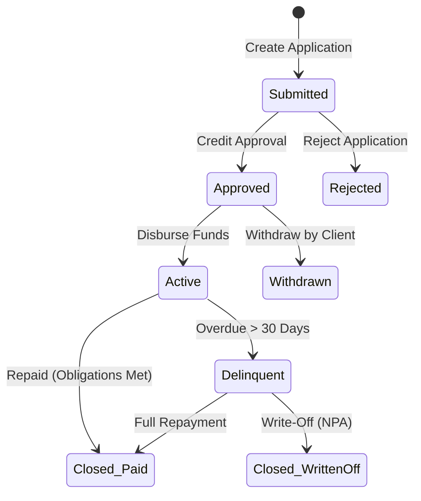

# Microfinance Core Banking: Architecture & Engineering Guide

**Answer-first:** Deconstructing microfinance core banking architecture decouples interest calculation engines, double-entry ledgers, and loan disbursement pipelines into event-driven Go microservices. 

Building a Core Banking System (CBS) for a Microfinance Institution (MFI) presents a radically different set of engineering challenges compared to traditional retail banking. While commercial banks focus heavily on individual credit scores and card networks, microfinance operates on high-frequency, low-value transactions, group-based lending, and offline field collections. 

If you are an engineer or Business Analyst transitioning into fintech, understanding the architectural nuances of platforms like Apache Fineract (Mifos X) or Musoni is critical. This guide we will break down the 5 must-have modules of a Microfinance CBS, providing the database schemas, mathematical formulas, double-entry mappings, and the actual Product Requirements Document (PRD) snippets you need to build them.

---

## The Fundamental Difference: Joint Liability

Because individual borrowers frequently lack traditional physical collateral, microfinance systems group borrowers into collective units that co-guarantee each member's loan obligations.

### Module 1: CIF, KYC, and Joint Liability Groups (JLGs)

In a JLG architecture, the system must track individual amortization schedules while allowing group-level administrative workflows. 

**Database Schema Mapping:**
*   `m_group`: Represents the physical group (meeting day, assigned credit officer).
*   `m_client`: Represents individual borrowers.
*   `m_loan`: Stores loan details. For JLG loans, the `loan_type_enum` is set to JLG, and both `client_id` and `group_id` are populated. This prevents the "monolithic group loan" anti-pattern and preserves individual tracking.

> **User Story:** As a Credit Officer, I want to link multiple individual borrower profiles into a single Joint Liability Group (JLG), so that the system can automatically enforce collective co-guarantees and track group-level risk.

**Acceptance Criteria:**
* **Given** Borrowers A, B, and C are linked under JLG "Center 1".
* **When** Borrower A defaults on their principal repayment by > 30 days.
* **Then** the system must automatically transition the JLG status to "Delinquent".
* **And** place a temporary withdrawal lock on the linked savings accounts of co-guarantors B and C.

---

### Module 2: Loan Management and the Amortization Engine

The credit engine handles the heavy mathematical lifting. MFIs typically utilize two primary interest calculation methods, which must be strictly immutable once a loan is active.

1. **Flat Rate**: Interest is calculated once on the initial principal and remains constant for every installment. 
2. **Declining Balance (Reducing)**: Interest is calculated periodically on the outstanding principal balance. The standard annuity formula for Equated Monthly Installments (EMI) is:
$$EMI = \frac{i \times P}{1 - (1 + i)^{-n}}$$
*(Where $i$ is the interest rate per period, $P$ is outstanding principal, and $n$ is the total remaining installments).*

> **User Story:** As a System Administrator, I want to configure a Declining Balance loan product with Equated Monthly Installments (EMI), so that interest is mathematically charged only on the outstanding principal balance.

**Acceptance Criteria (Payment Allocation Logic):**
* **Given** an active loan has current dues of: $10 penalties, $5 fees, $20 interest, and $100 principal.
* **When** the borrower makes a partial repayment of $25.
* **Then** the system must first clear the $10 penalty and $5 fee *(strict allocation order: Penalties $\rightarrow$ Fees $\rightarrow$ Interest $\rightarrow$ Principal)*.
* **And** allocate the remaining $10 to interest.
* **And** update the outstanding balances to reflect $10 interest and $100 principal remaining due.

---

### Module 3: CASA and Compulsory Savings Logic

To mitigate risk, MFIs utilize Compulsory Savings as cash collateral. The CBS must programmatically bridge the CASA (Current Account, Savings Account) module with the Loan module.

The system places a `HOLD_FUNDS` constraint on the client's linked savings account equal to the product's collateral requirement (e.g., 20% of the disbursed loan). As the loan is repaid, the system must execute `RELEASE_FUNDS` commands proportionally.

> **User Story:** As a Risk Manager, I want the system to automatically hold a defined percentage of a disbursed loan as mandatory savings, so that the institution has accessible cash collateral against defaults.

**Acceptance Criteria:**
* **Given** a borrower has a $1000 active loan with a 20% collateral requirement ($200 currently locked in savings via `enforceMinRequiredBalance`).
* **When** the borrower repays $500 of the loan principal.
* **Then** the system must recalculate the required hold to $100 (20% of $500).
* **And** release $100 in the savings account, making it immediately available for withdrawal.

---

### Module 4: Teller Operations, Cash Vaults, and Batch Repayments

Because transactions happen offline in village centers and are brought back to the branch, high-volume cash batching is crucial. Teller hierarchy maps physical cash to the General Ledger: 
**Main Vault (GL: 1001) $\rightarrow$ Branch Vault (GL: 1002) $\rightarrow$ Cashier Till (GL: 1003).**

To process a meeting, the CBS provides **Collection Sheets**—a single API payload containing repayments and savings deposits for 20+ group members at once.

> **User Story:** As a Teller, I want to use a Collection Sheet to process repayments for an entire center meeting in a single transaction, so that I can efficiently handle high-volume cash collections without manual entry for every individual.

**Acceptance Criteria:**
* **Given** a teller submits a Collection Sheet containing 20 JLG member repayments.
* **When** member #15's repayment data fails system validation.
* **Then** the system must reject the entire Collection Sheet.
* **And** roll back the ledger transactions for all other 19 members (ACID transaction enforcement).
* **And** log an exception detailing the specific row error for the teller to correct.

---

### Module 5: The General Ledger and Double-Entry Engine

Every lifecycle event must post a strict double-entry journal to the `acc_gl_journal_entry` table, keeping Assets, Liabilities, Equity, Revenues, and Expenses balanced.

| Lifecycle Event | Account Debited | Account Credited | Account Type (Dr / Cr) |
| :--- | :--- | :--- | :--- |
| **Disbursement** | Loan Receivable | Cash / Bank | Asset (+) / Asset (-) |
| **Repayment (Normal)** | Cash / Bank | Loan Receivable / Interest Income | Asset (+) / Asset (-) / Revenue (+) |
| **Interest Accrual** | Interest Receivable | Interest Income | Asset (+) / Revenue (+) |
| **Write-Off (NPA)** | Allowance for Loan Losses | Loan Receivable | Contra-Asset (+) / Asset (-) |

> **User Story:** As a Finance Manager, I want every core banking lifecycle event to automatically post double-entry journals, so that the General Ledger (GL) remains perfectly balanced in real-time.

**Acceptance Criteria:**
* **Given** the EOD batch job triggers the Accrual sequence.
* **When** exactly $5.00 of interest is accrued on an active loan.
* **Then** the system must create an immutable journal entry with a $5.00 Debit to "Interest Receivable" and a $5.00 Credit to "Interest Income".

---

## QA Focus: Testing Core Banking State Machines and EOD Jobs

Quality assurance for microfinance core banking platforms requires comprehensive verification of domain state machines and End-of-Day batch processing pipelines. QA engineers must design automated test scenarios that validate allowed state transitions, verify serializable transaction isolation, and test dead-letter queue exception recovery under heavy batch loads.

### The Loan Lifecycle State Machine
Just as we explored state machine logic in complex platforms, a loan account relies on strict transition commands (`approve`, `disburse`, `undo-disbursal`, `write-off`). The state diagram below illustrates the mandatory lifecycle states and allowed transition triggers for a microfinance loan account:


```mermaid
stateDiagram-v2
    [*] --> Submitted: Create Application
    Submitted --> Approved: Credit Approval
    Submitted --> Rejected: Reject Application
    Approved --> Active: Disburse Funds
    Approved --> Withdrawn: Withdraw by Client
    Active --> Closed_Paid: Repaid (Obligations Met)
    Active --> Delinquent: Overdue > 30 Days
    Delinquent --> Closed_Paid: Full Repayment
    Delinquent --> Closed_WrittenOff: Write-Off (NPA)
```

**QA Scenario:** If an API command attempts to `Disburse` a loan currently in the `Submitted` state, the system must block the transition. It must be explicitly `Approved` first.

### EOD Batch Processing Resilience
The Close of Business (COB) runs a strict sequence: **Transaction Posting $\rightarrow$ Accruals $\rightarrow$ Penalties $\rightarrow$ Reconciliation $\rightarrow$ Day Close**. 

Because modern CBS architectures manage millions of loans, they rely on distributed processing (like Spring Batch Remote Partitioning). The manager node splits the data, and worker nodes process it concurrently. Instead of monolithic batch windows, we are increasingly seeing banks [handling EOD jobs with event-driven architecture](/posts/mastering-event-driven-architecture-dapr/) to minimize downtime.

**QA Scenario:** If the EOD job processes 10,000 loans and loan #5045 encounters a rounding exception, the system must isolate #5045 into a **Dead Letter Queue (DLQ)** and successfully complete the remaining 9,999 loans without halting the entire batch.

---

*This article is part of our `core-banking-developer` series exploring scalable fintech architecture.*

**Continue Reading:** The [Core Banking Developer Learning Path](/series/core-banking-developer/) series goes deeper on ACID transactions, ISO 8583/20022 standards, and building a complete mini banking system from scratch.

For the broader strategic picture — how banks replace monolithic cores like Temenos T24 with full composable architectures using Go microservices, Saga orchestration, and Strangler Fig migrations — see [Composable Banking Architecture: From Monolith to Modular Core](/posts/composable-banking-architecture/).

**Related Reading:** For engineers working on core banking systems and the skills they need, see [The Core Banking Developer Guide](/series/core-banking-developer/executive-summary/). For a contrast at global scale — how PayPay applies similar transaction ledger and idempotency patterns for 70M users — see [PayPay Architecture: Scaling Payments to 70M Users](/posts/paypay-architecture-scaling/). For the architectural framework and ISO standards behind modern core banking, see the [Core Banking Architecture series](/series/core-banking-architecture/).

## Production Code Implementation

The Go production code implementation below demonstrates how to execute atomic JLG (Joint Liability Group) loan disbursements and calculate declining-balance EMI repayments within PostgreSQL serializable transactions. It enforces strict ACID guarantees to prevent concurrent double-disbursements and guarantees ledger balance integrity:

```go
package main

import (
	"context"
	"database/sql"
	"fmt"
	"math"

	_ "github.com/lib/pq"
)

type DisburseLoanRequest struct {
	GroupID      int64
	BorrowerID   int64
	AmountCents  int64 // Stored in cents to avoid float rounding
	InterestRate float64 // Annual rate e.g. 0.18
	TenureMonths int
}

func CalculateDecliningBalanceEMI(principal int64, annualRate float64, tenureMonths int) int64 {
	monthlyRate := annualRate / 12.0
	p := float64(principal)
	n := float64(tenureMonths)
	
	emi := (p * monthlyRate * math.Pow(1+monthlyRate, n)) / (math.Pow(1+monthlyRate, n) - 1)
	return int64(math.Round(emi))
}

func DisburseJLGLoan(ctx context.Context, db *sql.DB, req DisburseLoanRequest) error {
	tx, err := db.BeginTx(ctx, &sql.TxOptions{Isolation: sql.LevelSerializable})
	if err != nil {
		return err
	}
	defer tx.Rollback()

	// 1. Lock group record to verify zero member defaults
	var groupStatus string
	err = tx.QueryRowContext(ctx, "SELECT status FROM jlg_groups WHERE id = $1 FOR UPDATE", req.GroupID).Scan(&groupStatus)
	if err != nil || groupStatus != "ACTIVE" {
		return fmt.Errorf("group locked or inactive: %v", err)
	}

	// 2. Insert double-entry ledger entries (Debit Loan Portfolio, Credit Member Deposit)
	emiCents := CalculateDecliningBalanceEMI(req.AmountCents, req.InterestRate, req.TenureMonths)

	_, err = tx.ExecContext(ctx, `
		INSERT INTO ledger_entries (tx_id, account_id, debit_cents, credit_cents)
		VALUES (gen_random_uuid(), $1, $2, 0), (gen_random_uuid(), $3, 0, $2)
	`, req.BorrowerID, req.AmountCents, req.GroupID)
	if err != nil {
		return fmt.Errorf("failed to record ledger transaction: %w", err)
	}

	if err := tx.Commit(); err != nil {
		return err
	}

	fmt.Printf("JLG Loan %d Disbursed successfully. EMI: %d cents/month\n", req.BorrowerID, emiCents)
	return nil
}

func main() {
	fmt.Println("Microfinance Core Banking Ledger Engine Initialized.")
}
```


## Core Banking Trade-offs & Production Considerations

Engineering production microfinance ledgers requires balancing strict financial correctness against database write throughput. System architects must evaluate fundamental trade-offs between serializable transaction isolation, fixed-point integer rounding rules, and long-term audit trail storage costs when scaling core banking services to support high transaction volumes.

1. **Ledger integrity vs. write throughput**: Enforcing `SUM(debit) == SUM(credit)` with deferred PL/pgSQL constraints and serializable transactions guarantees the books never drift, but serializable isolation increases lock contention on hot accounts (a group's shared savings account during a JLG disbursement round). Batch group postings into a single transaction rather than one-per-member to reduce the contention window, and reserve the strictest isolation for posting paths only.
2. **Fixed-point precision vs. developer convenience**: Storing money as `int64` smallest-currency-units eliminates IEEE 754 penny drift, but every interest and EMI calculation must then carry explicit rounding rules (round-half-even vs. round-half-up changes the last cent, and regulators care which). Centralize rounding in one audited module rather than letting each service round ad hoc.
3. **Auditability vs. storage cost**: A full double-entry history plus an immutable audit trail is mandatory for financial compliance, but it grows monotonically and can dwarf operational data. Partition the ledger by period and move closed periods to cheaper cold storage rather than deleting — deletion is rarely legal for financial records.

> [!IMPORTANT]
> This is YMYL (Your Money or Your Life) content. The patterns here are engineering guidance, not accounting or regulatory advice — validate ledger rules and retention periods against your jurisdiction's financial regulations with a qualified compliance reviewer before production use.

## Frequently Asked Questions

### Why is a double-entry ledger implementation critical for a microfinance core banking backend?
A double-entry ledger ensures that every financial transaction consists of equal and offsetting debit and credit entries, guaranteeing that the fundamental accounting equation remains balanced. This is crucial for auditability and compliance, preventing database synchronization errors from creating phantom funds or balance discrepancies.

### How do Joint Liability Group (JLG) loan rules handle default guarantees in core banking?
The core banking engine tracks group member associations in a relational graph. If a loan payment is missed by a group member, a database transaction automatically applies a hold on all group members' compulsory savings accounts until default resolution.

### Why must financial ledger balances be computed using integer fixed-point math instead of floating point numbers?
Floating-point representations suffer from IEEE 754 rounding inaccuracies (e.g. 0.1 + 0.2 != 0.3). Core banking ledgers store monetary amounts in cents or smallest currency units as 64-bit integers (`int64`) to prevent penny drift across interest calculations.

### How do offline field collection synchronization gateways prevent double-spending in microfinance operations?
Field collection apps use client-side idempotent transaction keys and cryptographically signed offline receipts. When connectivity to the core banking API is restored, the synchronization gateway evaluates transactions in strict sequence using optimistic locking and deduplication keys before committing ledger entries.

## Related Reading

Exploring complementary architectural guides on banking microservices, composable core migration strategies, and Saga orchestration provides broader context for building modern financial software. The following technical articles detail advanced patterns for transaction management, event sourcing, and distributed workflow orchestration.

- [Banking Microservices in Go: Saga & Event Sourcing](/posts/banking-microservices-architecture/) — distributed transaction integrity across services.
- [Composable Banking Architecture Guide](/posts/composable-banking-architecture/) — modularizing a core banking platform.
- [Core Banking Developer Series](/series/core-banking-developer/) — the full engineering deep-dive.
- [Dapr Workflow Saga Orchestration Guide](/posts/dapr-workflow-saga-orchestration-guide/) — durable orchestration for multi-step disbursement flows.

