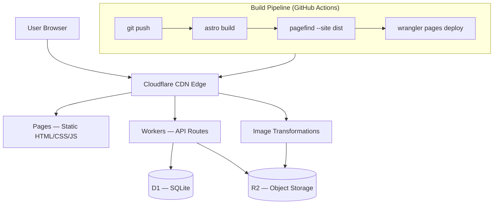
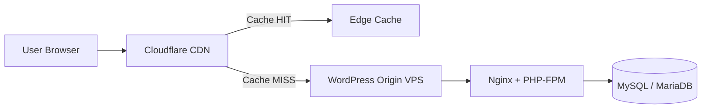

Running a content site on a traditional VPS or a managed Node.js host is fine until it isn't. You pay for compute that sits idle 95% of the time, you manage SSL renewals, you worry about cold starts, and you watch your Lighthouse score suffer because your origin is in Singapore while your readers are in Frankfurt.

Cloudflare's edge stack solves all of this. This post covers two paths: building a greenfield site with Astro on Cloudflare's full edge stack — Workers, R2, D1, Pagefind — and putting an existing WordPress site behind Cloudflare's CDN without migrating anything. Both approaches, real config, and the tradeoffs that matter.

## The Stack

Before diving into the architecture, here is what each piece does and why it earns its place:

| Component | Role | Why not the alternative |
|---|---|---|
| **Astro** | Static site generator with islands | Hugo is faster to build but lacks component islands for interactive UI |
| **Cloudflare Pages** | Hosting + CDN | Vercel/Netlify charge for bandwidth; Pages is free at this scale |
| **Cloudflare Workers** | API routes (comments, forms, webhooks) | Lambda cold starts; Workers run in V8 isolates with ~0ms startup |
| **R2** | Image and asset storage | S3 egress fees; R2 has zero egress cost |
| **D1** | Serverless SQLite for dynamic data | Postgres is overkill for comments and form submissions |
| **Drizzle ORM** | Type-safe D1 queries | Kysely works too, but Drizzle's D1 adapter is more mature |
| **Pagefind** | Client-side full-text search | Algolia costs money; Pagefind runs entirely in the browser |

The total monthly cost for a site doing ~50k pageviews: **~$5-8/month**, almost entirely from image transformations. Everything else is within Cloudflare's free tier.

## The Architecture



Every request hits Cloudflare's edge network first. Static assets — HTML, CSS, JS, pre-rendered pages — are served directly from the CDN with no origin round-trip. Dynamic requests — comment submissions, form webhooks, search index — go to Workers, which run in V8 isolates at the edge, not in a data center somewhere.

The key insight is that **Workers are not a backend**. They are edge functions that run in the same network location as the CDN. A Worker handling a comment submission in Frankfurt runs in Frankfurt, not in a US-East origin. That changes the latency profile entirely.

## Setting Up Astro with the Cloudflare Adapter

The Cloudflare adapter tells Astro to output a format that Workers can execute. For a static-first site, most pages are pre-rendered at build time. Only routes that need runtime data — API endpoints, dynamic pages — run as Workers.

```typescript
// astro.config.ts
import { defineConfig } from 'astro/config';
import cloudflare from '@astrojs/cloudflare';
import tailwind from '@astrojs/tailwind';
import mdx from '@astrojs/mdx';

export default defineConfig({
  output: 'static',          // pre-render everything by default
  adapter: cloudflare(),
  integrations: [
    tailwind({ applyBaseStyles: false }),
    mdx(),
  ],
});
```

The `output: 'static'` setting is important. It means Astro pre-renders every page at build time and only falls back to Workers for routes that explicitly opt into server-side rendering. This gives you the best of both worlds: static performance for content pages, dynamic capability for interactive features.

For pages that need runtime data, add `export const prerender = false` at the top of the `.astro` file. Everything else builds to static HTML.

## Wrangler Config: Binding Workers to D1 and R2

The `wrangler.jsonc` file is where you declare the bindings that connect your Workers to Cloudflare's services. These bindings are injected into the Worker's execution context at runtime — no environment variables, no SDK initialization, no connection strings.

```jsonc
// wrangler.jsonc
{
  "name": "leaseinvietnam",
  "compatibility_date": "2026-04-01",
  "pages_build_output_dir": "./dist",

  "d1_databases": [
    {
      "binding": "DB",
      "database_name": "leaseinvietnam-prod",
      "database_id": "your-database-id-here"
    }
  ],

  "r2_buckets": [
    {
      "binding": "IMAGES",
      "bucket_name": "leaseinvietnam-images"
    }
  ],

  "kv_namespaces": [
    {
      "binding": "CACHE",
      "id": "your-kv-namespace-id"
    }
  ]
}
```

Inside a Worker or an Astro API route, these bindings are available on the `env` object:

```typescript
// src/pages/api/comments.ts
export const prerender = false;

export async function POST({ request, locals }) {
  const env = locals.runtime.env;
  const { slug, content, author } = await request.json();

  await env.DB.prepare(
    'INSERT INTO comments (slug, content, author, status) VALUES (?, ?, ?, ?)'
  ).bind(slug, content, author, 'pending').run();

  return new Response(JSON.stringify({ ok: true }), {
    headers: { 'Content-Type': 'application/json' }
  });
}
```

No connection pooling. No cold start penalty. The D1 binding is a direct SQLite connection at the edge.

## D1 Schema and Drizzle ORM

D1 is SQLite running at Cloudflare's edge. It is not Postgres. It does not support all Postgres features. But for comments, form submissions, and lightweight dynamic data, it is exactly the right tool.

The schema for a comments system:

```sql
-- drizzle/schema.sql
CREATE TABLE IF NOT EXISTS comments (
  id        INTEGER PRIMARY KEY AUTOINCREMENT,
  slug      TEXT    NOT NULL,
  content   TEXT    NOT NULL,
  author    TEXT    NOT NULL,
  parent_id INTEGER REFERENCES comments(id),
  status    TEXT    NOT NULL DEFAULT 'pending',
  created_at DATETIME DEFAULT CURRENT_TIMESTAMP
);

CREATE INDEX IF NOT EXISTS idx_comments_slug ON comments(slug);
CREATE INDEX IF NOT EXISTS idx_comments_status ON comments(status);
```

With Drizzle, the same schema becomes type-safe TypeScript:

```typescript
// src/lib/schema.ts
import { sqliteTable, text, integer } from 'drizzle-orm/sqlite-core';

export const comments = sqliteTable('comments', {
  id:        integer('id').primaryKey({ autoIncrement: true }),
  slug:      text('slug').notNull(),
  content:   text('content').notNull(),
  author:    text('author').notNull(),
  parentId:  integer('parent_id'),
  status:    text('status').notNull().default('pending'),
  createdAt: text('created_at'),
});
```

Querying with Drizzle against D1:

```typescript
import { drizzle } from 'drizzle-orm/d1';
import { eq, and } from 'drizzle-orm';
import { comments } from '~/lib/schema';

export async function getComments(env: Env, slug: string) {
  const db = drizzle(env.DB);
  return db.select()
    .from(comments)
    .where(and(eq(comments.slug, slug), eq(comments.status, 'approved')))
    .orderBy(comments.createdAt);
}
```

## R2 for Images: Zero Egress Cost

R2 is Cloudflare's object storage. The critical difference from S3: **zero egress fees**. Serving images from R2 through Cloudflare's CDN costs nothing beyond the storage itself ($0.015/GB/month).

The image strategy that works well for content sites:

```
Original upload → R2 (full resolution)
Cloudflare Image Transformations → serve resized variants on demand
```

Define fixed presets rather than allowing arbitrary resize parameters. This prevents abuse and makes caching predictable:

```typescript
// src/utils/images.ts
const IMAGE_PRESETS = {
  thumb:  { width: 400,  height: 225, fit: 'cover' },
  card:   { width: 800,  height: 450, fit: 'cover' },
  hero:   { width: 1600, height: 900, fit: 'cover' },
  og:     { width: 1200, height: 628, fit: 'cover' },
} as const;

export function getImageUrl(key: string, preset: keyof typeof IMAGE_PRESETS) {
  const { width, height, fit } = IMAGE_PRESETS[preset];
  return `https://leaseinvietnam.com/cdn-cgi/image/width=${width},height=${height},fit=${fit},format=auto/${key}`;
}
```

Uploading images to R2 during the build pipeline using rclone:

```bash
# Upload new images to R2 (only changed files)
rclone sync ./public/images r2:leaseinvietnam-images \
  --transfers 8 \
  --checksum \
  --progress
```

The `--checksum` flag ensures rclone only uploads files that have actually changed, not just files with updated timestamps.

## Pagefind: Full-Text Search with Zero Runtime Cost

Pagefind is a static search library that indexes your site at build time and runs entirely in the browser. No Algolia account. No search API. No monthly bill. The index is generated from your built HTML and served as static files alongside your site.

Add it to the build pipeline:

```bash
# package.json
{
  "scripts": {
    "build": "astro build && pagefind --site dist",
    "preview": "wrangler pages dev dist"
  }
}
```

Pagefind crawls the `dist/` directory after Astro builds it, generates a search index, and writes it to `dist/pagefind/`. When deployed, the index is served as static files from Cloudflare's CDN.

The search UI is a web component that loads lazily:

```astro
---
// src/components/Search.astro
---
<div id="search"></div>

<script>
  async function initSearch() {
    const { PagefindUI } = await import('/pagefind/pagefind-ui.js');
    new PagefindUI({
      element: '#search',
      showSubResults: true,
      excerptLength: 15,
    });
  }

  // Load only when the search component is visible
  const observer = new IntersectionObserver((entries) => {
    if (entries[0].isIntersecting) {
      initSearch();
      observer.disconnect();
    }
  });
  observer.observe(document.getElementById('search'));
</script>
```

The lazy load via `IntersectionObserver` means the search JS only loads when the user scrolls to the search component. For most readers who never use search, it never loads at all.

## The Build and Deploy Pipeline

The full build pipeline runs in GitHub Actions on every push to `main`:

```yaml
# .github/workflows/deploy.yml
name: Deploy to Cloudflare Pages

on:
  push:
    branches: [main]

jobs:
  deploy:
    runs-on: ubuntu-latest
    steps:
      - uses: actions/checkout@v4

      - uses: actions/setup-node@v4
        with:
          node-version: '22'
          cache: 'npm'

      - name: Install dependencies
        run: npm ci

      - name: Build Astro
        run: npm run build
        env:
          PUBLIC_SITE_URL: https://leaseinvietnam.com

      - name: Generate Pagefind index
        run: npx pagefind --site dist

      - name: Deploy to Cloudflare Pages
        uses: cloudflare/wrangler-action@v3
        with:
          apiToken: ${{ secrets.CLOUDFLARE_API_TOKEN }}
          command: pages deploy dist --project-name=leaseinvietnam
```

The deploy step uses Wrangler's `pages deploy` command, which uploads the `dist/` directory to Cloudflare Pages and triggers a new deployment. The entire pipeline — install, build, index, deploy — runs in under 2 minutes for a site with ~200 pages.

## Caching Strategy

Cloudflare's CDN caches static assets automatically, but you need to configure cache headers for different asset types. Add a `_headers` file to your `public/` directory:

```
# public/_headers

# Immutable assets (hashed filenames from Astro build)
/_astro/*
  Cache-Control: public, max-age=31536000, immutable

# HTML pages — short cache, revalidate often
/*.html
  Cache-Control: public, max-age=3600, stale-while-revalidate=86400

# Pagefind index — cache for a day
/pagefind/*
  Cache-Control: public, max-age=86400

# Images served through R2
/images/*
  Cache-Control: public, max-age=604800
```

The `immutable` directive on `/_astro/*` is important. Astro generates content-hashed filenames for all bundled assets, so a file at `/_astro/main.abc123.js` will never change. Telling the browser it can cache this forever eliminates unnecessary revalidation requests.

## Cost Breakdown

For a site doing ~50k pageviews/month with ~500 images:

| Service | Usage | Cost |
|---|---|---|
| Cloudflare Pages | Unlimited requests | Free |
| Workers | ~10k API requests/month | Free (100k/day limit) |
| D1 | ~50k reads, ~5k writes | Free (5M reads/day limit) |
| R2 | 5GB storage, 0 egress | $0.075/month |
| Image Transformations | ~100k transforms | ~$5/month |
| **Total** | | **~$5.08/month** |

Image Transformations is the only meaningful cost driver. If you pre-generate image variants at build time instead of transforming on demand, you can eliminate this cost entirely — at the expense of longer build times and more R2 storage.

## Bonus: Putting WordPress Behind Cloudflare

Not every site is a greenfield Astro project. If you are running WordPress on a VPS and want Cloudflare's performance and DDoS protection without migrating the entire stack, the setup is straightforward — and the performance gains are real.

### The Architecture



Cloudflare sits in front of your origin. Most requests never reach the VPS — they are served from Cloudflare's edge cache. Only cache misses, admin requests, and POST requests hit the origin.

### Step 1: Point DNS to Cloudflare

Change your domain's nameservers to Cloudflare's. Once DNS is proxied (orange cloud icon), all traffic routes through Cloudflare. Your origin IP is hidden from the public internet.

Set your origin to only accept connections from [Cloudflare's IP ranges](https://www.cloudflare.com/ips/). This prevents attackers from bypassing Cloudflare and hitting your VPS directly:

```nginx
# /etc/nginx/conf.d/cloudflare-only.conf
# Allow Cloudflare IPs only — update periodically
allow 173.245.48.0/20;
allow 103.21.244.0/22;
allow 103.22.200.0/22;
allow 103.31.4.0/22;
allow 141.101.64.0/18;
allow 108.162.192.0/18;
allow 190.93.240.0/20;
allow 188.114.96.0/20;
allow 197.234.240.0/22;
allow 198.41.128.0/17;
allow 162.158.0.0/15;
allow 104.16.0.0/13;
allow 104.24.0.0/14;
allow 172.64.0.0/13;
allow 131.0.72.0/22;
deny all;
```

### Step 2: SSL Mode — Full (Strict)

In Cloudflare's SSL/TLS settings, set the mode to **Full (Strict)**. This means:

- Browser → Cloudflare: HTTPS (Cloudflare's certificate)
- Cloudflare → Origin: HTTPS (your origin certificate)

Do not use **Flexible** mode. Flexible encrypts the browser-to-Cloudflare leg but sends traffic to your origin over plain HTTP. It is a false sense of security and breaks some WordPress plugins.

Install a free origin certificate from Cloudflare (valid 15 years) on your VPS:

```bash
# Generate via Cloudflare dashboard: SSL/TLS → Origin Server → Create Certificate
# Then configure Nginx to use it
ssl_certificate     /etc/ssl/cloudflare/origin.pem;
ssl_certificate_key /etc/ssl/cloudflare/origin-key.pem;
```

### Step 3: Cache Rules for WordPress

WordPress is dynamic by default — every request hits PHP. The goal is to cache as much as possible at Cloudflare's edge while bypassing cache for logged-in users and POST requests.

Create a Cache Rule in Cloudflare's dashboard (Rules → Cache Rules):

```
Rule: Cache WordPress pages
When: hostname equals yourdomain.com
  AND NOT cookie contains "wordpress_logged_in"
  AND NOT cookie contains "wp-postpass"
  AND request method is GET or HEAD
  AND NOT URI path starts with /wp-admin
  AND NOT URI path starts with /wp-login.php

Then:
  Cache eligibility: Eligible for cache
  Edge TTL: 4 hours
  Browser TTL: 1 hour
```

This caches all public-facing pages at the edge for 4 hours. Logged-in users and admin requests always bypass cache and hit the origin.

On the WordPress side, install **WP Super Cache** or **W3 Total Cache** to generate static HTML files on the origin. Even on cache misses, Nginx serves a static file instead of running PHP:

```nginx
# Serve static cache files directly from Nginx
location / {
    set $cache_uri $request_uri;

    # Bypass cache for logged-in users and POST requests
    if ($request_method = POST) { set $cache_uri "null"; }
    if ($query_string != "") { set $cache_uri "null"; }
    if ($http_cookie ~* "comment_author|wordpress_[a-f0-9]+|wp-postpass|wordpress_logged_in") {
        set $cache_uri "null";
    }

    # Try static cache file first, then PHP
    try_files /wp-content/cache/supercache/$http_host/$cache_uri/index.html
              /wp-content/cache/supercache/$http_host/$cache_uri/index-https.html
              $uri $uri/ /index.php?$args;
}
```

### Step 4: Cloudflare-Specific WordPress Plugin

Install the [Cloudflare WordPress plugin](https://wordpress.org/plugins/cloudflare/). It does two important things:

1. **Restores real visitor IPs** — without it, all traffic appears to come from Cloudflare's IPs, breaking analytics, rate limiting, and comment spam detection
2. **Automatic cache purge on publish** — when you publish or update a post, the plugin calls Cloudflare's API to purge the cached version immediately

```php
// wp-config.php — restore real IP from Cloudflare header
if (isset($_SERVER['HTTP_CF_CONNECTING_IP'])) {
    $_SERVER['REMOTE_ADDR'] = $_SERVER['HTTP_CF_CONNECTING_IP'];
}
```

### Step 5: Security Headers via `_headers` or Transform Rules

Add security headers through Cloudflare's Transform Rules rather than in Nginx. This way they apply at the edge, before the request reaches your origin:

```
# Cloudflare Transform Rule — Modify Response Headers
X-Frame-Options: SAMEORIGIN
X-Content-Type-Options: nosniff
Referrer-Policy: strict-origin-when-cross-origin
Permissions-Policy: camera=(), microphone=(), geolocation=()
```

### What You Get

After this setup, a typical WordPress site goes from:

| Metric | Before Cloudflare | After Cloudflare |
|---|---|---|
| TTFB (cached page) | 400-800ms (origin) | 15-40ms (edge) |
| TTFB (uncached) | 400-800ms | 400-800ms (same) |
| DDoS protection | None | Automatic |
| Origin IP exposed | Yes | No |
| SSL management | Manual renewal | Automatic |
| Bandwidth cost | VPS egress | Cloudflare absorbs |

The cached TTFB improvement is the headline number. A page that previously took 600ms to first byte now takes 20ms because it is served from a Cloudflare edge node 50km from the user, not from a VPS in a data center on the other side of the world.

The uncached path — cache misses, admin, logged-in users — is unchanged. Cloudflare does not make your PHP faster. It just means most users never hit PHP at all.

### The Limits of This Approach

Cloudflare in front of WordPress is a performance multiplier, not a performance fix. If your WordPress is slow because of unoptimized queries, bloated plugins, or a weak VPS, Cloudflare will make the cached version fast and leave everything else exactly as slow as it was.

The right mental model: Cloudflare handles the 95% of traffic that is reading public content. Your VPS handles the 5% that is writing, logging in, or hitting uncached pages. Optimize both layers independently.

## What to Watch Out For

**D1 is not Postgres.** It does not support full-text search, JSON operators, or many Postgres-specific features. If your dynamic data needs are complex, D1 will frustrate you. For simple CRUD — comments, form submissions, view counts — it is excellent.

**Workers have a 128MB memory limit.** This is plenty for API routes, but if you are doing heavy computation in a Worker, you will hit it. Move heavy work to a background queue or a separate service.

**Pagefind indexes HTML, not source files.** If your content is behind authentication or rendered client-side, Pagefind will not index it. It works best for public, server-rendered content — which is exactly what Astro produces.

**Image Transformations requires a paid plan for custom domains.** The free tier only transforms images on `*.pages.dev` domains. If you are using a custom domain, you need at least the Pro plan ($20/month) or you need to pre-generate variants.

## The Result

A content site on this stack loads in under 200ms globally, scores 100/100 on Lighthouse performance, costs under $10/month to run, and requires zero server management. The build pipeline is a single GitHub Actions workflow. Deployments are atomic — if the build fails, the previous version stays live.

The tradeoff is that you are building on Cloudflare's platform, not on open standards. Workers are not Node.js. D1 is not Postgres. R2 is not S3 (though it is S3-compatible). If you ever need to move off Cloudflare, the migration is non-trivial.

For a content site where performance, cost, and operational simplicity matter more than portability, it is the right tradeoff.

---

*The full configuration for LeaseInVietnam's Cloudflare deployment — including the wrangler config, GitHub Actions workflow, and D1 schema migrations — is available in the [leaseinvietnam](https://github.com/vesviet/leaseinvietnam) repository.*


