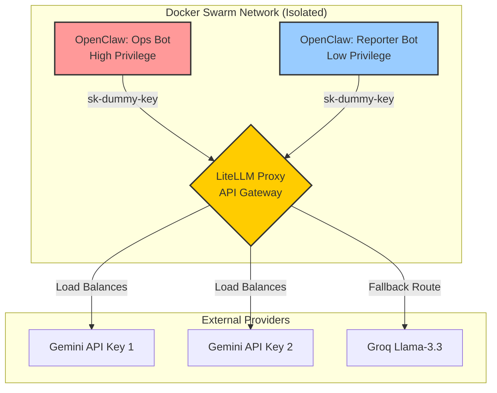

The era of simple, conversational AI chatbots is over. In 2026, the industry has aggressively shifted toward **Agentic AI**—autonomous systems capable of planning, executing, and iterating on multi-step workflows without constant human supervision. 

However, building an agent is the easy part. The real engineering challenge lies in the infrastructure required to keep a swarm of agents running 24/7. When your autonomous system relies on third-party LLM APIs, a single rate limit (HTTP 429) or a model deprecation (HTTP 404) can instantly crash your entire operational pipeline.

In this deep dive, we will explore the architecture of a production-ready AI swarm. We will break down how to use **OpenClaw** for agent execution, **LiteLLM** as an intelligent API Gateway, and **Docker** to enforce strict security boundaries through privilege separation.

> **TL;DR (Key Takeaways):**
> - **Agentic Infrastructure:** Operating a swarm requires an API Gateway. Never hardcode LLM APIs directly into your agents.
> - **Zero-Downtime:** Use LiteLLM to pool multiple free-tier keys (e.g., Gemini 2.5 Flash) and configure automatic fallbacks (e.g., to Groq/Llama-3.3) to survive rate limits.
> - **Security-Left:** Isolate agents using Docker `cap_drop: ALL` and read-only volumes to prevent Server-Side Request Forgery (SSRF) and privilege escalation.

## 1. The Architectural Challenge of Autonomous Agents

When you deploy a swarm of agents (e.g., one bot for system operations, another for reporting, another for coding), you quickly run into critical infrastructure bottlenecks:

1.  **Rate Limiting & Cost:** A single agent can consume thousands of tokens per minute. Hitting a single API key will inevitably trigger rate limits.
2.  **Single Point of Failure:** Hardcoding `gemini-2.5-flash` or `gpt-4o` directly into your agent code means that if the provider experiences downtime, your swarm dies.
3.  **Security & Privilege Escalation:** An agent that writes code or executes bash scripts is a massive security risk if compromised. You cannot allow a "reporting agent" to have the same system access as a "DevOps agent."

To solve this, we decouple the *Agent Logic* from the *LLM Routing* using an API Gateway, and we enforce isolation at the container level.

## 2. Architecture Deep-Dive

The solution relies on a hub-and-spoke architecture. The agents never speak to Google or OpenAI directly. Instead, they communicate exclusively with an internal LiteLLM Proxy.



This architecture provides three massive benefits:
*   **Zero-Downtime Fallbacks:** If Gemini fails, the gateway silently reroutes the agent to Llama-3.3.
*   **Key Load Balancing:** We can pool multiple free-tier keys to achieve enterprise-level throughput at zero cost.
*   **Security:** The API keys are injected only into the Gateway. If an agent is compromised via prompt injection, the attacker cannot steal your external API keys.

## 3. The Brain: Configuring LiteLLM for High Availability

To achieve 99.9% uptime for our swarm, we configure LiteLLM (`litellm_config.yaml`) to utilize a `simple-shuffle` load balancing strategy across multiple keys, coupled with a robust fallback mechanism.

```yaml
model_list:
  # ── OPS BOT: Gemini (4 keys, load-balanced) ──
  - model_name: gemini-2.5-flash
    litellm_params:
      model: gemini/gemini-2.5-flash
      api_key: os.environ/GEMINI_API_KEY_1
  - model_name: gemini-2.5-flash
    litellm_params:
      model: gemini/gemini-2.5-flash
      api_key: os.environ/GEMINI_API_KEY_2

  # ... (truncated for brevity)

  # ── FALLBACK ROUTE ──
  - model_name: ops-fallback
    litellm_params:
      model: groq/llama-3.3-70b-versatile
      api_key: os.environ/GROQ_API_KEY

router_settings:
  routing_strategy: simple-shuffle
  num_retries: 3
  fallbacks:
    - {"gemini-2.5-flash": ["gemini-2.5-flash", "ops-fallback"]}
```

### Why this is a game-changer:
1.  **Cost Optimization:** By pooling multiple API keys for models like `gemini-2.5-flash`, you can run heavy agentic workflows (which require continuous looping and planning) entirely within free tiers.
2.  **Autonomous Survival:** Notice the `fallbacks` array. If all Gemini keys hit a 429 Rate Limit, LiteLLM automatically transparently reroutes the exact same prompt to Groq's `llama-3.3-70b-versatile`. The OpenClaw agent is completely unaware of the failure; it just receives the JSON response and continues its work.

## 4. The Body: Orchestrating the Swarm (Security-Left)

A swarm is only as safe as its weakest container. We deploy the agents using `docker-compose.yml`, strictly adhering to the principle of least privilege (Security-Left).

### The Ops Bot (High Privilege)
The Ops Bot is designed to manage infrastructure. It requires access to the Docker socket and the host filesystem.

```yaml
  openclaw-ops:
    container_name: openclaw-ops
    volumes:
      - /var/run/docker.sock:/var/run/docker.sock
      - /:/host:ro # Read-only access to host OS
    environment:
      - OPENAI_BASE_URL=http://litellm-proxy:4000
      - OPENAI_API_KEY=sk-litellm-dummy-key
      - DEFAULT_MODEL=gemini/gemini-2.5-flash
```

### The Reporter Bot (Low Privilege)
The Reporter Bot only needs to read logs and generate markdown. We aggressively lock it down by dropping all Linux kernel capabilities.

```yaml
  openclaw-reporter:
    container_name: openclaw-reporter
    cap_drop:
      - ALL # SECURITY: Strip all kernel privileges
    volumes:
      - ./data/reporter:/app/data # Only access its own isolated data
    environment:
      - OPENAI_BASE_URL=http://litellm-proxy:4000
      - OPENAI_API_KEY=sk-litellm-dummy-key
      - DEFAULT_MODEL=reporter-model
```

Even if the Reporter Bot hallucinates or falls victim to a malicious Server-Side Request Forgery (SSRF) via prompt injection, the `cap_drop: ALL` directive and volume isolation ensure the blast radius is contained entirely within that single container.

## 5. Conclusion & Operational Reality

Building an AI agent in a Jupyter Notebook is easy. Deploying a swarm of autonomous agents that run continuously, survive rate limits, and maintain strict security boundaries requires real engineering.

By leveraging **LiteLLM** as an intelligent routing layer and **Docker** for privilege isolation, you transform fragile AI scripts into a resilient, production-grade microservice architecture. 

**Next Steps for V2:** While this architecture solves routing and security, the next evolution involves giving the swarm long-term memory. Integrating a local vector database (like DuckDB VSS or Chroma) directly into the internal Docker network will allow these agents to query historical context, turning a highly available swarm into a truly intelligent one.

*Looking to see how an autonomous pipeline operates in the real world? Check out our case study on [Architecting an Autonomous Hybrid-AI Pipeline](/posts/architecting-an-autonomous-hybrid-ai-content-pipeline/) to see how we dropped AI token costs to $0.05 a day.*

**Continue Reading:**
- [Prompt Engineering Standards for Production AI Systems](/series/prompt-standard/) — the prompt design patterns and versioning conventions this swarm uses internally.
- [What is Vibe Coding? AI Code Review & the Future of Software](/posts/vibe-coding-and-ai-code-review-future/) — how AI agents are reshaping code generation and review workflows.


