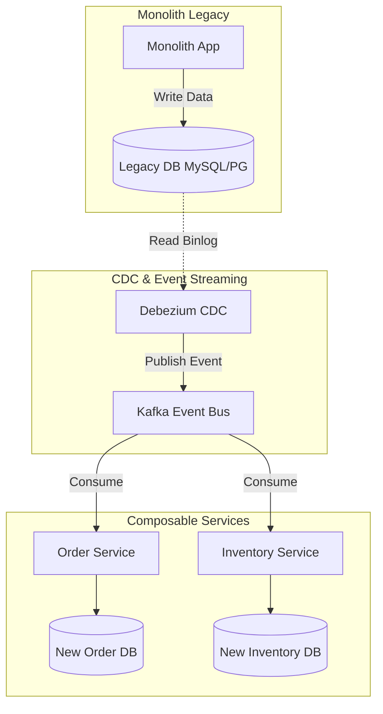

**Answer-first:** Monolith decoupling succeeds only when solving eventual consistency and distributed tracing overhead early. Mitigate inventory overselling via Redis-based BFF locking, stream database sync in real-time via Debezium CDC and Kafka, and build distributed tracing via OpenTelemetry from day one to avoid system blindness.

See the [21-service e-commerce architecture blueprint](/posts/blueprint-ecommerce-microservices-architecture-diagram/) for the domain boundaries this migration targets.

### What You'll Learn That AI Won't Tell You
- Strangler Fig routing configurations for Envoy that migrate traffic path-by-path from Magento to Go microservices without dropping active sessions.
- How to implement a double-write database sync listener in Go to prevent data drift during the multi-month migration window.

---

> In theory, MACH (Microservices, API-first, Cloud-native, Headless) and Composable Commerce are the "holy grail" of the ecommerce industry. However, when systems scale to process millions of transactions, issues regarding data consistency and Observability costs truly surface. This article outlines the hard-learned lessons from our Chief Architects when migrating a monolithic system to a Composable architecture.

---

## 1. The Real Bottleneck in Decoupling (Eventual Consistency)

When separating the Search Engine (like Algolia or Elasticsearch) and the Inventory Service via an Event-bus, data takes a few seconds to synchronize. This is the reality of eventual consistency in distributed systems.

* **The Problem**: If a customer clicks "Add to Cart" for the last item in stock, the Inventory Service deducts the stock immediately. However, the Search UI has not received the event to hide the product yet. A second customer sees the item, clicks buy, and hits a checkout error, or worse, receives a confirmation for an out-of-stock product.
* **Practical Solution**: Use Redis at the BFF (Backend-For-Frontend) layer to temporarily lock the shopping cart state before the event completes its lifecycle. Never leave the fate of payment transactions entirely to the Event-bus. 

When a checkout attempt begins, a Redis lease lock is acquired for that SKU and user session. Subsequent attempts on the same stock pool are held at the BFF gateway, bypassing database hits and returning instant backpressure status to the client.

---

## 2. Hidden Costs and the "Stabilization" Timeline

In a Monolith architecture, tracing a payment error simply requires reading a single web server log file or querying a single transaction table. In a Composable architecture, a single checkout request traverses:
1. Storefront (Astro/Next.js SPA)
2. BFF (Go/Node.js Gateway)
3. Cart Service (Go)
4. Payment Gateway Service (Go)
5. Third-Party Payment Processor (Stripe/VNPay)
6. Order Service (Go)
7. Warehouse Inventory Service (Go)

Without OpenTelemetry tracing spans injected and propagated from the very first line of code, the SRE team will be completely blind during an incident. Tracing is not a "nice-to-have" feature; it is a mandatory standard (Definition of Done) for Composable Commerce. Latency overhead from tracing collectors must be budgeted into target SLA metrics from day one.

---

## 3. Solving Legacy Monolith Sync: The CDC Architecture

Many teams make the mistake of having Application Code call APIs to write to both the old and new databases simultaneously (application-level double writing). If the second API call times out or throws an error, the databases become permanently desynchronized, requiring complex reconciliation scripts.

Instead, we use a **Change Data Capture (CDC)** model where database binlogs are streamed in real-time. Below is the standard data flow diagram for the Strangler Fig phase (running old and new in parallel):



Thanks to CDC, the new system acts purely as a passive Consumer. The main user transaction process on the legacy system suffers zero performance degradation and no network timeout risks.

---

## 4. The Phased Migration Roadmap

Migrating a high-traffic monolith to a composable system must never be executed as a "Big Bang" cutover. Instead, adopt a three-phase approach utilizing the **Strangler Fig pattern** to incrementally replace monolithic routes with isolated services.

```
+--------------------------------------------------------------+
|                   PHASED MIGRATION ROADMAP                   |
+--------------------------------------------------------------+
| Phase 1: Envoy Strangler Fig Routing                         |
|   - Setup Envoy proxy at edge. Route path-by-path.           |
+--------------------------------------------------------------+
| Phase 2: CDC-Driven Parallel Run                            |
|   - Legacy database streams write updates to new DBs.         |
+--------------------------------------------------------------+
| Phase 3: Monolith Deprecation & Final Cutover                |
|   - Deprecate old routes. Shut down monolith servers.       |
+--------------------------------------------------------------+
```

### Strangler Fig Routing & Data Synchronization Diagram

The diagram below represents the architectural data and traffic flows during the migration process. It details the request routing paths evaluated by the Envoy API gateway at the edge, alongside the asynchronous CDC-driven synchronization backplane keeping the legacy database in parity.

```mermaid
graph TD
    Client[User Client] -->|HTTP Requests| Gateway[Ingress Gateway / Envoy]
    
    subgraph Route Evaluation
        Gateway -->|/api/v1/cart/*<br/>(Migrated)| CartCluster[Composable Cart Service]
        Gateway -->|/api/v1/catalog/*<br/>(Migrated)| CatalogCluster[Composable Catalog Service]
        Gateway -->|/*<br/>(Legacy Default)| MonoCluster[Monolith Legacy Cluster]
    end

    subgraph Composable Layer
        CartCluster -->|1. Write| NewCartDB[(New Cart DB)]
        CatalogCluster -->|Read/Write| NewCatalogDB[(New Catalog DB)]
    end

    subgraph Legacy Layer
        MonoCluster -->|Write| LegacyDB[(Legacy DB)]
    end

    subgraph CDC Data Synchronization
        NewCartDB -.->|2. Capture Binlogs| CDC[Debezium CDC]
        CDC -->|3. Publish| Kafka[[Kafka Event Bus]]
        Kafka -->|4. Consume| SyncWorker[Go Sync Worker]
        SyncWorker -.->|5. Replicate| LegacyDB
    end

    style Gateway fill:#f9f,stroke:#333,stroke-width:2px
    style MonoCluster fill:#fbb,stroke:#333,stroke-width:1px
    style CartCluster fill:#bfb,stroke:#333,stroke-width:1px
    style CatalogCluster fill:#bfb,stroke:#333,stroke-width:1px
```

### Understanding the Strangler Fig Migration Pattern

The Strangler Fig pattern provides a low-risk methodology for modernizing legacy e-commerce applications. Instead of attempting a high-risk cutover, we gradually replace legacy components with composable microservices. This is similar to a strangler fig tree that grows around a host tree, eventually replacing it completely.

#### Slicing Boundaries via Domain-Driven Design (DDD)
The first step in any migration is defining boundary contexts. Monolithic applications are tightly coupled. To decouple them, we must extract logical subdomains. Candidate subdomains like Shopping Carts, Catalogs, and Checkouts should be decoupled:
- **Catalog/Search**: Typically read-heavy, making it an ideal first candidate for isolation. Extracting this reduces the load on the legacy monolith database.
- **Cart**: Highly transactional but localized. It does not require immediate deep integration with inventory warehouses until the checkout stage.
- **Checkout/Orders**: The most complex subdomain due to payment integrations and inventory locks. This should be migrated last, after the read-heavy domains have run stably in production.

#### Session and Authentication Management Across Boundaries
One of the most common blockers is maintaining user session continuity. If a client is routed to the new Cart service for cart operations, but is routed to the legacy monolith for profile management, they must remain authenticated.

We handle this by configuring the Ingress Gateway (Envoy) to act as an authentication translation layer:
- The gateway intercepts incoming session identifiers (e.g. legacy PHP session cookies or custom cookies).
- It calls a lightweight shared Auth Service or decrypts the session token directly using WebAssembly (Wasm) filters in Envoy.
- It attaches standardized headers (such as `X-User-ID` and `X-User-Roles`) to the request context before forwarding it to downstream microservices, isolating the new services from having to understand legacy database session schemas.

#### Choosing Asynchronous CDC Over Application Double-Writing
To keep databases synchronized during the parallel run phase, we must avoid application-level double writing (where the microservice code explicitly writes to both the legacy and composable databases). This pattern introduces several severe liabilities:
1. **Transaction Coupling**: A failure writing to the legacy database will force a rollback on the primary transaction, degrading the performance and reliability of the new service.
2. **Network Overhead**: Adding synchronous network calls to legacy endpoints increases API response latency.
3. **Data Drift**: If the worker process dies after the first write completes but before the second write starts, the databases drift permanently.

By choosing Change Data Capture (CDC) via Debezium and Kafka, database writes remain local and fast. The CDC engine tail-reads the database's Write-Ahead Log (WAL) or binlog, converts commits into events, and streams them asynchronously. This ensures that even if the sync worker experiences a transient database lock or outage, Kafka will buffer the events, guaranteeing that the sync worker will eventually resume replication without dropping transactions.


### Phase 1: Strangler Fig Gateway Routing
In this initial phase, we place an API gateway (e.g., Envoy or Kong) in front of the infrastructure. All traffic routes through this gateway.
* The legacy monolith remains the default backend cluster.
* We define explicit path routing matches. For example, `/api/v1/cart/*` is routed to the new Go Cart service, while `/api/v1/checkout/*` and all standard HTML pages continue routing to the legacy monolith backend.
* Session cookies and JWT credentials are shared or translated at the gateway layer to ensure customers do not lose active sessions during transitions.

### Phase 2: CDC-Driven Parallel Run (The Double-Write Window)
Once routing is active for a specific domain, we must synchronize state across databases.
* While the write actions are redirected to the new microservice, the legacy database must still be kept updated to support rollback scenarios.
* We employ Debezium CDC to read binlogs from the new microservice's database and stream updates back to the legacy database, or vice versa, depending on which system is currently the writer of record.
* Read verifiers run asynchronously, scanning 1% of transactions daily to verify that records in the old and new databases remain identical.

### Phase 3: Monolith Deprecation and Final Cutover
After a domain (such as Checkout or Inventory) runs stably in parallel for 30 days without data drift:
* The legacy database synchronization pipelines are turned off.
* The legacy database tables are marked as read-only.
* Monolith code paths for that specific domain are purged or disabled.
* The backend resources allocated to the legacy server are scaled down, eventually leading to full deprecation.

---

## 5. Envoy Routing Configuration

Below is a production-grade Envoy routing configuration snippet showing how path matching is configured to slice requests between the legacy monolith and the new composable clusters during Phase 1.

```yaml
static_resources:
  listeners:
  - name: ingress_edge_listener
    address:
      socket_address:
        address: 0.0.0.0
        port_value: 8080
    filter_chains:
    - filters:
      - name: envoy.filters.network.http_connection_manager
        typed_config:
          "@type": type.googleapis.com/envoy.extensions.filters.network.http_connection_manager.v3.HttpConnectionManager
          stat_prefix: ingress_http
          route_config:
            name: local_route
            virtual_hosts:
            - name: local_service
              domains: ["*"]
              routes:
              # Route 1: Target Composable Cart Service
              - match:
                  prefix: "/api/v1/cart"
                route:
                  cluster: composable_cart_service
                  timeout: 3s
                  retry_policy:
                    retry_on: "5xx,connect-failure,reset"
                    num_retries: 3
              # Route 2: Target Composable Catalog Service
              - match:
                  prefix: "/api/v1/catalog"
                route:
                  cluster: composable_catalog_service
                  timeout: 2s
              # Route 3: Default Fallback to Monolith Legacy
              - match:
                  prefix: "/"
                route:
                  cluster: monolith_legacy_cluster
                  timeout: 10s
          http_filters:
          - name: envoy.filters.http.router
            typed_config:
              "@type": type.googleapis.com/envoy.extensions.filters.http.router.v3.Router

  clusters:
  - name: composable_cart_service
    connect_timeout: 0.25s
    type: STRICT_DNS
    dns_lookup_family: V4_ONLY
    lb_policy: ROUND_ROBIN
    load_assignment:
      cluster_name: composable_cart_service
      endpoints:
      - lb_endpoints:
        - endpoint:
            address:
              socket_address:
                address: cart-service.internal
                port_value: 8081

  - name: composable_catalog_service
    connect_timeout: 0.25s
    type: STRICT_DNS
    lb_policy: ROUND_ROBIN
    load_assignment:
      cluster_name: composable_catalog_service
      endpoints:
      - lb_endpoints:
        - endpoint:
            address:
              socket_address:
                address: catalog-service.internal
                port_value: 8082

  - name: monolith_legacy_cluster
    connect_timeout: 0.5s
    type: STRICT_DNS
    lb_policy: ROUND_ROBIN
    load_assignment:
      cluster_name: monolith_legacy_cluster
      endpoints:
      - lb_endpoints:
        - endpoint:
            address:
              socket_address:
                address: legacy-monolith.internal
                port_value: 9090
```

---

## 6. Go Event Listener for Parallel Database Sync

To prevent database drift during the phase when writes occur in both databases, we run asynchronous event consumers in Go. Below is a production Go listener that consumes Catalog inventory updates from Kafka and updates the new composable database transactionally.

```go
package main

import (
	"context"
	"database/sql"
	"encoding/json"
	"fmt"
	"log"
	"time"

	"github.com/segmentio/kafka-go"
)

// InventorySyncEvent represents the CDC payload from the legacy database.
type InventorySyncEvent struct {
	SKU          string    `json:"sku"`
	Quantity     int       `json:"quantity"`
	WarehouseID  int       `json:"warehouse_id"`
	EventTime    time.Time `json:"event_time"`
	EventUUID    string    `json:"event_uuid"`
}

// Database Sync Worker
type SyncWorker struct {
	db          *sql.DB
	kafkaReader *kafka.Reader
}

func NewSyncWorker(db *sql.DB, brokers []string, topic string) *SyncWorker {
	r := kafka.NewReader(kafka.ReaderConfig{
		Brokers:  brokers,
		GroupID:  "inventory-sync-group",
		Topic:    topic,
		MinBytes: 10e3, // 10KB
		MaxBytes: 10e6, // 10MB
	})
	return &SyncWorker{
		db:          db,
		kafkaReader: r,
	}
}

// Start consuming events
func (w *SyncWorker) Start(ctx context.Context) {
	log.Println("Starting Inventory Sync Worker...")
	defer w.kafkaReader.Close()

	for {
		m, err := w.kafkaReader.ReadMessage(ctx)
		if err != nil {
			log.Printf("Error reading message: %v", err)
			time.Sleep(1 * time.Second)
			continue
		}

		var event InventorySyncEvent
		if err := json.Unmarshal(m.Value, &event); err != nil {
			log.Printf("Error decoding event: %v", err)
			continue
		}

		// Process event transactionally
		if err := w.processSyncEvent(ctx, event); err != nil {
			log.Printf("Failed to process event %s: %v", event.EventUUID, err)
			continue
		}
	}
}

// Process the event with strict idempotency
func (w *SyncWorker) processSyncEvent(ctx context.Context, event InventorySyncEvent) error {
	tx, err := w.db.BeginTx(ctx, &sql.TxOptions{Isolation: sql.LevelReadCommitted})
	if err != nil {
		return err
	}
	defer tx.Rollback()

	// 1. Idempotency Check (Outbox/Processed Events Pattern)
	var processed bool
	err = tx.QueryRowContext(ctx, 
		"SELECT EXISTS(SELECT 1 FROM processed_events WHERE event_uuid = $1)", 
		event.EventUUID).Scan(&processed)
	if err != nil {
		return fmt.Errorf("idempotency check failed: %w", err)
	}

	if processed {
		log.Printf("Event %s already processed, skipping", event.EventUUID)
		return nil
	}

	// 2. Perform Inventory Update in Composable DB
	_, err = tx.ExecContext(ctx, `
		INSERT INTO inventory_stocks (sku, available_qty, warehouse_id, updated_at)
		VALUES ($1, $2, $3, NOW())
		ON CONFLICT (sku, warehouse_id) 
		DO UPDATE SET available_qty = EXCLUDED.available_qty, updated_at = NOW()`,
		event.SKU, event.Quantity, event.WarehouseID)
	if err != nil {
		return fmt.Errorf("failed to upsert stock: %w", err)
	}

	// 3. Log event as processed
	_, err = tx.ExecContext(ctx, 
		"INSERT INTO processed_events (event_uuid, processed_at) VALUES ($1, NOW())", 
		event.EventUUID)
	if err != nil {
		return fmt.Errorf("failed to log processed event: %w", err)
	}

	return tx.Commit()
}

func main() {
	// Setup database connection and init worker here
	fmt.Println("Sync worker initialized.")
}
```

---

## FAQ: Composable Commerce Migration

### When should a business migrate to Composable Commerce?
When revenue hits the $5 million/year mark, or when the current monolithic platform begins to severely bottleneck the speed of releasing new features. For small startups, packaged SaaS solutions are still far more cost-effective.

### Why do we need a BFF (Backend-For-Frontend)?
The BFF aggregates data from multiple microservices into a single API response for the Frontend, minimizing network calls and acting as a Circuit Breaker when backend services experience high latency.
