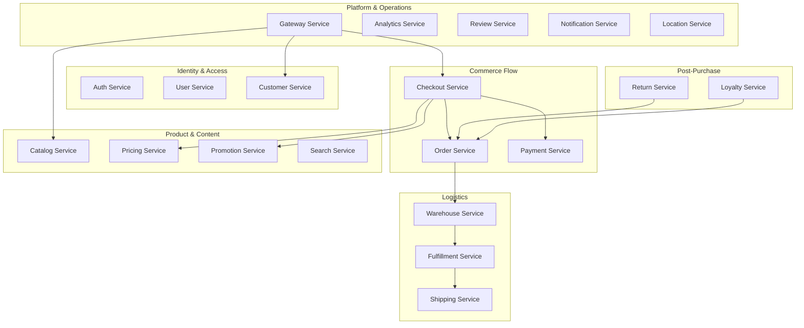
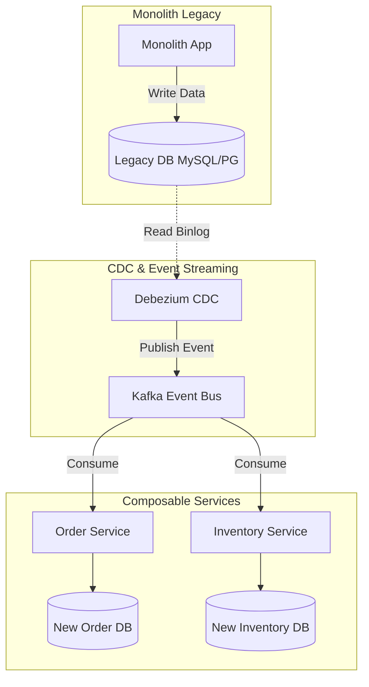

**Answer-first:** Monolith decoupling succeeds only when solving eventual consistency, domain boundaries, and distributed tracing overhead early. Mitigate inventory overselling via Redis-based BFF locking, stream database sync in real-time via Debezium CDC and Kafka, structure Go microservices using Domain-Driven Design (DDD) and Kratos v2, and build distributed tracing via OpenTelemetry from day one to avoid system blindness.

See the [21-service e-commerce architecture blueprint](/posts/blueprint-ecommerce-microservices-architecture-diagram/) for the domain boundaries this migration targets.

### What You'll Learn That AI Won't Tell You
- Why replacing a legacy PHP monolith (Magento) requires 21 DDD bounded contexts rather than naive 4–6 microservices.
- Strangler Fig routing configurations for Envoy that migrate traffic path-by-path from Magento to Go microservices without dropping active sessions.
- How to implement a double-write database sync listener in Go to prevent data drift during the multi-month migration window.
- Production Go microservice architecture using Kratos v2, Wire compile-time DI, and Protobuf Money types.

---

> In theory, MACH (Microservices, API-first, Cloud-native, Headless) and Composable Commerce are the "holy grail" of the e-commerce industry. However, when systems scale to process millions of transactions, issues regarding data consistency, domain decomposition, and observability costs surface. This guide details the lessons and architectural patterns from migrating a monolithic Magento application into a production-grade 21-service Go microservices platform.

---

## 1. Why DDD Bounded Contexts: Decomposing Magento Modules

Every engineering team that decides to migrate a legacy Magento monolith faces the question: **how many services?** Naive approaches draw service boundaries around existing database tables (`catalog_product_entity` → Product Service, `sales_order` → Order Service). This creates anemic REST wrappers with tight database coupling moved to network calls.

Domain-Driven Design (DDD) groups code around **business capabilities and invariants**. A rule is enforced within a single service's transaction boundary:



### The Two Counter-Intuitive Domain Splits
- **Checkout ≠ Order**: Checkout Service manages *temporary, expendable cart state*. Order Service manages *permanent, audited financial state* across an 8-state lifecycle (`PENDING → CONFIRMED → PAYMENT_CAPTURED → PROCESSING → FULFILLMENT_STARTED → SHIPPED → DELIVERED → COMPLETED`). Separating them enables independent pod scaling during peak events.
- **Pricing ≠ Promotion**: Pricing Service owns base price calculations (high read rate, Redis cache TTL = 1h). Promotion Service applies rules and coupon redemptions (event-driven, transactional PostgreSQL deduplication).

---

## 2. Monorepo Architecture: Rush & Go Workspaces

Managing 21 Go microservices and 2 frontend apps (Next.js storefront and React admin) requires structured monorepo governance:

```
composable-commerce/
├── rush.json                      ← Microsoft Rush config for TS apps & packages
├── common/config/rush/
│   └── common-versions.json       ← Strict dependency version governance
├── apps/
│   ├── storefront/                ← Next.js customer storefront
│   └── admin-dashboard/           ← React admin panel
├── packages/
│   ├── ui-components/             ← Shared Tailwind design system
│   └── api-client/                ← TypeScript SDK generated from Go protos
└── services/                      ← 21 Go microservices (Go module per service)
```

Protobuf contract compilation bridges Go services and frontend TypeScript code using `buf generate`, ensuring that any API schema change in Go immediately surfaces type-check errors in frontend builds before deployment.

---

## 3. Core Backend: Golang + Kratos v2 Internals

Each Go microservice implements a strict 5-layer layout:

```text
order-service/
├── api/order/v1/order.proto       ← gRPC + HTTP proto contract
├── cmd/order-service/
│   ├── main.go                    ← Entry point
│   ├── wire.go                    ← Compile-time DI declarations
│   └── wire_gen.go                ← Auto-generated DI initialization
├── internal/
│   ├── biz/                       ← Pure business logic & aggregate roots
│   ├── data/                      ← PostgreSQL & Redis repository implementations
│   ├── service/                   ← Transport handlers (Proto → Biz mapping)
│   └── server/                    ← gRPC (:9001) & HTTP (:8001) servers
```

### Wire Compile-Time Dependency Injection
Unlike runtime DI containers (Spring, Magento XML), Go Wire resolves dependencies at build time. If a dependency is missing, `go build` fails immediately.

### Protobuf Money Type & Cursor Pagination
- **Money Type**: Never use floats for financial prices. Use Google Money proto (`currency_code`, `units`, `nanos`) to eliminate floating-point rounding errors.
- **Cursor Pagination**: Replaces offset pagination (`OFFSET 10000`) with stable index seeking (`WHERE id > $cursor LIMIT 20`), ensuring O(1) page access even over 500,000+ records.

---

## 4. The Real Bottleneck in Decoupling (Eventual Consistency)

When separating the Search Engine (Elasticsearch) and the Inventory Service via an Event-bus, data takes a few seconds to synchronize.
- **The Problem**: A customer clicks "Add to Cart" for the last item in stock. Inventory deducts stock immediately, but Search UI has not received the event yet. A second customer attempts purchase and hits a checkout error.
- **Practical Solution**: Use Redis at the BFF (Backend-For-Frontend) layer to acquire a lease lock for that SKU and user session. Subsequent attempts on the same stock pool are held at the BFF gateway, bypassing database hits and returning instant backpressure status.

---

## 5. Solving Legacy Monolith Sync: The CDC Architecture

Avoiding application-level double writing prevents database drift and network latency overhead. Use **Change Data Capture (CDC)** to stream binlogs in real-time:



---

## 6. The Phased Migration Roadmap & Envoy Routing

Adopt a three-phase **Strangler Fig pattern** to incrementally replace monolithic routes:

```mermaid
graph TD
    Client[User Client] -->|HTTP Requests| Gateway[Ingress Gateway / Envoy]
    
    subgraph Route Evaluation
        Gateway -->|/api/v1/cart/*<br/>(Migrated)| CartCluster[Composable Cart Service]
        Gateway -->|/api/v1/catalog/*<br/>(Migrated)| CatalogCluster[Composable Catalog Service]
        Gateway -->|/*<br/>(Legacy Default)| MonoCluster[Monolith Legacy Cluster]
    end

    subgraph Composable Layer
        CartCluster -->|1. Write| NewCartDB[(New Cart DB)]
        CatalogCluster -->|Read/Write| NewCatalogDB[(New Catalog DB)]
    end

    subgraph Legacy Layer
        MonoCluster -->|Write| LegacyDB[(Legacy DB)]
    end

    subgraph CDC Data Synchronization
        NewCartDB -.->|2. Capture Binlogs| CDC[Debezium CDC]
        CDC -->|3. Publish| Kafka[[Kafka Event Bus]]
        Kafka -->|4. Consume| SyncWorker[Go Sync Worker]
        SyncWorker -.->|5. Replicate| LegacyDB
    end

    style Gateway fill:#f9f,stroke:#333,stroke-width:2px
    style MonoCluster fill:#fbb,stroke:#333,stroke-width:1px
    style CartCluster fill:#bfb,stroke:#333,stroke-width:1px
    style CatalogCluster fill:#bfb,stroke:#333,stroke-width:1px
```

### Envoy Configuration Snippet

```yaml
static_resources:
  listeners:
  - name: ingress_edge_listener
    address:
      socket_address:
        address: 0.0.0.0
        port_value: 8080
    filter_chains:
    - filters:
      - name: envoy.filters.network.http_connection_manager
        typed_config:
          "@type": type.googleapis.com/envoy.extensions.filters.network.http_connection_manager.v3.HttpConnectionManager
          stat_prefix: ingress_http
          route_config:
            name: local_route
            virtual_hosts:
            - name: local_service
              domains: ["*"]
              routes:
              - match:
                  prefix: "/api/v1/cart"
                route:
                  cluster: composable_cart_service
                  timeout: 3s
              - match:
                  prefix: "/api/v1/catalog"
                route:
                  cluster: composable_catalog_service
                  timeout: 2s
              - match:
                  prefix: "/"
                route:
                  cluster: monolith_legacy_cluster
                  timeout: 10s
```

---

## 7. Go Event Listener for Parallel Database Sync

```go
package main

import (
	"context"
	"database/sql"
	"encoding/json"
	"fmt"
	"log"
	"time"

	"github.com/segmentio/kafka-go"
)

type InventorySyncEvent struct {
	SKU          string    `json:"sku"`
	Quantity     int       `json:"quantity"`
	WarehouseID  int       `json:"warehouse_id"`
	EventTime    time.Time `json:"event_time"`
	EventUUID    string    `json:"event_uuid"`
}

type SyncWorker struct {
	db          *sql.DB
	kafkaReader *kafka.Reader
}

func NewSyncWorker(db *sql.DB, brokers []string, topic string) *SyncWorker {
	r := kafka.NewReader(kafka.ReaderConfig{
		Brokers:  brokers,
		GroupID:  "inventory-sync-group",
		Topic:    topic,
		MinBytes: 10e3,
		MaxBytes: 10e6,
	})
	return &SyncWorker{db: db, kafkaReader: r}
}

func (w *SyncWorker) processSyncEvent(ctx context.Context, event InventorySyncEvent) error {
	tx, err := w.db.BeginTx(ctx, &sql.TxOptions{Isolation: sql.LevelReadCommitted})
	if err != nil {
		return err
	}
	defer tx.Rollback()

	var processed bool
	err = tx.QueryRowContext(ctx, 
		"SELECT EXISTS(SELECT 1 FROM processed_events WHERE event_uuid = $1)", 
		event.EventUUID).Scan(&processed)
	if err != nil {
		return fmt.Errorf("idempotency check failed: %w", err)
	}

	if processed {
		return nil
	}

	_, err = tx.ExecContext(ctx, `
		INSERT INTO inventory_stocks (sku, available_qty, warehouse_id, updated_at)
		VALUES ($1, $2, $3, NOW())
		ON CONFLICT (sku, warehouse_id) 
		DO UPDATE SET available_qty = EXCLUDED.available_qty, updated_at = NOW()`,
		event.SKU, event.Quantity, event.WarehouseID)
	if err != nil {
		return fmt.Errorf("failed to upsert stock: %w", err)
	}

	_, err = tx.ExecContext(ctx, 
		"INSERT INTO processed_events (event_uuid, processed_at) VALUES ($1, NOW())", 
		event.EventUUID)
	if err != nil {
		return fmt.Errorf("failed to log processed event: %w", err)
	}

	return tx.Commit()
}
```

---

## FAQ: Composable Commerce Migration

### When should a business migrate to Composable Commerce?
When revenue hits the $5 million/year mark, or when the current monolithic platform severely bottlenecks release frequency. For small startups, packaged SaaS solutions remain more cost-effective.

### Why do we need a BFF (Backend-For-Frontend)?
The BFF aggregates data from multiple microservices into a single API response for the Frontend, minimizing network calls and acting as a Circuit Breaker when backend services experience latency.

### How long does the full migration take?
End-to-end: **14–19 weeks** for a production store. Phase 1 (read-only) takes 2–3 weeks, Phase 2 (dual-write per domain) takes 4–6 weeks, and Phase 3 (full cutover) takes 8–10 weeks.

### How much faster is gRPC than REST+JSON internally?
In production microservices, gRPC binary serialization and HTTP/2 multiplexing are **3–7× faster** than REST+JSON text parsing, reducing internal multi-hop latency from ~90ms to ~15ms.
