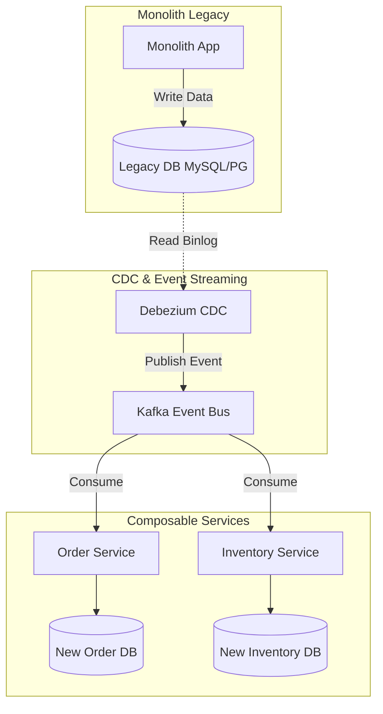

> **Answer-first:** Monolith decoupling succeeds only when solving eventual consistency and distributed tracing overhead early. Mitigate inventory overselling via Redis-based BFF locking, stream database sync in real-time via Debezium CDC and Kafka, and build distributed tracing via OpenTelemetry from day one to avoid system blindness.

In theory, MACH (Microservices, API-first, Cloud-native, Headless) and Composable Commerce are the "holy grail" of the ecommerce industry. However, when systems scale to process millions of transactions, issues regarding data consistency and Observability costs truly surface. This article outlines the hard-learned lessons from our Chief Architects when migrating a monolithic system to a Composable architecture.

## The Real Bottleneck in Decoupling (Eventual Consistency)

**Answer-first:** The biggest bottleneck is not setting up Kafka or an API Gateway, but solving "Eventual Consistency". To prevent overselling caused by inventory update latency from the Event-bus, the system must implement Optimistic Locking at the BFF layer.

When separating the Search Engine (like Algolia) and the Inventory Service via an Event-bus, data takes a few seconds to synchronize.
- If a customer clicks "Add to Cart" for the last item in stock, the Inventory Service deducts the stock immediately.
- However, the Search UI hasn't received the event to hide the product yet. A second customer sees the item and clicks buy, causing an error.
- **Practical Solution:** Use Redis at the BFF (Backend-For-Frontend) layer to temporarily lock the shopping cart state before the event completes its lifecycle. Never leave the fate of payment transactions entirely to the Event-bus.

## Hidden Costs and the "Stabilization" Timeline

**Answer-first:** It takes an average of 3-4 months to fully replace and stabilize a core module like Checkout. The most expensive hidden cost is building the Observability system, which consumes an additional 20-30% of project resources to implement Distributed Tracing.

In a Monolith architecture, tracing a payment error simply requires reading a log file. In Composable, a payment request traverses:
1. Storefront
2. BFF (Backend-For-Frontend)
3. Cart Service
4. Payment Gateway
5. Order Service

Without OpenTelemetry baked in from the very first line of code, the SRE team will be completely blind during an incident. Tracing is not a "nice-to-have" feature; it is a mandatory standard (Definition of Done) for Composable Commerce.

## Solving Legacy Monolith Sync: The CDC Architecture

**Answer-first:** Absolutely avoid "Dual-writes" from application logic due to the risk of partial failures. The optimal solution is implementing Change Data Capture (CDC) with Debezium, reading directly from the legacy database's binlog, and streaming via Kafka to synchronize with the new systems.

Many teams make the mistake of having Application Code call APIs to write to both the old and new databases simultaneously. If the second API call times out, the data becomes permanently desynchronized.

Below is the standard data flow diagram for the Strangler Fig phase (running old and new in parallel):

Thanks to CDC, the new system acts purely as a passive Consumer. The main user transaction process on the legacy system suffers zero performance degradation and no network timeout risks.

## FAQ: Composable Commerce Migration

### When should a business migrate to Composable Commerce?
When revenue hits the $5 million/year mark, or when the current monolithic platform begins to severely bottleneck the speed of releasing new features. For small startups, packaged SaaS solutions are still far more cost-effective.

### Why do we need a BFF (Backend-For-Frontend)?
The BFF aggregates data from multiple microservices into a single API response for the Frontend, minimizing network calls and acting as a Circuit Breaker when backend services experience high latency.

## Related Reading

If you're planning a composable migration, these deep-dives cover the adjacent decisions:

- [Moving from Magento to Microservices](/posts/moving-from-magento-to-microservices/)
- [Blueprint of a 21-Service E-commerce Edge](/posts/blueprint-ecommerce-microservices-architecture-diagram/)
- [Architecting a 21-Service E-commerce Ecosystem with Golang & DDD](/posts/architecting-21-service-ecommerce-golang-ddd/)
- [Deconstructing the Ecosystem: Service Details by Domain](/posts/deconstructing-ecommerce-service-details-domain/)
- [Mastering Event-Driven Architecture with Dapr](/posts/mastering-event-driven-architecture-dapr/)
