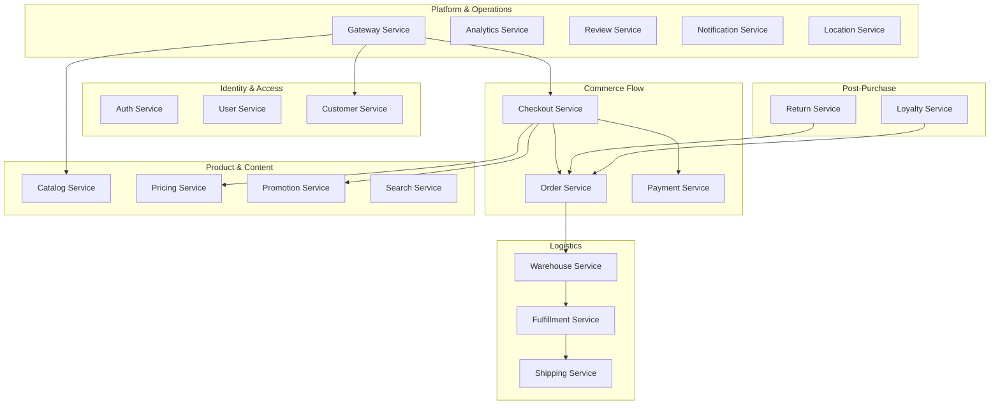
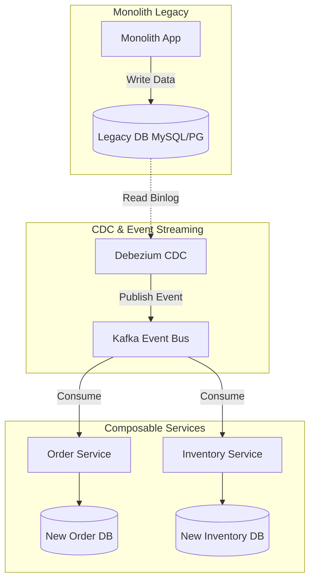

# Composable E-Commerce Migration: Overcoming Tech Debt

> **Answer-First:** Migrating a monolithic e-commerce application (such as Magento) to composable architecture requires decomposing domains into 21 bounded contexts using Strangler Fig proxy routing with Envoy, real-time Debezium CDC for zero-drift database sync, and Go microservices built on Kratos v2 and Protobuf gRPC.

See the [21-service e-commerce architecture blueprint](/posts/blueprint-ecommerce-microservices-architecture-diagram/) for the domain boundaries this migration targets.

- Why replacing a legacy PHP monolith (Magento) requires 21 DDD bounded contexts rather than naive 4–6 microservices.
- Strangler Fig routing configurations for Envoy that migrate traffic path-by-path from Magento to Go microservices without dropping active sessions.
- How to implement a double-write database sync listener in Go to prevent data drift during the multi-month migration window.
- Production Go microservice architecture using Kratos v2, Wire compile-time DI, and Protobuf Money types.

---

> In theory, MACH (Microservices, API-first, Cloud-native, Headless) and Composable Commerce are the "holy grail" of the e-commerce industry. However, when systems scale to process millions of transactions, issues regarding data consistency, domain decomposition, and observability costs surface. This guide details the lessons and architectural patterns from migrating a monolithic Magento application into a production-grade 21-service Go microservices platform.

---

## 1. Why DDD Bounded Contexts: Decomposing Magento Modules

Every engineering team that decides to migrate a legacy Magento monolith faces the question: **how many services?** Naive approaches draw service boundaries around existing database tables (`catalog_product_entity` → Product Service, `sales_order` → Order Service). This creates anemic REST wrappers with tight database coupling moved to network calls.

Domain-Driven Design (DDD) groups code around **business capabilities and invariants**. A rule is enforced within a single service's transaction boundary:


```mermaid
graph TD
    subgraph Commerce Flow
        Checkout[Checkout Service]
        Order[Order Service]
        Payment[Payment Service]
    end
    subgraph Product & Content
        Catalog[Catalog Service]
        Pricing[Pricing Service]
        Promotion[Promotion Service]
        Search[Search Service]
    end
    subgraph Identity & Access
        Auth[Auth Service]
        User[User Service]
        Customer[Customer Service]
    end
    subgraph Logistics
        Warehouse[Warehouse Service]
        Fulfillment[Fulfillment Service]
        Shipping[Shipping Service]
    end
    subgraph Post-Purchase
        Return[Return Service]
        Loyalty[Loyalty Service]
    end
    subgraph Platform & Operations
        Gateway[Gateway Service]
        Analytics[Analytics Service]
        Review[Review Service]
        Notification[Notification Service]
        Location[Location Service]
    end

    Gateway --> Checkout
    Gateway --> Catalog
    Gateway --> Customer
    Checkout --> Order
    Checkout --> Pricing
    Checkout --> Promotion
    Checkout --> Payment
    Order --> Warehouse
    Warehouse --> Fulfillment
    Fulfillment --> Shipping
    Return --> Order
    Loyalty --> Order
```

### The Two Counter-Intuitive Domain Splits
- **Checkout ≠ Order**: Checkout Service manages *temporary, expendable cart state*. Order Service manages *permanent, audited financial state* across an 8-state lifecycle (`PENDING → CONFIRMED → PAYMENT_CAPTURED → PROCESSING → FULFILLMENT_STARTED → SHIPPED → DELIVERED → COMPLETED`). Separating them enables independent pod scaling during peak events.
- **Pricing ≠ Promotion**: Pricing Service owns base price calculations (high read rate, Redis cache TTL = 1h). Promotion Service applies rules and coupon redemptions (event-driven, transactional PostgreSQL deduplication).

---

## 2. Monorepo Architecture: Rush & Go Workspaces

Managing 21 Go microservices and 2 frontend applications (Next.js storefront and React admin panel) within a single codebase requires structured monorepo governance. Without strict dependency management and code sharing policies, multi-service repositories quickly degrade into fragmented codebases with divergent library versions and redundant utility functions.

```
composable-commerce/
├── rush.json                      ← Microsoft Rush config for TS apps & packages
├── common/config/rush/
│   └── common-versions.json       ← Strict dependency version governance
├── apps/
│   ├── storefront/                ← Next.js customer storefront
│   └── admin-dashboard/           ← React admin panel
├── packages/
│   ├── ui-components/             ← Shared Tailwind design system
│   └── api-client/                ← TypeScript SDK generated from Go protos
└── services/                      ← 21 Go microservices (Go module per service)
```

Protobuf contract compilation bridges Go microservices and frontend TypeScript code using `buf generate`. By configuring automated pre-commit hooks and CI checks, any API schema change in a Go service `.proto` file immediately regenerates TypeScript interfaces and client stubs. If a backend developer modifies a RPC parameter signature, frontend builds fail immediately during type-checking before code can be merged into production.

---

## 3. Core Backend: Golang + Kratos v2 Internals

Each Go microservice implements a strict 5-layer Clean Architecture layout using the Kratos v2 framework to maintain clear separation of concerns across production workloads. The structured file layout below outlines the organization across API contracts, dependency injection bindings, domain business logic, data access repositories, and transport protocol servers:

```text
order-service/
├── api/order/v1/order.proto       ← gRPC + HTTP proto contract
├── cmd/order-service/
│   ├── main.go                    ← Entry point
│   ├── wire.go                    ← Compile-time DI declarations
│   └── wire_gen.go                ← Auto-generated DI initialization
├── internal/
│   ├── biz/                       ← Pure business logic & aggregate roots
│   ├── data/                      ← PostgreSQL & Redis repository implementations
│   ├── service/                   ← Transport handlers (Proto → Biz mapping)
│   └── server/                    ← gRPC (:9001) & HTTP (:8001) servers
```

### Wire Compile-Time Dependency Injection
Unlike runtime reflection-based DI containers (such as Spring or Magento XML injection), Go Wire resolves component dependencies at compile time. `wire.go` specifies provider sets for databases, repositories, business logic use-cases, and transport servers. Running `wire` generates deterministic initialization code in `wire_gen.go`. If a developer forgets to provide a required dependency, `go build` fails immediately at compile time rather than crashing in production.

### Protobuf Money Type & Cursor Pagination
- **Exact Money Representation**: Financial calculations must never use floating-point types (`float32`/`float64`) due to binary rounding inaccuracies (e.g., `0.1 + 0.2 != 0.3`). Microservices adopt Google's standard `google.type.Money` protobuf contract (`currency_code`, `units`, `nanos`), executing monetary arithmetic using 64-bit integer fixed-point units in Go.
- **High-Performance Cursor Pagination**: Standard SQL offset pagination (`OFFSET 10000 LIMIT 20`) forces database engines to perform full index scans to discard 10,000 rows. Composable services implement seek-based cursor pagination (`WHERE (created_at, id) < ($cursor_time, $cursor_id) ORDER BY created_at DESC, id DESC LIMIT 20`), providing O(1) query execution speeds regardless of table depth across millions of historical orders.

---

## 4. The Real Bottleneck in Decoupling (Eventual Consistency)

When separating read-heavy search services (Elasticsearch/Meilisearch) from core transactional inventory services via an asynchronous event bus, temporary data replication lag (typically 200ms to 2s) is inevitable. That lag creates one concrete hazard and demands one practical mitigation:

- **The Concurrency Hazard**: A customer views a product page showing 1 item remaining and clicks "Add to Cart". The Inventory Service immediately reserves the item and decrements stock to 0. However, because the CDC event has not yet reached Elasticsearch, a second customer refreshes the search results, sees 1 item remaining, attempts to checkout, and encounters a frustrating failure.
- **Practical Mitigation (Redis Lease Locking at BFF Layer)**: To eliminate checkout friction without coupling read services back to the primary database, the Backend-For-Frontend (BFF) gateway acquires a temporary lease lock in Redis upon inventory reservation. Subsequent checkout requests for that SKU check the Redis lease key before touching the database. If leased, the BFF returns instant backpressure response status to the second user, preventing phantom checkout attempts while Elasticsearch completes replication.

---

## 5. Solving Legacy Monolith Sync: The CDC Architecture

Avoiding application-level double writing prevents database drift, dual-phase commit lock contention, and network latency overhead. Change Data Capture (CDC) uses Debezium and Kafka Connect to tail the PostgreSQL Write-Ahead Log (WAL) or MySQL binary logs (binlogs) out-of-band. The three moving parts work as follows:

- **Debezium WAL Log Parsing**: Debezium captures row-level insert, update, and delete mutations directly from the database engine log without modifying application code or incurring SQL query overhead on the legacy database.
- **Kafka Event Streaming**: Captured mutations are published to dedicated Apache Kafka topics (e.g. `legacy.inventory_stocks`), preserving absolute global transaction order across table entities.
- **Eventual Consistency & Reconciliation**: Downstream composable microservices consume binlog events asynchronously. While eventual consistency introduces a transient replication delay (typically under 100ms), downstream consumers enforce schema transformation and write to domain-isolated databases, guaranteeing eventual data convergence across legacy and modern platforms.


```mermaid
graph TD
    subgraph Monolith Legacy
        APP[Monolith App] -->|Write Data| DB[(Legacy DB MySQL/PG)]
    end
    
    subgraph CDC & Event Streaming
        DB -.->|Read Binlog| DEB[Debezium CDC]
        DEB -->|Publish Event| KAFKA[Kafka Event Bus]
    end
    
    subgraph Composable Services
        KAFKA -->|Consume| OS[Order Service]
        KAFKA -->|Consume| INV[Inventory Service]
        OS --> O_DB[(New Order DB)]
        INV --> I_DB[(New Inventory DB)]
    end
```

---

## 6. The Phased Migration Roadmap & Envoy Routing

Transitioning a high-volume monolithic e-commerce application to composable microservices without taking downtime requires an incremental three-phase Strangler Fig migration pattern managed by Envoy Proxy. This traffic control layer dynamically directs incoming API routes across legacy monolith endpoints and modern Go microservice clusters. The architecture diagram below illustrates the route proxying topology:

```mermaid
graph TD
    Client[User Client] -->|HTTP Requests| Gateway[Ingress Gateway / Envoy]
    
    subgraph Route Evaluation
        Gateway -->|/api/v1/cart/*<br/>(Migrated)| CartCluster[Composable Cart Service]
        Gateway -->|/api/v1/catalog/*<br/>(Migrated)| CatalogCluster[Composable Catalog Service]
        Gateway -->|/*<br/>(Legacy Default)| MonoCluster[Monolith Legacy Cluster]
    end

    subgraph Composable Layer
        CartCluster -->|1. Write| NewCartDB[(New Cart DB)]
        CatalogCluster -->|Read/Write| NewCatalogDB[(New Catalog DB)]
    end

    subgraph Legacy Layer
        MonoCluster -->|Write| LegacyDB[(Legacy DB)]
    end

    subgraph CDC Data Synchronization
        NewCartDB -.->|2. Capture Binlogs| CDC[Debezium CDC]
        CDC -->|3. Publish| Kafka[[Kafka Event Bus]]
        Kafka -->|4. Consume| SyncWorker[Go Sync Worker]
        SyncWorker -.->|5. Replicate| LegacyDB
    end

    style Gateway fill:#f9f,stroke:#333,stroke-width:2px
    style MonoCluster fill:#fbb,stroke:#333,stroke-width:1px
    style CartCluster fill:#bfb,stroke:#333,stroke-width:1px
    style CatalogCluster fill:#bfb,stroke:#333,stroke-width:1px
```

### Envoy Configuration Snippet

The YAML snippet below configures Envoy HTTP route rules to forward traffic for migrated cart and catalog endpoints to modern microservice clusters while directing unmigrated routes to the legacy monolith:

```yaml
static_resources:
  listeners:
  - name: ingress_edge_listener
    address:
      socket_address:
        address: 0.0.0.0
        port_value: 8080
    filter_chains:
    - filters:
      - name: envoy.filters.network.http_connection_manager
        typed_config:
          "@type": type.googleapis.com/envoy.extensions.filters.network.http_connection_manager.v3.HttpConnectionManager
          stat_prefix: ingress_http
          route_config:
            name: local_route
            virtual_hosts:
            - name: local_service
              domains: ["*"]
              routes:
              - match:
                  prefix: "/api/v1/cart"
                route:
                  cluster: composable_cart_service
                  timeout: 3s
              - match:
                  prefix: "/api/v1/catalog"
                route:
                  cluster: composable_catalog_service
                  timeout: 2s
              - match:
                  prefix: "/"
                route:
                  cluster: monolith_legacy_cluster
                  timeout: 10s
```

---

## 7. Go Event Listener for Parallel Database Sync

To process CDC event streams reliably at high throughput without risking data drift or duplicate processing during database synchronization, the Go synchronization worker implements a worker pool concurrent pipeline. The Go implementation below processes Kafka CDC events and executes idempotent PostgreSQL upserts within atomic transactions:

```go
package main

import (
	"context"
	"database/sql"
	"encoding/json"
	"fmt"
	"log"
	"time"

	"github.com/segmentio/kafka-go"
)

type InventorySyncEvent struct {
	SKU          string    `json:"sku"`
	Quantity     int       `json:"quantity"`
	WarehouseID  int       `json:"warehouse_id"`
	EventTime    time.Time `json:"event_time"`
	EventUUID    string    `json:"event_uuid"`
}

type SyncWorker struct {
	db          *sql.DB
	kafkaReader *kafka.Reader
}

func NewSyncWorker(db *sql.DB, brokers []string, topic string) *SyncWorker {
	r := kafka.NewReader(kafka.ReaderConfig{
		Brokers:  brokers,
		GroupID:  "inventory-sync-group",
		Topic:    topic,
		MinBytes: 10e3,
		MaxBytes: 10e6,
	})
	return &SyncWorker{db: db, kafkaReader: r}
}

func (w *SyncWorker) processSyncEvent(ctx context.Context, event InventorySyncEvent) error {
	tx, err := w.db.BeginTx(ctx, &sql.TxOptions{Isolation: sql.LevelReadCommitted})
	if err != nil {
		return err
	}
	defer tx.Rollback()

	var processed bool
	err = tx.QueryRowContext(ctx, 
		"SELECT EXISTS(SELECT 1 FROM processed_events WHERE event_uuid = $1)", 
		event.EventUUID).Scan(&processed)
	if err != nil {
		return fmt.Errorf("idempotency check failed: %w", err)
	}

	if processed {
		return nil
	}

	_, err = tx.ExecContext(ctx, `
		INSERT INTO inventory_stocks (sku, available_qty, warehouse_id, updated_at)
		VALUES ($1, $2, $3, NOW())
		ON CONFLICT (sku, warehouse_id) 
		DO UPDATE SET available_qty = EXCLUDED.available_qty, updated_at = NOW()`,
		event.SKU, event.Quantity, event.WarehouseID)
	if err != nil {
		return fmt.Errorf("failed to upsert stock: %w", err)
	}

	_, err = tx.ExecContext(ctx, 
		"INSERT INTO processed_events (event_uuid, processed_at) VALUES ($1, NOW())", 
		event.EventUUID)
	if err != nil {
		return fmt.Errorf("failed to log processed event: %w", err)
	}

	return tx.Commit()
}
```

---

## Frequently Asked Questions

Below are answers to common technical questions regarding composable e-commerce migrations, domain decomposition, and CDC database synchronization patterns in 2026. These insights clarify architectural trade-offs, performance gains from gRPC transport protocols, and strategies for managing legacy database transitions effectively without encountering unexpected downtime.

### When should a business migrate to Composable Commerce?
When revenue hits the $5 million/year mark, or when the current monolithic platform severely bottlenecks release frequency. For small startups, packaged SaaS solutions remain more cost-effective.

### Why do we need a BFF (Backend-For-Frontend)?
The BFF aggregates data from multiple microservices into a single unified API response for the frontend application, drastically minimizing mobile network round-trips. It also acts as a circuit breaker and caching layer when downstream backend microservices experience transient latency.

### How long does the full migration take?
End-to-end: **14–19 weeks** for a production store. Phase 1 (read-only) takes 2–3 weeks, Phase 2 (dual-write per domain) takes 4–6 weeks, and Phase 3 (full cutover) takes 8–10 weeks.

### How much faster is gRPC than REST+JSON internally?
In production microservices, gRPC binary serialization and HTTP/2 multiplexing are **3–7× faster** than REST+JSON text parsing. This performance gain reduces internal multi-hop microservice latency from ~90ms down to ~15ms.


## Related Reading

- [Why Migrate Magento to Microservices: Zero-Downtime Guide](/posts/moving-from-magento-to-microservices/) — the 3-phase Strangler Fig playbook in operational detail.
- [Magento Migration: Shared DB, CDC, or Event Bus?](/posts/strangler-fig-shared-database-quick-win/) — choosing the data-sync strategy for Phase 1.
- [E-Commerce Microservices Architecture: 21-Service Blueprint](/posts/blueprint-ecommerce-microservices-architecture-diagram/) — the target-state topology.
- [Real-Time Inventory: Kafka, CDC & Redis](/posts/real-time-inventory-ecommerce-architecture/) — the CDC pipeline referenced above, in production form.
