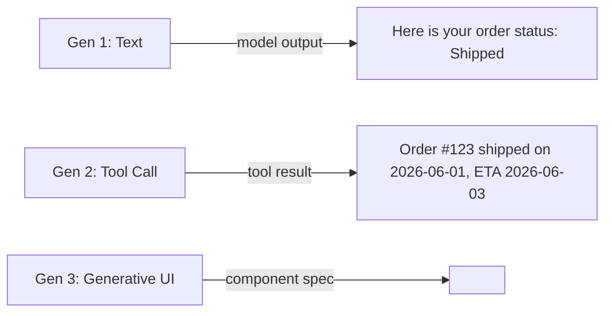

**Answer-first:** Model Context Protocol (MCP) enables AI agents to discover backend capabilities and emit structured tool invocations for application-rendered dynamic UIs. Secure Generative UI requires schema validation (Zod) at the component registry boundary, state synchronization between agent reasoners and DOM elements, sandboxed isolated runtimes for untrusted content, human-in-the-loop confirmation gates, and automated E2E edge testing.

---

## Executive Summary & Generative UI Architecture

Generative UI replaces static text-only chat responses with dynamic, interactive UI components:

1. **Beyond Chatbots**: Moving from plain text to rich interactive component generation.
2. **State Synchronization**: Reconciling LLM agent reasoning state with live DOM component state.
3. **Component Registry**: Managing versioned, permission-gated UI component definitions.
4. **Security & Accessibility (A11y)**: Zod schema parsing, iframe sandboxing, and WCAG compliance.
5. **Human-in-the-Loop (HITL)**: Confirmation components for high-risk destructive actions.
6. **E2E Testing & Edge Runtimes**: Playwright automation and Cloudflare Edge rendering.

---

## 1. Evolution of AI Interfaces: Beyond Chatbots



---

## 2. Client-Agent State Management & Streaming Transport

Generative UI streams component specifications via SSE or WebSockets using React Server Components (RSC):

```typescript
// lib/mcp/schemas/order-status-card.ts
import { z } from "zod";

export const OrderStatusCardSchema = z.object({
    orderId:           z.string().uuid(),
    status:            z.enum(["pending", "processing", "shipped", "delivered", "cancelled"]),
    estimatedDelivery: z.string().datetime().optional(),
    trackingNumber:    z.string().max(50).optional(),
    allowedActions:    z.array(z.enum(["cancel", "return", "reorder"])).default([]),
});

export type OrderStatusCardProps = z.infer<typeof OrderStatusCardSchema>;
```

---

## 3. Dynamic Component Registry

```typescript
// lib/mcp/registry.ts
class ComponentRegistry {
    private components = new Map<string, ComponentDefinition>();
    
    register(definition: ComponentDefinition) {
        this.components.set(definition.name, definition);
    }
    
    async resolve(name: string, userPermissions: string[] = []): Promise<React.ComponentType<any> | null> {
        const def = this.components.get(name);
        if (!def || !def.permissions.every(p => userPermissions.includes(p))) return null;
        return def.loader();
    }
}
```

---

## 4. Security, Sandboxing, and Accessibility (A11y)

1. **Schema Validation**: Props are parsed using `schema.safeParse(props)` prior to rendering. Invalid props are rejected immediately to prevent prop-injection attacks.
2. **Iframe Sandboxing**: Untrusted or user-generated HTML is rendered in isolated `https://sandbox.example.com` iframes.
3. **WCAG A11y Compliance**: Every registered UI component maintains keyboard focus traps, ARIA labels, and screen reader roles.

---

## 5. Human-in-the-Loop (HITL) Confirmation Workflows

Destructive actions (order cancellations, refunds, contract dispatches) require explicit user approval via specialized confirmation dialogs rendered by the agent.

---

## 6. E2E Testing & Edge Runtime Deployment

Playwright E2E suites test Generative UI pipelines by injecting mock LLM tool responses and asserting DOM component rendering, interactive state updates, and error boundary fallbacks.

---

## FAQ


Generative UI is a frontend architecture where an AI model generates specifications for interactive UI components rendered in the browser. The model emits a tool call, and the client resolves and renders the corresponding React/Svelte component from a local component registry.



MCP provides a standardized contract for how AI models discover available tools and UI component schemas. It eliminates proprietary one-off integrations and allows any MCP-compliant LLM to invoke application components safely.



Yes, when protected by: (1) **Runtime schema validation** (Zod) at the registry boundary; (2) **Sandboxed iframes** for user-generated content; (3) **Strict Content Security Policies (CSP)**; and (4) **Server-side authorization** on all component actions.



