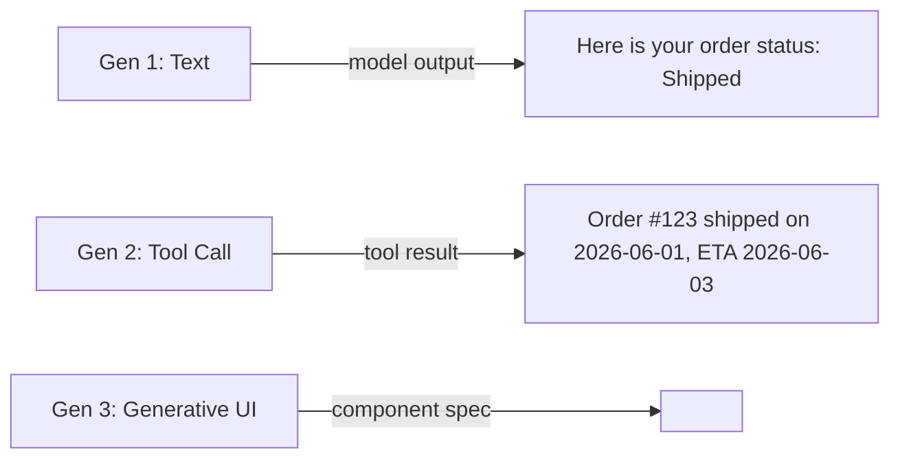
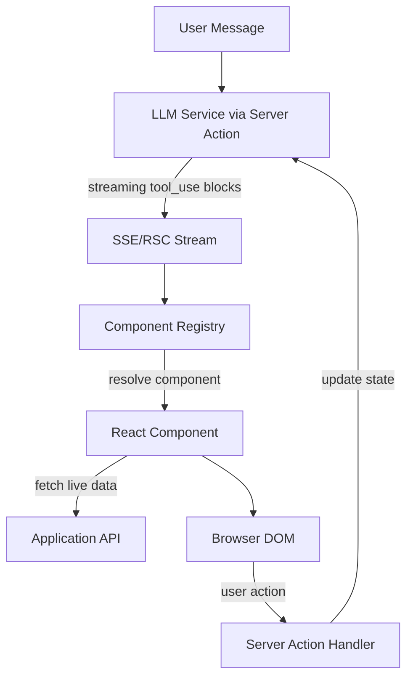

**Answer-first:** Generative UI architectures use Model Context Protocol (MCP) to stream UI component declarations from LLMs. Security requires compiling prop schemas via Zod at the gateway, matching them against versioned local primitive registries rather than executing raw client-side code.

### What You'll Learn That AI Won't Tell You
- Security controls for dynamic TSX execution in edge isolates.
- State reconciliation techniques between AI reasoners and client-side DOM states.


The first generation of AI-powered chat interfaces followed a simple pattern: the user types a message, the LLM generates text, the UI renders text. The second generation added tool calls — the LLM could invoke functions and render the results as text. The third generation — **Generative UI** — goes further: the LLM generates not just text responses but *interactive UI components* that are rendered directly in the browser, enabling experiences that feel less like chatting with a text box and more like using a responsive, intelligent application.

Generative UI represents a genuine architectural shift. It requires a new contract between the AI model and the frontend: the **Model Context Protocol (MCP)**, developed by Anthropic. (For a complete guide on operating MCP securely in production, see our [MCP Engineering in Production](/series/mcp-engineering-in-production/) masterclass). MCP defines how AI models discover available tools and UI components, how they invoke those components with typed parameters, and how the frontend renders and sandboxes dynamically generated interfaces.

This post covers the architectural design of a Generative UI system using MCP: the evolution from text to interactive UI, the MCP contract layer, client-agent state synchronization, the component registry, security controls, and a Next.js reference implementation.

For the full implementation series, explore the [Generative UI Architecture Series](/series/generative-ui-architecture/).

---

## The Evolution of Chat Interfaces: Moving Towards Generative UI

Understanding Generative UI requires understanding what the previous generations of AI interfaces could and could not do.

**Generation 1 — Text Output**: LLM returns plain text. The frontend renders it as markdown. Rich interactions (filtering a data table, booking a date, adjusting a slider) require the user to leave the AI context and navigate to a separate feature of the application.

**Generation 2 — Tool Calls (Text-Anchored)**: LLM can invoke functions (search the database, fetch an order status). The results are formatted as text and returned to the conversation. The user still interacts with text.

**Generation 3 — Generative UI**: The LLM can specify not just *what* information to show but *how* to show it. Instead of returning "Your flight is at 14:30 on Gate B12 — would you like to check in?", it returns a rich flight card component with a one-click check-in button, seat selection, and a live boarding timer — all rendered dynamically in the browser without a page navigation.



Generative UI is the correct architecture when:
- Users need to interact with complex data (not just read it)
- The AI needs to render context-specific interfaces that vary by state, user role, or business domain
- The application wants to eliminate the friction of "the AI tells you what to do, you go find where to do it"

---

## Model Context Protocol (MCP): The System Contract Layer for UI Generation

MCP is an open protocol specification that defines a standard interface for AI models to discover and invoke tools, including UI rendering tools. Without MCP, each AI application builds a proprietary contract between the model and the frontend — making components non-reusable and integrations fragile.

### The MCP Component Contract

An MCP UI component is defined by:

1. **Schema**: A JSON Schema or TypeScript type definition describing the component's props
2. **Renderer**: A React (or framework-agnostic) component that renders the given props
3. **Permissions**: What data the component can access and what actions it can trigger
4. **Sandbox level**: Whether the component runs in a trusted or sandboxed iframe context

A component definition in MCP format:

```typescript
// mcp-registry/components/order-status-card.ts
import { z } from "zod";

export const OrderStatusCardSchema = z.object({
    orderId: z.string().describe("The unique order identifier"),
    status: z.enum(["pending", "processing", "shipped", "delivered", "cancelled"])
        .describe("Current order status"),
    items: z.array(z.object({
        name: z.string(),
        quantity: z.number().int().positive(),
        priceCents: z.number().int(),
    })).describe("Items in the order"),
    trackingNumber: z.string().optional().describe("Carrier tracking number"),
    estimatedDelivery: z.string().optional().describe("ISO 8601 estimated delivery date"),
    allowedActions: z.array(z.enum(["track", "cancel", "return", "reorder"]))
        .describe("Actions the user is permitted to take on this order"),
});

export type OrderStatusCardProps = z.infer<typeof OrderStatusCardSchema>;

export const OrderStatusCardMCPDefinition = {
    name: "order-status-card",
    description: "Displays the current status of an order with actionable options",
    schema: OrderStatusCardSchema,
    permissions: ["read:orders", "write:orders:cancel"],
    sandboxLevel: "trusted",   // Access to the application's auth context
};
```

### How the Model Discovers Components

The MCP server exposes a tools/list endpoint that returns all registered components. When the LLM generates a response, it selects the most appropriate component from the registry and generates its props:

```json
// LLM response (MCP tool_use block)
{
  "type": "tool_use",
  "id": "toolu_01XyZ",
  "name": "render_component",
  "input": {
    "component": "order-status-card",
    "props": {
      "orderId": "ORD-456789",
      "status": "shipped",
      "trackingNumber": "1Z999AA10123456784",
      "estimatedDelivery": "2026-06-03",
      "allowedActions": ["track", "return"]
    }
  }
}
```

---

## Client-Agent State Synchronization: Managing Async UI Generation

Generative UI introduces a state synchronization challenge: the LLM generates a component specification asynchronously, but the component needs to interact with live application state (the user's current session, real-time order status, inventory availability).

### The State Synchronization Architecture



The key insight is that the LLM generates **component specifications** (which component to show, with which initial props), but the components themselves fetch their own live data from the application's API. This separation means:
- The LLM does not need access to real-time application state
- Components are always rendered with fresh data regardless of when the LLM generated the spec
- Component actions (button clicks, form submissions) flow back through normal application state management, not through the LLM

### React Server Components for Streaming Generation

Next.js React Server Components (RSC) are the ideal rendering primitive for Generative UI because they support streaming:

```typescript
// app/chat/route.ts
import { streamText, convertToCoreMessages } from "ai";
import { anthropic } from "@ai-sdk/anthropic";
import { getMCPTools } from "@/lib/mcp/registry";

export async function POST(req: Request) {
    const { messages, sessionId } = await req.json();
    
    // Get all registered MCP UI components as tools
    const mcpTools = await getMCPTools(sessionId);
    
    const result = streamText({
        model: anthropic("claude-opus-4-5"),
        messages: convertToCoreMessages(messages),
        tools: mcpTools,
        system: `You are a helpful assistant for an e-commerce platform. 
        When showing order status, product information, or taking user actions,
        prefer using the available UI components over plain text responses.`,
        maxSteps: 5,  // Allow multi-step tool calls
    });
    
    return result.toDataStreamResponse();
}
```

```typescript
// app/chat/components/message-renderer.tsx
"use client";

import { useChat } from "@ai-sdk/react";
import { ComponentRegistry } from "@/lib/mcp/client-registry";

export function ChatInterface() {
    const { messages, append } = useChat({ api: "/api/chat" });
    
    return (
        <div className="chat-container">
            {messages.map(message => (
                <div key={message.id}>
                    {message.role === "assistant" && message.toolInvocations?.map(tool => {
                        if (tool.toolName === "render_component" && tool.state === "result") {
                            // Resolve and render the component from the registry
                            return (
                                <ComponentRegistry
                                    key={tool.toolCallId}
                                    componentName={tool.args.component}
                                    props={tool.args.props}
                                    onAction={(action, payload) => {
                                        // Route actions back to the conversation
                                        append({
                                            role: "user",
                                            content: `[Action: ${action}] ${JSON.stringify(payload)}`,
                                        });
                                    }}
                                />
                            );
                        }
                        return null;
                    })}
                    {message.content && <TextMessage content={message.content} />}
                </div>
            ))}
        </div>
    );
}
```

---

## The Component Registry: Dynamic Registry Loading and Versioning

The component registry is the central authority for what components the AI can render. It must support:
- **Runtime registration**: Components can be added without redeploying the application
- **Versioning**: The AI must request a specific component version to avoid behavior changes
- **Permission checking**: Components are only available to users with the required permissions

Each component in the registry is paired with a **Zod schema** that defines and validates its props. The schema serves two purposes: runtime validation (the registry rejects malformed props from LLM outputs) and MCP tool parameter generation (Zod schemas can be serialized to JSON Schema for the `tools` array). Here is the schema for the `order-status-card` component:

```typescript
// lib/mcp/schemas/order-status-card.ts
import { z } from "zod";

export const OrderStatusCardSchema = z.object({
    orderId:           z.string().uuid(),
    status:            z.enum(["pending", "processing", "shipped", "delivered", "cancelled"]),
    estimatedDelivery: z.string().datetime().optional(),
    trackingNumber:    z.string().max(50).optional(),
    allowedActions:    z.array(z.enum(["cancel", "return", "reorder"])).default([]),
});

// Derive the TypeScript type from the schema — single source of truth
export type OrderStatusCardProps = z.infer<typeof OrderStatusCardSchema>;
```

The `allowedActions` field uses `.default([])` so the LLM can omit it without causing a validation error. Fields like `estimatedDelivery` are `.optional()` for cases where the order hasn't been dispatched yet. The registry then references this schema when registering the component:

```typescript
// lib/mcp/registry.ts
import { z } from "zod";

interface ComponentDefinition {
    name: string;
    version: string;
    schema: z.ZodType;
    permissions: string[];
    sandboxLevel: "trusted" | "sandboxed";
    loader: () => Promise<React.ComponentType<any>>;
}

class ComponentRegistry {
    private components = new Map<string, ComponentDefinition>();
    
    register(definition: ComponentDefinition) {
        const key = `${definition.name}@${definition.version}`;
        this.components.set(key, definition);
        // Also register as "latest" for convenience
        this.components.set(definition.name, definition);
    }
    
    async resolve(
        name: string,
        version?: string,
        userPermissions: string[] = []
    ): Promise<React.ComponentType<any> | null> {
        const key = version ? `${name}@${version}` : name;
        const definition = this.components.get(key);
        
        if (!definition) {
            console.warn(`Component not found: ${key}`);
            return null;
        }
        
        // Check that the user has all required permissions
        const hasPermissions = definition.permissions.every(
            perm => userPermissions.includes(perm)
        );
        if (!hasPermissions) {
            console.warn(`Permission denied for component: ${name}`);
            return null;
        }
        
        // Lazy-load the component
        return definition.loader();
    }
    
    // Export registry as MCP tools for the LLM
    async toMCPTools(userPermissions: string[]): Promise<Record<string, any>> {
        const tools: Record<string, any> = {};
        
        for (const [name, def] of this.components) {
            if (name.includes('@')) continue; // Skip versioned aliases
            if (!def.permissions.every(p => userPermissions.includes(p))) continue;
            
            tools[`render_${name.replace(/-/g, '_')}`] = {
                description: `Render the ${name} component`,
                parameters: def.schema,
            };
        }
        
        return tools;
    }
}

export const registry = new ComponentRegistry();

// Register components at startup
registry.register({
    name: "order-status-card",
    version: "2.1.0",
    schema: OrderStatusCardSchema,
    permissions: ["read:orders"],
    sandboxLevel: "trusted",
    loader: () => import("@/components/ai/OrderStatusCard").then(m => m.OrderStatusCard),
});
```

For the complete component registry with styling, versioning, and hot-reload support, see [Part 3: Component Registry, Styling and Versioning](/series/generative-ui-architecture/part-3-component-registry/).

---

## Security and Sandboxing: Preventing Prompt Injection in Dynamic Components

Generative UI introduces a new attack surface: **prompt injection via user-provided content**. If the AI renders a component that displays user-submitted data (a product review, a chat message, a document title), an attacker could craft input designed to make the LLM render malicious components or trigger unauthorized actions.

### Defense Layer 1: Schema Validation Before Rendering

Every component's props must be validated against its Zod schema before rendering. Props that fail validation are rejected entirely:

```typescript
function ComponentRegistry({ componentName, props, onAction }: RegistryProps) {
    const [Component, setComponent] = useState<React.ComponentType | null>(null);
    const [validatedProps, setValidatedProps] = useState<any>(null);
    
    useEffect(() => {
        async function load() {
            const definition = await registry.get(componentName);
            if (!definition) return;
            
            // Validate props against the schema — rejects malformed or injected props
            const parsed = definition.schema.safeParse(props);
            if (!parsed.success) {
                console.error("Component prop validation failed:", parsed.error);
                return; // Render nothing rather than an invalid component
            }
            
            const component = await registry.resolve(componentName, undefined, userPermissions);
            setComponent(() => component);
            setValidatedProps(parsed.data);
        }
        load();
    }, [componentName, props]);
    
    if (!Component || !validatedProps) return null;
    return <Component {...validatedProps} onAction={onAction} />;
}
```

### Defense Layer 2: Sandboxed Components for Untrusted Content

Components that render user-provided content (reviews, comments, document bodies) should run in a sandboxed iframe:

```typescript
function SandboxedComponent({ componentName, props }: { componentName: string; props: unknown }) {
    const iframeRef = useRef<HTMLIFrameElement>(null);
    
    useEffect(() => {
        // Post validated props to the sandboxed iframe
        iframeRef.current?.contentWindow?.postMessage({
            type: "RENDER_COMPONENT",
            componentName,
            props,
        }, window.location.origin);
    }, [componentName, props]);
    
    return (
        <iframe
            ref={iframeRef}
            src="/sandbox/component-host"
            sandbox="allow-scripts allow-same-origin"  // No allow-forms, no allow-top-navigation
            style={{ border: "none", width: "100%", height: "auto" }}
        />
    );
}
```

### Defense Layer 3: Content Security Policy

Configure CSP headers to prevent dynamically generated components from loading external resources:

```typescript
// next.config.ts
const ContentSecurityPolicy = `
    default-src 'self';
    script-src 'self' 'unsafe-eval';  // 'unsafe-eval' needed for RSC, restrict in production
    style-src 'self' 'unsafe-inline';
    img-src 'self' data: blob:;
    connect-src 'self' https://api.stripe.com;
    frame-src 'none';
`;
```

---

## Human-in-the-Loop: Implementing Approval Workflows inside Generative UI

Some AI-generated actions require human confirmation before execution. Generative UI is the ideal medium for this: instead of an "Are you sure? Yes/No" text confirmation, the AI can render a rich confirmation component that shows the user exactly what will happen.

```typescript
// components/ai/ConfirmAction.tsx
interface ConfirmActionProps {
    actionType: "cancel_order" | "process_refund" | "send_contract";
    entityId: string;
    summary: string;           // AI-generated plain-language description
    impact: string[];          // List of consequences the user should understand
    requiresTypedConfirmation?: boolean;
}

export function ConfirmAction({
    actionType,
    entityId,
    summary,
    impact,
    requiresTypedConfirmation,
    onAction,
}: ConfirmActionProps & { onAction: ActionHandler }) {
    const [confirmed, setConfirmed] = useState(false);
    const [typedValue, setTypedValue] = useState("");
    
    const canProceed = requiresTypedConfirmation 
        ? typedValue === "CONFIRM" 
        : confirmed;
    
    return (
        <div className="confirm-action-card">
            <h3>Confirm: {summary}</h3>
            <ul className="impact-list">
                {impact.map((item, i) => (
                    <li key={i} className="impact-item">{item}</li>
                ))}
            </ul>
            
            {requiresTypedConfirmation ? (
                <div>
                    <p>Type <strong>CONFIRM</strong> to proceed:</p>
                    <input
                        value={typedValue}
                        onChange={e => setTypedValue(e.target.value)}
                        placeholder="CONFIRM"
                    />
                </div>
            ) : (
                <label>
                    <input
                        type="checkbox"
                        checked={confirmed}
                        onChange={e => setConfirmed(e.target.checked)}
                    />
                    I understand and confirm this action
                </label>
            )}
            
            <div className="action-buttons">
                <button
                    disabled={!canProceed}
                    onClick={() => onAction("confirm", { actionType, entityId })}
                    className="btn-confirm"
                >
                    Confirm
                </button>
                <button
                    onClick={() => onAction("cancel", { actionType, entityId })}
                    className="btn-cancel"
                >
                    Cancel
                </button>
            </div>
        </div>
    );
}
```

The AI routes confirmation-required actions through this component. The component result (`confirm` or `cancel`) flows back to the conversation as a user action, allowing the AI to proceed or acknowledge the cancellation.

---

## Next.js + MCP Reference Implementation and Case Study

Putting it all together, here is the minimal directory structure for a Next.js MCP-enabled Generative UI application:

```
/app
  /api
    /chat/route.ts         ← LLM streaming endpoint with MCP tools
    /actions               ← Server Actions for component interactions
  /chat/page.tsx           ← Chat interface with ComponentRegistry
  /sandbox/component-host  ← Sandboxed iframe host for untrusted components

/lib
  /mcp
    registry.ts            ← Component registry (server-side)
    client-registry.tsx    ← Client component resolver
    tools.ts               ← MCP tool definitions from registry

/components
  /ai
    OrderStatusCard.tsx    ← Trusted component: order status + actions
    ProductCard.tsx        ← Trusted component: product with add-to-cart
    ConfirmAction.tsx      ← Human-in-the-loop confirmation dialog
    DataTable.tsx          ← Sandboxed component: user data display

/mcp-registry
  order-status-card.ts     ← MCP component definition + Zod schema
  product-card.ts
  confirm-action.ts
```

This architecture integrates naturally with the edge-native deployment model described in [Astro on Cloudflare: Full-Stack Edge Architecture](/posts/deploying-astro-on-cloudflare-full-stack-edge-architecture) for globally low-latency AI UI delivery, and with the real-time state management patterns in [Cloudflare D1 + Durable Objects: Build a Real-Time Cart](/posts/cloudflare-d1-durable-objects-realtime-cart/) for AI-assisted shopping experiences.

---

## Frequently Asked Questions

### What is Generative UI and how does it work?
Generative UI is a frontend architecture where an AI model (LLM) generates not just text responses but specifications for interactive UI components to be rendered in the browser. The model selects a component from a registry (e.g., "order-status-card"), generates typed props for it (order ID, status, allowed actions), and the frontend resolves and renders the actual React component. The component fetches its own live data from the application's API, ensuring freshness independent of the LLM's generation time.

### How does Model Context Protocol (MCP) help in frontend UI generation?
MCP provides a standardized contract for how AI models discover available tools and UI components. Without MCP, each AI application builds a proprietary interface — components are not reusable across AI models or applications. With MCP, a component defined once with a JSON Schema can be invoked by any MCP-compatible AI model. This standardization enables a component ecosystem where components built for Claude can also be invoked by GPT-4o or Gemini, reducing vendor lock-in.

### Is Generative UI secure against malicious LLM outputs?
With proper defenses, yes. The three key controls are: (1) **Schema validation** — every component's props are validated against a Zod schema before rendering, rejecting any malformed or injected props the LLM might generate; (2) **Sandboxed iframes** — components that render user-provided content run in an iframe with restricted sandbox permissions, preventing XSS escalation; (3) **Content Security Policy** — CSP headers prevent dynamically rendered components from loading external resources or executing scripts from untrusted origins. No Generative UI system should render components without prop validation — this is the minimum viable security control.

---

**Related Reading:** For the full 7-part series on building Generative UI and AI-Native Frontend Architecture with Astro + Svelte, see the [Generative UI & AI-Native Frontend Architecture series](/series/generative-ui-architecture/). For the production MCP infrastructure that powers the tool-calling layer behind these interfaces, see [MCP Engineering in Production: Go SDK to Enterprise](/series/mcp-engineering-in-production/). For the data and retrieval backbone — GraphRAG vs Naive RAG for AI applications — see [GraphRAG vs Naive RAG: Enterprise Architecture Guide](/posts/graphrag-vs-naive-rag-enterprise-guide/). For 10 honest architectural predictions on where AI-native frontend is heading by 2028 — including generative component registries, MCP-native layouts, and the death of the SPA — see [AI-Native Frontend in 2028: 10 Architecture Predictions](/posts/ai-native-frontend-architecture-predictions-2028/). From the Tech Radar: the [April 29, 2026 Tech Radar](/radar/radar-2026-04-29-creative-mcp/) covered Anthropic's push of MCP into the creative stack — turning Adobe, Blender, and Autodesk into connected agent surfaces, a direct extension of what Generative UI enables on the frontend.


