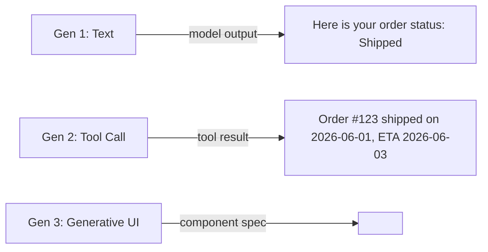

# Generative UI with MCP: Architecting AI-Native Frontends

**Answer-first:** Generative UI powered by Model Context Protocol (MCP) enables backend AI models to dynamically render tailored frontend components, streaming reactive interface updates directly to client web apps. 

Generative UI with Model Context Protocol (MCP) moves frontends from text-only chat interfaces to dynamic, interactive UI components. Using React Server Components, Zod runtime schema validation, dynamic component registries, and iframe sandboxing, AI agents can safely trigger rich native UI components directly from structured tool call outputs. This post covers six pieces of that architecture: moving beyond plain-text chat, reconciling agent reasoning state with live DOM state, managing a versioned component registry, securing and making components accessible, human-in-the-loop confirmation for high-risk actions, and testing/deploying at the edge.

---

## 1. Evolution of AI Interfaces: Beyond Chatbots

Traditional conversational interfaces (Gen 1) constrained AI outputs to plain text blocks or basic Markdown formatting. As LLM tool calling matured (Gen 2), agents gained the ability to invoke backend database queries and external APIs, returning structured JSON payloads back into text stream responses.

Generative UI (Gen 3) has AI agents directly orchestrate frontend UI component hierarchies instead of describing results in text:


```mermaid
graph LR
    G1["Gen 1: Text"] -->|"model output"| TEXT["Here is your order status: Shipped"]
    G2["Gen 2: Tool Call"] -->|"tool result"| TEXT2["Order #123 shipped on 2026-06-01, ETA 2026-06-03"]
    G3["Gen 3: Generative UI"] -->|"component spec"| UI["<OrderStatusCard orderId='123' status='shipped' />"]
```

Rather than rendering static text paragraphs describing an order status or flight itinerary, the agent emits an MCP tool call targeting a registered UI component spec. The frontend runtime resolves the spec and dynamically mounts interactive cards, data visualization charts, or confirmation forms directly within the chat feed.

---

## 2. Client-Agent State Management & Streaming Transport

Generative UI applications stream component specifications over low-latency transport channels—such as Server-Sent Events (SSE), WebSockets, or React Server Component (RSC) streams. As the agent's thought loop executes, partial tool call tokens are streamed to the browser. The Zod schema below defines the typed prop structure enforced for an order status card component:

```typescript
// lib/mcp/schemas/order-status-card.ts
import { z } from "zod";

export const OrderStatusCardSchema = z.object({
    orderId:           z.string().uuid(),
    status:            z.enum(["pending", "processing", "shipped", "delivered", "cancelled"]),
    estimatedDelivery: z.string().datetime().optional(),
    trackingNumber:    z.string().max(50).optional(),
    allowedActions:    z.array(z.enum(["cancel", "return", "reorder"])).default([]),
});

export type OrderStatusCardProps = z.infer<typeof OrderStatusCardSchema>;
```

To maintain application state integrity, the client state manager reconciles live DOM component state with agent reasoning turns. If a user interacts with a generated component (e.g. clicking "Cancel Order"), the component emits an action payload back to the agent via the MCP gateway, updating the shared conversation context without requiring a full page refresh.

---

## 3. Dynamic Component Registry

The dynamic component registry acts as the authoritative boundary between LLM tool call payloads and frontend UI components. The registry maps string component identifiers (emitted by MCP tool calls) to React/Next.js dynamic imports while enforcing role-based access control (RBAC). The TypeScript implementation below manages component lookup and permission checks:

```typescript
// lib/mcp/registry.ts
class ComponentRegistry {
    private components = new Map<string, ComponentDefinition>();
    
    register(definition: ComponentDefinition) {
        this.components.set(definition.name, definition);
    }
    
    async resolve(name: string, userPermissions: string[] = []): Promise<React.ComponentType<any> | null> {
        const def = this.components.get(name);
        if (!def || !def.permissions.every(p => userPermissions.includes(p))) return null;
        return def.loader();
    }
}
```

Components are lazily imported (`React.lazy` or `next/dynamic`), ensuring that users only download JavaScript bundles for UI components that the AI agent actively renders. If an agent attempts to invoke a component that the user lacks permissions to view, the registry rejects resolution and returns a permission error to the agent.

---

## 4. Security, Sandboxing, and Accessibility (A11y)

Rendering dynamic AI-generated UI elements introduces new security attack vectors—such as prop-injection, cross-site scripting (XSS), and UI redressing. To protect application security and maintain accessibility standards, Generative UI runtimes enforce three defense layers:

1. **Schema Validation**: Every component prop payload undergoes strict runtime validation (`schema.safeParse(props)`) prior to mounting. Invalid, unexpected, or malicious prop payloads are rejected immediately before reaching the DOM.
2. **Iframe Sandboxing**: Untrusted or user-generated HTML/CSS snippets generated by LLMs are strictly isolated inside sandboxed `<iframe>` containers hosted on segregated origins (`https://sandbox.example.com`).
3. **WCAG A11y Compliance**: Every registered UI component maintains full WCAG 2.1 AA compliance, including ARIA live regions for dynamic streaming updates, automatic focus management, and screen reader announcements.

---

## 5. Human-in-the-Loop (HITL) Confirmation Workflows

Destructive or high-risk actions—such as processing payment refunds, executing database migrations, or cancelling active enterprise subscriptions—must never be executed by autonomous AI agents without explicit user consent.

Generative UI architectures implement Human-in-the-Loop (HITL) confirmation patterns. When an agent determines that a high-risk tool call is required, it renders a specialized `<ConfirmationModal />` component displaying explicit action details, financial impact summaries, and two-factor approval buttons. The underlying action payload remains paused in the backend state machine until the human user explicitly signs and submits the confirmation payload.

---

## 6. E2E Testing & Edge Runtime Deployment

Testing Generative UI applications requires verifying both LLM tool call contracts and browser DOM rendering. End-to-end (E2E) testing suites powered by Playwright intercept MCP SSE streams, injecting mock tool call payloads to assert that:

- Dynamic components mount correctly with valid props.
- Error boundary fallbacks render gracefully when schema validation fails.
- Interactive user events correctly dispatch callback signals back to the agent gateway.

Deploying Generative UI runtimes to edge networks (such as Cloudflare Workers or Vercel Edge Functions) ensures sub-50ms cold starts, placing AI tool resolution and component streaming nodes physically close to global users.

---

## Frequently Asked Questions

### What is Generative UI and how does it work?
Generative UI is a frontend architecture where an AI model generates specifications for interactive UI components rendered in the browser. The model emits a tool call, and the client resolves and renders the corresponding React/Svelte component from a local component registry.

### How does Model Context Protocol (MCP) help in frontend UI generation?
MCP provides a standardized contract for how AI models discover available tools and UI component schemas. It eliminates proprietary one-off integrations and allows any MCP-compliant LLM to invoke application components safely.

### Is Generative UI secure against malicious LLM outputs?
Generative UI is secure when protected by runtime Zod schema validation at the component registry boundary and sandboxed iframes for untrusted content. Enforcing strict Content Security Policies (CSP) and server-side authorization on all component actions prevents unauthorized state execution.

## Related Reading

- [AI-Native Frontend in 2028: 10 Architecture Predictions](/posts/ai-native-frontend-architecture-predictions-2028/) — where this architecture is heading over the next few years.
- [Build Production Go MCP Servers](/posts/go-mcp-server-development-production-guide/) — implementing the MCP server that exposes component tools.
- [Production AI APIs: OAuth 2.1 & Rate Limiting](/posts/production-ai-apis-oauth-versioning-meta-predictions/) — authorizing the component actions referenced above.
- [Deploy Astro on Cloudflare Pages: Full-Stack Edge Guide](/posts/deploying-astro-on-cloudflare-full-stack-edge-architecture/) — shipping a streaming-capable frontend to the edge.

