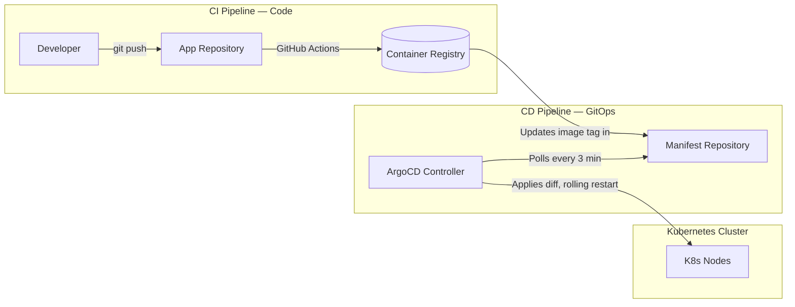

**Answer-first:** Why kubectl apply is dangerous. Learn how to automate a 21-service Go platform using ArgoCD App-of-Apps, Kustomize, and git revert rollbacks.

Building 21 well-architected Go microservices is only half the battle. If your deployment process relies on an engineer running `kubectl apply` from their laptop on a Friday afternoon, you haven't built an enterprise platform — you've built a ticking time bomb.

When designing this composable e-commerce ecosystem, we made one hard architectural rule from day one: **no human touches the production cluster directly.** Everything flows through Git. ArgoCD enforces it.

## The GitOps Mental Model: Git is the Source of Truth

The core principle: a Git repository is the **declarative desired state** of your entire infrastructure. ArgoCD is the enforcement agent that continuously reconciles cluster state to match that Git state.

This is fundamentally different from a traditional CI/CD push model:



1. **CI:** Engineer pushes Go code → GitHub Actions tests, builds the binary, pushes a Docker image to the registry, then opens a PR on a **separate Manifest Repository** updating the image tag.
2. **CD:** ArgoCD watches the Manifest Repo. When the PR is merged, ArgoCD detects the drift between desired state (Git) and actual state (cluster), and self-corrects automatically.

No human touches `kubectl`. No one needs cluster credentials in CI. The cluster is pull-based, not push-based.

## Repository Structure

We use two separate repositories — a pattern known as **split-repo GitOps**:

```
manifest-repo/
├── apps/
│   ├── order-service/
│   │   ├── base/
│   │   │   ├── deployment.yaml
│   │   │   ├── service.yaml
│   │   │   └── kustomization.yaml
│   │   └── overlays/
│   │       ├── dev/
│   │       │   └── kustomization.yaml
│   │       ├── staging/
│   │       │   └── kustomization.yaml
│   │       └── prod/
│   │           ├── kustomization.yaml
│   │           └── hpa.yaml
│   └── checkout-service/
│       └── ...
└── argocd/
    ├── root-app.yaml          ← App-of-Apps root
    ├── order-service-prod.yaml
    └── checkout-service-prod.yaml
```

Keeping manifests in a separate repo from application code provides a clean audit trail: every deploy is a Git commit with a timestamp, author, and image tag. Rolling back is a `git revert`.

## The ArgoCD Application CRD

Every service gets an `Application` CRD that tells ArgoCD exactly which path in the manifest repo to watch, and where to deploy it:

```yaml
# argocd/order-service-prod.yaml
apiVersion: argoproj.io/v1alpha1
kind: Application
metadata:
  name: order-service-production
  namespace: argocd
  labels:
    environment: production
    team: commerce
spec:
  project: ecommerce-prod

  source:
    repoURL: https://github.com/your-org/manifest-repo.git
    targetRevision: main
    path: apps/order-service/overlays/prod  # points at prod Kustomize overlay

  destination:
    server: https://kubernetes.default.svc
    namespace: production

  syncPolicy:
    automated:
      prune: true      # remove resources deleted from Git
      selfHeal: true   # revert manual kubectl changes automatically
    syncOptions:
      - CreateNamespace=true
      - ServerSideApply=true  # avoids annotation length limits on large CRDs
    retry:
      limit: 3
      backoff:
        duration: 30s
        factor: 2
        maxDuration: 5m

  # Health check: ArgoCD won't mark as Healthy until all pods are Running
  ignoreDifferences:
    - group: apps
      kind: Deployment
      jsonPointers:
        - /spec/replicas  # ignore HPA-managed replica count drift
```

> **`selfHeal: true`** is the critical production setting. If an SRE manually patches a Deployment in production (for whatever reason), ArgoCD will revert it within 3 minutes. Git is the only source of truth — no exceptions.

## Taming YAML Chaos with Kustomize

Managing manifests for 21 services across 3 environments (`dev`, `staging`, `prod`) produces 60+ YAML files. Copy-pasting creates configuration drift. Kustomize solves this with a base + overlay model.

### Base Manifest (Environment-Agnostic)

```yaml
# apps/order-service/base/deployment.yaml
apiVersion: apps/v1
kind: Deployment
metadata:
  name: order-service
spec:
  replicas: 1  # overridden per environment
  selector:
    matchLabels:
      app: order-service
  template:
    metadata:
      labels:
        app: order-service
    spec:
      containers:
        - name: order-service
          image: registry.example.com/order-service:latest  # tag overridden per environment
          ports:
            - containerPort: 8080
          resources:
            requests:
              cpu: "100m"
              memory: "128Mi"
            limits:
              cpu: "500m"
              memory: "512Mi"
          readinessProbe:
            httpGet:
              path: /health/ready
              port: 8080
            initialDelaySeconds: 10
            periodSeconds: 5
          livenessProbe:
            httpGet:
              path: /health/live
              port: 8080
            initialDelaySeconds: 30
            periodSeconds: 15
```

```yaml
# apps/order-service/base/kustomization.yaml
apiVersion: kustomize.config.k8s.io/v1beta1
kind: Kustomization
resources:
  - deployment.yaml
  - service.yaml
```

### Production Overlay (Patches Only What Differs)

The overlay never duplicates the base — it only patches what changes per environment:

```yaml
# apps/order-service/overlays/prod/kustomization.yaml
apiVersion: kustomize.config.k8s.io/v1beta1
kind: Kustomization

resources:
  - ../../base
  - hpa.yaml          # HPA only in prod

# Override the image tag for this specific release
images:
  - name: registry.example.com/order-service
    newTag: "v1.47.2"  # updated by CI pipeline after each build

# Strategic merge patch — only the fields that differ from base
patchesStrategicMerge:
  - |-
    apiVersion: apps/v1
    kind: Deployment
    metadata:
      name: order-service
    spec:
      replicas: 4      # prod gets 4 replicas vs dev's 1
      template:
        spec:
          containers:
            - name: order-service
              resources:
                requests:
                  cpu: "500m"
                  memory: "512Mi"
                limits:
                  cpu: "2000m"
                  memory: "2Gi"
              env:
                - name: DB_HOST
                  valueFrom:
                    secretKeyRef:
                      name: order-service-prod-secrets
                      key: db_host
```

```yaml
# apps/order-service/overlays/prod/hpa.yaml
apiVersion: autoscaling/v2
kind: HorizontalPodAutoscaler
metadata:
  name: order-service-hpa
spec:
  scaleTargetRef:
    apiVersion: apps/v1
    kind: Deployment
    name: order-service
  minReplicas: 4
  maxReplicas: 20
  metrics:
    - type: Resource
      resource:
        name: cpu
        target:
          type: Utilization
          averageUtilization: 70
```

The `dev` overlay uses `newTag: "latest"`, `replicas: 1`, lower resource limits, and no HPA. The `staging` overlay mirrors prod sizing but points to a staging database secret. All three share the identical base deployment logic.

## The App-of-Apps Root

For 21 services, creating ArgoCD `Application` objects one-by-one is impractical. We use the **App-of-Apps pattern**: a single root `Application` that manages all other `Application` objects:

```yaml
# argocd/root-app.yaml
apiVersion: argoproj.io/v1alpha1
kind: Application
metadata:
  name: ecommerce-platform
  namespace: argocd
spec:
  project: default
  source:
    repoURL: https://github.com/your-org/manifest-repo.git
    targetRevision: main
    path: argocd/  # ArgoCD watches this directory for Application CRDs
  destination:
    server: https://kubernetes.default.svc
    namespace: argocd
  syncPolicy:
    automated:
      prune: true
      selfHeal: true
```

When a new microservice is added to the platform, the process is:
1. Add a new `Application` YAML to `argocd/`
2. Merge the PR
3. The root App-of-Apps detects the new file and creates the child Application automatically
4. ArgoCD provisions the new service with zero manual intervention

## The Rollback Story: `git revert` is Enough

Before GitOps, rolling back a broken deployment meant frantically digging through CI logs to find an old Docker tag, then running manual `kubectl rollout undo` commands while customers hit 500 errors.

With ArgoCD, disaster recovery is a four-step process:

```bash
# 1. Identify the bad commit
git log --oneline manifests/apps/checkout-service/overlays/prod/kustomization.yaml

# 2. Revert it
git revert <bad-commit-hash> --no-edit

# 3. Push
git push origin main

# 4. ArgoCD detects the revert within 3 minutes and rolls back automatically
# No kubectl required. No cluster access required.
```

The revert creates a new commit with full auditability: who reverted, when, and which change was undone. The cluster state is back to the last stable image in under 5 minutes.

For critical services (Checkout, Payment), we additionally use **Argo Rollouts** with Prometheus-based health gates — if error rate or p99 latency exceeds thresholds during a rollout, the canary is automatically aborted and traffic is shifted back to the stable version without human intervention.

## Summary: The Principles That Make This Work

| Principle | Implementation |
| :--- | :--- |
| **Git is the only source of truth** | `selfHeal: true` on all prod Applications |
| **No drift between environments** | Kustomize base + overlays — patches, never copies |
| **Rollback is a Git operation** | `git revert` → ArgoCD auto-syncs |
| **New services self-register** | App-of-Apps root watches the `argocd/` directory |
| **Human error is structurally prevented** | No one needs `kubectl` or cluster credentials in CI |

The investment pays off the first time you hit a bad production deploy at 2am. Instead of a frantic kubectl session, you open a terminal, type three git commands, and watch ArgoCD fix the cluster by itself.

---

**Continue Reading:**
- [What's New in Argo CD 3.4 & 3.3: Cluster Pause & Upgrades](/posts/argo-cd-updates-2026/) — the latest features and breaking changes before you upgrade your GitOps platform.
- [Mastering Event-Driven Architecture with Dapr Pub/Sub](/posts/mastering-event-driven-architecture-dapr/) — how the 21 microservices deployed here communicate asynchronously.
- [MySQL Scaling: Replication, Sharding & TiDB](/posts/mysql-scaling-sharding-tidb-architecture/) — scaling the databases that these Kubernetes-managed services depend on.



## FAQ


**GitOps** is a critical architectural pattern or system discussed in this guide. Why kubectl apply is dangerous. Learn how to automate a 21-service Go platform using ArgoCD App-of-Apps, Kustomize, and git revert rollbacks.



Unlike legacy systems, **GitOps** introduces modern microservices or event-driven paradigms that scale efficiently. This article explores the exact tradeoffs and engineering constraints involved.


