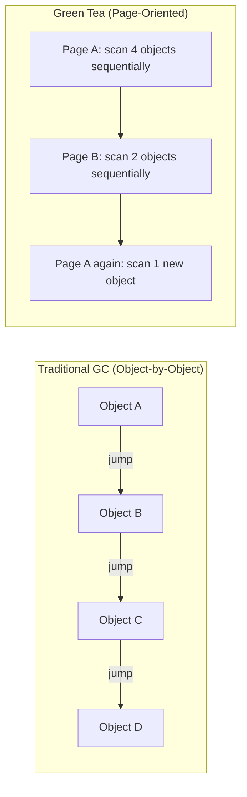

**Answer-first:** Go 1.26 ships three landmark runtime features: the Green Tea garbage collector (10–40% GC overhead reduction), ~30% faster cgo calls for AI inference bindings, and an experimental goroutine leak profile that detects permanently blocked goroutines via GC reachability analysis.

Released in February 2026, Go 1.26 is not a routine patch release. It fundamentally changes how the Go runtime manages memory, interacts with C code, and surfaces concurrency bugs. For teams running [Golang microservices at scale](/posts/architecting-21-service-ecommerce-golang-ddd/), these improvements compound across a fleet — zero code changes required.

This post covers what changed, why it matters for production systems, how to adopt it, and what to watch out for during migration.

---

## 1. The Green Tea Garbage Collector: Page-Oriented Marking

**Answer-first:** Green Tea replaces Go's traditional object-by-object graph flood with a page-oriented scanning strategy that improves CPU cache locality, reduces work list contention, and enables AVX-512 vector acceleration — delivering 10–40% less GC CPU overhead in real workloads.

### Why the Old GC Was Hitting a Wall

Go's previous mark-sweep GC followed a straightforward graph flood: take an object off the work list, scan its pointers, add discovered objects to the list, repeat. The problem is microarchitectural:

- **Cache thrashing**: Two objects pointing to each other have no guarantee of being near each other in memory. The GC jumps between pages constantly, defeating CPU caches.
- **Branch misprediction**: Each scan operation is small, unpredictable, and dependent on the last — the CPU can never "see ahead" far enough to pipeline effectively.
- **Work list contention**: Parallel marking threads all compete for a shared queue of objects.

Modern hardware trends make this worse over time: non-uniform memory access (NUMA), reduced per-core memory bandwidth, and ever more cores competing for the same shared state.

### How Green Tea Works

The core insight is deceptively simple: **work with pages, not objects**.

Instead of tracking individual objects on the work list, Green Tea tracks 8 KiB pages. Objects accumulate on a page while it waits in a FIFO queue, then the GC scans multiple objects in a single left-to-right memory pass — exploiting spatial locality.



Key mechanics:

1. **Two bits per object slot** — "seen" (pointer found) and "scanned" (object processed). Their difference tells which objects need scanning on the next page pass.
2. **FIFO page queue** — pages accumulate seen-but-unscanned objects while waiting, maximizing work per pass.
3. **Pages can re-enter the queue** — unlike traditional mark where each object is queued exactly once, a page can reappear if new pointers to its objects are discovered later.

### AVX-512 Vector Acceleration

On Intel Ice Lake / AMD Zen 4 and newer, Green Tea uses 512-bit vector registers to process an entire page's metadata in a few instructions:

1. Load "seen" and "scanned" bitmaps into two 512-bit registers.
2. Compute the difference (active objects bitmap) with a single XOR.
3. Expand active objects bitmap to an "active pointers" bitmap using `VGF2P8AFFINEQB` — a single instruction that performs 8×8 bit matrix multiplication per byte.
4. Iterate the page memory 64 bytes at a time, collecting all live pointers.

This yields an additional ~10% GC CPU reduction beyond the base Green Tea improvement.

### Real-World Impact

| Metric | Before (Go 1.25) | After (Go 1.26) | Change |
|--------|-------------------|------------------|--------|
| GC CPU overhead (modal) | Baseline | -10% | Typical improvement |
| GC CPU overhead (heavy allocation) | Baseline | -40% | Best case |
| GC pause time (p99) | Baseline | ~-35% | [Reported by production teams](https://levelup.gitconnected.com/the-green-tea-gc-is-now-default-in-go-1-26-here-is-what-that-means-for-your-backend-services-4f6cdf8fc136) |
| Average latency (zero code changes) | Baseline | ~-6% | Fleet-wide observation |

For a service spending 10% of CPU in GC, the modal improvement translates to 1% overall CPU reduction — multiplied across hundreds of pods, that's real cost savings.

### Opting Out (If Needed)

```bash
# Disable Green Tea GC (opt-out will be removed in Go 1.27)
GOEXPERIMENT=nogreenteagc go build ./...
```

If you observe regressions, [file an issue](https://go.dev/issue/new). The Go team specifically requests production feedback before removing the opt-out in 1.27.

---

## 2. 30% Faster CGO Calls: Why AI Engineers Should Care

**Go 1.26 reduces per-cgo-call overhead by ~30% by cutting redundant signal mask operations in the goroutine-to-OS-thread handoff. At 10,000 cgo calls/sec (typical for token generation via llama.cpp), overhead drops from 8.5ms/sec to 5.95ms/sec — zero code changes required. This makes Go the strongest orchestration layer for C/C++ inference engines (llama.cpp, ONNX Runtime, TensorRT) where thousands of small cgo calls per second previously created measurable tail latency.**

Running local LLMs in Go typically requires calling into C++ inference engines via cgo. Each cgo call incurs overhead from:

- **Goroutine-to-thread context switch**: Go's M:N scheduler must pin the goroutine to an OS thread for the C call duration.
- **Stack switching**: Go goroutines use segmented stacks; C code needs a traditional stack.
- **Signal handling setup**: The runtime adjusts signal masks for the C execution context.

In a high-throughput inference pipeline making thousands of small cgo calls per second (tokenization, embedding lookups, attention layer invocations), this overhead compounds severely.

### What Changed

Go 1.26 optimized the cgo call path by reducing redundant signal mask operations and streamlining the goroutine-to-thread handoff. The result is a flat ~30% reduction in per-call overhead — no code changes required.

### Practical Impact

For an AI orchestration service calling `llama.cpp` for token generation:

```go
// Before Go 1.26: ~850ns per cgo call overhead
// After Go 1.26:  ~595ns per cgo call overhead (-30%)

// At 10,000 cgo calls/sec (typical for streaming token generation):
// Before: 8.5ms/sec lost to cgo overhead
// After:  5.95ms/sec lost to cgo overhead
// Saved: 2.55ms/sec — meaningful for latency-sensitive inference
```

This cements Go as the optimal language for building API orchestration layers around raw C++ inference engines — exactly the pattern we use in our [production AI swarm architecture](/posts/deploying-autonomous-ai-swarm-openclaw-litellm/).

---

## 3. Experimental Goroutine Leak Detection

**The new `goroutineleak` pprof profile (enabled via `GOEXPERIMENT=goroutineleakprofile`) uses GC reachability analysis: if a goroutine is blocked on a channel/mutex that has become unreachable from all runnable goroutines, it can never wake up and is reported as leaked. Access via `/debug/pprof/goroutineleak` or `pprof.Lookup("goroutineleak").Count()` for Prometheus alerting. Zero overhead when not actively profiling. Expected default in Go 1.27.**

### How It Works

A goroutine leaks when it's blocked on a concurrency primitive (channel, mutex, cond) whose "wake" path is unreachable. The runtime detects this using the garbage collector: if the primitive P that goroutine G is blocked on becomes unreachable from all runnable goroutines, then G can never wake up.

```go
// ❌ Classic goroutine leak: unbuffered channel with early return
func processWorkItems(ws []workItem) ([]workResult, error) {
    ch := make(chan result) // unbuffered
    for _, w := range ws {
        go func() {
            res, err := processWorkItem(w)
            ch <- result{res, err} // blocks forever if consumer returns early
        }()
    }

    var results []workResult
    for range len(ws) {
        r := <-ch
        if r.err != nil {
            return nil, r.err // early return → remaining goroutines leak
        }
        results = append(results, r.res)
    }
    return results, nil
}
```

After the early return, `ch` becomes unreachable to all other non-leaked goroutines. The GC detects this and reports the leaked goroutines in the new profile.

### Enabling the Profile

```bash
# Build with the experiment enabled
GOEXPERIMENT=goroutineleakprofile go build ./...
```

Once enabled, the profile is accessible via:
- `runtime/pprof` package: `pprof.Lookup("goroutineleak")`
- HTTP endpoint: `/debug/pprof/goroutineleak`

### Production Integration

For [Kubernetes deployments with GitOps](/posts/gitops-at-scale-kubernetes-argocd-microservices/), you can integrate this into your observability stack:

```go
// Expose goroutine leak count as a Prometheus metric
import "runtime/pprof"

func goroutineLeakCount() int {
    p := pprof.Lookup("goroutineleak")
    if p == nil {
        return 0 // profile not enabled
    }
    return p.Count()
}
```

Set alerts when the count exceeds a threshold — catching leaks before they trigger OOM kills (exit code 137). For the full debugging workflow, see our [goroutine leak detection guide](/posts/goroutine-leak-detection-production-golang/).

### Limitations

- Only detects leaks where the blocking primitive becomes GC-unreachable. Global variables or long-lived goroutines holding references will mask leaks.
- Zero runtime overhead when not actively profiling.
- Considered experimental for API feedback — the detection logic itself is production-ready (contributed by Vlad Saioc at Uber).
- Expected to be enabled by default in Go 1.27.

---

## 4. Other Notable Features in Go 1.26

**Other 1.26 highlights: `io.ReadAll` is 2× faster with ~50% less memory (every Go program benefits); `crypto/hpke` adds RFC 9180 Hybrid Public Key Encryption for post-quantum hybrid KEMs; `errors.AsType[T]` enables generic type-safe error unwrapping; compiler stack-allocates more slice literals — fewer heap allocations in hot paths; heap base address randomization hardens cgo binaries.**
| Feature | What It Does | Impact |
|---------|--------------|--------|
| **`new(expr)` syntax** | `new` accepts an expression as initial value | Cleaner optional field initialization (protobuf, JSON) |
| **Self-referential type constraints** | `type Adder[A Adder[A]] interface{}` | More powerful generics |
| **Revamped `go fix`** | Dozens of modernizers to update code to latest idioms | One-command migration to new APIs |
| **`crypto/hpke`** | Hybrid Public Key Encryption (RFC 9180) | Post-quantum hybrid KEMs |
| **`simd/archsimd` (experimental)** | Architecture-specific SIMD operations (amd64) | 128/256/512-bit vector types |
| **`runtime/secret` (experimental)** | Secure erasure of cryptographic temporaries | Forward secrecy in Go |
| **`errors.AsType[T]`** | Generic, type-safe error unwrapping | Faster, cleaner error handling |
| **`io.ReadAll` optimization** | 2× faster, ~50% less memory | Every Go program benefits |
| **Heap base address randomization** | Randomized heap start on 64-bit | Security hardening for cgo |
| **Compiler stack allocation for slices** | More slices allocated on stack | Fewer heap allocations |

---

## 5. Migration Guide: Upgrading from Go 1.25

**4-step Go 1.26 upgrade: (1) `go get go@1.26`; (2) `go fix ./...` to apply all modernizers; (3) run benchmarks before/after with `benchstat` to verify GC improvements; (4) roll out via canary in Kubernetes, monitoring `/sched/pauses/total/gc:seconds`. Watch for: `image/jpeg` encoder bit-exact output change, `net/url.Parse` now rejecting unbracketed IPv6 hosts, requires Go 1.24.6+ bootstrap.**

### Pre-Upgrade Checklist

```bash
# 1. Check current Go version
go version

# 2. Update go.mod (Go 1.26 will default new modules to go 1.25.0)
go get go@1.26

# 3. Run the new go fix modernizers
go fix ./...

# 4. Run tests with Green Tea GC explicitly
GOEXPERIMENT=greenteagc go test ./...

# 5. Run benchmarks to baseline GC improvements
go test -bench=. -benchmem -count=5 ./... > bench-1.25.txt
# Then after upgrade:
go test -bench=. -benchmem -count=5 ./... > bench-1.26.txt
benchstat bench-1.25.txt bench-1.26.txt
```

### Things to Watch

1. **Image processing libraries**: `image/jpeg` encoder/decoder has been replaced. If you rely on exact bit-for-bit output, validate.
2. **Malformed URL parsing**: `net/url.Parse` now rejects URLs with colons in the host (e.g., `http://::1/`). Use brackets for IPv6.
3. **Bootstrap requirement**: Go 1.26 requires Go 1.24.6+ for bootstrap.
4. **macOS**: Go 1.26 is the last release supporting macOS 12 Monterey.
5. **Windows/arm (32-bit)**: Removed entirely.

### Kubernetes Rolling Upgrade Strategy

For [ArgoCD-managed deployments](/posts/gitops-at-scale-kubernetes-argocd-microservices/):

```yaml
# Update your Dockerfile base image
FROM golang:1.26-alpine AS builder
```

Roll out via canary deployment — monitor GC metrics (`/sched/pauses/total/gc:seconds`, the new `/sched/goroutines` metrics) for the canary before promoting. If your cluster supports [In-Place Pod Resizing](/posts/kubernetes-in-place-pod-resizing-guide/), you can even adjust resource limits live during the canary phase without rolling the entire deployment.

---

## FAQ


The **Green Tea GC** is a new page-oriented mark-sweep garbage collector that became the default in Go 1.26. Instead of scanning objects individually (traditional graph flood), it tracks 8 KiB pages on a work queue and scans multiple objects per page in sequential memory passes. This improves CPU cache locality and enables AVX-512 vector acceleration, delivering 10–40% less GC CPU overhead in real workloads. It was experimental in Go 1.25 and is production-proven at Google scale.



Go 1.26 reduces the baseline runtime overhead of **cgo calls by approximately 30%**. This improvement is automatic and requires no code changes. It's especially impactful for Go services calling C/C++ AI inference engines (llama.cpp, ONNX Runtime) where thousands of small cgo calls per second previously created measurable latency overhead.



Go 1.26 introduces an experimental `goroutineleak` pprof profile (enabled via `GOEXPERIMENT=goroutineleakprofile`). It uses the garbage collector's reachability analysis: if a goroutine is blocked on a channel or mutex that becomes unreachable from all runnable goroutines, it's permanently blocked and reported as leaked. The feature has zero runtime overhead when not actively profiled and is expected to become default in Go 1.27.



**Yes, for most teams.** The Green Tea GC and faster cgo calls deliver free performance improvements with zero code changes. Run `go fix ./...` to adopt new idioms, validate benchmarks, and roll out via canary. The only caution is if you depend on exact `image/jpeg` output or parse malformed URLs with unbracketed IPv6 addresses — test those paths first.


{}
Yes: build with `GOEXPERIMENT=nogreenteagc`. However, this opt-out will be removed in Go 1.27. If you observe regressions, file an issue at [go.dev/issue/new](https://go.dev/issue/new) — the Go team specifically wants production feedback before removing the escape hatch.
{}

---

**From the Tech Radar:** When Go 1.26 shipped, the [May 10, 2026 Tech Radar](/radar/radar-2026-05-10/) covered the operational impact of the Green Tea GC in the context of Kubernetes-as-AI-OS and the shift toward Agentic Engineering — including how reduced GC pause times are directly relevant for Go-based AI inference sidecars.
