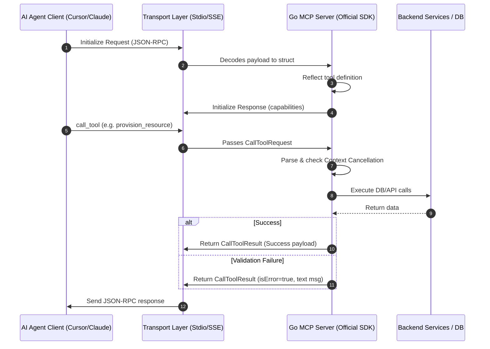

**Answer-first:** Production-grade Go MCP servers require the official `modelcontextprotocol/go-sdk` and strict JSON schemas. Because stdio transport uses standard output, you must route all internal logs to stderr to prevent client crashes. Return validation errors as tool-level failures rather than system errors to preserve connection persistence.

## What You'll Learn That AI Won't Tell You
- How a single standard library `print` statement can immediately corrupt a JSON-RPC stdio pipeline and crash your agent gateway.
- The critical semantic difference between Go native errors and MCP tool-level errors for maintaining connection persistence.
- Concrete architectural patterns for managing multi-minute cloud provisioning tasks within strict HTTP/SSE timeouts.

---

## Introduction: The Rise of Agentic Infrastructures

The landscape of AI is shifting from passive chat boxes to autonomous agents. Building a production-grade **Go MCP server** allows developers to safely connect AI models with databases and APIs. Anthropic's Model Context Protocol (MCP) establishes this secure, bidirectional communication between AI client environments and backend service APIs.

When we deployed our first suite of agentic tools, our Claude desktop client crashed immediately due to a single un-routed `fmt.Println` statement. We quickly realized that while spinning up a simple Python-based calculator running over standard I/O is trivial, building a production-grade, highly resilient MCP server in an enterprise environment requires a completely different level of engineering rigor. 

Go has emerged as the premier choice for agentic runtime backends. Its zero-dependency compilation, low-overhead memory footprint (~15MB RAM), and rapid boot-up time make it uniquely suited to serve LLM requests under strict latency SLAs. In this definitive guide, we will dive into building production-ready Go-based MCP servers using the official SDK, addressing critical design patterns, security protocols, and operational pitfalls.

---

## Section 1: The Case for Go in Agentic Infrastructure

In high-throughput enterprise systems, the choice of backend runtime carries substantial financial and operational implications. While Python and Node.js are common in AI experimentation, they carry high startup overhead, larger container sizes, and significant memory footprints. Compiled Go, by contrast, excels at scaling backend agentic infrastructures. 

### Why Compiled Go Dominates the Agentic Layer

1. **Ultra-Low Memory and CPU Overhead:** A compiled Go MCP binary starts instantly and operates comfortably within a ~15MB RSS memory envelope. This is particularly crucial when running desktop-based agent extensions (like Cursor or Claude) or when scaling hundreds of micro-agents in Kubernetes pods where resource optimization is paramount.
2. **Predictable Garbage Collection and Latency:** The latency constraints of [production Go microservices architecture](/posts/go-microservices/) map perfectly to MCP requirements. With low garbage collection pause times, Go ensures that the communication path between the AI client and backend services remains highly responsive, keeping overall request times low.
3. **Robust Native Concurrency:** Go’s goroutine model allows an MCP server to handle hundreds of concurrent tool calls and resource streaming requests without complex async event-loop configurations.

### The Three Pillars of Production MCP Design

When architecting MCP servers, engineers must move away from the "one big script" anti-pattern and apply domain-driven design principles.

*   **Bounded Contexts:** Keep billing, databases, and container orchestration tools in separate, isolated MCP servers. Do not build a single monolithic MCP server that exposes everything. By keeping contexts bounded, you limit the security blast radius and reduce the number of tools exposed to the LLM, which keeps the context window lean and minimizes hallucinations.
*   **Outcome-Oriented APIs:** Avoid exposing low-level CRUD operations (e.g., `update_db_row`). Agents struggle with high-frequency micro-interactions and bloat their context windows quickly. Instead, design macro-level, outcome-oriented tools (e.g., `provision_staging_environment`) that bundle complex multi-step workflows.
*   **Statelessness:** The MCP server itself should remain stateless. Any state related to running jobs, resources, or configurations must be offloaded to standard databases (PostgreSQL) or key-value caches (Redis) to allow the Go server to scale horizontally.

---

## Section 2: Navigating the Go SDK Ecosystem

Choosing the right library is the foundation of a stable development workflow. In the Go ecosystem, several options exist for implementing MCP.

### Go MCP SDK Options

1. **Official SDK (`github.com/modelcontextprotocol/go-sdk`)**: This is the official SDK collaborated on by Anthropic and Google. It strictly adheres to the Model Context Protocol specifications, provides native JSON-RPC schema reflection, and has a standard-library feel. We strongly recommend it for enterprise use cases because of its long-term project support and timely updates.
2. **`github.com/mark3labs/mcp-go`**: A highly popular community-maintained SDK. It pioneered early Go support for Server-Sent Events (SSE) and HTTP transports, offering a highly flexible API, though it diverges slightly from the official specification naming conventions.
3. **`github.com/metoro-io/mcp-golang`**: An alternative community package with simple tool registration syntax, but it has smaller adoption and fewer community contributions.
4. **Bare Metal JSON-RPC**: Writing raw JSON-RPC 2.0 frames over `os.Stdin` and `os.Stdout`. While this results in minuscule binaries (~2MB), it forces you to manually manage schema generation, deserialization, and protocol handshake states.

For the remainder of this guide, we will focus exclusively on the official **`modelcontextprotocol/go-sdk`** package to ensure our implementation is robust, standardized, and ready for future protocol updates.

### Defining Explicit Tool Schemas in Registration

Unlike community SDKs or custom reflection wrappers that might dynamically generate schemas from Go structs, the official Go SDK requires you to explicitly register the JSON schemas for your tool parameters. The LLM client reads these schemas to understand exactly what parameters the tool expects.

```go
type CloudResourceRequest struct {
	ResourceType string `json:"resource_type" jsonschema:"required,enum=ec2,enum=s3,description=The AWS resource type to provision"`
	Region       string `json:"region" jsonschema:"required,description=Target AWS region"`
	RequestID    string `json:"request_id" jsonschema:"required,description=Unique UUID for request idempotency"`
}
```

By explicitly declaring properties, types, descriptions, and required fields in the SDK's `sdk.Schema` structure during server tool registration, you guarantee that the AI client receives a rigid contract, dramatically reducing the risk of invalid tool call payloads.

---

## Section 3: Architecture and Request-Response Lifecycle

Understanding how the transport layer routes requests is critical for debugging MCP servers. An AI client (e.g., Claude Desktop) typically spawns the Go MCP server binary as a subprocess and establishes communication over standard input (`stdin`) and standard output (`stdout`). Alternatively, in web-scale agent environments, the communication can flow over Server-Sent Events (SSE) and HTTP POST requests.

Below is the request-response lifecycle illustrating standard transport routing:



1. **Handshake Protocol:** The AI agent client sends an initialization frame to the gateway.
2. **Server Capabilities:** The Go MCP server responds with its name, version, and supported capabilities (such as tools, resources, and prompts).
3. **Tool Call Execution:** The client invokes a tool (e.g., `provision_resource`). The SDK decodes the payload, matches it to the registered tool handler, and validates the arguments against the reflected JSON schema.
4. **Context Propagation:** The server executes the business logic while checking for context cancellation.
5. **Enveloped Error Handling:** If the tool logic fails, it wraps the failure inside a valid tool result envelope (`isError=true`) rather than returning a protocol-level JSON-RPC error. This ensures the communication channel remains open.

---

## Section 4: Implementing a Secure MCP Server in Go (Step-by-Step)

Let us implement a secure, production-grade MCP server using the official Go SDK. We will build a server that manages cloud provisioning operations, showcasing proper validation, context cancellation, and error routing.

### Step 1: Initialization and Bootstrap

First, establish your project layout and install the official SDK packages:

```bash
go mod init my-mcp-server
go get github.com/modelcontextprotocol/go-sdk
```

Create a `main.go` file and bootstrap the server:

```go
package main

import (
	"context"
	"encoding/json"
	"errors"
	"fmt"
	"log"
	"os"
	"time"

	"github.com/modelcontextprotocol/go-sdk/sdk"
	"github.com/modelcontextprotocol/go-sdk/server"
)

func main() {
	// Initialize the Server with metadata using the official SDK API
	s := server.NewServer(sdk.NewServerInfo("cloud-ops-mcp", "1.0.0"))

	// Ensure all standard log output is redirected to stderr.
	// This is the single most important line to prevent stdio transport corruption!
	log.SetOutput(os.Stderr)
	log.Println("Initializing cloud-ops-mcp server...")

	// Register tools
	registerCloudTools(s)

	// Block and serve over standard input/output
	log.Println("MCP Server listening on stdio...")
	if err := server.ServeStdio(s); err != nil {
		log.Fatalf("Server connection terminated: %v", err)
	}
}
```

### Step 2: Defining Structs for Strong Validation

We define the arguments struct for our cloud provisioning tool:

```go
// ProvisionRequest represents the validated inputs expected from the AI agent.
type ProvisionRequest struct {
	ResourceType string `json:"resource_type" jsonschema:"required,enum=vm,enum=bucket,enum=database,description=Type of resource to provision"`
	Region       string `json:"region" jsonschema:"required,enum=us-east-1,enum=eu-west-1,description=Target cloud region"`
	RequestID    string `json:"request_id" jsonschema:"required,description=UUID to enforce execution idempotency"`
}
```

*Crucial Design Choice:* We mandate a `request_id` or `idempotency_key`. Agents often run in recursive loop traces and may retry calls if they perceive a delay. Requiring an idempotency key allows the backend database to filter out duplicate execution requests.

### Step 3: Registering the Tool and Handler

We use `s.RegisterTool` to expose our tool to the server, explicitly defining the JSON schema parameters:

```go
func registerCloudTools(s *server.Server) {
	// Define the tool metadata and its input schema explicitly
	tool := sdk.Tool{
		Name:        "provision_resource",
		Description: "Provisions cloud resources. Requires an idempotency request_id to avoid duplicates.",
		InputSchema: sdk.Schema{
			Type: "object",
			Properties: map[string]sdk.Property{
				"resource_type": {
					Type:        "string",
					Description: "Type of resource (vm, bucket, database)",
					Enum:        []string{"vm", "bucket", "database"},
				},
				"region": {
					Type:        "string",
					Description: "Target cloud region (us-east-1, eu-west-1)",
					Enum:        []string{"us-east-1", "eu-west-1"},
				},
				"request_id": {
					Type:        "string",
					Description: "Unique UUID for execution idempotency",
				},
			},
			Required: []string{"resource_type", "region", "request_id"},
		},
	}

	s.RegisterTool(tool, handleProvisionResource)
}
```

Now let us write the handler. The handler signature required by the official SDK is:

```go
func handleProvisionResource(ctx context.Context, req sdk.CallToolRequest) (sdk.CallToolResult, error) {
	// 1. Check for pre-existing context cancellation before starting expensive logic
	select {
	case <-ctx.Done():
		return sdk.CallToolResult{
			Content: []sdk.Content{sdk.NewTextContent("operation aborted before execution started")},
			IsError: true,
		}, ctx.Err()
	default:
	}

	// 2. Decode the raw arguments into our validated Go struct
	var args ProvisionRequest
	rawBytes, err := json.Marshal(req.Params.Arguments)
	if err != nil {
		return sdk.CallToolResult{
			Content: []sdk.Content{sdk.NewTextContent("failed to serialize incoming arguments")},
			IsError: true,
		}, nil
	}

	if err := json.Unmarshal(rawBytes, &args); err != nil {
		return sdk.CallToolResult{
			Content: []sdk.Content{sdk.NewTextContent(fmt.Sprintf("argument validation failed: %v", err))},
			IsError: true,
		}, nil
	}

	// 3. Enforce validation bounds
	if args.RequestID == "" {
		return sdk.CallToolResult{
			Content: []sdk.Content{sdk.NewTextContent("missing mandatory field: request_id")},
			IsError: true,
		}, nil
	}

	// 4. Execute operation with Context propagation
	resourceID, err := executeProvisioning(ctx, args)
	if err != nil {
		// Log the native error to stderr for engineering inspection
		log.Printf("ERROR: provisioning failure for request %s: %v", args.RequestID, err)
		
		// Return a tool-level failure. Do not return (nil, err)!
		// Returning a Go error here will crash the stdio stream.
		return sdk.CallToolResult{
			Content: []sdk.Content{sdk.NewTextContent(fmt.Sprintf("Provisioning failed: %v", err))},
			IsError: true,
		}, nil
	}

	// Return CallToolResult directly with Content slice populated
	return sdk.CallToolResult{
		Content: []sdk.Content{sdk.NewTextContent(fmt.Sprintf("Successfully provisioned %s: Resource ID: %s", args.ResourceType, resourceID))},
	}, nil
}

// Simulated cloud provider execution
func executeProvisioning(ctx context.Context, req ProvisionRequest) (string, error) {
	// Simulate latency
	timer := time.NewTimer(2 * time.Second)
	defer timer.Stop()

	select {
	case <-ctx.Done():
		return "", ctx.Err()
	case <-timer.C:
		if req.ResourceType == "database" && req.Region == "eu-west-1" {
			return "", errors.New("insufficient capacity in eu-west-1 for database nodes")
		}
		return fmt.Sprintf("res-%s-%s", req.ResourceType, req.RequestID[:8]), nil
	}
}
```

### Explaining Error Envelopes vs System Crashes

Look closely at the error handling logic in `handleProvisionResource`:
- **System-level errors (Fatal protocol failures):** If we return a non-nil `error` from our handler (e.g., `return sdk.CallToolResult{}, err`), the official SDK assumes a critical internal failure has occurred. It closes the standard input/output transport channel, causing the client subprocess to crash. This is a catastrophic failure mode.
- **Tool-level errors (Business validation failures):** If the database is down, arguments are malformed, or capacity is depleted, these are *expected application conditions*. We must return `sdk.CallToolResult{Content: []sdk.Content{sdk.NewTextContent("error message")}, IsError: true}, nil`. The SDK wraps this message in a valid JSON-RPC envelope with `isError: true`. The client receives the error response gracefully, and the AI agent can read the text to adjust its next tool call or inform the user.

This pattern is highly integrated with frontend rendering systems. For instance, when designing [Generative UI with MCP](/posts/generative-ui-with-mcp-ai-native-frontend/) layouts, the client relies on receiving these envelope structures to render error-state components without breaking the overall web workspace layout.

---

## Section 5: The Fatal Pitfall: Standard I/O Logging

The most common mistake when writing Go-based MCP servers is standard library log routing.

### The Stdio Collision Problem

When the transport layer is configured to run over Stdio (`server.ServeStdio()`), the Go binary communicates with the host application (like Cursor or Claude) using standard input and output streams. The protocol frames are strictly formatted JSON-RPC 2.0 lines:

```json
{"jsonrpc":"2.0","method":"tools/call","params":{"name":"provision_resource","arguments":{...}},"id":1}
```

If your Go code (or any imported third-party library) makes a call to `fmt.Println()`, `fmt.Printf()`, or uses the standard `log` package without configuring its output target, those messages write directly to `os.Stdout`.

```go
// DO NOT DO THIS!
fmt.Printf("Starting provisioning for %s\n", resource)
```

The output stream becomes:

```
Starting provisioning for database
{"jsonrpc":"2.0","result":{"content":[{"type":"text","text":"..."}]},"id":1}
```

Because the stream contains non-JSON text, the client’s JSON-RPC parser fails instantly, throws an unexpected token exception, and terminates the subprocess. Your tools disappear, and the agent session crashes.

> 💡 **Pro-Tip: Descriptor-Level Stdout Redirection**
> In production, simply calling `log.SetOutput(os.Stderr)` is insufficient if your Go project imports CGo modules, legacy libraries, or external dependencies (like database drivers or cloud SDKs) that write directly to file descriptor 1 (`os.Stdout`) bypassing Go's standard logger. 
> 
> To guarantee that the stdio pipeline is never corrupted, perform a descriptor-level redirection before launching the server:
> ```go
> import (
> 	"io"
> 	"os"
> 	"syscall"
> )
> 
> func redirectStdout() {
> 	// Duplicate original stdout (descriptor 1) to restore or use for transport
> 	origStdout, _ := syscall.Dup(1)
> 	
> 	// Create a pipe to intercept stdout
> 	r, w, _ := os.Pipe()
> 	
> 	// Replace descriptor 1 with the write end of the pipe
> 	syscall.Dup2(int(w.Fd()), 1)
> 	
> 	// Copy anything written to the pipe to stderr
> 	go io.Copy(os.Stderr, r)
> }
> ```
> By applying this mitigation, any print statement from anywhere in the process gets routed safely to `os.Stderr`, preserving JSON-RPC stream integrity.

### The Stderr Log Routing Solution

To prevent stdout contamination, you must configure your logging systems to output exclusively to `os.Stderr`. The transport layer ignores standard error streams, allowing host applications to capture them and log them quietly to their debug consoles.

In your initialization code:

```go
// Route all standard log commands to Stderr
log.SetOutput(os.Stderr)
```

If you are using Go’s structured logging library (`slog`), initialize it like this:

```go
logger := slog.New(slog.NewTextHandler(os.Stderr, nil))
slog.SetDefault(logger)
```

### Profiling and Monitoring over Network Boundaries

In high-throughput microservices, engineers require telemetry, trace maps, and performance metrics. When tuning memory and CPU limits—such as optimizing garbage collection utilizing the [Go 1.26 GC and performance enhancements](/posts/go-126-green-tea-gc-cgo-performance-guide/) guidelines—do not attempt to stream telemetry outputs over stdio. 

Instead, configure your MCP server to expose an independent HTTP server on a local port (e.g., `localhost:6060`) specifically dedicated to hosting Prometheus `/metrics` or `pprof` endpoints. This separates the operational control plane from the tool communication pipeline.

---

## Section 6: Handling Long-Running Tasks and Context Budgets

Most LLM clients (like Cursor or Claude Desktop) apply strict timeout limits on tool calls, usually capping executions at 10 to 30 seconds. If your tool takes minutes to execute—such as complex database migrations, VM setups, or running large indexing jobs—a synchronous execution model will hit timeouts and fail.

### The Asynchronous Polling Pattern

To support operations that outlast standard client timeouts, implement an asynchronous polling pattern.

1. **Initiate Job:** The agent invokes `provision_resource`. The server triggers a background goroutine and immediately returns a payload containing a `job_id` and status `pending`.
2. **Poll Status:** The agent is instructed to wait and invoke a secondary tool `check_job_status` with the corresponding `job_id`.
3. **Resolve:** The agent polls periodically until the status resolves to `completed` or `failed`.

This pattern maps directly to complex agentic integrations. For instance, in [Agentic E-commerce Search in Go](/posts/agentic-ecommerce-search-golang-vector-databases/), indexing large product databases and fine-tuning vector layers are processed asynchronously to avoid blocking the user execution thread.

### Code Pattern: Asynchronous Job Execution

```go
import (
	"context"
	"fmt"
	"sync"
	"time"
	"github.com/modelcontextprotocol/go-sdk/sdk"
)

type Job struct {
	ID        string `json:"job_id"`
	Status    string `json:"status"` // pending, running, completed, failed
	Result    string `json:"result,omitempty"`
	ErrorMsg  string `json:"error,omitempty"`
}

var (
	jobStore = make(map[string]*Job)
	// Mutex to protect concurrent access to jobStore in goroutines
	storeMu  sync.RWMutex
)

// Main provision handler triggers a background job
func handleProvisionAsync(ctx context.Context, req sdk.CallToolRequest) (sdk.CallToolResult, error) {
	var args ProvisionRequest
	// ... unmarshal arguments ...

	jobID := fmt.Sprintf("job-%d", time.Now().UnixNano())
	
	storeMu.Lock()
	jobStore[jobID] = &Job{
		ID:     jobID,
		Status: "pending",
	}
	storeMu.Unlock()

	// Spawn background execution with detached context
	go func(id string, reqData ProvisionRequest) {
		storeMu.Lock()
		jobStore[id].Status = "running"
		storeMu.Unlock()

		// Execute business logic with independent context (not the client's request context)
		res, err := executeProvisioning(context.Background(), reqData)
		
		storeMu.Lock()
		defer storeMu.Unlock()
		if err != nil {
			jobStore[id].Status = "failed"
			jobStore[id].ErrorMsg = err.Error()
		} else {
			jobStore[id].Status = "completed"
			jobStore[id].Result = res
		}
	}(jobID, args)

	// Return the job ID immediately, well within the timeout budget
	return sdk.CallToolResult{
		Content: []sdk.Content{sdk.NewTextContent(fmt.Sprintf("Provisioning job started. ID: %s. Please poll check_job_status to monitor progress.", jobID))},
	}, nil
}
```

By shifting long-running tasks to background goroutines, you respect client timeouts while maintaining clear visibility of job statuses.

> ⚠️ **Warning: Prevent Goroutine Leaks with Concurrency Limits**
> Letting the AI client spawn arbitrary asynchronous jobs without limits can quickly lead to goroutine leaks. If a third-party API or cloud provider slows down, hundreds of goroutines will accumulate, consuming memory and triggering Out Of Memory (OOM) crashes.
> 
> In a production Go MCP server, always limit concurrent tasks using a buffered channel semaphore or a dedicated worker pool (e.g., using `golang.org/x/sync/errgroup`):
> ```go
> // Limit to a maximum of 20 concurrent provisioning operations
> var jobSemaphore = make(chan struct{}, 20)
> 
> func handleProvisionAsyncWithLimit(ctx context.Context, req sdk.CallToolRequest) (sdk.CallToolResult, error) {
> 	// Try to acquire slot immediately
> 	select {
> 	case jobSemaphore <- struct{}{}:
> 	default:
> 		return sdk.CallToolResult{
> 			Content: []sdk.Content{sdk.NewTextContent("Server is busy handling too many operations. Please try again later.")},
> 			IsError: true,
> 		}, nil
> 	}
> 
> 	jobID := fmt.Sprintf("job-%d", time.Now().UnixNano())
> 	
> 	go func() {
> 		defer func() { <-jobSemaphore }()
> 		// Execute the background provisioning...
> 	}()
> 
> 	return sdk.CallToolResult{
> 		Content: []sdk.Content{sdk.NewTextContent(fmt.Sprintf("Job started. ID: %s", jobID))},
> 	}, nil
> }
> ```

> ⚠️ **Warning: Production Job Store Persistence**
> Keeping `jobStore` in an in-memory map is suitable only for local prototyping or small desktop-only configurations. In horizontal cloud deployments or resilient systems, if the MCP server restarts, the entire active job cache is wiped out. This causes subsequent status checks to return "job not found" and forces the agent to retry, leading to double-provisioning.
> 
> For any enterprise application, move your job status cache from internal Go memory to an external persistent data layer, such as Redis or PostgreSQL, using atomic transactions to update state.

---

## Section 7: Setting Up SSE Transport

While standard input/output is ideal for localized desktop CLI agent configurations (like Cursor and Claude Desktop), large-scale cloud-based agent platforms rely on Server-Sent Events (SSE) and HTTP POST. 

Using SSE transport, the Go MCP server runs as a standard web service, pushing server events down a persistent SSE channel while receiving client commands over conventional HTTP POST requests.

### SSE Server Code Example

The official Go SDK includes dedicated SSE adapters to facilitate this transition. Below is a minimal example demonstrating how to configure SSE transport alongside standard HTTP routing in Go:

```go
package main

import (
	"log"
	"net/http"

	"github.com/modelcontextprotocol/go-sdk/sdk"
	"github.com/modelcontextprotocol/go-sdk/server"
)

func main() {
	// 1. Initialize server info
	s := server.NewServer(sdk.NewServerInfo("cloud-ops-mcp", "1.0.0"))

	// Register tools and handlers...
	registerCloudTools(s)

	// 2. Initialize the SSE adapter server
	// We specify the URL endpoint where clients should send HTTP POST messages.
	sseServer := server.NewSSEServer(s, "http://localhost:8080/message")

	// 3. Register HTTP handlers for establishing the SSE stream and posting messages
	http.HandleFunc("/sse", sseServer.HandleSSE)
	http.HandleFunc("/message", sseServer.HandleMessage)

	log.Println("MCP Server running over SSE on :8080...")
	if err := http.ListenAndServe(":8080", nil); err != nil {
		log.Fatalf("Failed to run HTTP server: %v", err)
	}
}
```

By decoupling transport into standard web handlers, you can easily expose your Go MCP tools behind load balancers, secure them via JWT authorization middleware, and monitor them using standard enterprise API gateways.

---

## Section 8: Conclusion & Next Steps

Building production-ready Model Context Protocol servers in Go requires shifting our focus from simple scripts to robust systems engineering. By applying structured schema registration, strictly directing logs to standard error, propagating context cancellations, and executing long-running tasks asynchronously, you construct stable, high-performance backends for AI agent pipelines.

### Production Readiness Checklist

| Category | Requirement | Verified |
| :--- | :--- | :---: |
| **Logging** | All logging redirected to `os.Stderr` | [ ] |
| **Error Handling** | Application failures wrapped in `sdk.CallToolResult` | [ ] |
| **Idempotency** | Mandatory `request_id` or `idempotency_key` in all write operations | [ ] |
| **Contexts** | Strict checks on `ctx.Done()` in all loops and remote calls | [ ] |
| **Telemetry** | Profiling and metrics hosted on dedicated HTTP ports | [ ] |

In our next guide, we will focus on securing SSE transport layers using JSON Web Token (JWT) authorization schemes and establishing role-based API access controls to safely run autonomous agents in production environments.

---

## Frequently Asked Questions (FAQ)

### How do I prevent stdio transport crashes in a Go MCP server?
Stdio transport crashes occur when standard library print operations (like `fmt.Println` or default log statements) send raw non-JSON text to the standard output channel (`os.Stdout`), corrupting the JSON-RPC communication stream. 

To prevent this:
1. Redirect Go's standard logging library to standard error using `log.SetOutput(os.Stderr)`.
2. Wrap external libraries and CGo code by performing a file descriptor-level redirection of file descriptor 1 (`os.Stdout`) to standard error using `syscall.Dup2`.
3. Confine the official MCP server's communications strictly to a duplicated standard output descriptor to protect the transport stream.

### What is the difference between tool errors and system errors in MCP?
- **Tool-level errors** represent expected business logic or validation failures (e.g., resource limit exceeded, invalid arguments). In the official Go SDK, these should be returned inside a successful `sdk.CallToolResult` envelope with `IsError: true` and a `nil` Go error value. This keeps the transport stream alive.
- **System-level errors** are returned as a non-nil Go `error` value from the handler callback. The SDK treats this as a fatal transport-level anomaly and immediately terminates the JSON-RPC session, crashing the subprocess. Always capture application-level errors and convert them to tool-level errors.

### How can a Go MCP server handle long-running tasks?
To support long-running tasks that exceed typical client timeouts (10–30 seconds), adopt the **Asynchronous Polling Pattern**:
1. When the agent requests a long-running action, generate a unique `job_id`, initialize a background worker goroutine, store the state as `pending`, and immediately return the `job_id` to the agent.
2. Expose a second status tool (e.g., `check_job_status`) that the agent can poll periodically.
3. Keep track of active jobs using a persistent database (PostgreSQL/Redis) and use a concurrency semaphore to prevent goroutine leaks.

### Why should I use Go for Model Context Protocol development?
Go is uniquely suited for building backend agent infrastructure due to:
1. **Low Footprint**: Starts instantly and compiles to a single static binary consuming only ~15MB of RAM, making it optimal for desktop sidecars (Cursor/Claude Desktop) and high-density micro-agents in Kubernetes.
2. **Native Concurrency**: Its goroutine model easily scales to thousands of concurrent tool calls and persistent Server-Sent Events (SSE) connections without relying on complex async event loops.
3. **Rigid Performance**: High throughput and sub-millisecond GC pauses satisfy strict latency SLAs required by modern agentic architectures.
