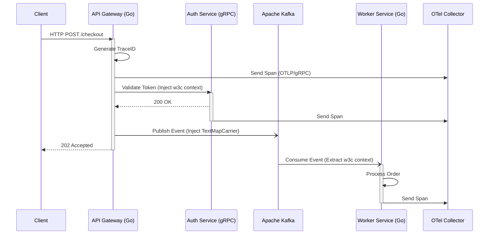

**Answer-first:** Solve observability blind spots across distributed Go microservices by implementing an OpenTelemetry pipeline. Propagate W3C trace context across HTTP/gRPC boundaries and Kafka streams, batch metrics at the local agent level, and use tail-based sampling at the collector gateway to filter noise before ingestion.

### What You'll Learn That AI Won't Tell You
- OpenTelemetry collector tuning for low-overhead distributed tracing.
- Propagating span contexts over asynchronous Kafka messaging systems without breaking tracing chains.


> 

Monitoring complex Go microservices requires more than isolated logs. When a request traverses HTTP APIs, Kafka event streams, and asynchronous worker pools, you need absolute visibility to pinpoint latency bottlenecks and failures.

By 2026, **OpenTelemetry (OTel)** has cemented itself as the vendor-neutral standard for telemetry. This guide explores the architecture of distributed tracing in Go, from SDK context propagation to advanced Collector Gateway configurations.

## The 2026 Paradigm: OpenTelemetry Pipeline




Historically, organizations utilized proprietary daemonsets (like Datadog or New Relic). The shift to vendor-neutral instrumentation means developers write observability code once, utilizing `go.opentelemetry.io/otel`.

- **Sidecar vs DaemonSet:** Running the OTel Collector as a Kubernetes DaemonSet limits memory consumption to one process per node. Sidecars isolate configuration but consume duplicate memory resources across thousands of Pods.
- **OTLP over gRPC:** For optimal CPU utilization, export telemetry using OTLP over gRPC (ProtoBuf encoding) rather than JSON, which consumes massive parsing cycles under load.

> **Related Insight:** To understand how to diagnose CPU and memory anomalies within the sidecars themselves, see our [Go pprof Tutorial: CPU & Memory Profiling in Production](/posts/golang-pprof-profiling-memory-cpu-tutorial/).

## Overcoming Go Context Propagation Traps


The Go `context.Context` is the backbone of trace propagation. 

- **Goroutines:** Always pass the active `ctx` into anonymous functions (`go func(ctx context.Context) { ... }`). 
- **Context Cancellations:** When a parent context cancels (e.g., `context.DeadlineExceeded`), the pipeline aborts. Ensure tracing hooks record these error statuses before exiting.

Go 1.26 optimizes context propagation internally, lowering allocation overhead for context chaining. However, you must enforce disciplined context passing.

## Cross-Boundary Tracing: HTTP and gRPC Interceptors


For internal RPC microservices, standard gRPC interceptors inject outgoing metadata headers and extract them upon receipt. 

```go
// Example gRPC Client Interceptor for OpenTelemetry
func ClientInterceptor(tracer trace.Tracer) grpc.UnaryClientInterceptor {
	return func(ctx context.Context, method string, req, reply interface{}, cc *grpc.ClientConn, invoker grpc.UnaryInvoker, opts ...grpc.CallOption) error {
		carrier := propagation.HeaderCarrier{}
		otel.GetTextMapPropagator().Inject(ctx, carrier)
		// ... inject carrier keys into metadata.MD ...
		return invoker(ctx, method, req, reply, cc, opts...)
	}
}
```

## Propagating Context via Apache Kafka


Breaking trace context on message ingestion is the number one visibility gap in asynchronous systems. 

Here is the 2026 standard for Go Kafka carriers:

```go
// KafkaHeaderCarrier implements propagation.TextMapCarrier
type KafkaHeaderCarrier struct {
	Headers *[]RecordHeader
}

// InjectTraceToKafka injects the active span context from ctx into Kafka headers
func InjectTraceToKafka(ctx context.Context, headers *[]RecordHeader) {
	carrier := KafkaHeaderCarrier{Headers: headers}
	otel.GetTextMapPropagator().Inject(ctx, carrier)
}
```

By ensuring the Kafka consumer extracts this header, the event stream connects seamlessly back to the originating HTTP request.

## Advanced Collector Gateways and Tail-Based Sampling


A critical requirement for tail-based sampling is that **all spans with the same Trace ID must land on the same Collector instance**. Therefore, local agents must utilize a `loadbalancing` exporter configured with a Trace ID routing policy.

### PII Redaction via Transform Processor

Before traces leave your VPC, the OpenTelemetry Transform Language (OTTL) should scrub sensitive data.

```yaml
processors:
  transform:
    traces:
      queries:
        - replace_pattern(attributes["http.target"], "access_token=[^&]+", "access_token=REDACTED")
```

## Integrating Logs, Metrics, and Traces


This triad of correlation allows engineers to observe a latency metric, click the Exemplar, view the exact distributed trace in Tempo, and read the correlated logs in Loki.

> **Architecture Context:** For understanding how decoupled observability integrates with complex deployments, review our core [Go Microservices Architecture: Production Guide](/posts/go-microservices/). To troubleshoot core application concurrency faults before they hit the trace pipeline, see [Goroutine Leak Detection in Production](/posts/goroutine-leak-detection-production-golang/).

## FAQ


If you pass a job payload to a worker channel without wrapping the `context.Context` inside the task struct, the worker defaults to `context.Background()`. This truncates the trace parent. Always embed the active request context inside your job definitions.



Tail sampling is highly stateful. If `num_traces` is configured too high without a preceding `memory_limiter` processor, the Collector will buffer traces until it triggers an Out-Of-Memory (OOM) panic under heavy load. To prevent this in Go-based collectors, ensure you periodically run memory profiles as demonstrated in our [Go pprof Tutorial](/posts/golang-pprof-profiling-memory-cpu-tutorial/).



Use the `oteldb` wrapper driver and ensure tracing is configured to omit raw SQL query parameters. This ensures the telemetry records the parameterized statement (`SELECT * FROM users WHERE email = ?`) rather than the raw user data.

