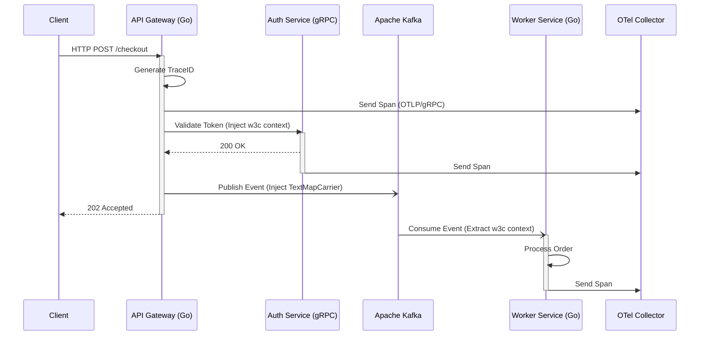

**Answer-first:** Solve observability blind spots across distributed Go microservices by implementing an OpenTelemetry pipeline. Propagate W3C trace context across HTTP/gRPC boundaries and Kafka streams, batch metrics at the local agent level, and use tail-based sampling at the collector gateway to filter noise before ingestion.

### What You'll Learn That AI Won't Tell You
- OpenTelemetry collector tuning for low-overhead distributed tracing.
- Propagating span contexts over asynchronous Kafka messaging systems without breaking tracing chains.


> 

Monitoring complex Go microservices requires more than isolated logs. When a request traverses HTTP APIs, Kafka event streams, and asynchronous worker pools, you need absolute visibility to pinpoint latency bottlenecks and failures.

By 2026, **OpenTelemetry (OTel)** has cemented itself as the vendor-neutral standard for telemetry. This guide explores the architecture of distributed tracing in Go, from SDK context propagation to advanced Collector Gateway configurations.

## The 2026 Paradigm: OpenTelemetry Pipeline




Historically, organizations utilized proprietary daemonsets (like Datadog or New Relic). The shift to vendor-neutral instrumentation means developers write observability code once, utilizing `go.opentelemetry.io/otel`.

- **Sidecar vs DaemonSet:** Running the OTel Collector as a Kubernetes DaemonSet limits memory consumption to one process per node. Sidecars isolate configuration but consume duplicate memory resources across thousands of Pods.
- **OTLP over gRPC:** For optimal CPU utilization, export telemetry using OTLP over gRPC (ProtoBuf encoding) rather than JSON, which consumes massive parsing cycles under load.

> **Related Insight:** To understand how to diagnose CPU and memory anomalies within the sidecars themselves, see our [Go pprof Tutorial: CPU & Memory Profiling in Production](/posts/golang-pprof-profiling-memory-cpu-tutorial/).

## Overcoming Go Context Propagation Traps


The Go `context.Context` is the backbone of trace propagation. 

- **Goroutines:** Always pass the active `ctx` into anonymous functions (`go func(ctx context.Context) { ... }`). 
- **Context Cancellations:** When a parent context cancels (e.g., `context.DeadlineExceeded`), the pipeline aborts. Ensure tracing hooks record these error statuses before exiting.

Go 1.26 optimizes context propagation internally, lowering allocation overhead for context chaining. However, you must enforce disciplined context passing.

## Tracing Context Propagation Across HTTP Headers

In a distributed microservice network, individual transactions frequently cross network boundaries via HTTP/gRPC. To reconstruct a single, cohesive request execution path, services must propagate trace context across every network hop. The industry-standard mechanism for this is the **W3C Trace Context** specification.

The W3C Trace Context standard relies on two HTTP headers:
1. **`traceparent`**: A single, structured string containing four distinct fields:
   - `version` (2 hex characters, currently `00`): Identifies the version of the specification.
   - `trace-id` (32 hex characters): A globally unique identifier for the entire transaction. All spans within the transaction share this ID.
   - `parent-id` / `span-id` (16 hex characters): Identifies the specific span that initiated the outbound call.
   - `trace-flags` (2 hex characters, e.g., `01` or `00`): A bitmask representing trace options. The least significant bit (`01`) represents the sampling decision (whether the trace was recorded).
   
   Example header value: `traceparent: 00-4bf92f3577b34da6a3ce929d0e0e4736-00f067aa0ba902b7-01`.

2. **`tracestate`**: An optional header consisting of comma-separated key-value pairs (e.g., `tracestate: rojo=1,congo=2`). This allows vendor-specific metadata or internal routing coordinates to travel along the request path without disrupting the standardized `traceparent` header.

### Context Extraction and Injection Lifecycle

Whenever a client calls an API gateway, the gateway checks for an incoming `traceparent` header. If absent, the gateway generates a fresh `trace-id` and a root `span-id`, establishing itself as the origin. As the gateway invokes downstream microservices over HTTP, its outgoing request client **injects** the active trace context into the HTTP headers.

Upon receiving the request, the downstream service's HTTP middleware **extracts** the headers, parses the `trace-id` and `parent-id`, and instantiates a new child span. This parent-child linkage allows tracing backends (like Jaeger, Tempo, or Zipkin) to build the structured DAG (Directed Acyclic Graph) representing the execution path.

### Challenges of Context Propagation in Go

The primary challenge in Go revolves around the management of `context.Context`. Since Go does not support thread-local storage, developers must explicitly pass `ctx` as the first parameter to every function, network client, and database call. 

Common pitfalls include:
- **Context Loss in Goroutines**: If an application spins off a background task using `go func() { ... }()`, the active span context will be lost unless the parent `ctx` is explicitly closed over and passed. If the goroutine runs concurrently, passing the request context directly can lead to premature cancellation if the main request handler exits and calls its context cancel function. In such scenarios, developers must extract the span context and attach it to a non-cancelling background context:
  ```go
  spanCtx := trace.SpanContextFromContext(reqCtx)
  bgCtx := trace.ContextWithSpanContext(context.Background(), spanCtx)
  ```
- **Header Key Collisions**: Legacy tracing formats (such as Zipkin's B3 headers `X-B3-TraceId`) can conflict with W3C headers. A robust propagation engine must configure a composite propagator (e.g., `propagation.NewCompositeTextMapPropagator`) capable of extracting multiple formats while standardizing on W3C for outbound calls.

---

## Configuring OpenTelemetry with Jaeger & HTTP Middleware

To implement distributed tracing in a production Go service, you must initialize the OpenTelemetry SDK with an exporter and register a global propagator. We will export trace data over gRPC to Jaeger using the OTLP/gRPC exporter, which is the standardized ingestion protocol.

Below is the complete, production-grade Go implementation configuring the `TracerProvider` and a custom HTTP middleware wrapper for tracing context propagation.

```go
package tracing

import (
	"context"
	"fmt"
	"net/http"
	"time"

	"go.opentelemetry.io/otel"
	"go.opentelemetry.io/otel/attribute"
	"go.opentelemetry.io/otel/codes"
	"go.opentelemetry.io/otel/exporters/otlp/otlptrace/otlptracegrpc"
	"go.opentelemetry.io/otel/propagation"
	"go.opentelemetry.io/otel/sdk/resource"
	sdktrace "go.opentelemetry.io/otel/sdk/trace"
	semconv "go.opentelemetry.io/otel/semconv/v1.24.0"
	"go.opentelemetry.io/otel/trace"
	"google.golang.org/grpc"
	"google.golang.org/grpc/credentials/insecure"
)

// InitTracerProvider configures an OTLP/gRPC exporter pointing to a Jaeger instance
// and registers the TracerProvider globally.
func InitTracerProvider(ctx context.Context, serviceName, environment, collectorAddr string) (*sdktrace.TracerProvider, error) {
	// 1. Establish connection to the OTLP collector (Jaeger)
	resCtx, cancel := context.WithTimeout(ctx, 5*time.Second)
	defer cancel()

	conn, err := grpc.DialContext(resCtx, collectorAddr,
		grpc.WithTransportCredentials(insecure.NewCredentials()),
		grpc.WithBlock(),
	)
	if err != nil {
		return nil, fmt.Errorf("failed to connect to OTLP collector: %w", err)
	}

	// 2. Configure the OTLP trace exporter
	exporter, err := otlptracegrpc.New(ctx, otlptracegrpc.WithGRPCConn(conn))
	if err != nil {
		return nil, fmt.Errorf("failed to create OTLP trace exporter: %w", err)
	}

	// 3. Define the resource metadata for this microservice
	res, err := resource.New(ctx,
		resource.WithAttributes(
			semconv.ServiceNameKey.String(serviceName),
			attribute.String("environment", environment),
			attribute.String("library.language", "go"),
		),
	)
	if err != nil {
		return nil, fmt.Errorf("failed to create tracing resource: %w", err)
	}

	// 4. Initialize TracerProvider with Batch Span Processor and ParentBased Sampler
	tp := sdktrace.NewTracerProvider(
		sdktrace.WithSampler(sdktrace.ParentBased(sdktrace.AlwaysSample())),
		sdktrace.WithBatcher(exporter,
			sdktrace.WithMaxQueueSize(2048),
			sdktrace.WithMaxExportBatchSize(512),
			sdktrace.WithBatchTimeout(5*time.Second),
		),
		sdktrace.WithResource(res),
	)

	// 5. Register globally
	otel.SetTracerProvider(tp)
	otel.SetTextMapPropagator(propagation.NewCompositeTextMapPropagator(
		propagation.TraceContext{},
		propagation.Baggage{},
	))

	return tp, nil
}

// StatusResponseWriter wraps http.ResponseWriter to capture HTTP status codes and response sizes
type StatusResponseWriter struct {
	http.ResponseWriter
	StatusCode int
	BytesWritten int64
}

func (w *StatusResponseWriter) WriteHeader(code int) {
	w.StatusCode = code
	w.ResponseWriter.WriteHeader(code)
}

func (w *StatusResponseWriter) Write(b []byte) (int, error) {
	if w.StatusCode == 0 {
		w.StatusCode = http.StatusOK
	}
	n, err := w.ResponseWriter.Write(b)
	w.BytesWritten += int64(n)
	return n, err
}

// HTTPTracingMiddleware extracts incoming W3C trace context, starts a server span,
// records execution attributes, handles panics gracefully, and updates span status.
func HTTPTracingMiddleware(tracer trace.Tracer) func(http.Handler) http.Handler {
	return func(next http.Handler) http.Handler {
		return http.HandlerFunc(func(w http.ResponseWriter, r *http.Request) {
			// 1. Extract context from incoming W3C headers
			propagator := otel.GetTextMapPropagator()
			ctx := propagator.Extract(r.Context(), propagation.HeaderCarrier(r.Header))

			// 2. Start a new span as a child of the extracted context
			opts := []trace.SpanStartOption{
				trace.WithSpanKind(trace.SpanKindServer),
				trace.WithAttributes(
					semconv.HTTPMethodKey.String(r.Method),
					semconv.HTTPTargetKey.String(r.URL.Path),
					semconv.HTTPRouteKey.String(r.Pattern), // Requires Go 1.22+ multiplexer
					semconv.HTTPUserAgentKey.String(r.UserAgent()),
					semconv.NetPeerNameKey.String(r.RemoteAddr),
				),
			}

			spanName := fmt.Sprintf("HTTP %s %s", r.Method, r.URL.Path)
			ctx, span := tracer.Start(ctx, spanName, opts...)
			defer span.End()

			// 3. Wrap response writer to capture HTTP metadata
			srw := &StatusResponseWriter{ResponseWriter: w}

			// 4. Capture panics to ensure spans are always marked as error before terminating
			defer func() {
				if err := recover(); err != nil {
					span.RecordError(fmt.Errorf("panic: %v", err))
					span.SetStatus(codes.Error, "internal server panic")
					span.SetAttributes(attribute.Int("http.status_code", http.StatusInternalServerError))
					panic(err) // Forward panic to parent recovery middleware
				}
			}()

			// 5. Pass context and wrapped response writer downstream
			next.ServeHTTP(srw, r.WithContext(ctx))

			// 6. Record final HTTP response status
			span.SetAttributes(
				attribute.Int("http.status_code", srw.StatusCode),
				attribute.Int64("http.response_content_length", srw.BytesWritten),
			)

			if srw.StatusCode >= 400 {
				if srw.StatusCode >= 500 {
					span.SetStatus(codes.Error, fmt.Sprintf("HTTP Server Error: %d", srw.StatusCode))
				} else {
					// Client errors can be recorded on span but don't flag the overall span as system failure
					span.SetAttributes(attribute.String("http.client_error", http.StatusText(srw.StatusCode)))
				}
			} else {
				span.SetStatus(codes.Ok, "success")
			}
		})
	}
}
```

### Deep Dive into Tracer Initialization

The initialization code sets up a robust, production-grade telemetry pipeline.
First, dialing the OTLP receiver (such as a Jaeger collector running at `localhost:4317`) uses gRPC for high performance. The OTLP protocol supports both HTTP/JSON and gRPC. However, in distributed tracing environments, gRPC is highly preferred due to its binary serialization (Protocol Buffers) and connection reuse. This minimizes the latency added to the critical path.

The `resource.New` configuration binds metadata to the tracer. It is vital to define the `service.name` and other environment attributes here. These attributes act as search dimensions in the query UI, allowing you to filter traces by a specific service replica, commit hash, or environment (production vs. staging).

The `TracerProvider` incorporates a `ParentBased` sampler wrapper. In production architectures, sampling must be managed to control data egress costs and backend storage. Rather than selecting a flat sample rate (which might miss critical errors in low-traffic routes or overwhelm the collector on high-traffic routes), we configure a sampler that relies on the parent's decision. If an upstream service (like Envoy) decided to trace the transaction, this microservice respects that choice.

The Batch Span Processor (`WithBatcher`) runs an internal goroutine that queues completed spans and flushes them when `MaxExportBatchSize` is reached or when `BatchTimeout` triggers. This decouples trace transmission from HTTP request execution, keeping overhead extremely low. If the exporter encounters network problems, the buffer queue prevents spans from holding memory indefinitely by dropping oldest spans when `MaxQueueSize` is exceeded.

### Understanding the HTTP Middleware Mechanics

The custom HTTP middleware performs trace extraction and injection.
The `StatusResponseWriter` wrapper is required because Go's default `http.ResponseWriter` interface hides the response status code and length. By intercepting calls to `WriteHeader` and `Write`, the middleware records the exact status returned to the client.

Upon request arrival, `propagator.Extract` converts the W3C headers from `r.Header` into a Go `context.Context` value. When `tracer.Start` is called, the library looks for a parent span context inside the Go context. If found, the new span is created as a child of the incoming trace parent, preserving the trace hierarchy.

Inside the request handler, any panic is caught using a deferred recovery function. Recording the panic details and setting the span status to `codes.Error` ensures that failures are not lost. If the handler panics, the middleware re-panics after recording the trace data so that the outer service recovery handlers can still operate.

Finally, we distinguish between 4xx and 5xx status codes. Only server-side errors (5xx) flag the span as an overall trace failure (`codes.Error`). Client-side validation errors (4xx) are annotated on the span as attributes but keep the span status green, avoiding false alarms in SRE dashboard alerting rules.

## Cross-Boundary Tracing: HTTP and gRPC Interceptors

For internal RPC microservices, standard gRPC interceptors inject outgoing metadata headers and extract them upon receipt. 

```go
// Example gRPC Client Interceptor for OpenTelemetry
func ClientInterceptor(tracer trace.Tracer) grpc.UnaryClientInterceptor {
	return func(ctx context.Context, method string, req, reply interface{}, cc *grpc.ClientConn, invoker grpc.UnaryInvoker, opts ...grpc.CallOption) error {
		carrier := propagation.HeaderCarrier{}
		otel.GetTextMapPropagator().Inject(ctx, carrier)
		// ... inject carrier keys into metadata.MD ...
		return invoker(ctx, method, req, reply, cc, opts...)
	}
}
```

## Propagating Context via Apache Kafka


Breaking trace context on message ingestion is the number one visibility gap in asynchronous systems. 

Here is the 2026 standard for Go Kafka carriers:

```go
// KafkaHeaderCarrier implements propagation.TextMapCarrier
type KafkaHeaderCarrier struct {
	Headers *[]RecordHeader
}

// InjectTraceToKafka injects the active span context from ctx into Kafka headers
func InjectTraceToKafka(ctx context.Context, headers *[]RecordHeader) {
	carrier := KafkaHeaderCarrier{Headers: headers}
	otel.GetTextMapPropagator().Inject(ctx, carrier)
}
```

By ensuring the Kafka consumer extracts this header, the event stream connects seamlessly back to the originating HTTP request.

## Advanced Collector Gateways and Tail-Based Sampling


A critical requirement for tail-based sampling is that **all spans with the same Trace ID must land on the same Collector instance**. Therefore, local agents must utilize a `loadbalancing` exporter configured with a Trace ID routing policy.

### PII Redaction via Transform Processor

Before traces leave your VPC, the OpenTelemetry Transform Language (OTTL) should scrub sensitive data.

```yaml
processors:
  transform:
    traces:
      queries:
        - replace_pattern(attributes["http.target"], "access_token=[^&]+", "access_token=REDACTED")
```

## Integrating Logs, Metrics, and Traces


This triad of correlation allows engineers to observe a latency metric, click the Exemplar, view the exact distributed trace in Tempo, and read the correlated logs in Loki.

> **Architecture Context:** For understanding how decoupled observability integrates with complex deployments, review our core [Go Microservices Architecture: Production Guide](/posts/go-microservices/). To troubleshoot core application concurrency faults before they hit the trace pipeline, see [Goroutine Leak Detection in Production](/posts/goroutine-leak-detection-production-golang/).

## FAQ


If you pass a job payload to a worker channel without wrapping the `context.Context` inside the task struct, the worker defaults to `context.Background()`. This truncates the trace parent. Always embed the active request context inside your job definitions.



Tail sampling is highly stateful. If `num_traces` is configured too high without a preceding `memory_limiter` processor, the Collector will buffer traces until it triggers an Out-Of-Memory (OOM) panic under heavy load. To prevent this in Go-based collectors, ensure you periodically run memory profiles as demonstrated in our [Go pprof Tutorial](/posts/golang-pprof-profiling-memory-cpu-tutorial/).



Use the `oteldb` wrapper driver and ensure tracing is configured to omit raw SQL query parameters. This ensures the telemetry records the parameterized statement (`SELECT * FROM users WHERE email = ?`) rather than the raw user data.

