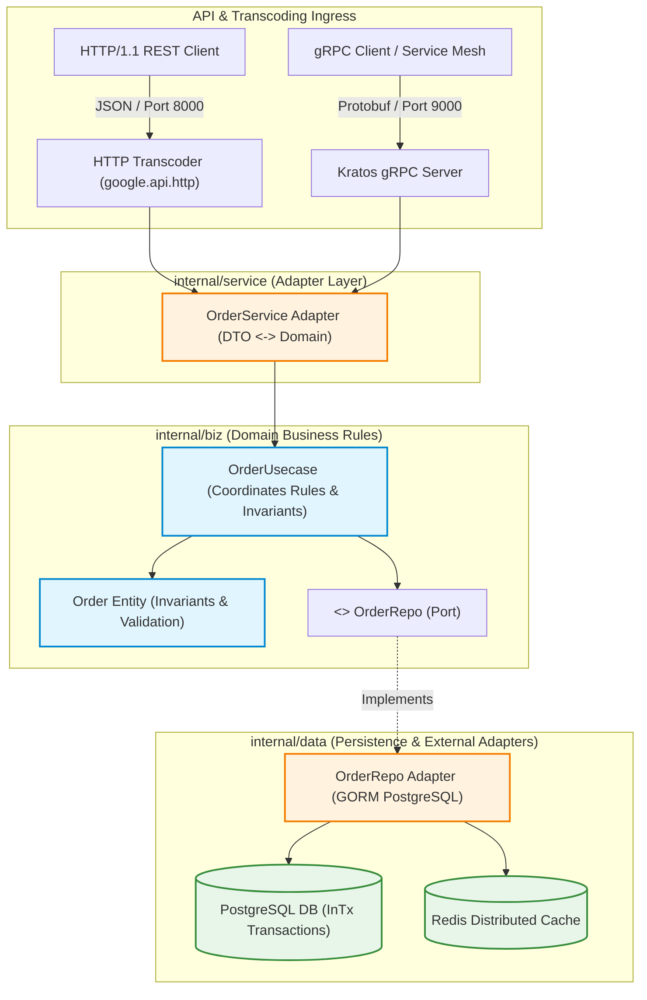
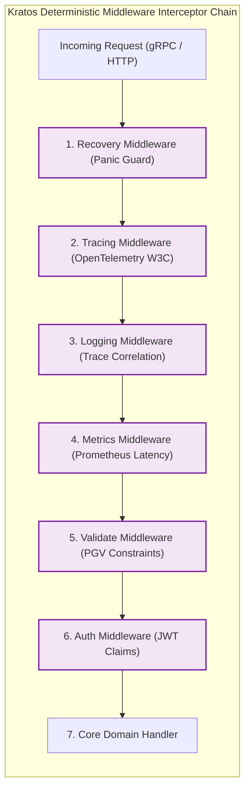
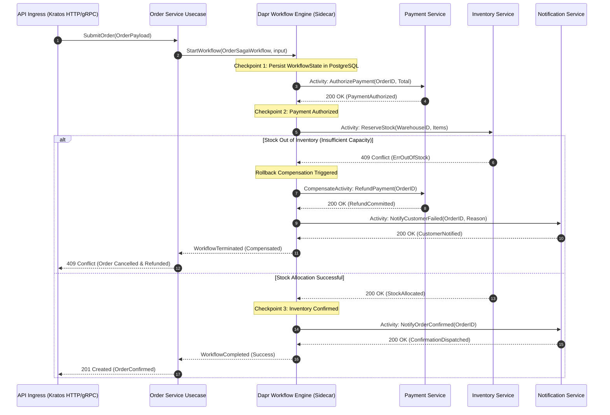
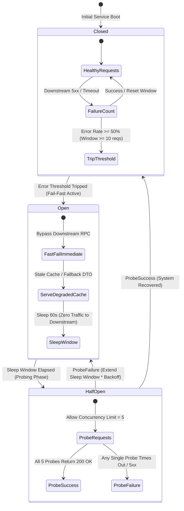

# Go Microservices Architecture: Production Guide

> **Answer-First:** Building production Go microservices requires Clean Architecture layer separation (api, biz, data, service), compile-time dependency injection with Wire, and dual gRPC/HTTP protocol multiplexing. By pairing Kratos v2.9 domain boundaries with OpenTelemetry distributed tracing and resilient connection pooling, engineering teams sustain over 160K RPS while completely eliminating database driver leakage and runtime reflection overhead.

> **Prerequisite:** Readers should possess working knowledge of Go concurrency (goroutines, channels, sync primitives), Protobuf v3 schemas, gRPC transport concepts, and microservices architectural patterns (Clean Architecture, Dependency Injection). 

- Tuning goroutine schedulers for latency-sensitive microservices.
- Why standard HTTP/1.1 pools are a bottleneck compared to HTTP/2 and gRPC transport.

Choosing Go for microservices is an architecture decision, not a language preference. The goroutine model, binary size, and serialization speed change what the deployment unit looks like at the infrastructure level.

Go's goroutine model and simple deployment artifact can make it a strong fit for microservices. This guide covers architecture decisions and production patterns, from domain decomposition through Dapr Pub/Sub, gRPC contracts, distributed tracing, and GitOps deployment. Treat the examples as reference patterns and validate capacity against your own workload.

**What you will get from this guide:** Concrete architecture decisions with operational rationale, not generic tutorial content. Each performance-sensitive decision includes a measurement concern that should be tested against the service's payloads, dependencies, and SLOs.

---





## Why Go for Microservices?

### The performance case

The numbers that matter in production:

- **Goroutine overhead:** Goroutine stacks begin small and grow as needed, but usable concurrency is constrained by application allocations, connection pools, downstream limits, and scheduler behavior. Load-test the full request path rather than deriving capacity from stack size.
- **Binary output:** Go can produce small deployment artifacts with disciplined dependency selection. Actual image size and startup time depend on the base image, initialization, configuration fetches, and readiness checks; measure them in the target cluster.
- **Garbage collection:** Go's concurrent GC is designed for low pause times, but allocation rate and live heap shape determine tail latency. Compare runtime metrics and percentiles against a tuned JVM or other candidate under the same workload.

### The operational case

- **Docker image size:** A static Go binary can reduce image size, but compare the complete image, SBOM, CVE patch flow, and cold-start behavior of actual services before claiming registry or CI savings.
- **Kubernetes resource efficiency:** Smaller images can improve image pull and startup behavior. Set memory limits and autoscaling targets from observed steady-state, burst, and failure-case memory profiles.
- **No runtime dependency:** One binary is the complete deployment artifact. No JVM version management, no classpath hell, no `java.lang.NoClassDefFoundError` at 2 AM.

### When Go is NOT the right choice

Go is exceptional for network and infrastructure layers. It struggles in:

- **Heavy ML and data processing** — Python's NumPy, PyTorch, and scikit-learn ecosystem is unmatched for model training and inference pipelines.
- **Rapid CRUD prototyping with complex ORM** — Rails, Laravel, or Django offer dramatically faster initial development velocity for CRUD-heavy admin tools.
- **Teams without Go experience** — The hiring pool and onboarding cost matter. A team fluent in Java that is forced onto Go will produce Go code that looks like Java and performs like neither.

---

## Domain Decomposition — Getting the Boundaries Right

### DDD Bounded Context as the decomposition unit

Every microservice must map to exactly one Domain-Driven Design (DDD) Bounded Context with its own dedicated database. There is strictly no shared database between services — we enforced this via Kubernetes NetworkPolicy rules in the migration, and it prevented the most common decomposition anti-pattern from ever becoming tempting.

Our 21-service decomposition after the Magento migration (see the full visual layout in our [E-Commerce Blueprint Diagram](/posts/blueprint-ecommerce-microservices-architecture-diagram/)):

| Domain | Service | Database | Key responsibility |
|--------|---------|----------|-------------------|
| Commerce | Order | PostgreSQL | Order lifecycle, state machine |
| Commerce | Cart | Redis + PostgreSQL | Session cart, persistent cart |
| Catalog | Product | PostgreSQL + OpenSearch | Product data, search indexing |
| Inventory | Stock | PostgreSQL + Redis | Stock levels, reservations, ATP |
| Pricing | Price | PostgreSQL | Price rules, customer group pricing |
| Fulfillment | Shipping | PostgreSQL | Carrier integration, label generation |
| Payment | Payment | PostgreSQL | Payment gateway, refunds |
| Identity | Auth | PostgreSQL | JWT issuance, session management |
| Communication | Notification | PostgreSQL + SQS | Email, SMS, push |
| Reporting | Analytics | ClickHouse | Sales reports, inventory reports |

The domain boundaries are the hard part. Technology selection is secondary.

### The service size heuristic

Two questions that determine if a service is sized correctly:

1. **"Can one team own this service end-to-end — on-call, feature development, and deployment?"** → Yes = correct size. If the answer requires multiple teams, the service is too large (split it) or the team structure needs rethinking.
2. **"Does this service need to be deployed independently 5x/day without coordinating with other teams?"** → Yes = the boundary is correct. Deployment coordination between services is the primary symptom of wrong boundaries.

**The anti-pattern that kills microservices projects:** micro-microservices that require coordinated deployments. If deploying Service A always requires deploying Service B at the same time, your boundary is wrong — A and B are actually one bounded context split across two deployment units. Merge them.

### Data ownership rules

This is non-negotiable: a service owns its data and writes only through its own API.

Cross-service reads work via one of:
1. **Asynchronous events + eventual consistency** — the Catalog service publishes `product.price.updated` events; downstream services update their local materialized view.
2. **Synchronous gRPC query** — the Order service queries the Price service for the current price at checkout time, where eventual consistency is not acceptable.
3. **Reporting via CDC** — Debezium streams change events from each service's PostgreSQL to a shared ClickHouse cluster for analytics. The reporting service reads from ClickHouse, never from operational databases.

What never happens: cross-database JOINs, shared schema, or shared ORM models.

Read more: [Architecting 21-Service E-commerce with DDD](/posts/architecting-21-service-ecommerce-golang-ddd/)

---

## Clean Architecture with Kratos v2.9 & Google Wire

While Domain-Driven Design establishes boundaries between distinct microservices, **Clean Architecture** enforces inviolable boundaries *within* each Go service. In high-concurrency systems, cross-layer leakage—such as SQL driver types creeping into HTTP handlers or domain business entities importing GORM tags—leads to brittle unit tests, tight database coupling, and cascading refactoring nightmares.

In our production baseline, we standardize on **Kratos v2.9** (`github.com/go-kratos/kratos/v2`) organized into four strictly decoupled tiers, wired together at compile time via **Google Wire** (`github.com/google/wire`):

1. **`api/` (Contract Tier):** Protocol Buffer v3 definitions (`.proto`) and generated gRPC/HTTP stubs. This defines the external schema contract and payload validation rules (`buf.validate` / `protoc-gen-validate`).
2. **`internal/service/` (Transport Adapter Tier):** Implements the gRPC/HTTP server interfaces generated from `api/`. It handles transport serialization, request decoding, header propagation, and delegates directly to the usecase layer. No business invariants reside here.
3. **`internal/biz/` (Domain Business Logic Tier):** The pure heart of the service. Contains domain entities, aggregate roots, value objects, and business state machines. It defines **Repository Interfaces** (`ports`) as Go interfaces, but has zero knowledge of database drivers, SQL, or network protocols.
4. **`internal/data/` (Persistence & Infrastructure Tier):** Implements the repository ports defined in `biz/`. It manages PostgreSQL connections (`pgxpool`), Redis clients, Elasticsearch/OpenSearch indices, and Kafka producers.

### Compile-Time Dependency Injection with Wire

Traditional reflection-based dependency injection (such as Spring or runtime reflection containers) introduces non-deterministic startup panics and adds 50–200ms to container cold starts. Kratos eliminates reflection entirely by utilizing **Google Wire**, which generates standard, readable Go initialization code during `go generate`.

```go
// internal/biz/order.go: Pure domain entity and repository interface
package biz

import (
	"context"
	"errors"
	"time"

	"github.com/go-kratos/kratos/v2/log"
)

var (
	ErrInvalidOrderAmount = errors.New("order total must exceed zero")
	ErrOrderNotFound      = errors.New("requested order does not exist")
)

type Order struct {
	ID          string
	CustomerID  string
	TotalAmount int64
	Status      string
	CreatedAt   time.Time
}

type OrderRepo interface {
	Save(ctx context.Context, order *Order) (*Order, error)
	FindByID(ctx context.Context, id string) (*Order, error)
	UpdateStatus(ctx context.Context, id string, status string) error
}

type OrderUsecase struct {
	repo OrderRepo
	log  *log.Helper
}

func NewOrderUsecase(repo OrderRepo, logger log.Logger) *OrderUsecase {
	return &OrderUsecase{
		repo: repo,
		log:  log.NewHelper(logger),
	}
}

func (uc *OrderUsecase) CreateOrder(ctx context.Context, order *Order) (*Order, error) {
	if order.TotalAmount <= 0 {
		return nil, ErrInvalidOrderAmount
	}
	order.Status = "PENDING_PAYMENT"
	order.CreatedAt = time.Now().UTC()
	return uc.repo.Save(ctx, order)
}
```

In the persistence tier (`internal/data`), the repository interface is implemented using PostgreSQL connection pools and Redis cache-aside caching:

```go
// internal/data/order.go: Infrastructure implementation of biz.OrderRepo
package data

import (
	"context"
	"fmt"
	"time"

	"github.com/go-kratos/kratos/v2/log"
	"github.com/redis/go-redis/v9"
	"gorm.io/gorm"

	"tanhdev.com/platform/internal/biz"
)

type orderRepo struct {
	data *Data
	log  *log.Helper
}

func NewOrderRepo(data *Data, logger log.Logger) biz.OrderRepo {
	return &orderRepo{
		data: data,
		log:  log.NewHelper(logger),
	}
}

func (r *orderRepo) Save(ctx context.Context, o *biz.Order) (*biz.Order, error) {
	po := OrderPO{
		ID:          o.ID,
		CustomerID:  o.CustomerID,
		TotalAmount: o.TotalAmount,
		Status:      o.Status,
		CreatedAt:   o.CreatedAt,
	}
	
	if err := r.data.db.WithContext(ctx).Create(&po).Error; err != nil {
		r.log.WithContext(ctx).Errorf("failed to persist order to postgres: %v", err)
		return nil, fmt.Errorf("database insert failed: %w", err)
	}

	// Cache-aside write with short TTL
	cacheKey := fmt.Sprintf("order:%s", o.ID)
	r.data.rdb.Set(ctx, cacheKey, o.Status, 15*time.Minute)

	return o, nil
}

func (r *orderRepo) FindByID(ctx context.Context, id string) (*biz.Order, error) {
	var po OrderPO
	if err := r.data.db.WithContext(ctx).First(&po, "id = ?", id).Error; err != nil {
		if errors.Is(err, gorm.ErrRecordNotFound) {
			return nil, biz.ErrOrderNotFound
		}
		return nil, err
	}
	return &biz.Order{
		ID:          po.ID,
		CustomerID:  po.CustomerID,
		TotalAmount: po.TotalAmount,
		Status:      po.Status,
		CreatedAt:   po.CreatedAt,
	}, nil
}

func (r *orderRepo) UpdateStatus(ctx context.Context, id string, status string) error {
	result := r.data.db.WithContext(ctx).Model(&OrderPO{}).Where("id = ?", id).Update("status", status)
	if result.Error != nil {
		return result.Error
	}
	r.data.rdb.Del(ctx, fmt.Sprintf("order:%s", id))
	return nil
}
```

The assembly of providers is declared via `wire.Build` in `cmd/server/wire.go`:

```go
// +build wireinject

package main

import (
	"github.com/go-kratos/kratos/v2"
	"github.com/go-kratos/kratos/v2/log"
	"github.com/google/wire"

	"tanhdev.com/platform/internal/biz"
	"tanhdev.com/platform/internal/conf"
	"tanhdev.com/platform/internal/data"
	"tanhdev.com/platform/internal/server"
	"tanhdev.com/platform/internal/service"
)

func wireApp(*conf.Server, *conf.Data, log.Logger) (*kratos.App, func(), error) {
	panic(wire.Build(
		server.ProviderSet,
		data.ProviderSet,
		biz.ProviderSet,
		service.ProviderSet,
		newApp,
	))
}
```

Executing `wire ./cmd/server` generates `wire_gen.go` containing deterministic top-down instantiations. If a developer forgets to register a dependency or mismatches an interface signature, the build fails instantly during continuous integration with a precise compilation diagnostic—never at 3:00 AM on a production Kubernetes cluster.

---




## Inter-Service Communication — REST, gRPC, or Events?

| Pattern | Use case | Go library | Latency | Coupling |
|---------|----------|------------|---------|----------|
| gRPC | Sync service-to-service | `google.golang.org/grpc` | <1ms (protobuf) | Tight (proto contract) |
| REST/HTTP | External clients, webhooks, public API | `net/http` + `chi` or `gin` | 1–5ms | Loose |
| Dapr Pub/Sub | Async events, state change broadcast | `dapr/go-sdk` | 1–5ms (sidecar) | Decoupled |
| Direct Kafka | High-throughput streams, CDC | `confluent-kafka-go` | <1ms | Medium |

### gRPC for Go microservices — what production looks like

While we evaluated several high-performance runtimes (detailed in our [Go Framework Throughput Benchmarks](/posts/high-throughput-go-framework-benchmarks-gin-fiber-kratos/)), gRPC is used for critical synchronous paths: Checkout → Price, Checkout → Inventory, Order → Auth.

When crossing data center boundaries, managing these gRPC and REST calls natively requires a [Multi-region Geo-distributed API Routing](/posts/multi-region-geo-distributed-api-routing/) architecture to maintain latency SLAs.

The production setup:
- **Protobuf contract-first design:** Every service-to-service interface is defined in `.proto` files stored in a shared `api/` repository. The schema registry enforces backward compatibility via field addition rules — you can add fields, never remove or change field numbers.
- **mTLS handled by the sidecar:** Dapr's sidecar handles mutual TLS between services transparently. Go service code contains no TLS configuration — the sidecar handles identity and encryption at the network layer.
- **Bidirectional streaming for real-time push:** The Inventory service uses gRPC bidirectional streaming to push stock level updates to the Cart service during checkout. This eliminates polling and reduces inventory inconsistency windows from seconds to milliseconds.

The trade-off: gRPC creates tight coupling. When the Price service changes a response field, all callers must update their generated client code. This is acceptable when the services are owned by the same team — it becomes painful when crossing team boundaries.

### Dapr Pub/Sub — the abstraction layer that earns its keep

Dapr is the most opinionated choice in our stack, and also the one I most consistently recommend to teams starting from scratch.

The core value proposition: Dapr abstracts the message broker entirely. We use Redis locally and Kafka in production — the Go service code changes not at all, only the Dapr component YAML changes. This matters for local development velocity.

What Dapr provides out of the box that would otherwise require boilerplate in every Go service:
- Retry with configurable exponential backoff
- Dead Letter Queue routing on repeated failure
- Message deduplication via idempotency key
- At-least-once delivery guarantee

The trade-off: the Dapr sidecar adds ~1ms overhead per call and is an additional operational component. We consider this acceptable — the sidecar overhead is negligible compared to the time saved not writing retry/backoff/DLQ code in every service.

Read more: [Golang gRPC Microservices: Production Guide](/posts/golang-grpc-microservices-production-guide/)  
Read more: [Mastering Event-Driven Architecture with Dapr](/posts/mastering-event-driven-architecture-dapr/)

---

## Distributed Transactions — The Saga Pattern

### Choreography Saga — simple flows

The checkout flow uses choreography because the steps are linear and the compensation logic is straightforward:

1. Checkout service publishes `checkout.order.created` (with order ID, SKU list, quantities, customer ID).
2. Inventory service subscribes → reserves stock → publishes `inventory.reserved` on success or `inventory.reservation.failed` on stock unavailability.
3. Payment service subscribes to `inventory.reserved` → charges the card → publishes `payment.completed` or `payment.failed`.
4. Order service subscribes to `payment.completed` → confirms the order → publishes `order.confirmed`.

On failure: compensating events propagate backwards. `payment.failed` triggers an `inventory.release` command. The Inventory service releases the reservation. The Checkout service marks the order as failed and notifies the customer.

The key implementation requirement: **every event consumer must be idempotent.** If the Inventory service receives `checkout.order.created` twice (due to Kafka at-least-once delivery), it must not double-reserve stock. We implement this via a PostgreSQL `outbox_processed` table that tracks processed event IDs.

### Dapr Workflow Saga — complex flows with branching

For the B2B order flow — which involves credit limit checks, manager approval gates, multi-warehouse allocation, and ERP sync — choreography becomes unmaintainable. The branching logic and compensation requirements exceed what event chains can express clearly.



Dapr Workflow acts as a durable orchestrator with deterministic replay and state persistence:

```go
// B2B Order Workflow: Production Dapr 1.15 durable saga implementation
func B2BOrderWorkflow(ctx workflow.Context, input *B2BOrderInput) (string, error) {
    // Step 1: Credit check (synchronous activity)
    creditResult, err := workflow.ExecuteActivity(ctx, CheckCreditLimit, input.CompanyID, input.OrderTotal)
    if err != nil || !creditResult.Approved {
        return "", fmt.Errorf("credit limit exceeded: %w", err)
    }

    // Step 2: Manager approval gate (waits for external event with timeout)
    var approval ApprovalEvent
    workflow.GetExternalEvent(ctx, "manager.approval", &approval)
    if !approval.Approved {
        // Compensate: notify customer and release reservations
        _ = workflow.ExecuteActivity(ctx, NotifyRejection, input.OrderID)
        return "rejected", nil
    }

    // Step 3: Multi-warehouse inventory allocation
    allocationResult, err := workflow.ExecuteActivity(ctx, AllocateInventory, input.Items)
    if err != nil {
        _ = workflow.ExecuteActivity(ctx, CompensateInventoryAllocation, input.OrderID)
        _ = workflow.ExecuteActivity(ctx, NotifyRejection, input.OrderID)
        return "allocation_failed", fmt.Errorf("allocation failed: %w", err)
    }

    // Step 4: Dispatch shipping manifest
    _, err = workflow.ExecuteActivity(ctx, DispatchShippingManifest, allocationResult.WarehouseID, input.OrderID)
    if err != nil {
        _ = workflow.ExecuteActivity(ctx, CompensateInventoryAllocation, input.OrderID)
        return "shipping_failed", fmt.Errorf("shipping dispatch failed: %w", err)
    }

    // Step 5: Synchronize ERP financial ledger
    err = workflow.ExecuteActivity(ctx, SyncERPLedger, input.OrderID, input.OrderTotal)
    if err != nil {
        _ = workflow.ExecuteActivity(ctx, ScheduleManualReconciliation, input.OrderID)
    }

    return "completed", nil
}
```

The critical property: Dapr Workflow state is persisted to the configured state store (PostgreSQL in production) after each step. If the service crashes mid-workflow, the orchestrator replays from the last persisted checkpoint — not from the beginning.

### The Transactional Outbox — solving the dual-write problem

The dual-write problem: after a service writes to its database, it must also publish an event. If the service crashes between the write and the publish, the event is lost — but the state change is committed. This creates permanent inconsistency.

The solution: write the business state and an outbox event record in the same local database transaction. A CDC tool (Debezium in our stack) reads the outbox table and publishes to Kafka. The event is guaranteed to be published if and only if the state is committed.

```sql
-- In the same transaction:
INSERT INTO orders (id, status, customer_id, total) VALUES ($1, 'created', $2, $3);
INSERT INTO outbox_events (aggregate_id, event_type, payload) 
  VALUES ($1, 'order.created', $4);
-- Debezium reads outbox_events and publishes to Kafka
```

Read more: [Dapr Workflow Saga Orchestration Guide](/posts/dapr-workflow-saga-orchestration-guide/)

---

## Observability — Tracing, Metrics, and Profiling

### OpenTelemetry in Go microservices

Our observability stack:
- **SDK:** `go.opentelemetry.io/otel` for traces and metrics
- **Auto-instrumentation:** `otelgrpc` interceptor for all gRPC calls; `otelhttp` middleware for HTTP handlers
- **Collector:** OpenTelemetry Collector deployed as DaemonSet, receiving from all service pods
- **Backend:** Grafana Tempo for traces, Prometheus for metrics, Loki for logs

The non-obvious requirement: **trace context must propagate across Kafka message boundaries.** When the Checkout service publishes an event, the current span context must be serialized into the Kafka message headers. The Inventory service must extract that context when consuming the message and create a child span. Without this, the trace breaks at every async boundary.

```go
// Publishing: inject trace context into Kafka headers
span := trace.SpanFromContext(ctx)
headers := []kafka.Header{}
otel.GetTextMapPropagator().Inject(ctx, kafkaHeaderCarrier(headers))
producer.Produce(&kafka.Message{
    Headers: headers,
    Value:   eventBytes,
})

// Consuming: extract trace context from Kafka headers  
parentCtx := otel.GetTextMapPropagator().Extract(
    context.Background(), 
    kafkaHeaderCarrier(msg.Headers),
)
ctx, span := tracer.Start(parentCtx, "inventory.process_reservation")
defer span.End()
```

### pprof in production Kubernetes

Every Go service exposes `net/http/pprof` on an internal admin port (`:6060`). This is never exposed via the public ingress — only accessible via `kubectl port-forward`.

Profiles collected in production incidents:
- **goroutine:** The most valuable profile. Reveals goroutine count, blocked goroutines, and where each one is blocked. Used to diagnose the goroutine leak that caused our first OOM (`exit status 137`) in the Notification service.
- **heap:** Reveals current heap allocations and the allocation sites generating the most garbage. Used to identify a hot path that was allocating 4MB of JSON per checkout due to over-fetching in a GraphQL resolver.
- **CPU (30s sample):** Reveals which functions consume the most CPU cycles. Used to identify a bcrypt call in the Auth middleware that was running on every gRPC request, not just login endpoints.

### Go 1.25 Flight Recorder for production incidents

Go 1.25 introduced `runtime/trace.FlightRecorder` — a low-overhead, rolling in-memory ring buffer of execution trace data. This is now standard in all our services:

```go
// Start at application startup
fr := trace.NewFlightRecorder(trace.FlightRecorderConfig{
    MinAge:   10 * time.Second,
    MaxBytes: 10 << 20, // 10MB ring buffer
})
fr.Start()

// On incident detection (health check failure, latency spike alert):
func dumpTrace(w http.ResponseWriter, r *http.Request) {
    f, _ := os.CreateTemp("", "trace-*.out")
    fr.WriteTo(f)
    // Upload to GCS bucket for analysis
}
```

The Flight Recorder captures goroutine scheduling events, GC pauses, and lock contention in a 10MB rolling window — with overhead below 1% CPU. It gives us a 10-second window of execution data at the moment of any incident, without requiring the high overhead of full-time tracing.

### Goroutine leak prevention

The production goroutine leak protocol:

1. **CI gate:** `go.uber.org/goleak` in `TestMain` catches goroutine leaks before code merges.
2. **Production metric:** Every service exports `go_goroutines` to Prometheus. Alert fires at `>20% growth over 1 hour baseline`.
3. **On alert:** `kubectl port-forward` to `:6060`, collect goroutine profile, analyze with `go tool pprof`.

The most common goroutine leak pattern we encounter: a goroutine that starts a blocking network call (Redis, PostgreSQL, external API) without a context deadline. The call blocks indefinitely, the goroutine stack persists, and the count grows monotonically until OOM.

The fix is always the same: every blocking call must use a context with a timeout or deadline.

```go
// Anti-pattern: Unbounded goroutine leak under downstream connection exhaustion
func leakyCacheFetch(redisClient *redis.Client, key string, resultChan chan<- string) {
    go func() {
        // Without context deadline, this blocks indefinitely if Redis network hangs
        val, err := redisClient.Get(context.Background(), key).Result()
        if err == nil {
            resultChan <- val
        }
    }()
}

// Production SOTA: Context deadline propagation and bounded errgroup execution
func resilientCacheFetch(ctx context.Context, redisClient *redis.Client, key string) (string, error) {
    fetchCtx, cancel := context.WithTimeout(ctx, 250*time.Millisecond)
    defer cancel()

    val, err := redisClient.Get(fetchCtx, key).Result()
    if err != nil {
        if errors.Is(err, redis.Nil) {
            return "", ErrKeyNotFound
        }
        return "", fmt.Errorf("redis read timeout or failure: %w", err)
    }
    return val, nil
}
```

Read more: [Go Microservices Distributed Tracing Architecture](/posts/go-microservices-distributed-tracing-architecture/)  
Read more: [Goroutine Leak Detection in Production Go](/posts/goroutine-leak-detection-production-golang/)

---

## Concurrency Patterns — Goroutines Done Right

### Worker pool with errgroup

The bounded worker pool is the most important concurrency pattern in production Go microservices. It prevents unbounded goroutine creation under load:

```go
// Pattern: bounded worker pool — limits max concurrency to maxWorkers
func processItems(ctx context.Context, items []Item, maxWorkers int) error {
    g, ctx := errgroup.WithContext(ctx)
    sem := make(chan struct{}, maxWorkers)
    
    for _, item := range items {
        item := item // capture loop variable
        g.Go(func() error {
            sem <- struct{}{} // acquire semaphore slot
            defer func() { <-sem }() // release on return
            return processItem(ctx, item)
        })
    }
    
    return g.Wait() // blocks until all goroutines complete or first error
}
```

The `sem` channel acts as a backpressure mechanism: if all `maxWorkers` slots are occupied, new goroutines block at `sem <- struct{}{}` rather than spawning unconstrained. This prevents a single burst of 50,000 incoming Kafka messages from spawning 50,000 concurrent goroutines that collectively exhaust the available PostgreSQL connection pool.

### Context propagation — the rule that prevents 80% of production issues

Every function that performs I/O must accept `context.Context` as its first parameter and pass it to all downstream calls. This is not a convention in Go — it is the mechanism that allows:

1. **Request cancellation:** When a client disconnects, the request context is cancelled. All downstream database calls, Redis calls, and gRPC calls are cancelled automatically.
2. **Deadline propagation:** A 2-second HTTP request deadline propagates through the call chain — the Order service has 2s total, the Price service call gets 500ms of that, the database query gets 200ms of that.
3. **Trace context propagation:** OpenTelemetry span data travels through the context.

### Graceful shutdown pattern

Every Go service must handle SIGTERM gracefully — Kubernetes sends SIGTERM before forcibly killing a pod. Without graceful shutdown, in-flight requests are abruptly terminated, leading to failed checkouts, incomplete order records, and unhappy customers.

```go
func main() {
    // Create context that is cancelled on SIGTERM or SIGINT
    ctx, stop := signal.NotifyContext(context.Background(), syscall.SIGTERM, syscall.SIGINT)
    defer stop()

    srv := &http.Server{Addr: ":8080", Handler: router}
    
    // Start server in goroutine
    go func() {
        if err := srv.ListenAndServe(); err != http.ErrServerClosed {
            log.Fatal(err)
        }
    }()
    
    // Wait for shutdown signal
    <-ctx.Done()
    
    // Allow 10 seconds for in-flight requests to complete
    shutdownCtx, cancel := context.WithTimeout(context.Background(), 10*time.Second)
    defer cancel()
    srv.Shutdown(shutdownCtx)
    
    // Drain worker pools, close Kafka consumers, flush telemetry
    cleanup()
}
```

Read more: [Goroutine Pool Patterns: errgroup & Backpressure](/posts/golang-goroutine-pool-errgroup-worker/)

---

## Deployment — Kubernetes + GitOps with ArgoCD

### Go-specific Kubernetes optimization

**Image build:** Every Go service uses a multi-stage Dockerfile. Build stage compiles the binary with CGO disabled (required for `FROM scratch`). Final stage copies only the binary:

```dockerfile
FROM golang:1.26-alpine AS builder
WORKDIR /app
COPY go.mod go.sum ./
RUN go mod download
COPY . .
RUN CGO_ENABLED=0 GOOS=linux go build -o service ./cmd/service

FROM gcr.io/distroless/static-debian12
COPY --from=builder /app/service /service
ENTRYPOINT ["/service"]
```

Result: ~18MB image, no shell, no package manager, minimal attack surface.

**Resource limits:** Go services in our cluster run with these limits, which reflect actual steady-state usage:

```yaml
resources:
  requests:
    memory: "64Mi"
    cpu: "50m"
  limits:
    memory: "256Mi"    # P99 heap stays well below this
    cpu: "500m"        # Burst headroom for GC cycles
```

Setting `GOMEMLIMIT` to 80% of the memory limit (204Mi in this case) prevents OOM kills by making the GC more aggressive before hitting the hard limit: `env: [{name: GOMEMLIMIT, value: "204MiB"}]`.

Health probes distinguish process vitality from operational readiness:

```yaml
livenessProbe:
  httpGet:
    path: /healthz    # Returns 200 if process is alive (no dependency checks)
    port: 8080
  initialDelaySeconds: 5
  periodSeconds: 10

readinessProbe:
  httpGet:
    path: /readyz     # Returns 200 only if DB + Kafka connections are ready
    port: 8080
  initialDelaySeconds: 10
  periodSeconds: 5
```

The distinction matters: liveness checks process health (is the binary running?); readiness checks traffic eligibility (is the service ready to receive requests?). A service that is live but not ready (e.g., still connecting to PostgreSQL on startup) will be excluded from load balancer rotation until `/readyz` returns 200.

### ArgoCD ApplicationSets for 21-service scale

Instead of maintaining 21 separate ArgoCD Application manifests, we use a single ApplicationSet with a Git directory generator:

```yaml
apiVersion: argoproj.io/v1alpha1
kind: ApplicationSet
metadata:
  name: services-production
spec:
  generators:
  - git:
      repoURL: https://github.com/org/platform
      revision: HEAD
      directories:
      - path: deploy/services/*   # Each subdirectory = one service
  template:
    spec:
      project: production
      source:
        repoURL: https://github.com/org/platform
        targetRevision: HEAD
        path: "deploy/services/{{path.basename}}"
      destination:
        server: https://kubernetes.default.svc
        namespace: "{{path.basename}}"
      syncPolicy:
        automated:
          prune: true    # Remove resources not in Git
          selfHeal: true # Revert manual kubectl changes
```

Adding a new service requires one new directory under `deploy/services/`. The ApplicationSet generates the ArgoCD Application automatically on the next sync cycle.

**Progressive delivery for critical services:** We use Argo Rollouts for the Checkout and Payment services, where a bad deployment has direct revenue impact:

- Canary: 10% of traffic → monitor error rate and P99 latency for 5 minutes → 50% → 100%.
- Automatic rollback: triggers if error rate exceeds 1% or P99 exceeds 500ms during the canary window.
- Manual gate: Checkout service requires explicit engineer approval to advance from 50% → 100%.

Read more: [GitOps at Scale: Kubernetes & ArgoCD](/posts/gitops-at-scale-kubernetes-argocd-microservices/)

---

## Resilience Patterns — Circuit Breaking and Retry

In distributed systems, downstream service degradation is far more catastrophic than clean, immediate failure. If a downstream database or third-party service slows from 5ms to 8,000ms, upstream callers hold database connections and spawn thousands of concurrent goroutines waiting on I/O. Without rigorous resilience boundaries, a single degraded dependency exhausts system resources and cascades into total platform collapse.



### Circuit breaker with gobreaker

`sony/gobreaker` is the standard Go implementation of the Circuit Breaker pattern:

```go
var cb = gobreaker.NewCircuitBreaker(gobreaker.Settings{
    Name:        "inventory-service",
    MaxRequests: 5,                // Requests allowed in half-open state
    Interval:    30 * time.Second, // Window for counting failures
    Timeout:     60 * time.Second, // Time in open state before retry
    ReadyToTrip: func(counts gobreaker.Counts) bool {
        failureRatio := float64(counts.TotalFailures) / float64(counts.Requests)
        return counts.Requests >= 10 && failureRatio >= 0.5
    },
})

func getInventoryLevel(ctx context.Context, sku string) (*Inventory, error) {
    result, err := cb.Execute(func() (interface{}, error) {
        return inventoryClient.GetLevel(ctx, sku)
    })
    if err == gobreaker.ErrOpenState {
        // Circuit is open — return cached data or graceful degradation
        return getCachedInventory(sku), nil
    }
    return result.(*Inventory), err
}
```

When the circuit opens (after 50% failure rate over 10 requests), calls to the Inventory service immediately return the cached value rather than waiting for a timeout. This prevents goroutine accumulation and allows the Checkout service to continue serving traffic with slightly stale inventory data — far preferable to complete checkout failure.

### Retry with exponential backoff

Transient failures — momentary network hiccups, brief database connection issues — should be retried. Permanent failures — validation errors, authentication failures — should not. The distinction matters:

```go
func withRetry(ctx context.Context, op func() error) error {
    backoff := time.Second
    maxBackoff := 30 * time.Second
    
    for attempt := 0; attempt < 5; attempt++ {
        err := op()
        if err == nil {
            return nil
        }
        
        // Do not retry permanent errors
        if isNonRetryable(err) {
            return err
        }
        
        select {
        case <-ctx.Done():
            return ctx.Err()
        case <-time.After(backoff + jitter()):
            backoff = min(backoff*2, maxBackoff)
        }
    }
    return fmt.Errorf("operation failed after 5 attempts")
}
```

Jitter is critical to prevent thundering-herd: if 100 services all retry simultaneously after a brief outage, the burst can re-trigger the outage. Adding random jitter (±20% of the backoff interval) spreads the retry load.

### Go 1.25 Runtime Scheduler & CFS Quota Alignment

In Kubernetes environments, microservices running on multi-core worker nodes often suffer from severe, unexplained tail-latency spikes (P99 > 800ms) despite low CPU utilization. The culprit is the mismatch between Go's runtime scheduler and the Linux Completely Fair Scheduler (CFS) quota mechanism.

By default, the Go runtime sets `GOMAXPROCS` equal to the number of physical CPU cores on the host node (e.g., 64 or 128 cores on modern AMD EPYC servers), even if the pod's Kubernetes manifest declares `cpu: "2"`. When 64 goroutines run concurrently across 64 OS threads, the pod exhausts its 200ms CFS quota within the first 3.1ms of the 100ms CFS quota window. The Linux kernel immediately throttles the entire container cgroup for the remaining 96.9ms, freezing all active network I/O and causing devastating gRPC timeout cascades.

To prevent CFS throttling, every Go microservice imports `go.uber.org/automaxprocs` in `main.go`:

```go
package main

import (
	"log"

	_ "go.uber.org/automaxprocs"
)

func init() {
	// automaxprocs automatically queries the container's cgroup mount point
	// (/sys/fs/cgroup/cpu.max or /sys/fs/cgroup/cpu/cpu.cfs_quota_us)
	// and sets runtime.GOMAXPROCS to match the allocated integer quota.
}
```

### Connection Pool Starvation & Mathematical Sizing

Connection pool exhaustion is the primary failure mode under heavy traffic spikes. Setting `MaxOpenConns` too low causes request goroutines to block waiting for an available database handle, leading to goroutine explosion. Conversely, setting `MaxOpenConns` too high across 20 pods will instantly overwhelm PostgreSQL's `max_connections` limit, causing PostgreSQL to reject connections and enter crash recovery.

In our production architecture, connection pool capacity is calculated using Little's Law:

$$\text{MaxOpenConns} = \left\lceil \frac{\text{Target RPS} \times \text{P99 Latency (seconds)}}{\text{Container Pod Instances}} \right\rceil \times \text{Safety Factor (1.3)}$$

For a service handling 10,000 RPS with a P99 query latency of 12ms ($0.012\text{s}$) distributed across 8 pod replicas:

$$\text{MaxOpenConns} = \left\lceil \frac{10000 \times 0.012}{8} \right\rceil \times 1.3 = \lceil 15 \rceil \times 1.3 \approx 20\text{ connections per pod}$$

```go
// Production pgxpool configuration with deterministic starvation guards
func NewPostgresPool(ctx context.Context, dsn string) (*pgxpool.Pool, error) {
	cfg, err := pgxpool.ParseConfig(dsn)
	if err != nil {
		return nil, fmt.Errorf("invalid postgres dsn: %w", err)
	}

	cfg.MaxConns = 25
	cfg.MinConns = 5
	cfg.MaxConnLifetime = 30 * time.Minute
	cfg.MaxConnIdleTime = 5 * time.Minute
	cfg.HealthCheckPeriod = 1 * time.Minute

	// Non-blocking connection acquisition timeout prevents indefinite goroutine hangs
	acquireCtx, cancel := context.WithTimeout(ctx, 3*time.Second)
	defer cancel()

	pool, err := pgxpool.NewWithConfig(acquireCtx, cfg)
	if err != nil {
		return nil, fmt.Errorf("failed to initialize pgx connection pool: %w", err)
	}

	return pool, nil
}
```

---

## When Microservices is Wrong for Your Team

### Signals you are NOT ready

- **No automated CI/CD per service.** Manual deployment processes do not scale beyond 3 services.
- **Shared database across services.** If two services write to the same schema, you have a distributed monolith, not microservices.
- **No distributed tracing.** Without tracing, debugging cross-service issues is nearly impossible.
- **No on-call rotation that covers service boundaries.** Teams must own their services in production.
- **Team size under 8 engineers.** Conway's Law applies — your architecture will mirror your communication structure. A 4-person team does not have the bandwidth to own 20 services.

### When to start the microservices journey

Start when you have concrete, observable pain points — not because microservices are trendy:

- **Deployment coupling becomes expensive:** A change to the Catalog service requires a full platform release that disrupts checkout. Independent deployability becomes a genuine business requirement.
- **Failure isolation fails:** An error in the Promotion service cascades and takes down order processing. Domain boundaries need to be real fault boundaries.
- **Scaling requirements diverge drastically:** The Search service needs 10x the resources of the Auth service during flash sales. Unified scaling is wasteful.
- **Team ownership becomes blurry:** As the codebase grows, engineers are afraid to modify modules outside their area. Service ownership restores clarity.

The Strangler Fig pattern is the right migration path from a working monolith: identify one bounded context, extract it as a standalone service, route traffic to it via API Gateway, and verify in production before extracting the next domain. Do not attempt a big-bang rewrite.



---

## Frequently Asked Questions


Go provides the best combination of execution speed and operational simplicity for network-heavy microservices. Goroutines use ~2KB of memory compared to a Java thread's 1MB, enabling massive concurrency on modest hardware. Go compiles to a single static binary (~15MB) that starts in ~10ms with no JVM warmup. For teams that need predictable P99 latency and minimal container overhead, Go is consistently the right choice.



There is no fixed number — services should map to DDD Bounded Contexts. A mature e-commerce platform typically settles at 15–30 services: Order, Catalog, Inventory, Payment, Notification, Pricing, Auth, Shipping, Fulfillment, and supporting services. Do not create micro-microservices that require coordinated deployments. If deploying Service A always requires deploying Service B, your boundary is wrong.



Use the Saga pattern. For simple linear flows (2–4 steps), implement Choreography via Dapr Pub/Sub — services react to events and publish compensating events on failure. For complex branching flows (5+ steps, approval gates, multi-condition rollback), use Orchestration via Dapr Workflow, which provides durable, replay-safe orchestration with persisted state. Always pair with the Transactional Outbox pattern to prevent event loss.



Use gRPC for internal synchronous service-to-service calls — it is 5–10x faster than JSON REST due to protobuf binary encoding, enforces strong API contracts via schema registry, and supports bidirectional streaming. Use REST for external-facing public APIs, webhooks, and integrations with third-party services that expect JSON. Use Dapr Pub/Sub for asynchronous event-driven communication between services.



Implement three layers of defense against leaks. First, always pass `context.Context` with a deadline or timeout to every blocking call — uncontrolled blocking is the primary leak cause. Second, use `go.uber.org/goleak` in `TestMain` to catch leaks in CI before merging. Third, monitor `go_goroutines` in Prometheus and alert on sustained growth above 20% of baseline over one hour — this signals a leak in progress.



Direct Kafka (`confluent-kafka-go`) gives maximum performance and control but requires writing retry logic, dead letter queue handling, backoff, and circuit breaking in every service. Dapr abstracts the broker and provides these resilience features out-of-the-box via a sidecar — you can switch from Redis to Kafka to AWS SQS by changing a YAML file. The Dapr sidecar adds ~1ms overhead per call, which is acceptable for most workloads. Use direct Kafka only when you need sub-millisecond throughput or specific Kafka features Dapr does not expose.



Use the OpenTelemetry Go SDK (`go.opentelemetry.io/otel`). Add `otelgrpc` interceptors to all gRPC servers and clients, and `otelhttp` middleware to all HTTP handlers. Crucially, propagate W3C trace context across Kafka message boundaries by serializing the current span into message headers on publish and extracting it on consume. Export spans to an OpenTelemetry Collector and backend such as Grafana Tempo or Jaeger.



Avoid microservices when your team is under 8 engineers, when you lack automated per-service CI/CD, when you have no distributed tracing in place, or when your operational team cannot manage Kubernetes. In these conditions, the operational overhead of microservices will consume more time than the architectural benefits return. Build a well-structured modular monolith first — extract services only when specific, evidence-based scaling or deployment requirements make decomposition necessary.


---

## Need Go Microservices Architecture Help?

If you are evaluating or executing a migration from legacy monolithic systems to distributed Go microservices, targeted architectural advisory ensures your service boundaries, tracing pipelines, and deployment automation adhere to production standards. I provide specialized architecture reviews, performance tuning, and technical guidance for complex cloud migrations: **[Get in touch →](/hire/)**

---

## Related Deep Dives

Each of these goes deeper on a subsystem referenced above — from gRPC contracts and tracing to the GitOps pipeline that ships these services:

- **[Go gRPC Microservices Production Guide](/posts/golang-grpc-microservices-production-guide/)** — Production-grade gRPC patterns, interceptors, and health checking in Go.
- **[Go Microservices Distributed Tracing Architecture](/posts/go-microservices-distributed-tracing-architecture/)** — OpenTelemetry + Grafana Tempo tracing from service mesh to Kafka boundaries.
- **[GitOps at Scale: Kubernetes, ArgoCD & Microservices](/posts/gitops-at-scale-kubernetes-argocd-microservices/)** — End-to-end GitOps pipeline for a 21-service Kubernetes deployment.
- **[Mastering Event-Driven Architecture with Dapr](/posts/mastering-event-driven-architecture-dapr/)** — Dapr pub/sub, saga orchestration, and transactional outbox patterns.
- **[Goroutine Leak Detection in Production](/posts/goroutine-leak-detection-production-golang/)** — Detecting and fixing goroutine leaks in production Go services with pprof.
---

