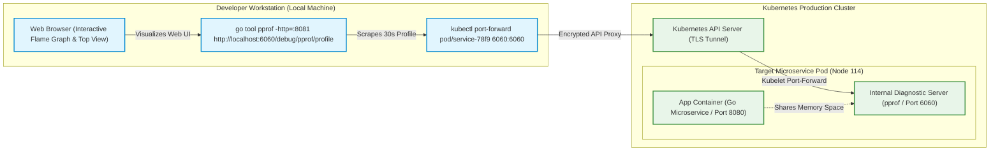

# Go pprof in Kubernetes: Remote Profiling & Flame Graphs

> **Answer-First:** Remote Go pprof profiling in Kubernetes safely captures runtime CPU and heap profiles under live production load using dedicated internal diagnostic ports. By combining secure kubectl port-forwarding with ephemeral debug containers and continuous eBPF profiling agents, platform teams isolate goroutine leaks, eliminate mutex contention, and generate actionable flame graphs without exposing endpoints publicly.

> **Prerequisite:** Readers should possess working knowledge of Go runtime internals (goroutines, garbage collection, heap allocations), Linux process management, and Kubernetes workload debugging (kubectl commands, pod networking, port-forwarding). 

You've instrumented your Go service with `net/http/pprof`, run `go tool pprof` locally against the development binary, and spotted the hot path in your flame graph. Then you deploy to Kubernetes and the bottleneck disappears — because the workload profile in Kubernetes differs from local testing (different request mix, connection pool pressure, GC behavior under actual memory pressure, scheduler interference from co-located pods).

The production performance profile is the one that matters. **Go pprof Kubernetes remote profiling** is the practice of capturing real profiles from live pods — but `localhost:6060/debug/pprof` doesn't work against a pod running inside a Kubernetes cluster. You need a set of practical techniques for safely reaching the pprof HTTP endpoint of a specific pod, capturing profiles under real production load, and integrating continuous profiling without the operational overhead of manual profiling sessions.

This post covers the three principal approaches — `kubectl port-forward`, pprof sidecar pattern, and Pyroscope continuous profiling — plus how to read the flame graph output for common Go performance issues. For the foundational pprof concepts and local profiling workflow, see [Go pprof Tutorial: CPU & Memory Profiling in Production](/posts/golang-pprof-profiling-memory-cpu-tutorial/).

---





## The Kubernetes Profiling Challenge: Why `localhost:6060` Doesn't Work in K8s

When a Go service runs in Kubernetes, pprof's HTTP server binds to the pod's internal network interface — accessible within the cluster, but not from your local machine. The pod's IP address is ephemeral (changes on restart), and by default no service or ingress routes external traffic to the pprof port.

There are three approaches to solving this, each with different trade-offs:

| Approach | Setup Complexity | Overhead | Real-Time? | Best For |
|---|---|---|---|---|
| `kubectl port-forward` | Low | None (on-demand) | Yes | On-demand debugging during incidents |
| pprof sidecar container | Medium | None (isolated) | Yes | Secure access in hardened clusters |
| Pyroscope continuous profiling | Medium-High | Low (~1-3% CPU) | Always-on | Long-term performance trend analysis |

---

## Method 1: `kubectl port-forward` — The Manual On-Demand Approach

`kubectl port-forward` creates an encrypted tunnel directly to a specific pod, letting you query pprof endpoints without modifying service definitions or exposing debug ports publicly.

### Step 1: Ensure pprof Is Enabled in the Go Service

Your Go service must start the pprof HTTP server on a separate admin port (never expose it on the same port as your main API):

```go
package main

import (
    "log/slog"
    "net/http"
    _ "net/http/pprof" // blank import registers pprof handlers
    "os"
)

func startAdminServer() {
    adminAddr := os.Getenv("ADMIN_ADDR")
    if adminAddr == "" {
        adminAddr = ":6060"
    }
    go func() {
        slog.Info("starting admin server", "addr", adminAddr)
        if err := http.ListenAndServe(adminAddr, nil); err != nil {
            slog.Error("admin server failed", "error", err)
        }
    }()
}
```

Add the admin port to your pod spec (but **do not** add it to the Kubernetes Service — it should remain inaccessible externally):

```yaml
# deployment.yaml
containers:
  - name: my-go-service
    image: my-go-service:latest
    ports:
      - name: http
        containerPort: 8080
      - name: admin           # pprof port — NOT in the Service spec
        containerPort: 6060
    env:
      - name: ADMIN_ADDR
        value: ":6060"
```

### Step 2: Forward the Port and Capture a Profile

```bash
# Forward local 6060 to the pod's 6060
POD=$(kubectl get pods -l app=my-go-service -n production -o jsonpath='{.items[0].metadata.name}')

# Open the tunnel (runs in foreground, keep it open):
kubectl port-forward pod/$POD 6060:6060 -n production

# In a separate terminal — capture a 30-second CPU profile:
curl -s -o cpu.pb.gz "http://localhost:6060/debug/pprof/profile?seconds=30"

# Capture the current goroutine state:
curl -s -o goroutine.pb.gz "http://localhost:6060/debug/pprof/goroutine"

# Capture a heap allocation profile:
curl -s -o heap.pb.gz "http://localhost:6060/debug/pprof/heap"
```

### Step 3: Analyze the Profile Locally

```bash
# Open the CPU profile interactively
go tool pprof -http=:8090 cpu.pb.gz

# Or compare two goroutine profiles (baseline vs. leak state):
go tool pprof -base goroutine_baseline.pb.gz goroutine_leak.pb.gz
```

The `-http` flag opens an interactive web UI at `localhost:8090` with flame graphs, call graphs, and the `top` view.

### Targeting a Specific Pod During Traffic Spikes

In a multi-replica deployment, you may want to profile the specific pod that is showing high CPU or memory. Use `kubectl top pods` to find the highest-resource pod before port-forwarding:

```bash
# Find the pod with highest CPU utilization
kubectl top pods -l app=my-go-service -n production --sort-by=cpu | head -5

# Port-forward to that specific pod
kubectl port-forward pod/my-go-service-7d4b9c8f6-xk9p2 6060:6060 -n production
```

---

## Method 2: pprof Sidecar Pattern — A Dedicated Debug Container

**In hardened clusters (OPA/Gatekeeper, service mesh mTLS), port-forwarding to the main app port may require elevated RBAC. Instead, bind the admin server to `127.0.0.1:6060` (loopback only) and add an nginx sidecar container that proxies from port 9090 with cluster-IP allowlist (`allow 10.0.0.0/8`). Operators port-forward to the sidecar's 9090 without touching the main app port.**

In hardened Kubernetes environments (PodSecurityPolicy, OPA/Gatekeeper, or Service Mesh mTLS), temporarily port-forwarding to a pod may be restricted or require elevated RBAC permissions. An alternative is to run a pprof proxy as a **sidecar container** that shares the pod network namespace with the main container.

### The Sidecar Approach

The sidecar container runs a minimal HTTP reverse proxy that forwards pprof requests from a secured endpoint to the main container's admin port:

```yaml
# deployment.yaml with pprof sidecar
spec:
  template:
    spec:
      containers:
        - name: my-go-service
          image: my-go-service:latest
          ports:
            - containerPort: 8080
            - containerPort: 6060  # admin port, localhost only
          # Restrict admin port to loopback only
          env:
            - name: ADMIN_ADDR
              value: "127.0.0.1:6060"

        - name: pprof-proxy
          image: nginx:alpine
          ports:
            - name: pprof-proxy
              containerPort: 9090
          volumeMounts:
            - name: nginx-config
              mountPath: /etc/nginx/conf.d
          resources:
            limits:
              cpu: 50m
              memory: 32Mi
      
      volumes:
        - name: nginx-config
          configMap:
            name: pprof-nginx-config
```

The NGINX config proxies pprof requests to the local Go admin server while restricting access to cluster-internal IPs:

```nginx
# pprof-nginx.conf
server {
    listen 9090;
    
    # Restrict access to cluster-internal IPs only
    allow 10.0.0.0/8;
    allow 172.16.0.0/12;
    deny all;
    
    location /debug/pprof/ {
        proxy_pass http://127.0.0.1:6060;
        proxy_set_header Host $host;
    }
}
```

With this setup, RBAC-permissioned operators can port-forward to `9090` (the sidecar port) without needing access to the main application port, and the sidecar enforces network-level access control.

---

## Method 3: Pyroscope — Continuous Profiling Without Any Code Changes

**Pyroscope pull mode: add 4 pod annotations (`pyroscope.io/scrape: "true"`, `pyroscope.io/port: "6060"`, `pyroscope.io/profile-cpu: "true"`, `pyroscope.io/profile-mem: "true"`) and the Kubernetes agent scrapes every 15 seconds automatically — zero Go code changes. Push mode uses the `github.com/grafana/pyroscope-go` SDK for lower overhead. Deploy via Helm with `persistence.size=50Gi` and configure S3 storage for production retention.**

Pyroscope is an open-source continuous profiling platform. It collects pprof profiles from all pods automatically, aggregates them by service and Kubernetes labels, and provides a web UI for exploring historical and real-time flame graphs.

### Two Integration Modes

**Pull mode (Kubernetes agent)**: Pyroscope's Kubernetes agent scrapes pprof endpoints automatically from pods annotated with:

```yaml
# Add these annotations to your pod template
annotations:
  pyroscope.io/scrape: "true"
  pyroscope.io/port: "6060"
  pyroscope.io/profile-cpu: "true"
  pyroscope.io/profile-mem: "true"
  pyroscope.io/profile-goroutines: "true"
```

The Pyroscope agent discovers annotated pods via the Kubernetes API and scrapes their pprof endpoints every 15 seconds (configurable). **No code changes are required in your Go service.**

**Push mode (SDK)**: For lower overhead and more control, the Pyroscope Go SDK sends profiles directly from the application:

```go
import "github.com/grafana/pyroscope-go"

func initPyroscope() {
    pyroscope.Start(pyroscope.Config{
        ApplicationName: "my-go-service",
        ServerAddress:   "http://pyroscope-server:4040",
        
        // Tag with K8s metadata for filtering
        Tags: map[string]string{
            "region": os.Getenv("REGION"),
            "pod":    os.Getenv("POD_NAME"),
        },
        
        ProfileTypes: []pyroscope.ProfileType{
            pyroscope.ProfileCPU,
            pyroscope.ProfileAllocObjects,
            pyroscope.ProfileAllocSpace,
            pyroscope.ProfileInuseObjects,
            pyroscope.ProfileInuseSpace,
            pyroscope.ProfileGoroutines,
        },
    })
}
```

### Deploying the Pyroscope Server on Kubernetes

Deploy the Pyroscope profiling server to your Kubernetes cluster using the official Grafana Helm repository with persistent storage enabled.

```bash
helm repo add grafana https://grafana.github.io/helm-charts
helm install pyroscope grafana/pyroscope \
    --namespace observability \
    --set persistence.enabled=true \
    --set persistence.size=50Gi
```

Pyroscope stores profiles in object storage (S3-compatible) or on-disk. For production clusters, configure S3 storage to avoid filling ephemeral volumes.

### Querying Pyroscope for Performance Regression Detection

Pyroscope's query API supports time-range comparisons — the equivalent of the pprof diff workflow, but over historical data:

```
# Compare CPU profiles: last 1 hour vs same time last week
GET /render?query=process_cpu:cpu:nanoseconds:cpu:nanoseconds{service_name="my-go-service"}
    &from=now-1h&until=now
    &leftFrom=now-1w-1h&leftUntil=now-1w
```

This surfaces regressions introduced by recent deployments without requiring a manual "before/after" capture workflow. Integrate this query into your CI/CD post-deployment verification step.

---

## Profiling Under Real Load: Capturing Profiles During Traffic Spikes

Capturing pprof profiles against an idle Go pod yields flat flame graphs dominated by runtime scheduling loops. To isolate active CPU bottlenecks, lock contention, and memory allocation spikes, trigger realistic load tests using `k6` or capture profiles directly during production traffic surges after pod warm-up completes:

The most common profiling mistake is capturing a profile against an idle or lightly loaded pod. An idle Go service shows a flat flame graph dominated by `runtime.schedule` and `net/http.(*Server).Serve` — useful for nothing. The profile that matters is the one captured while the service is handling real request volume.

### Generating Representative Load with k6

Use `k6` to drive realistic traffic against your service while the port-forward tunnel is open:

```bash
# Terminal 1 — open the pprof tunnel to the highest-CPU pod
POD=$(kubectl top pods -l app=my-go-service -n production --sort-by=cpu \
    | awk 'NR==2{print $1}')
kubectl port-forward pod/$POD 6060:6060 -n production &
TUNNEL_PID=$!

# Terminal 2 — start the load test (simulates 50 concurrent users for 90 seconds)
k6 run --vus 50 --duration 90s - << 'EOF'
import http from 'k6/http';
import { sleep } from 'k6';

export default function () {
    http.get('https://my-service.internal/api/orders');
    sleep(0.1);
}
EOF
```

While the synthetic load is running, execute the following commands in a third terminal to save the CPU and goroutine snapshots.

```bash
# Terminal 3 — capture a 30-second CPU profile WHILE k6 is running
# Timing: start the capture about 15 seconds into the k6 run,
# so the JIT warm-up phase is past and the load is fully ramped
curl -s -o cpu_loaded.pb.gz "http://localhost:6060/debug/pprof/profile?seconds=30"

# Also capture a goroutine snapshot at peak load
curl -s -o goroutine_peak.pb.gz "http://localhost:6060/debug/pprof/goroutine?debug=0"

# Clean up the tunnel
kill $TUNNEL_PID
```

### Idle vs. Loaded Profile Comparison

Comparing an idle profile against a loaded profile reveals which code paths only appear under concurrency pressure — connection pool contention, mutex hot paths, and GC pressure from high allocation rates.

```bash
# Capture idle baseline (no load traffic)
curl -s -o cpu_idle.pb.gz "http://localhost:6060/debug/pprof/profile?seconds=30"

# Then run the load test and capture the loaded profile
curl -s -o cpu_loaded.pb.gz "http://localhost:6060/debug/pprof/profile?seconds=30"

# Diff: shows what appears under load that wasn't visible at idle
go tool pprof -diff_base cpu_idle.pb.gz -http=:8090 cpu_loaded.pb.gz
```

The diff flame graph highlights functions that gained CPU time under load. A common finding: `sync.(*Mutex).Lock` showing up in the diff graph indicates a shared mutex that serializes concurrent requests — invisible at low QPS, catastrophic at peak.

### Profiling During an Actual Incident

If your service is already degrading in production and you need to profile without further impacting it:

1. **Use a low-overhead profile type first**: Goroutine dump (`/debug/pprof/goroutine`) is instantaneous and shows blocking goroutines — the fastest path to diagnosing a deadlock or goroutine leak
2. **Then capture heap** (`/debug/pprof/heap`) to check for unexpected allocation spikes
3. **Only then capture CPU** (`/debug/pprof/profile?seconds=10`) — the 10-second window minimizes the observation window during an active incident
4. **Prefer Pyroscope historical data** over live captures during incidents, if Pyroscope is deployed — no additional overhead on the struggling pod

For the goroutine pool patterns that prevent goroutine explosion before you even need to profile it, see [Goroutine Pool Patterns in Go: errgroup & Backpressure](/posts/golang-goroutine-pool-errgroup-worker/).

---




```mermaid
flowchart TD
    subgraph IncidentTriage ["Production Memory & Goroutine Leak Triage Workflow"]
        Alert["Prometheus Alert: Pod Memory Usage > 85%"] --> PortForward["Step 1: Open Safe kubectl port-forward :6060"]
        PortForward --> Snapshot1["Step 2: Collect Baseline Heap Snapshot (heap_base.pb.gz)"]
        Snapshot1 --> WaitLoad["Step 3: Wait 5-10 Minutes Under Active Traffic"]
        WaitLoad --> Snapshot2["Step 4: Collect Second Heap Snapshot (heap_current.pb.gz)"]
        Snapshot2 --> DiffAnalysis["Step 5: Run go tool pprof -base heap_base.pb.gz heap_current.pb.gz"]
        DiffAnalysis --> InspectRoots["Step 6: Inspect alloc_space vs inuse_space Delta Roots"]
        InspectRoots --> GoroutineDump["Step 7: Check Goroutine Dump for Blocked Chans or Mutexes"]
        GoroutineDump --> HotPatch["Step 8: Deploy Hotfix with GOMEMLIMIT Safeguard"]
    end

    classDef triage fill:#fff3e0,stroke:#f57c00,stroke-width:2px;
    class Alert,PortForward,Snapshot1,WaitLoad,Snapshot2,DiffAnalysis,InspectRoots,GoroutineDump,HotPatch triage;
```

## Analyzing Memory Leaks and Reading CPU Flame Graphs

Interpreting Go pprof flame graphs requires identifying distinct runtime call stack patterns that signal underlying performance bottlenecks. Analyzing frame width isolates high heap allocation rates, blocking I/O calls, mutex lock contention, and garbage collection CPU pressure. Consider the primary flame graph patterns and optimization solutions detailed below:

A flame graph visualizes the call stack: the x-axis is sampling frequency (wider = more CPU time), the y-axis is call depth. The widest boxes at the top are the functions spending the most CPU time.

### Pattern 1: Wide `runtime.mallocgc` — Heap Allocation Hot Spot

Call stack pattern indicates that garbage collection allocation pauses dominate CPU usage.

```
[runtime.mallocgc - 35% CPU]
  └─ [json.Marshal - 30%]
       └─ [http.(*ServeMux).ServeHTTP - 25%]
```

If `runtime.mallocgc` is wide in a CPU profile, your service is spending a significant portion of time on garbage collection caused by heap allocations. Common Go causes:
- `json.Marshal` on large structs — use `json.Encoder` with a reused buffer, or switch to `encoding/json/v2` or `jsoniter`
- Concatenating strings in loops — use `strings.Builder`
- Creating new slice/map in hot paths — pre-allocate with `make([]T, 0, expectedSize)`

### Pattern 2: Wide `syscall.read` or `net.(*netFD).Read` — I/O Bound

This call stack profile shows a service bottlenecked on network or file system I/O operations.

```
[syscall.read - 60% CPU]
  └─ [bufio.(*Reader).ReadLine - 55%]
       └─ [net/http.(*response).readRequest - 50%]
```

The service is spending most of its time waiting on I/O. This is often a sign of inadequate connection pooling (creating new database connections per request) or reading large responses without streaming.

### Pattern 3: Wide `sync.(*Mutex).Lock` — Lock Contention

High CPU time concentrated in lock acquisition functions demonstrates significant mutex contention across goroutines.

```
[sync.(*Mutex).Lock - 40% CPU]
  └─ [sync.(*Mutex).lockSlow - 38%]
       └─ [mypackage.(*Cache).Get - 35%]
```

A mutex in a hot path is serializing goroutines. Options:
- Shard the mutex (N mutexes, key % N selects the shard)
- Replace `sync.Mutex` with `sync.RWMutex` if reads dominate
- Switch to a lockless data structure (`sync.Map` for read-heavy maps)

### Pattern 4: Wide `runtime.gcBgMarkWorker` — GC Pressure

If GC background worker frames consume more than 10–15% of CPU in a profile, the garbage collector is under sustained pressure. This indicates high allocation rates exceeding the collector's throughput. Solutions:
- Profile heap allocations (`/debug/pprof/heap`) to find the allocation source
- Set `GOGC` higher (default 100) to reduce GC frequency at the cost of higher peak memory
- Set `GOMEMLIMIT` (introduced in Go 1.19) to cap total memory usage

For the goroutine-specific patterns in flame graphs, see [Goroutine Leak Detection and Fix in Production Go Services](/posts/goroutine-leak-detection-production-golang/).

---

## Security Hardening: Preventing pprof Exposure in Production Clusters

**pprof heap dumps can contain in-memory tokens and PII from active goroutines. Three hardening steps: (1) bind admin port to `127.0.0.1` — blocks pod-to-pod access via pod IP; (2) NetworkPolicy restricting port 6060 to the `observability` namespace only; (3) use build tags (`//go:build debug`) to compile-exclude `net/http/pprof` entirely from production binaries — the endpoint doesn't exist, it can't leak.**

The pprof endpoint exposes detailed information about your service's internal behavior — heap contents, goroutine stacks, and CPU profiling data. In some cases, this data can include sensitive application state (tokens in memory, PII in active goroutines).

### Hardening Checklist

- `[ ]` **Bind admin port to `127.0.0.1`**: Prevents direct access from other pods via the pod IP. Only port-forward and same-pod processes can reach it.
- `[ ]` **NetworkPolicy**: Restrict which pods can access the admin port at the cluster network level.

```yaml
# NetworkPolicy: only allow pprof access from the observability namespace
apiVersion: networking.k8s.io/v1
kind: NetworkPolicy
metadata:
  name: allow-pprof-from-observability
spec:
  podSelector:
    matchLabels:
      app: my-go-service
  ingress:
    - from:
        - namespaceSelector:
            matchLabels:
              kubernetes.io/metadata.name: observability
      ports:
        - port: 6060
```

- `[ ]` **Remove pprof from production builds**: Use build tags to conditionally import `net/http/pprof`:

```go
//go:build debug

package main

import _ "net/http/pprof"
```

Build with `-tags debug` for non-production environments and without the tag for production — pprof is not registered at all.

- `[ ]` **Log all pprof accesses**: Even if pprof is internal-only, log every profile download with the requester's identity for audit purposes.

---

## Integrating pprof Into Your Kubernetes Incident Response Playbook

Add these steps to your incident response runbook for Go service performance issues:

```
INCIDENT: Go service showing elevated CPU or memory growth

1. kubectl top pods -l app=<service> -n <ns> --sort-by=<cpu|memory>
   → Identify the worst pod

2. kubectl port-forward pod/<pod-name> 6060:6060 -n <ns>
   → Open tunnel in background

3. Capture profiles:
   CPU: curl -o cpu.pb.gz "http://localhost:6060/debug/pprof/profile?seconds=30"
   Heap: curl -o heap.pb.gz "http://localhost:6060/debug/pprof/heap"
   Goroutine: curl -o goroutine.pb.gz "http://localhost:6060/debug/pprof/goroutine?debug=1"

4. go tool pprof -http=:8090 cpu.pb.gz
   → Open flame graph in browser

5. Compare with baseline (if available):
   go tool pprof -base baseline.pb.gz heap.pb.gz
   → Identify new allocations

6. Check Pyroscope for historical context:
   → Compare with last 7 days at same traffic level
   → Check if regression correlates with a recent deployment
```

This playbook aligns with the GitOps operational practices described in [GitOps at Scale: Kubernetes & ArgoCD for Microservices](/posts/gitops-at-scale-kubernetes-argocd-microservices/) and the Argo CD deployment management covered in [What's New in Argo CD 3.4 & 3.3](/posts/argo-cd-updates-2026/).

---

## Frequently Asked Questions

### How do I access pprof on a Go pod running in Kubernetes?
Use `kubectl port-forward pod/<pod-name> 6060:6060` to create a local tunnel to the pod's admin port. The pprof HTTP server must be bound to the pod's network interface (not `127.0.0.1`) for port-forward to work — or use `127.0.0.1` binding with the sidecar pattern. Once the tunnel is open, all `go tool pprof` commands work against `http://localhost:6060` as if the pod were local.

### What is Pyroscope and how does it compare to pprof?
Pyroscope is a continuous profiling platform that automates the collection, storage, and querying of pprof profiles from Kubernetes pods. Unlike on-demand pprof captures, Pyroscope always-on profiling means you always have profile data for any historical time range — including before an incident began. Pyroscope's overhead is approximately 1–3% CPU when using the pull mode with the standard 15-second scrape interval.

### Is continuous profiling safe in production?
Yes, with appropriate configuration. The pprof CPU profiling endpoint uses sampling (every 10ms by default), not instrumentation — it adds no code to the hot path. Memory and goroutine profile endpoints cause a brief Stop-The-World pause (< 1ms for most services). Pyroscope's continuous profiling at a 15-second collection interval with CPU sampling produces approximately 1–3% CPU overhead — acceptable for most production services. The key risk is data sensitivity: pprof heap dumps can contain in-memory application data. Use network policies and access logging to control who can download profiles.

---

**Related Reading:** For deploying Go services and routing engines on Kubernetes — a common target for pprof profiling — see [Self-Hosting GraphHopper on Kubernetes with OSM Data](/posts/graphhopper-kubernetes-self-hosting-osm/) for StatefulSet configuration patterns. For the GitOps deployment pipeline managing your Kubernetes workloads, see [What's New in Argo CD 3.4 & 3.3](/posts/argo-cd-updates-2026/) and [GitOps at Scale: Kubernetes & ArgoCD for Microservices](/posts/gitops-at-scale-kubernetes-argocd-microservices/).


---

## Frequently Asked Questions


Importing `_ "net/http/pprof"` automatically registers diagnostic handlers onto `http.DefaultServeMux`. If your microservice uses `http.DefaultServeMux` to serve public web or API traffic on port 8080, your pprof endpoints become accessible to the entire internet without authentication. Attackers can scrape heap profiles to extract sensitive memory data, tokens, and customer PII, or trigger multiple concurrent 30-second CPU profiles that exhaust CPU quota and cause severe denial-of-service outages. In production, always bind pprof to a dedicated internal listener on localhost or an unexposed management port.



`inuse_space` measures the volume of memory currently allocated and retained in heap memory at the exact moment the profile was captured. This is the primary metric for identifying memory leaks and diagnosing Kubernetes OOMKilled events. In contrast, `alloc_space` measures the cumulative volume of memory allocated over the lifetime of the application, including objects that have already been garbage collected. High `alloc_space` highlights rapid allocation churn that places excessive pressure on the Go garbage collector.



Prior to Go 1.19, the Go garbage collector only triggered based on `GOGC` (a percentage target for heap growth relative to live data), completely unaware of Kubernetes container cgroup memory limits. Under rapid allocation spikes, the heap would double and exceed the container limit before a GC cycle could run, causing the Linux kernel OOM killer to terminate the container. `GOMEMLIMIT` establishes a soft memory ceiling (recommended at 85–90% of container limit) that forces the GC to run more aggressively as memory approaches the threshold, effectively preventing OOM terminations.



On-demand pprof via `kubectl port-forward` provides a detailed point-in-time snapshot, but it requires active manual intervention during an ongoing incident. If a latency spike or memory leak occurs intermittently at 3 AM and recovers before an engineer logs in, on-demand profiling cannot capture the root cause. Continuous profiling tools like Pyroscope run lightweight background agents (consuming ~1-3% CPU) that continuously record CPU, memory, and goroutine samples, allowing engineers to diff performance profiles across arbitrary historical time windows and deployment releases.


For complete architectural patterns on structuring resilient Go backend systems, see our foundational blueprint on [modular Go microservices architecture](/posts/go-microservices/) and [high-throughput banking microservices](/posts/banking-microservices-architecture/).
