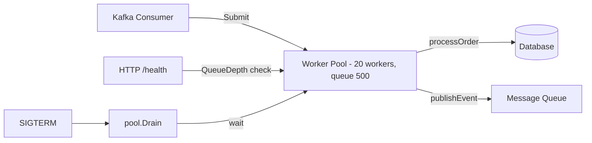

**Answer-first:** Unbounded goroutines in production trigger OOM crashes and garbage collection spirals. Prevent failures by enforcing concurrency limits using `errgroup.WithContext` for group error handling, channel-based worker pools for continuous jobs, and buffered semaphores for rate-limiting, transforming variable runtime resource usage into predictable, fixed bounds.

### What You'll Learn That AI Won't Tell You
- Preventing goroutine leaks in high-concurrency worker pools using errgroup.
- Writing robust worker pools that propagate context cancellation to all active goroutines.


> 

Every Go engineer eventually writes the same mistake: a loop that launches goroutines unconditionally. In a demo with 10 items, this works beautifully. In production with 50,000 incoming webhook events, it spawns 50,000 goroutines simultaneously, exhausts memory, and triggers the OOM killer. Kubernetes restarts the pod. The on-call engineer gets paged at 3 AM.

The solution is not to avoid goroutines — Go's concurrency model is one of its greatest strengths. The solution is to use the correct pattern for the workload: worker pools, bounded semaphores, and backpressure mechanisms that keep concurrency within sustainable bounds regardless of input volume.

This post covers four production-grade **golang goroutine pool** patterns with complete code, benchmarks, and use-case guidance. It is the proactive counterpart to [Goroutine Leak Detection and Fix in Production Go Services](/posts/goroutine-leak-detection-production-golang/) — that post detects and fixes leaks; this one prevents them architecturally. For the foundational CPU and heap profiling workflow that helps you measure pool performance, see [Go pprof Tutorial: CPU & Memory Profiling in Production](/posts/golang-pprof-profiling-memory-cpu-tutorial/).

---

## Why Unbounded Goroutines Will Destroy Your Production Service

**At 50,000 simultaneous goroutines, baseline stack memory is 100MB — but stacks are the least problem. Each goroutine pins heap references the GC cannot collect, triggering a death spiral: GC runs more frequently, consuming CPU that should be doing useful work, slowing goroutine completion, increasing peak goroutine count. Kubernetes terminates with exit code 137.**

A goroutine starts with a 2KB stack that grows dynamically. At 50,000 simultaneous goroutines, the baseline stack memory alone is 100MB. But stacks are the least of the problem — each goroutine may hold references to heap-allocated data (request bodies, database rows, response buffers), all of which the GC cannot collect while the goroutine is alive.

The failure modes are:

**1. OOM exit code 137**: Kubernetes terminates the pod when the container's memory limit is breached. All in-flight work is lost. No graceful drain.

**2. GC death spiral**: The garbage collector runs more frequently as heap usage grows. At extreme goroutine counts, GC work itself consumes CPU cycles that should be doing useful work, reducing throughput — which causes goroutines to complete more slowly — which increases peak goroutine count — which triggers more GC. A positive feedback loop that collapses the service.

**3. Downstream cascade**: Unbounded goroutines issue unbounded database queries, gRPC calls, and HTTP requests to downstream services. Your service's goroutine explosion becomes a DDoS against your own infrastructure.

The correct approach is to decide, upfront, the maximum concurrency your system can sustain, and enforce that limit structurally.

---

## Pattern 1: `errgroup` — The Idiomatic Go Worker Pool

`golang.org/x/sync/errgroup` is the standard library's solution for running a fixed set of goroutines and collecting errors. Combined with `errgroup.WithContext`, it propagates context cancellation to all workers when any one worker fails.

### Basic `errgroup` Pattern

```go
package main

import (
    "context"
    "fmt"
    "log/slog"

    "golang.org/x/sync/errgroup"
)

type Job struct {
    ID   int
    Data string
}

func processJobs(ctx context.Context, jobs []Job) error {
    // errgroup.WithContext creates a derived context that is canceled
    // automatically when any goroutine returns a non-nil error.
    g, gCtx := errgroup.WithContext(ctx)

    for _, job := range jobs {
        job := job // capture for goroutine (not needed in Go 1.22+)
        g.Go(func() error {
            if err := processJob(gCtx, job); err != nil {
                return fmt.Errorf("job %d failed: %w", job.ID, err)
            }
            return nil
        })
    }

    // Wait blocks until all goroutines complete or any returns an error.
    // On first error, gCtx is canceled — well-behaved goroutines should
    // check gCtx.Done() and return early.
    if err := g.Wait(); err != nil {
        return fmt.Errorf("job processing failed: %w", err)
    }
    return nil
}
```

### Bounded `errgroup` with `SetLimit`

The `errgroup.Group.SetLimit(n)` method (added in Go 1.20) caps the number of goroutines running simultaneously. This is the simplest production-safe pattern for bounded fan-out:

```go
func processJobsBounded(ctx context.Context, jobs []Job, concurrency int) error {
    g, gCtx := errgroup.WithContext(ctx)
    g.SetLimit(concurrency) // Maximum N goroutines active at once

    for _, job := range jobs {
        job := job
        // g.Go blocks if concurrency limit is reached, then unblocks when
        // a slot becomes available. This provides implicit backpressure
        // on the producer — the loop itself slows down.
        g.Go(func() error {
            return processJob(gCtx, job)
        })
    }

    return g.Wait()
}
```

**When to use `errgroup` with `SetLimit`:**
- Processing a finite, known list of items (batch jobs, fan-out API calls)
- All-or-nothing semantics: if one job fails, cancel remaining jobs
- The producer (the `for` loop) is local to the same function — blocking the producer is acceptable

**When `errgroup` is NOT sufficient:**
- Continuous streaming input (Kafka consumer, WebSocket messages) — blocking the consumer loop stalls message processing
- You need to reject work when the pool is full (instead of blocking the producer)
- You need different error semantics (log-and-continue, not all-or-nothing)

---

## Pattern 2: Semaphore-Based Concurrency Limiting with `golang.org/x/sync`

**A `semaphore.Weighted` from `golang.org/x/sync` separates concurrency control from goroutine lifecycle: `Acquire(ctx, 1)` blocks until a slot is available (respecting context cancellation), then you launch the goroutine; `Release(1)` in defer returns the slot. Unlike `errgroup.SetLimit`, semaphores support weighted acquisition — a heavy job acquires weight 5, a light job acquires 1.**

A **semaphore** is a counting mutex: `Acquire` blocks until a slot is available, `Release` returns a slot. Unlike `errgroup.SetLimit`, a semaphore separates the concurrency control from the goroutine lifecycle management, giving you more flexibility.

```go
import "golang.org/x/sync/semaphore"

type Processor struct {
    sem *semaphore.Weighted
}

func NewProcessor(maxConcurrency int64) *Processor {
    return &Processor{
        sem: semaphore.NewWeighted(maxConcurrency),
    }
}

// ProcessAsync submits a job for async processing.
// It acquires a semaphore slot (blocking if at capacity) before
// launching the goroutine, then releases the slot when done.
func (p *Processor) ProcessAsync(ctx context.Context, job Job) error {
    // Acquire a slot. Respects ctx cancellation — returns error if ctx is done.
    if err := p.sem.Acquire(ctx, 1); err != nil {
        return fmt.Errorf("context canceled while waiting for worker slot: %w", err)
    }
    
    go func() {
        defer p.sem.Release(1)
        
        // Use a separate context for the work itself so that
        // context cancellation from the caller doesn't abort in-flight work
        workCtx := context.WithoutCancel(ctx)
        if err := processJob(workCtx, job); err != nil {
            slog.Error("job processing failed", "job_id", job.ID, "error", err)
        }
    }()
    
    return nil
}

// WaitAll waits for all in-flight goroutines to complete.
// Call this during graceful shutdown.
func (p *Processor) WaitAll(ctx context.Context) error {
    // Acquire all N slots — only possible when all goroutines have released
    return p.sem.Acquire(ctx, int64(p.sem.TryAcquire(0)))
}
```

**Weighted semaphores** are an advanced feature: different jobs can acquire different "weights" (e.g., a large batch job acquires weight 5, a small single-item job acquires weight 1). This allows priority-aware concurrency control.

---

## Pattern 3: Bounded Channel Worker Pool — Full Control of Queue Depth

**Pre-start N goroutines consuming from a buffered channel: `numWorkers` controls parallelism, `queueDepth` controls how much work queues before the producer blocks. Crucially, these are separate knobs — 20 workers with a 1,000-deep queue drains a Kafka burst without spawning 1,000 goroutines. Use `close(jobs)` + `wg.Wait()` for clean SIGTERM drain.**

For streaming workloads (Kafka consumers, background processing queues), the most robust pattern is a pre-started worker pool consuming from a bounded channel:

```go
package workerpool

import (
    "context"
    "log/slog"
    "sync"
)

type WorkerPool[T any] struct {
    numWorkers int    // fixed parallelism — distinct from channel capacity
    jobs       chan T
    wg         sync.WaitGroup
    process    func(ctx context.Context, job T) error
}

// New creates a worker pool with a fixed number of workers and a bounded queue.
// queueDepth controls how many jobs can be queued before the sender blocks.
// numWorkers and queueDepth are intentionally separate: a large queue with few
// workers provides backpressure without high goroutine overhead.
func New[T any](
    numWorkers int,
    queueDepth int,
    processFunc func(ctx context.Context, job T) error,
) *WorkerPool[T] {
    return &WorkerPool[T]{
        numWorkers: numWorkers, // store explicitly; do not derive from cap(jobs)
        jobs:       make(chan T, queueDepth),
        process:    processFunc,
    }
}

// Start launches numWorkers goroutines. Call once during service initialization.
func (p *WorkerPool[T]) Start(ctx context.Context) {
    for i := 0; i < p.numWorkers; i++ { // use numWorkers, not cap(p.jobs)
        p.wg.Add(1)
        go func() {
            defer p.wg.Done()
            for {
                // Biased select: check context cancellation first
                select {
                case <-ctx.Done():
                    return
                default:
                }
                
                select {
                case job, ok := <-p.jobs:
                    if !ok {
                        return // Channel closed — drain and exit
                    }
                    if err := p.process(ctx, job); err != nil {
                        slog.Error("worker error", "error", err)
                    }
                case <-ctx.Done():
                    return
                }
            }
        }()
    }
}

// Submit sends a job to the worker pool.
// Returns ErrPoolFull if the queue is at capacity and ctx is done.
func (p *WorkerPool[T]) Submit(ctx context.Context, job T) error {
    select {
    case p.jobs <- job:
        return nil
    case <-ctx.Done():
        return ctx.Err()
    }
}

// SubmitOrDrop submits a job without blocking. Returns false if queue is full.
// Use this for non-critical fire-and-forget work.
func (p *WorkerPool[T]) SubmitOrDrop(job T) bool {
    select {
    case p.jobs <- job:
        return true
    default:
        return false // Queue full — drop the job
    }
}

// Drain signals workers to stop and waits for all in-flight jobs to complete.
func (p *WorkerPool[T]) Drain() {
    close(p.jobs) // Signal workers to exit after draining remaining jobs
    p.wg.Wait()
}
```

### Usage in a Kafka Consumer

```go
func main() {
    ctx, stop := signal.NotifyContext(context.Background(), syscall.SIGTERM)
    defer stop()

    pool := workerpool.New(
        20,    // 20 parallel workers
        1000,  // queue up to 1000 jobs before blocking the consumer
        processOrder,
    )
    pool.Start(ctx)

    // Kafka consumer loop
    for msg := range kafkaConsumer.Messages() {
        job := Job{ID: msg.Offset, Data: string(msg.Value)}
        
        if err := pool.Submit(ctx, job); err != nil {
            // Context canceled — graceful shutdown initiated
            break
        }
        kafkaConsumer.Commit(msg)
    }

    // Wait for all in-flight jobs to complete
    pool.Drain()
}
```

---

## Backpressure: How to Reject Work Gracefully When the Pool Is Full

**Three backpressure strategies for Go worker pools: (1) block the producer — `Submit` waits until a slot opens, natural for batch jobs; (2) drop and log — `SubmitOrDrop` returns false and increments a `worker_pool_jobs_dropped_total` Prometheus counter; (3) reject at the API layer — HTTP 429 or gRPC `ResourceExhausted` when queue depth exceeds 80% capacity threshold.**

**Backpressure** is the mechanism by which a saturated consumer signals its producers to slow down or stop. In Go microservices, proper backpressure prevents queue buildup from propagating OOM errors downstream.

### The Three Backpressure Strategies

**Strategy 1: Block the producer** (`Submit` blocks until space is available)
- Use when: The producer is a local goroutine that can wait (batch processor, local queue)
- Risk: If the upstream is an HTTP handler blocking on a client connection, this holds the HTTP connection open and prevents new connections from being accepted

**Strategy 2: Drop and log** (`SubmitOrDrop` returns false)
- Use when: The work is non-critical and temporary loss is acceptable (metrics aggregation, non-critical audit events)
- Implementation: increment a `dropped_jobs_total` Prometheus counter so drops are visible

**Strategy 3: Reject with HTTP 429 / gRPC ResourceExhausted**
- Use when: The caller must know the work was not accepted (payment requests, order submissions)
- Implementation: Check the queue depth before accepting new requests at the API layer

```go
// Middleware that rejects requests when the worker pool queue is near-full
func BackpressureMiddleware(pool *workerpool.WorkerPool[Job], threshold float64) http.Handler {
    return http.HandlerFunc(func(w http.ResponseWriter, r *http.Request) {
        // Reject if queue depth exceeds threshold% of capacity
        if pool.QueueDepth() > int(float64(pool.QueueCapacity()) * threshold) {
            http.Error(w, "service temporarily overloaded, retry in 1s", http.StatusTooManyRequests)
            w.Header().Set("Retry-After", "1")
            return
        }
        // ... process request
    })
}
```

---

## Graceful Shutdown: Draining the Worker Pool on SIGTERM

**On SIGTERM, drain in three steps: (1) `srv.Shutdown(shutCtx)` stops accepting new HTTP requests; (2) `close(jobs)` signals workers to drain the queue and exit; (3) `pool.Drain()` — which calls `wg.Wait()` — blocks until all in-flight jobs complete. Set Kubernetes `terminationGracePeriodSeconds` to at least your worst-case job processing time.**

Kubernetes sends SIGTERM before terminating a pod. Your worker pool must stop accepting new work and drain all in-flight jobs before the process exits.

```go
func main() {
    ctx, stop := signal.NotifyContext(context.Background(), os.Interrupt, syscall.SIGTERM)
    defer stop()

    pool := workerpool.New(20, 500, processOrder)
    pool.Start(ctx)

    srv := &http.Server{
        Addr:    ":8080",
        Handler: BackpressureMiddleware(pool, 0.8),
    }

    go func() {
        if err := srv.ListenAndServe(); err != http.ErrServerClosed {
            log.Fatalf("HTTP server error: %v", err)
        }
    }()

    // Block until SIGTERM
    <-ctx.Done()
    slog.Info("SIGTERM received — beginning graceful shutdown")

    // 1. Stop the HTTP server (no new requests accepted)
    shutCtx, cancel := context.WithTimeout(context.Background(), 10*time.Second)
    defer cancel()
    if err := srv.Shutdown(shutCtx); err != nil {
        slog.Error("HTTP server shutdown error", "error", err)
    }

    // 2. Drain the worker pool (wait for in-flight jobs to complete)
    pool.Drain()
    slog.Info("worker pool drained — clean exit")
}
```

The Kubernetes `terminationGracePeriodSeconds` must be set to at least as long as your worst-case job processing time plus the HTTP drain time:

```yaml
spec:
  terminationGracePeriodSeconds: 60  # Match to your job SLA
```

---

## Tracing Goroutine Pools with pprof Labels

**When a service runs multiple worker pools, pprof flame graphs show all goroutines merged. Use `pprof.Do(ctx, pprof.Labels("pool", p.name, "worker_id", id), ...)` to attach key-value metadata to every pprof sample from that goroutine. In the flame graph, samples become `pool=order-processor worker_id=3` — instantly disambiguating which pool is consuming CPU.**

When profiling a service with multiple goroutine pools, pprof flame graphs are difficult to read without context on *which pool* each goroutine belongs to. Use `pprof.Labels` to attach custom metadata:

```go
import "runtime/pprof"

func (p *WorkerPool[T]) Start(ctx context.Context) {
    for i := 0; i < numWorkers; i++ {
        workerID := i
        p.wg.Add(1)
        go func() {
            defer p.wg.Done()
            
            // Attach pool context to all pprof samples from this goroutine
            pprof.Do(ctx, pprof.Labels(
                "pool", p.name,
                "worker_id", strconv.Itoa(workerID),
            ), func(ctx context.Context) {
                p.workerLoop(ctx)
            })
        }()
    }
}
```

In the pprof flame graph, samples from this goroutine will now show `pool=order-processor worker_id=3` as labels, making it trivial to distinguish between pools in a complex service.

For the complete pprof workflow in Kubernetes, see [Go pprof in Kubernetes: Remote Profiling & Flame Graphs](/posts/go-pprof-kubernetes-remote-profiling/).

---

## Real-World Example: A Parallel Order Processing Pipeline in Go

**The production pattern: Kafka consumer submits jobs to a `WorkerPool` (20 workers, 1,000-deep queue). An HTTP `/health` endpoint checks `pool.QueueDepth()` against capacity and returns 503 when >80% full. On SIGTERM, the Kafka consumer loop breaks on `ctx.Done()`, then `pool.Drain()` waits for in-flight orders. Total shutdown time: <5 seconds for typical order volumes.**

Combining all patterns: a Kafka-driven order processing pipeline with bounded concurrency, backpressure, and graceful shutdown.



The key metrics to instrument on this pipeline:

```go
var (
    jobsSubmitted = prometheus.NewCounter(prometheus.CounterOpts{
        Name: "worker_pool_jobs_submitted_total",
        Help: "Total jobs submitted to the pool",
    })
    jobsDropped = prometheus.NewCounter(prometheus.CounterOpts{
        Name: "worker_pool_jobs_dropped_total",
        Help: "Jobs dropped due to full queue",
    })
    queueDepth = prometheus.NewGauge(prometheus.GaugeOpts{
        Name: "worker_pool_queue_depth",
        Help: "Current number of jobs in the queue",
    })
    jobDuration = prometheus.NewHistogram(prometheus.HistogramOpts{
        Name:    "worker_pool_job_duration_seconds",
        Buckets: prometheus.DefBuckets,
    })
)
```

Alert on `worker_pool_jobs_dropped_total` rate > 0 as an indicator that the pool is consistently at capacity and needs scaling.

For event-driven microservices architectures where this worker pool pattern integrates with Dapr Pub/Sub consumers, see [Mastering Event-Driven Architecture with Dapr](/posts/mastering-event-driven-architecture-dapr/) for the full Dapr integration pattern. For the definitive guide on the complete architecture, read the [Go Microservices Architecture: Production Guide](/posts/go-microservices/).

---

## Frequently Asked Questions

### What is the difference between errgroup and sync.WaitGroup in Go?
`sync.WaitGroup` is a primitive counter: `Add`, `Done`, and `Wait`. It has no error collection, no context propagation, and no concurrency limiting. `errgroup` wraps `WaitGroup` with error collection (returns the first non-nil error from any goroutine), context propagation (a derived context is canceled when any goroutine errors), and optional concurrency limiting via `SetLimit`. For all new code that coordinates multiple goroutines and needs error handling, prefer `errgroup` over raw `WaitGroup`.

### How do I limit the number of goroutines in Go?
Three approaches: (1) `errgroup.Group.SetLimit(n)` — simplest, blocks the producer until a slot is available; (2) `semaphore.Weighted` from `golang.org/x/sync` — more flexible, allows weighted acquisition; (3) bounded channel worker pool — pre-starts N goroutines that consume from a buffered channel, giving you full control over queue depth and backpressure behavior.

### What is backpressure in Go concurrency?
Backpressure is the mechanism by which a saturated worker pool signals its upstream producers to slow down or stop submitting work. In Go, backpressure is expressed through: blocking `Submit` calls (the producer waits until a slot opens), `SubmitOrDrop` with a Prometheus counter (drop the work and measure the drop rate), or HTTP 429 / gRPC ResourceExhausted responses (propagate the load signal to external callers). Proper backpressure prevents queue buildup from growing unboundedly and triggering OOM failures.


