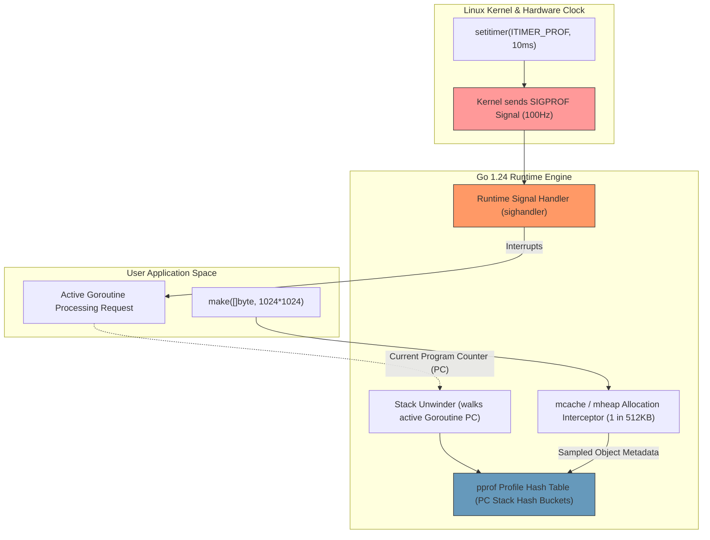
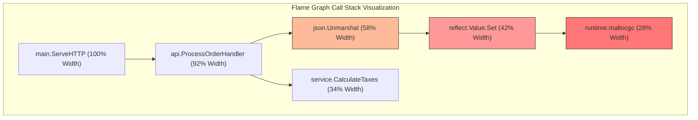
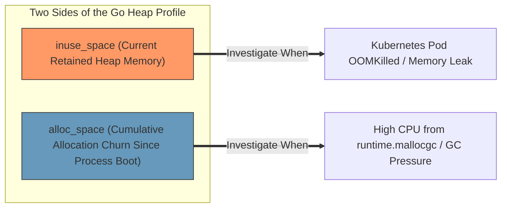
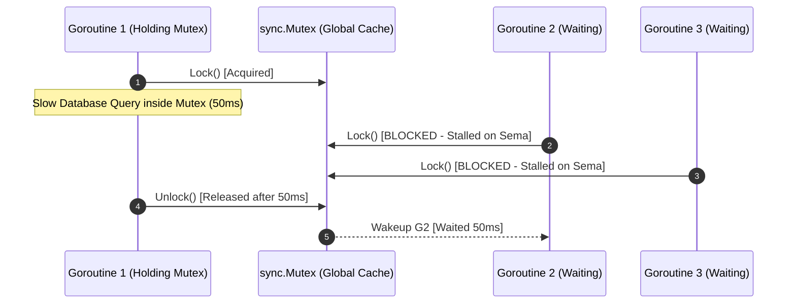
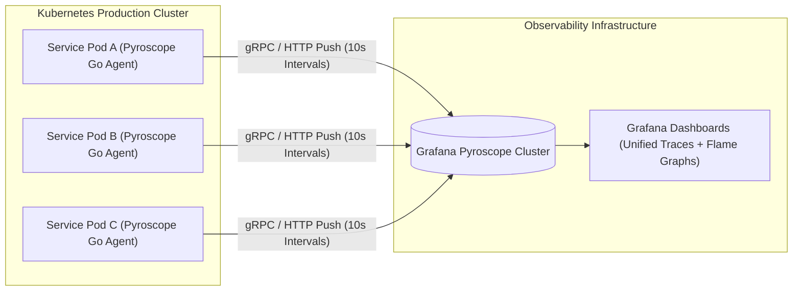
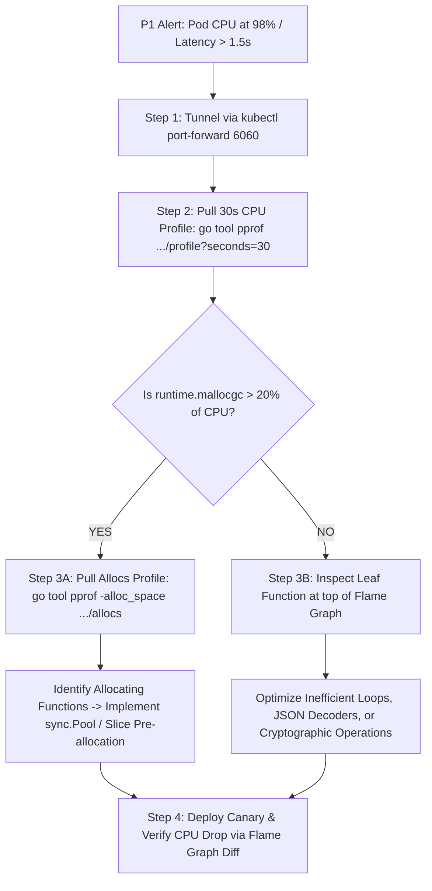

# Go pprof CPU & Memory Profiling: The Production Engineering Guide

When a mission-critical Go microservice in Kubernetes suddenly spikes to 95% CPU utilization, latency degrades from 15ms to 800ms, or pods are repeatedly terminated by the Linux kernel OOM (Out-Of-Memory) killer, guessing root causes by inspecting source code is an exercise in futility. In high-concurrency systems, intuition fails. You need empirical, low-overhead runtime telemetry.

The Go standard library ships with one of the most sophisticated, low-overhead profiling runtimes in modern software engineering: **`pprof`**. 

However, running `pprof` safely on a production cluster processing tens of thousands of requests per second is fundamentally different from profiling a test on a developer's workstation. Misconfiguring profile rates, exposing debug endpoints on public HTTP routers, or failing to differentiate between memory retention (`inuse_space`) and allocation churn (`alloc_space`) leads to degraded performance or catastrophic security disclosures.

This guide provides a comprehensive, production-hardened engineering tutorial for Go profiling. We examine the low-level mechanics of the Go runtime profiler, build a secure, isolated diagnostic listener in Go 1.24, perform heap escape analysis, interpret CPU flame graphs, diagnose mutex contention, and deploy continuous profiling at scale.

---

> ### ⚡ Executive Architectural Summary
> * **The Core Problem**: In high-throughput distributed systems, performance bottlenecks typically stem from four discrete failure modes: **CPU Hot Paths** (e.g., inefficient JSON parsing, regex compilation), **Memory Allocation Churn** (triggering frequent Garbage Collector Stop-The-World mark-sweep phases), **Goroutine / Memory Leaks** (unbounded growth in heap retention), and **Lock Contention** (goroutines stalled waiting for mutex locks).
> * **Production Safety & Overhead**:
>   * *Heap Profiling*: Continuously active by default with negligible overhead ($< 1\%$). Samples 1 allocation per 512KB allocated (`runtime.MemProfileRate`).
>   * *CPU Profiling*: Intermittent sampling via POSIX timer signals (`SIGPROF`) at 100Hz (10ms intervals). Typical overhead: $1\% - 2.5\%$. Safe to run for 30–60 second windows during active production traffic.
>   * *Block & Mutex Profiling*: Disabled by default. Setting sample rates to $1$ (recording 100% of events) introduces $10\% - 25\%$ latency overhead. Must be sampled surgically (e.g., `SetMutexProfileFraction(100)` for 1% sampling).
>   * *Execution Tracer (`runtime/trace`)*: Heavy event logging capturing all scheduler events. Adds $10\% - 20\%$ overhead; restrict to 3–5 second targeted forensic windows.

---

## 1. The Physics of the Go Runtime Profiler

To wield `pprof` effectively, you must understand how the Go runtime collects telemetry under the hood without crippling process execution.



### CPU Profiling: The `SIGPROF` Signal
When you trigger a CPU profile (e.g., `/debug/pprof/profile?seconds=30`), the Go runtime invokes the POSIX system call `setitimer(ITIMER_PROF)`. The operating system kernel generates a `SIGPROF` signal every 10 milliseconds (100Hz) to the running process:
1. The kernel pauses the currently executing thread ($M$) and transfers control to the Go runtime signal handler (`runtime.sighandler`).
2. The runtime identifies the active goroutine ($G$) on that thread and extracts the current call stack by reading the Program Counter ($PC$) and unwinding stack frames.
3. The stack trace is hashed and recorded into an in-memory hash table, incrementing the sample counter for that call path.
4. If a thread is blocked waiting on network I/O, channel operations, or mutexes, it does not consume CPU time and **is not interrupted by `SIGPROF`**. Consequently, a CPU profile will reveal zero activity for stalled, deadlocked goroutines.

### Memory Profiling: Probabilistic Exponential Sampling
Unlike naive profilers that hook every memory allocation (which destroys cache locality and throughput), Go employs **probabilistic sampling** based on an exponential distribution:
* The runtime maintains a global allocation counter. Every time an allocation occurs via `runtime.mallocgc`, the counter decrements by the object size.
* When the counter crosses zero (governed by `runtime.MemProfileRate = 512 * 1024`), the allocation is sampled, and the call stack that triggered the allocation is recorded.
* This statistical approach captures $>99\%$ of memory allocation weight while introducing $<1\%$ runtime overhead.

---

## 2. Hardened Production Implementation: Isolated Diagnostic Server

The standard pattern seen in tutorials—`import _ "net/http/pprof"`—automatically registers debug handlers onto `http.DefaultServeMux`. If your application exposes `http.DefaultServeMux` on your public web listener, **you have created a critical security vulnerability**. Attackers can scrape `/debug/pprof/cmdline`, view memory layouts, or launch Denial-of-Service (DoS) attacks by repeatedly triggering 60-second CPU profiles.

### Production Standard: The Isolated Internal Diagnostic Listener

The production pattern requires binding `pprof` handlers exclusively to a private, non-routable loopback interface or a dedicated internal management port accessible only via Kubernetes internal pod networking or `kubectl port-forward`.

```go
// Package diagnostics provides an isolated, secure pprof and health server
// completely decoupled from public HTTP API routes.
package diagnostics

import (
	"context"
	"fmt"
	"log/slog"
	"net/http"
	"net/http/pprof"
	"runtime"
	"time"
)

// Config defines the configuration for the internal diagnostic server.
type Config struct {
	BindAddress         string        `json:"bind_address"` // e.g. "127.0.0.1:6060"
	ReadTimeout         time.Duration `json:"read_timeout"`
	WriteTimeout        time.Duration `json:"write_timeout"`
	EnableMutexProfiling bool         `json:"enable_mutex_profiling"`
	EnableBlockProfiling bool         `json:"enable_block_profiling"`
}

// DiagnosticServer manages isolated profiling and runtime metrics endpoints.
type DiagnosticServer struct {
	server *http.Server
	logger *slog.Logger
}

// NewDiagnosticServer instantiates a hardened internal diagnostic HTTP server.
func NewDiagnosticServer(cfg Config, logger *slog.Logger) *DiagnosticServer {
	// Configure surgical profiling rates
	if cfg.EnableMutexProfiling {
		// Sample 1% of mutex contention events to balance diagnostic depth and performance
		runtime.SetMutexProfileFraction(100)
		logger.Info("Enabled runtime mutex contention profiling (fraction: 100)")
	}

	if cfg.EnableBlockProfiling {
		// Sample blocking operations taking longer than 100 microseconds (100,000 ns)
		runtime.SetBlockProfileRate(100_000)
		logger.Info("Enabled runtime block profiling (rate: 100us)")
	}

	mux := http.NewServeMux()

	// Register pprof handlers explicitly on a private ServeMux
	// Never use http.DefaultServeMux in production!
	mux.HandleFunc("/debug/pprof/", pprof.Index)
	mux.HandleFunc("/debug/pprof/cmdline", pprof.Cmdline)
	mux.HandleFunc("/debug/pprof/profile", pprof.Profile)
	mux.HandleFunc("/debug/pprof/symbol", pprof.Symbol)
	mux.HandleFunc("/debug/pprof/trace", pprof.Trace)
	mux.Handle("/debug/pprof/goroutine", pprof.Handler("goroutine"))
	mux.Handle("/debug/pprof/heap", pprof.Handler("heap"))
	mux.Handle("/debug/pprof/allocs", pprof.Handler("allocs"))
	mux.Handle("/debug/pprof/threadcreate", pprof.Handler("threadcreate"))
	mux.Handle("/debug/pprof/block", pprof.Handler("block"))
	mux.Handle("/debug/pprof/mutex", pprof.Handler("mutex"))

	// Liveness and readiness endpoints for Kubernetes probes
	mux.HandleFunc("/healthz", func(w http.ResponseWriter, r *http.Request) {
		w.WriteHeader(http.StatusOK)
		_, _ = w.Write([]byte("OK"))
	})

	srv := &http.Server{
		Addr:         cfg.BindAddress,
		Handler:      mux,
		ReadTimeout:  cfg.ReadTimeout,
		WriteTimeout: cfg.WriteTimeout,
	}

	return &DiagnosticServer{
		server: srv,
		logger: logger,
	}
}

// Start launches the diagnostic listener in a non-blocking background goroutine.
func (ds *DiagnosticServer) Start() {
	go func() {
		ds.logger.Info(fmt.Sprintf("Internal diagnostics server listening on %s", ds.server.Addr))
		if err := ds.server.ListenAndServe(); err != nil && err != http.ErrServerClosed {
			ds.logger.Error("Diagnostic server encountered error", "error", err)
		}
	}()
}

// Stop executes graceful termination of the diagnostic server.
func (ds *DiagnosticServer) Stop(ctx context.Context) error {
	ds.logger.Info("Shutting down diagnostic server...")
	return ds.server.Shutdown(ctx)
}
```

---

## 3. CPU Flame Graph Interpretation & Hot-Path Surgery

A standard `top` view in `pprof` displays a flat list of functions, which often obscures the systemic root cause of CPU consumption (e.g., seeing `runtime.kevent` or `runtime.mallocgc` tells you *what* is running, but not *who* invoked it). 

**Flame Graphs** visualize the entire call stack hierarchy:
* The **horizontal axis** ($X$) represents the entire population of CPU sample profiles. Wider boxes consume proportionally more CPU time. The ordering is alphabetical, not chronological.
* The **vertical axis** ($Y$) represents stack depth, showing ancestors on the bottom and descendants on top.
* The functions at the top of wide flat towers are your **hot-spot leaf nodes**.



### Capturing & Viewing Flame Graphs Locally

To capture a 30-second CPU profile from a live Kubernetes pod and inspect it interactively in your browser:

```bash
# 1. Establish an encrypted tunnel to the internal diagnostic port
kubectl port-forward pod/order-service-78f99b9b7f-x92kl 6060:6060

# 2. Capture a 30-second CPU profile and launch the pprof Web UI
go tool pprof -http=:8085 http://localhost:6060/debug/pprof/profile?seconds=30
```

Once the web browser opens:
1. Navigate to the **View $\rightarrow$ Flame Graph** menu.
2. Look for wide plateaus at the top of the stack.
3. If `runtime.mallocgc` accounts for $>20\%$ of CPU width, **your CPU problem is actually a memory allocation problem**. Every heap allocation forces the runtime to evaluate GC boundaries, triggering background sweep phases.

---

## 4. Memory Profiling: The Critical Difference Between `inuse_space` and `alloc_space`

One of the most frequent errors in production debugging is inspecting the wrong memory metric:



1. **`inuse_space` (Retained Objects)**: Measures the bytes currently residing in memory and referenced by reachable pointers.
   * **When to use**: When pod memory usage continuously climbs, memory does not return to baseline after traffic ceases, or Kubernetes terminates the pod with Exit Code 137 (OOMKilled).
   * **Command**: `go tool pprof -inuse_space http://localhost:6060/debug/pprof/heap`
2. **`alloc_space` (Allocation Volume)**: Measures the cumulative total volume of memory allocated over the lifetime of the process, including objects that were immediately collected.
   * **When to use**: When CPU profiles are dominated by `runtime.mallocgc` or Garbage Collection pauses, indicating excessive allocation churn.
   * **Command**: `go tool pprof -alloc_space http://localhost:6060/debug/pprof/allocs`

### Memory Escape Analysis (`-gcflags="-m"`)

Why do certain variables allocate on the heap while others remain on the ultra-fast stack? Go's compiler performs **Escape Analysis** during compilation. If a variable's lifetime escapes the scope of its declaring function, or if the compiler cannot determine its size at compile time, it escapes to the heap.

```bash
# Run escape analysis on your package to find why objects escape to heap
go build -gcflags="-m -m" ./internal/order/
```

Common causes of unnecessary heap escape:
* **Passing pointers to short-lived structs**: Returning `&Order{}` forces the struct onto the heap. Returning by value `Order{}` allows the object to remain on the stack if it does not escape.
* **Interface Conversions (`any` / `interface{}`)**: Passing a concrete type to `fmt.Println(val)` or `json.Marshal(val)` converts the type into an `interface{}`, which always escapes to the heap.
* **Dynamic Slices**: Initializing a slice without capacity (`make([]byte, 0)`) forces repeated reallocations as elements append.

---

## 5. Mutex Contention & Scheduler Block Profiling

When CPU utilization is low (e.g., 15%) but application latency has spiked from 10ms to 2,000ms, the bottleneck is almost always **Goroutines stalled waiting for locks or I/O channels**.



### Mutex Profiling vs Block Profiling
* **Mutex Profiler (`/debug/pprof/mutex`)**: Measures the cumulative time goroutines spend waiting to acquire a `sync.Mutex` or `sync.RWMutex` that was locked by another goroutine.
* **Block Profiler (`/debug/pprof/block`)**: Measures the time goroutines spend waiting on non-mutex synchronization: channel sends/receives, `select` statements, network read/write timeouts, and OS syscalls.

### Analyzing Mutex Contention in pprof

```bash
# Capture a 30-second mutex contention profile
go tool pprof -http=:8085 http://localhost:6060/debug/pprof/mutex
```

Inside the UI, sort by **Cum (Cumulative Time)**. If a specific function shows that goroutines have cumulatively spent 45 minutes waiting for a lock across a 30-second real-time window, you have discovered an execution bottleneck:
* **Remedy 1**: Reduce lock holding time. Never execute network I/O, database queries, or disk writes while holding a `sync.Mutex`.
* **Remedy 2**: Partition lock contention using **Sharded Mutexes** (e.g., partitioning a global cache into 32 independent stripe mutexes based on `hash(key) % 32`).
* **Remedy 3**: Switch read-heavy locks to `sync.RWMutex` or lock-free atomic pointers (`atomic.Pointer[T]`).

---

## 6. Continuous Profiling at Scale: Grafana Pyroscope

Pulling ad-hoc profiles using `kubectl port-forward` works well during active debugging sessions, but fails for intermittent, transient performance spikes that occur at 3:00 AM and vanish before an on-call engineer logs in.

**Continuous Profiling** solves this by continuously sampling and uploading profiles to a centralized storage and visualization backend.



### Integrating the Pyroscope Go Agent

```go
package main

import (
	"os"
	"github.com/grafana/pyroscope-go"
)

func initContinuousProfiling() (*pyroscope.Profiler, error) {
	return pyroscope.Start(pyroscope.Config{
		ApplicationName: "commerce.order-service",
		ServerAddress:   os.Getenv("PYROSCOPE_SERVER_URL"), // e.g. "http://pyroscope.monitoring:4040"
		Tags: map[string]string{
			"env":       os.Getenv("ENVIRONMENT"),
			"region":    os.Getenv("AWS_REGION"),
			"pod":       os.Getenv("POD_NAME"),
		},
		ProfileTypes: []pyroscope.ProfileType{
			pyroscope.ProfileCPU,
			pyroscope.ProfileAllocObjects,
			pyroscope.ProfileAllocSpace,
			pyroscope.ProfileInuseObjects,
			pyroscope.ProfileInuseSpace,
			pyroscope.ProfileGoroutines,
			pyroscope.ProfileMutexCount,
			pyroscope.ProfileMutexDuration,
			pyroscope.ProfileBlockCount,
			pyroscope.ProfileBlockDuration,
		},
	})
}
```

With continuous profiling active, when an alert fires for a latency spike at 03:14 AM, the engineer opens Grafana, selects the exact 5-minute time window, and immediately compares the flame graph against the baseline from the prior week (diff flame graph).

---

## 7. Comparative Performance Diagnostics Matrix

To choose the appropriate profiling and diagnostic tool for any production incident, consult the reference matrix below:

| Performance Symptom | Diagnostic Tool | Primary Metric to Inspect | Production Overhead |
| :--- | :--- | :--- | :--- |
| **High CPU Utilization (>80%)** | `pprof` CPU profile | Wide plateaus in Flame Graph (`cum%`) | **Minimal (1–2%)** |
| **High Memory Retention (OOM Kills)** | `pprof` Heap profile | `inuse_space` / `inuse_objects` | **Negligible (<1%)** |
| **High GC Pressure (`runtime.mallocgc`)** | `pprof` Allocs profile | `alloc_space` / `alloc_objects` | **Negligible (<1%)** |
| **High Latency with Low CPU (<20%)** | `pprof` Mutex & Block | Mutex wait duration (`contentions`) | **Low (Surgically sampled)** |
| **Microsecond Scheduler Stalls** | `runtime/trace` (Tracer) | Goroutine scheduling delay & Syscalls | **Moderate (10–20%)** |
| **Unbounded Goroutine Count** | `pprof` Goroutine profile | Stack traces of blocked goroutines | **Negligible (<1%)** |
| **Production Historical Incident Auditing**| Grafana Pyroscope | Time-series diff flame graphs | **Low (Continuous ~2%)** |

---

## 8. Production Incident Runbook: Triaging a 100% CPU Spike

When an on-call alert wakes you up for a high-CPU or latency incident, follow this systematic runbook:



1. **Tunnel Safely**: Establish an administrative tunnel:
   ```bash
   kubectl port-forward pod/<pod-name> 6060:6060
   ```
2. **Sample the Active Traffic**: Capture a 30-second CPU profile:
   ```bash
   curl -o cpu_incident.pb.gz http://localhost:6060/debug/pprof/profile?seconds=30
   ```
3. **Inspect the Leaf Functions**:
   ```bash
   go tool pprof -top cpu_incident.pb.gz
   ```
   * If `runtime.mallocgc` dominates: Immediately capture a heap allocs profile (`curl -o allocs.pb.gz http://localhost:6060/debug/pprof/allocs`). Identify the top allocation churners.
   * If regular application code dominates (e.g., `json.Unmarshal`, `regexp.Compile`): Refactor code to pre-compile regular expressions or adopt zero-allocation decoders.
4. **Capture Baseline Comparison**: Once the patch is deployed to canary pods, capture a subsequent profile and generate a direct differential profile:
   ```bash
   go tool pprof -base cpu_incident.pb.gz cpu_canary.pb.gz
   ```
   Negative values confirm performance improvements.

---

## Frequently Asked Questions


Heap profiling is continuously active in the Go runtime using statistical sampling (defaulting to 1 sample per 512KB allocated via `runtime.MemProfileRate`), adding less than 1% CPU overhead. CPU profiling samples thread execution stacks at 100Hz via OS `SIGPROF` signals only when requested, typically incurring 1% to 2.5% overhead during an active 30-second capture. Mutex and block profiling should be sampled selectively (e.g., setting `SetMutexProfileFraction(100)` for 1% sampling) to prevent noticeable latency degradation.



Use `pprof` when you have high CPU utilization and need to find which functions are consuming processing cycles, or when diagnosing memory leaks. Use the Execution Tracer (`go tool trace`) when your service exhibits high latency despite low CPU utilization, as it records granular runtime scheduler events, goroutine preemptions, network wait states, and Garbage Collector Stop-the-World pauses.



To profile mutex contention safely, configure probabilistic sampling using `runtime.SetMutexProfileFraction(100)` (which samples 1 out of every 100 contention events) rather than sampling every single lock event (fraction = 1). Once enabled, inspect the data via `go tool pprof http://localhost:6060/debug/pprof/mutex` to identify the call sites causing the highest cumulative lock wait time.



`inuse_space` measures the volume of memory currently retained by the program and not yet collected by the Garbage Collector, making it the primary metric for diagnosing memory leaks and Kubernetes OOMKilled events. Conversely, `alloc_space` measures the cumulative volume of all memory allocated over the lifetime of the process, including short-lived objects, making it ideal for identifying high allocation churn that drives excessive Garbage Collection CPU overhead.



Exposing `pprof` handlers on `http.DefaultServeMux` makes sensitive debugging endpoints publicly accessible if the default router is exposed to the internet. Attackers can view runtime stack traces, inspect environmental arguments via `/debug/pprof/cmdline`, and trigger denial-of-service conditions by launching CPU-intensive 60-second profiling runs concurrently. Always bind `pprof` to an isolated internal port or loopback interface.


---

## Conclusion & Next Steps

High performance in Go is not a matter of luck or blind guesswork; it is the direct outcome of disciplined profiling and empirical measurement.

By establishing an **isolated internal diagnostic listener**, mastering the distinction between **retained memory (`inuse_space`)** and **allocation churn (`alloc_space`)**, analyzing **flame graphs and mutex contention**, and adopting **continuous profiling with Pyroscope**, engineering teams can confidently diagnose and resolve any production performance degradation at scale.
